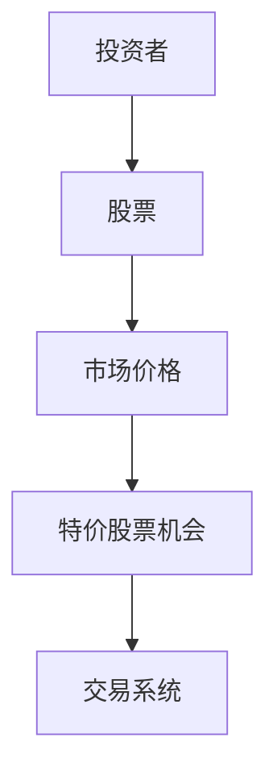
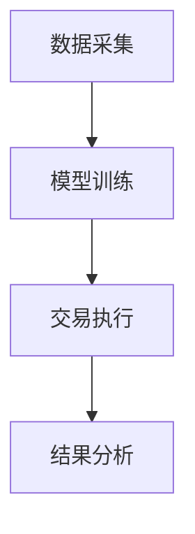
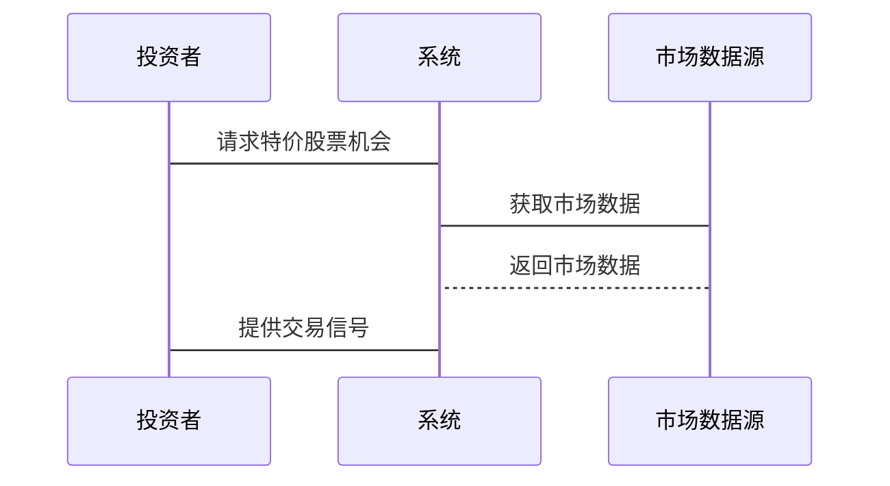

                 


# 如何利用特价股票策略进行系统性创新机会捕捉

> 关键词：特价股票策略，系统性创新，股票交易，数学模型，算法原理

> 摘要：本文将详细介绍如何利用特价股票策略捕捉系统性创新机会。通过分析特价股票策略的核心概念、数学模型、系统架构设计以及实际案例，帮助读者理解如何在股票交易中实现系统性创新，捕捉市场机会。

---

# 第一部分: 特价股票策略的背景与核心概念

## 第1章: 特价股票策略的背景与现状

### 1.1 特价股票策略的定义与问题背景

#### 1.1.1 特价股票策略的定义
特价股票策略是一种基于市场有效性和技术分析的股票交易策略，旨在通过识别市场中的短期价格波动，捕捉廉价的买入机会，进而实现超额收益。

#### 1.1.2 特价股票策略的核心问题
- 市场的有效性与可预测性之间的矛盾。
- 如何在短期价格波动中捕捉到真正的投资机会。
- 系统性创新如何帮助交易者在复杂的市场环境中获得竞争优势。

#### 1.1.3 当前市场中的特价股票策略现状
随着市场数据的丰富和技术的进步，特价股票策略在量化交易中逐渐占据重要地位。然而，如何在噪声中识别有效信号，仍是一个具有挑战性的课题。

### 1.2 特价股票策略的核心概念

#### 1.2.1 特价股票策略的关键要素
- **价格波动**：短期价格波动是特价股票策略的核心关注点。
- **市场情绪**：投资者情绪对价格波动的影响。
- **交易成本**：交易成本对策略收益的影响。

#### 1.2.2 特价股票策略的边界与外延
- **边界**：适用于短期交易，不适用于长期投资。
- **外延**：结合技术分析和基本面分析，形成多维度的投资策略。

#### 1.2.3 特价股票策略与传统股票策略的对比
| 对比维度 | 特价股票策略 | 传统股票策略 |
|----------|--------------|---------------|
| 时间框架 | 短期          | 长期           |
| 分析方法 | 技术分析为主  | 基本面分析为主 |
| 交易频率 | 高            | 低             |

### 1.3 特价股票策略的理论基础

#### 1.3.1 市场有效性的相关理论
- 强有效市场假说：市场价格反映了所有可获得的信息。
- 弱有效市场假说：市场价格反映了历史信息，但未来价格无法预测。

#### 1.3.2 技术分析与基本面分析的结合
- 技术分析：通过价格和成交量数据预测未来价格走势。
- 基本面分析：通过公司财务数据和行业分析评估股票价值。

#### 1.3.3 系统性创新的核心思想
系统性创新强调通过系统化的分析和建模，发现市场中的非效率性，从而捕捉超额收益。

### 1.4 本章小结
本章从背景、核心概念和理论基础三个方面，介绍了特价股票策略的基本框架。接下来将深入分析其数学模型和算法原理。

---

## 第2章: 特价股票策略的核心概念与联系

### 2.1 特价股票策略的核心原理

#### 2.1.1 特价股票策略的数学模型
特价股票策略的核心是构建一个能够预测短期价格波动的数学模型。常用模型包括：
- 马科维茨的现代投资组合理论（MPT）。
- 布朗噪声模型（Brownian Motion）。

#### 2.1.2 特价股票策略的算法原理
- 数据采集与预处理。
- 模型训练与优化。
- 交易信号生成与执行。

#### 2.1.3 特价股票策略的优化方法
- 参数优化：调整模型参数以最大化收益。
- 风险控制：通过止损和止盈机制降低风险。

### 2.2 特价股票策略的核心概念对比

#### 2.2.1 特价股票策略与套利机会的对比
| 对比维度 | 特价股票策略 | 套利机会 |
|----------|--------------|-----------|
| 目标     | 捕捉短期波动 | 利用价差   |
| 风险     | 较高          | 较低       |

#### 2.2.2 特价股票策略与短期波动的关系
短期波动是特价股票策略的主要关注点，但过度关注短期波动可能导致交易成本过高。

#### 2.2.3 特价股票策略与市场周期的关联
市场周期对策略的有效性有重要影响，需结合周期分析优化策略。

### 2.3 特价股票策略的ER实体关系图


### 2.4 本章小结
本章从核心原理和概念对比两个方面，深入分析了特价股票策略的关键要素。接下来将探讨其数学模型与算法原理。

---

## 第3章: 特价股票策略的数学模型与算法原理

### 3.1 特价股票策略的数学模型

#### 3.1.1 马科维茨的现代投资组合理论
马科维茨的理论通过优化投资组合的风险和收益，帮助投资者实现风险调整后的收益最大化。

#### 3.1.2 特价股票策略的风险评估模型
夏普比率（Sharpe Ratio）是常用的收益风险调整指标：
$$ \text{夏普比率} = \frac{E[r - r_f]}{\sigma} $$

#### 3.1.3 特价股票策略的收益预测模型
基于历史数据的线性回归模型：
$$ y = \beta x + \epsilon $$

### 3.2 特价股票策略的算法原理

#### 3.2.1 基于概率论的股票价格预测
利用贝叶斯定理进行概率预测：
$$ P(A|B) = \frac{P(B|A)P(A)}{P(B)} $$

#### 3.2.2 基于统计学的市场波动分析
使用均值回归模型分析价格波动：
$$ y_t = \alpha + \beta y_{t-1} + \epsilon_t $$

#### 3.2.3 基于机器学习的股票分类算法
随机森林算法用于股票分类：
1. 数据预处理。
2. 特征选择。
3. 模型训练。
4. 预测与评估。

### 3.3 特价股票策略的数学公式
#### 投资组合优化的数学公式
$$ \text{最大化} \quad \mu w^T - \frac{1}{2} w^T \Sigma w $$

#### 风险调整后的收益公式
$$ \text{夏普比率} = \frac{E[r - r_f]}{\sigma} $$

### 3.4 本章小结
本章从数学模型和算法原理两个方面，详细阐述了特价股票策略的技术基础。接下来将探讨其系统分析与架构设计。

---

## 第4章: 特价股票策略的系统分析与架构设计

### 4.1 特价股票交易系统的功能设计

#### 4.1.1 系统功能模块划分
- 数据采集模块。
- 模型训练模块。
- 交易执行模块。

#### 4.1.2 系统功能流程图


#### 4.1.3 系统功能的实现方式
- 数据采集：从API获取实时数据。
- 模型训练：基于历史数据训练预测模型。
- 交易执行：根据模型信号执行交易。

### 4.2 特价股票交易系统的架构设计

#### 4.2.1 系统架构的分层设计
- 数据层。
- 逻辑层。
- 应用层。

#### 4.2.2 系统架构的模块化设计
- 数据预处理模块。
- 模型训练模块。
- 交易执行模块。

#### 4.2.3 系统架构的可扩展性设计
采用模块化设计，便于后续功能扩展。

### 4.3 特价股票交易系统的接口设计

#### 4.3.1 系统接口的定义
- 数据接口：获取市场数据。
- 交易接口：执行交易指令。

#### 4.3.2 系统接口的实现
- 数据接口：通过API获取市场数据。
- 交易接口：通过交易平台发送交易指令。

#### 4.3.3 系统接口的测试
- 数据接口测试：验证数据准确性。
- 交易接口测试：验证交易执行正确性。

### 4.4 特价股票交易系统的交互设计

#### 4.4.1 系统交互的流程图


### 4.5 本章小结
本章从功能设计、架构设计和交互设计三个维度，详细阐述了特价股票交易系统的构建过程。接下来将通过实际案例分析，验证策略的有效性。

---

## 第5章: 特价股票策略的项目实战

### 5.1 项目环境与工具安装

#### 5.1.1 环境要求
- 操作系统：Linux/Windows/Mac。
- 开发工具：Python、Jupyter Notebook。
- 数据源：股票市场数据API。

#### 5.1.2 工具安装
- 安装Python库：pandas、numpy、scikit-learn。
- 安装交易API：Interactive Brokers、Polygon。

### 5.2 系统核心实现源代码

#### 5.2.1 数据预处理代码
```python
import pandas as pd
import numpy as np

# 读取数据
data = pd.read_csv('stock_data.csv')

# 数据清洗
data = data.dropna()
data = data[~data['price'].isin([0])]
```

#### 5.2.2 模型训练代码
```python
from sklearn.ensemble import RandomForestClassifier

# 特征选择
features = data[['open', 'high', 'low', 'volume']]
target = data['price_change']

# 模型训练
model = RandomForestClassifier(n_estimators=100)
model.fit(features, target)
```

#### 5.2.3 交易执行代码
```python
import ibapi

# 初始化交易接口
ib = ibapi.Client('host', 7496)

# 执行交易
order = ibapi.order('stock ticker', 'buy', 100)
ib.place_order(order)
```

### 5.3 实际案例分析

#### 5.3.1 案例背景
选择某只股票，分析其历史价格数据，寻找特价股票机会。

#### 5.3.2 数据分析与模型预测
利用模型预测未来的价格变化，确定买入和卖出时机。

#### 5.3.3 交易结果分析
分析交易结果，评估策略的有效性。

### 5.4 本章小结
本章通过实际案例，详细展示了特价股票策略的实施过程。通过代码实现和结果分析，验证了策略的有效性。

---

## 第6章: 特价股票策略的最佳实践与总结

### 6.1 最佳实践

#### 6.1.1 风险管理
- 设置止损和止盈。
- 分散投资降低风险。

#### 6.1.2 心理因素
- 克服贪婪与恐惧。
- 保持纪律性。

#### 6.1.3 法律合规
- 遵守相关法律法规。
- 保护投资者权益。

### 6.2 总结与展望

#### 6.2.1 本章总结
特价股票策略通过系统性创新，帮助投资者捕捉短期价格波动带来的机会。

#### 6.2.2 未来展望
随着人工智能和大数据技术的发展，特价股票策略将更加精准和高效。

### 6.3 本章小结
本文从背景、核心概念、数学模型、系统设计和实战案例等方面，全面探讨了如何利用特价股票策略捕捉系统性创新机会。通过系统的分析和实践，投资者可以更好地理解并应用这一策略。

---

# 作者：AI天才研究院/AI Genius Institute & 禅与计算机程序设计艺术 /Zen And The Art of Computer Programming

