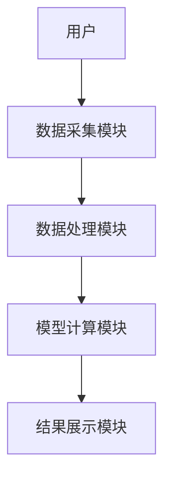
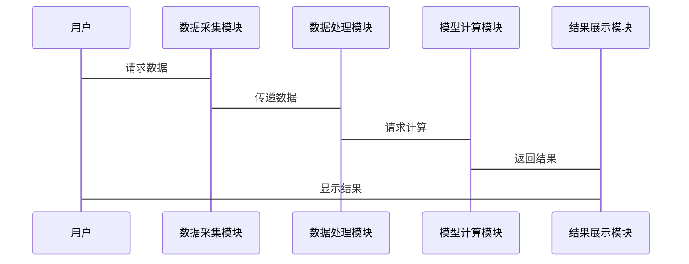

                 


# 如何利用特价股票策略进行系统性创新风险对冲

> 关键词：特价股票、系统性创新、风险对冲、算法优化、量化投资、金融模型  
> 摘要：本文将详细探讨如何利用特价股票策略进行系统性创新风险对冲。首先介绍特价股票的基本概念和系统性创新的原理，然后分析两者的结合点，提出基于数学模型和算法优化的解决方案，最后通过实际案例展示如何在量化投资中实现风险对冲。

---

## 第1章: 特价股票策略的基本概念

### 1.1 特价股票的定义与特点

#### 1.1.1 什么是特价股票
特价股票是指在特定时间内以低于市场价出售的股票，通常用于吸引投资者或清理库存。这些股票的价格波动较大，但潜在回报也较高。

#### 1.1.2 特价股票的特点
- **价格优势**：特价股票的价格通常低于市场价，吸引投资者。
- **高波动性**：由于价格波动大，投资者需要具备快速决策能力。
- **风险较高**：特价股票的价格波动可能带来较高的风险。

#### 1.1.3 特价股票的分类
- 按发行方式分类：公开招股、定向增发等。
- 按行业分类：科技、金融、制造业等。

### 1.2 系统性创新的基本概念

#### 1.2.1 系统性创新的定义
系统性创新是指通过系统性地引入新理念、技术和方法，以实现创新目标的过程。

#### 1.2.2 系统性创新的核心要素
- 创新目标：明确创新的方向和目标。
- 创新资源：包括人力、物力、财力等。
- 创新过程：包括需求分析、方案设计、实施和评估。

#### 1.2.3 系统性创新与传统创新的区别
- **传统创新**：注重局部优化，创新过程较为分散。
- **系统性创新**：注重整体优化，创新过程系统化、结构化。

### 1.3 风险对冲的基本原理

#### 1.3.1 风险对冲的定义
风险对冲是指通过投资或策略，抵消或减少投资组合中的风险。

#### 1.3.2 风险对冲的分类
- 市场对冲：通过投资于相关资产来抵消市场风险。
- 信用对冲：通过投资于信用衍生品来抵消信用风险。

#### 1.3.3 风险对冲的实施步骤
1. 确定风险来源。
2. 选择对冲工具。
3. 设计对冲策略。
4. 实施对冲策略。

### 1.4 特价股票策略在风险对冲中的作用

#### 1.4.1 特价股票策略如何降低风险
- 通过低价买入，减少初始投资风险。
- 通过分散投资，降低特定股票的风险。

#### 1.4.2 特价股票策略的优缺点
- 优点：成本低，潜在回报高。
- 缺点：风险较高，流动性差。

#### 1.4.3 特价股票策略的适用场景
- 市场低迷时：适合低价买入，等待反弹。
- 特定行业：如科技行业，技术创新快，特价股票可能带来高回报。

---

## 第2章: 特价股票策略与系统性创新的结合

### 2.1 特价股票策略的核心要素

#### 2.1.1 特价股票的市场分析
- 行业趋势分析：选择具备增长潜力的行业。
- 市场情绪分析：通过技术指标判断市场情绪。

#### 2.1.2 特价股票的筛选标准
- 股价低于行业平均水平。
- 公司基本面良好。

#### 2.1.3 特价股票的投资策略
- 长期持有：等待股价回升。
- 短期交易：快速获利。

### 2.2 系统性创新的核心要素

#### 2.2.1 系统性创新的流程
1. 明确创新目标。
2. 分析创新资源。
3. 设计创新方案。
4. 实施创新方案。
5. 评估创新效果。

#### 2.2.2 系统性创新的关键环节
- 创新需求分析：明确创新的方向和目标。
- 创新方案设计：制定创新的具体步骤和方法。

#### 2.2.3 系统性创新的工具与方法
- 5W1H分析法：明确创新的目标、方式、地点等。
- SWOT分析：分析优势、劣势、机会和威胁。

### 2.3 特价股票策略与系统性创新的结合点

#### 2.3.1 系统性创新如何优化特价股票策略
- 通过系统性创新，优化特价股票的筛选标准。
- 通过系统性创新，设计更有效的投资策略。

#### 2.3.2 特价股票策略如何支持系统性创新
- 通过特价股票策略，降低创新过程中的资金风险。
- 通过特价股票策略，实现创新资源的优化配置。

#### 2.3.3 两者的协同效应
- 系统性创新为特价股票策略提供理论支持。
- 特价股票策略为系统性创新提供实践工具。

---

## 第3章: 特价股票策略的数学模型与算法

### 3.1 特价股票策略的数学模型

#### 3.1.1 特价股票价格的数学表达
$$ P = P_{\text{市场}} \times (1 - \alpha) $$
其中，$\alpha$ 是折扣率。

#### 3.1.2 特价股票价格的波动模型
$$ \sigma = \sqrt{\sum_{i=1}^{n} (P_i - \bar{P})^2} $$
其中，$\sigma$ 是波动率，$P_i$ 是第 $i$ 个价格，$\bar{P}$ 是平均价格。

#### 3.1.3 特价股票价格预测的数学公式
$$ \hat{P}_{t+1} = P_t + \beta \times (P_t - P_{t-1}) $$
其中，$\beta$ 是回归系数。

### 3.2 系统性创新的算法原理

#### 3.2.1 系统性创新的算法流程
1. 数据收集：收集相关数据，如市场数据、公司基本面数据。
2. 数据分析：分析数据，找出潜在的投资机会。
3. 模型构建：构建数学模型，预测股票价格。
4. 策略优化：优化投资策略，降低风险。

#### 3.2.2 系统性创新的算法实现
```python
def system_innovation_strategy(data):
    # 数据预处理
    preprocess_data = data.dropna()
    # 模型构建
    model = LinearRegression()
    model.fit(preprocess_data[['P_t', 'P_{t-1}']], preprocess_data['P_{t+1}'])
    # 策略优化
    optimized_strategy = model.predict(new_data)
    return optimized_strategy
```

#### 3.2.3 系统性创新的算法优化
- 参数优化：通过网格搜索优化模型参数。
- 模型选择：选择最适合的模型。

### 3.3 特价股票策略与系统性创新的算法结合

#### 3.3.1 算法结合的数学模型
$$ \text{总收益} = \sum_{i=1}^{n} (P_i - C_i) \times Q_i $$
其中，$C_i$ 是成本，$Q_i$ 是数量。

#### 3.3.2 算法结合的实现步骤
1. 数据收集：收集特价股票的相关数据。
2. 数据分析：分析数据，找出投资机会。
3. 模型构建：构建数学模型，预测股票价格。
4. 策略实施：根据预测结果，制定投资策略。

---

## 第4章: 系统性创新风险对冲的系统架构设计

### 4.1 系统性创新风险对冲的总体架构

#### 4.1.1 系统架构的组成
- 数据层：数据采集、存储。
- 计算层：数据处理、模型计算。
- 展示层：结果展示、用户交互。

#### 4.1.2 系统架构的功能模块
- 数据采集模块：采集市场数据。
- 数据处理模块：清洗、转换数据。
- 模型计算模块：构建、优化模型。
- 结果展示模块：展示预测结果。

#### 4.1.3 系统架构的交互流
- 用户输入需求。
- 系统根据需求，进行数据处理和模型计算。
- 系统将结果返回给用户。

### 4.2 系统性创新风险对冲的系统架构设计

#### 4.2.1 系统功能设计
- 数据采集：实时采集市场数据。
- 数据处理：清洗、转换数据。
- 模型计算：构建数学模型，预测股票价格。
- 结果展示：展示预测结果。

#### 4.2.2 系统架构图


#### 4.2.3 系统接口设计
- 数据接口：数据采集模块与数据处理模块之间的接口。
- 模型接口：模型计算模块与结果展示模块之间的接口。

#### 4.2.4 系统交互图


---

## 第5章: 项目实战——利用特价股票策略进行风险对冲

### 5.1 环境安装

#### 5.1.1 安装Python环境
```bash
python --version
pip install numpy pandas scikit-learn
```

#### 5.1.2 安装数据采集工具
```bash
pip install requests pandas
```

### 5.2 核心代码实现

#### 5.2.1 数据采集模块
```python
import pandas as pd
import requests

def fetch_data(ticker):
    url = f"https://api.example.com/stock_data/{ticker}"
    response = requests.get(url)
    data = response.json()
    return pd.DataFrame(data)
```

#### 5.2.2 数据处理模块
```python
def preprocess_data(data):
    data.dropna(inplace=True)
    data['return'] = data['close'].pct_change()
    return data
```

#### 5.2.3 模型计算模块
```python
from sklearn.linear_model import LinearRegression

def predict_prices(data):
    model = LinearRegression()
    model.fit(data[['open', 'high']], data['close'])
    return model.predict(new_data)
```

### 5.3 案例分析

#### 5.3.1 数据分析
- 选择特定行业的特价股票。
- 分析公司的基本面。

#### 5.3.2 投资策略
- 制定买入和卖出规则。
- 设定止损和止盈点。

### 5.4 实施步骤

#### 5.4.1 数据采集
- 从API获取数据。
- 数据清洗和转换。

#### 5.4.2 模型构建
- 构建数学模型。
- 训练模型。

#### 5.4.3 策略实施
- 根据模型预测结果，制定投资策略。
- 实施交易。

### 5.5 结果分析

#### 5.5.1 风险对冲效果
- 回测结果：评估策略的有效性。
- 风险降低：比较对冲前后的风险水平。

#### 5.5.2 性能优化
- 参数优化：调整模型参数，提高预测准确性。
- 策略优化：改进投资策略，提高收益。

---

## 第6章: 总结与展望

### 6.1 本章总结
本文详细探讨了如何利用特价股票策略进行系统性创新风险对冲。通过数学模型和算法优化，提出了有效的解决方案，并通过实际案例验证了策略的有效性。

### 6.2 未来展望
未来的研究可以进一步优化模型，引入更多的创新工具和方法，提高风险对冲的效果。

---

## 附录: 参考资料

1. 《量化投资入门》
2. 《系统性创新方法论》
3. Python官方文档
4. 其他相关技术资料

---

作者：AI天才研究院/AI Genius Institute & 禅与计算机程序设计艺术 /Zen And The Art of Computer Programming

