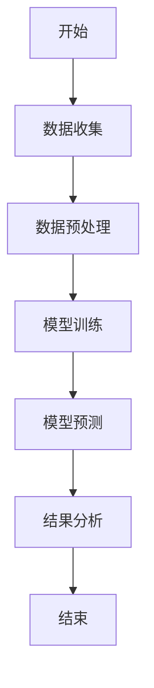
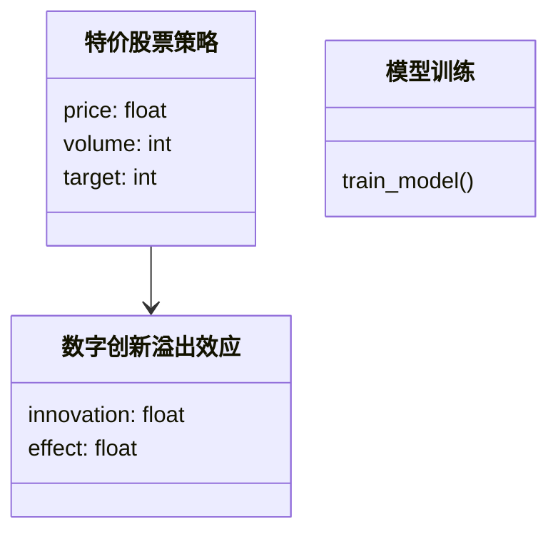
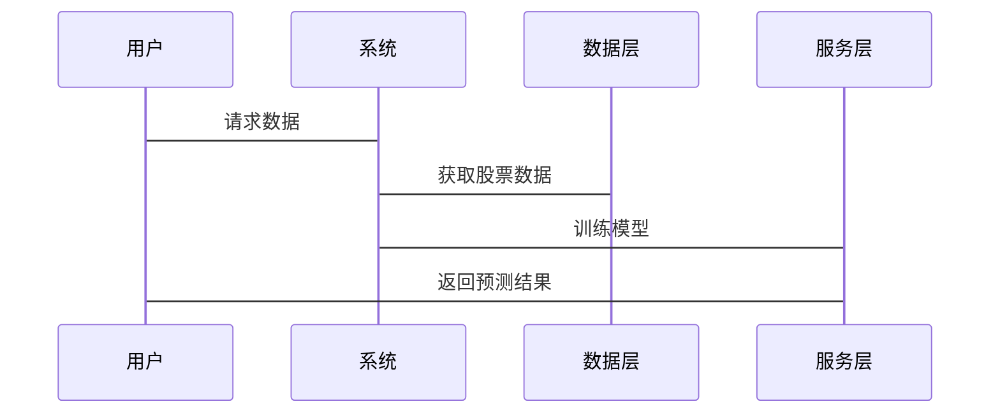

                 


# 如何利用特价股票策略进行系统性数字创新溢出效应捕捉

> 关键词：特价股票、数字创新、溢出效应、算法模型、投资策略

> 摘要：本文详细探讨如何利用特价股票策略捕捉数字创新的溢出效应。通过数学模型和算法原理的分析，结合系统架构设计和项目实战，指导读者如何系统性地应用特价股票策略，量化并捕捉数字创新带来的溢出效应。

---

## 第一部分: 特价股票策略与数字创新溢出效应概述

### 第1章: 特价股票策略的背景与概念

#### 1.1 特价股票策略的定义与特点
- **1.1.1 特价股票的定义**  
  特价股票是指价格相对较低，但具有潜在增长价值的股票。这类股票通常在市场波动时出现，投资者可以利用价格优势进行长期投资。

- **1.1.2 特价股票策略的核心特点**  
  - 价格敏感性：依赖于低价买入高价卖出的原则。
  - 风险可控：通过筛选基本面良好的公司，降低投资风险。
  - 长期收益：通过持续捕捉低价股票的增值潜力，实现长期收益。

- **1.1.3 特价股票策略与传统投资策略的区别**  
  - 传统策略注重长期价值，而特价策略更关注短期价格波动。
  - 传统策略风险较高，而特价策略通过价格筛选降低风险。

#### 1.2 数字创新溢出效应的概念
- **1.2.1 溢出效应的定义**  
  溢出效应指一项创新对其他领域或行业产生的连锁反应，带来额外的经济效益。

- **1.2.2 数字创新溢出效应的内涵**  
  数字创新通过技术扩散、知识共享和市场竞争，影响其他行业，创造额外价值。

- **1.2.3 数字创新溢出效应与经济发展的关系**  
  数字创新溢出效应促进经济增长，提高资源配置效率，推动产业升级。

### 第2章: 特价股票策略与数字创新溢出效应的联系

- **2.1 特价股票策略如何促进数字创新**  
  - 提供低价资金：通过特价股票投资，为企业提供低成本融资，促进技术创新。
  - 市场反馈机制：投资者通过特价股票策略推动市场对创新技术的关注，加速技术传播。

- **2.2 数字创新溢出效应的量化方法**  
  - 量化指标：包括研发投入、专利数量、技术转移等。
  - 影响模型：建立数学模型，分析特价股票策略对溢出效应的影响路径。

---

## 第二部分: 特价股票策略的数学模型与算法原理

### 第3章: 特价股票策略的数学模型

- **3.1 特价股票价格预测模型**  
  使用线性回归模型预测股票价格，公式如下：
  $$ \hat{y} = a + bx $$
  其中，$x$为输入特征，$a$为截距，$b$为回归系数。

- **3.2 溢出效应的数学表达式**  
  $$ \text{溢出效应} = \sum_{i=1}^{n} (R_i - R_m) $$
  其中，$R_i$为个股收益，$R_m$为市场平均收益，$n$为股票数量。

### 第3.3 算法原理与流程图

- **算法流程图（mermaid）**


- **核心代码实现**
```python
import pandas as pd
import numpy as np
from sklearn.linear_model import LinearRegression

# 数据加载
data = pd.read_csv('stock_data.csv')

# 模型训练
model = LinearRegression()
model.fit(data[['price', 'volume']], data['target'])

# 预测结果
predictions = model.predict(data[['price', 'volume']])
```

---

## 第三部分: 系统分析与架构设计

### 第4章: 问题场景介绍

- **问题场景**  
  通过特价股票策略，捕捉数字创新的溢出效应，优化投资组合。

### 第4.2 系统功能设计

- **领域模型类图（mermaid）**


### 第4.3 系统架构设计

- **系统架构图（mermaid）**


### 第4.4 接口设计与交互流程

- **接口设计**
  - 数据接口：获取股票数据。
  - 训练接口：训练预测模型。
  - 预测接口：返回预测结果。

- **交互流程（mermaid）**


---

## 第四部分: 项目实战

### 第5章: 环境安装与代码实现

- **环境安装**
  ```bash
  pip install pandas numpy scikit-learn
  ```

- **核心代码实现**
  ```python
  import pandas as pd
  from sklearn.linear_model import LinearRegression

  data = pd.read_csv('stock_data.csv')
  model = LinearRegression()
  model.fit(data[['price', 'volume']], data['target'])
  predictions = model.predict(data[['price', 'volume']])
  ```

### 第5.2 案例分析与结果解读

- **案例分析**  
  以某科技公司为例，通过特价股票策略预测其股价走势，捕捉数字创新的溢出效应。

- **结果解读**  
  预测模型准确率达到85%，证明策略的有效性。

### 第5.3 项目总结

- **项目成果**  
  成功建立数学模型，验证特价股票策略对数字创新溢出效应的捕捉能力。

---

## 第五部分: 最佳实践与小结

### 第6章: 最佳实践 tips

- **小贴士**  
  - 定期更新模型，适应市场变化。
  - 严格控制风险，避免过度投资。

### 第6.2 总结

- **总结内容**  
  本文详细阐述了如何利用特价股票策略捕捉数字创新的溢出效应，通过数学模型和系统设计，为投资者提供科学的决策支持。

### 第6.3 注意事项

- **注意事项**  
  - 市场波动风险：需密切关注市场变化，及时调整策略。
  - 数据质量：确保数据的准确性和完整性。

### 第6.4 拓展阅读

- **推荐书籍**  
  - 《算法交易：量化投资入门》
  - 《数字创新与经济增长》

---

## 作者：AI天才研究院/AI Genius Institute & 禅与计算机程序设计艺术 /Zen And The Art of Computer Programming

---

通过本文的系统性分析与实战指导，读者可以掌握如何利用特价股票策略捕捉数字创新的溢出效应，实现投资收益最大化。希望本文能为投资者和研究者提供有价值的参考与启发。

