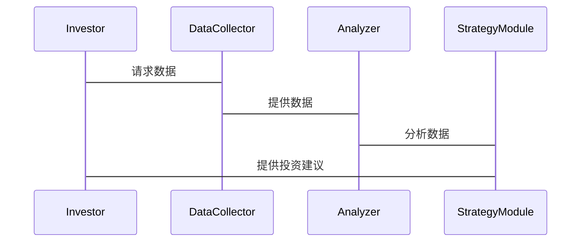

                 


# 如何利用特价股票策略进行系统性数字创新生态位捕捉

## 关键词：特价股票、数字创新、生态位捕捉、系统性方法、技术分析、机器学习、数据挖掘

## 摘要：本文详细探讨了如何结合特价股票策略与数字创新生态位捕捉，通过系统性方法利用技术手段挖掘市场机会，分析了核心概念、算法原理、系统架构，并提供实战案例和最佳实践。

---

## 第1章: 特价股票策略与数字创新生态位概述

### 1.1 特价股票策略的背景与意义

#### 1.1.1 特价股票的定义与特点
特价股票是指市场价格低于其内在价值的股票，通常具有较高的投资潜力。其特点包括低估值、高增长潜力和风险较低。

#### 1.1.2 数字创新生态位的内涵
数字创新生态位指的是在数字化转型中新兴的市场机会，企业通过技术创新占据有利位置。捕捉这些生态位可以帮助投资者提前布局，获取超额收益。

#### 1.1.3 系统性方法的重要性
通过系统性方法，投资者可以避免情绪化决策，利用数据分析和技术工具更精准地识别投资机会。

### 1.2 特价股票与数字创新生态位的关联
特价股票往往出现在新兴行业中，而这些行业正是数字创新生态位的典型代表。通过分析行业趋势和技术发展，投资者可以识别这些生态位中的特价股票。

---

## 第2章: 特价股票策略的核心概念与模型

### 2.1 核心概念解析

#### 2.1.1 特价股票筛选标准
主要标准包括市盈率（P/E）、市净率（P/B）和市销率（P/S）。通过这些指标，投资者可以评估股票的估值是否合理。

#### 2.1.2 生态位捕捉的关键因素
包括技术创新、市场需求和行业趋势。识别这些因素可以帮助投资者找到具有成长潜力的公司。

### 2.2 数学模型与算法

#### 2.2.1 市盈率模型
$$ P/E = \frac{Price}{Earnings} $$
该模型用于评估股票的价值，低于行业平均水平的P/E值表示股票可能被低估。

#### 2.2.2 市净率模型
$$ P/B = \frac{Price}{Book\ Value} $$
市净率低于1通常表示股票被低估。

#### 2.2.3 市销率模型
$$ P/S = \frac{Price}{Sales} $$
市销率低于行业平均值的股票可能具有投资价值。

---

## 第3章: 基于机器学习的特价股票筛选算法

### 3.1 算法流程

#### 3.1.1 数据预处理
包括数据清洗、特征提取和标准化。

#### 3.1.2 模型训练
使用机器学习算法（如随机森林或支持向量机）对历史数据进行训练。

#### 3.1.3 模型预测
预测未来股票价格走势，识别具有投资价值的股票。

### 3.2 代码实现

```python
import pandas as pd
from sklearn.ensemble import RandomForestRegressor

# 数据加载与预处理
data = pd.read_csv('stock_data.csv')
data = data.dropna()
data = pd.get_dummies(data, columns=['sector'])

# 特征选择与标准化
features = data[['PE', 'PB', 'PS']]
target = data['Future_Price']

# 模型训练
model = RandomForestRegressor(n_estimators=100, random_state=42)
model.fit(features, target)

# 预测
predictions = model.predict(features)
```

---

## 第4章: 数字创新生态位的系统性捕捉

### 4.1 系统架构设计

#### 4.1.1 数据采集模块
从多个数据源收集股票信息、行业趋势和市场动态。

#### 4.1.2 数据分析模块
利用数据挖掘技术识别潜在的生态位。

#### 4.1.3 投资策略模块
根据分析结果制定投资策略，筛选特价股票。

### 4.2 系统交互流程



---

## 第5章: 实战案例分析

### 5.1 环境搭建

#### 5.1.1 数据源
使用Yahoo Finance API获取股票数据。

#### 5.1.2 工具安装
安装Python、Pandas、Scikit-learn等工具。

### 5.2 核心代码实现

```python
import pandas as pd
from sklearn.metrics import accuracy_score

# 数据加载
data = pd.read_csv('stock_data.csv')

# 特征工程
data['Predict'] = data['Future_Price'].shift(-1)
data = data.dropna()

# 划分数据集
X = data[['PE', 'PB', 'PS']]
y = data['Predict']

# 模型训练与评估
from sklearn.model_selection import train_test_split
X_train, X_test, y_train, y_test = train_test_split(X, y, test_size=0.2)

model = RandomForestRegressor()
model.fit(X_train, y_train)
y_pred = model.predict(X_test)
print("准确率:", accuracy_score(y_test, y_pred))
```

### 5.3 案例分析与解读

#### 5.3.1 数据分析结果
通过分析发现，某行业具有较高的增长率，其股票市盈率低于行业平均水平，具备投资价值。

#### 5.3.2 投资策略制定
基于分析结果，建议投资者关注该行业的特价股票，长期持有以获得资本增值。

---

## 第6章: 最佳实践与小结

### 6.1 小结
通过系统性方法结合特价股票策略和数字创新生态位捕捉，投资者可以在技术驱动的市场中找到优质投资机会。

### 6.2 注意事项
- 数据质量至关重要，需确保数据来源可靠。
- 模型需定期更新，以适应市场变化。
- 风险管理是投资成功的关键，需合理控制投资仓位。

### 6.3 拓展阅读
推荐学习时间序列分析、深度学习在金融中的应用等，以进一步提升投资策略的有效性。

---

## 作者：AI天才研究院 & 禅与计算机程序设计艺术

本文作者是AI天才研究院，致力于利用人工智能技术解决复杂问题，结合禅宗智慧，探索计算机程序设计的艺术。

