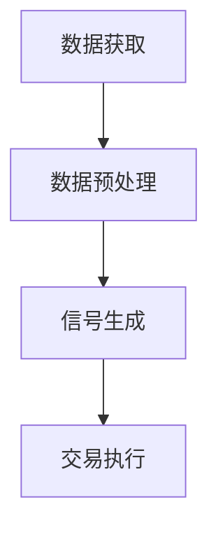
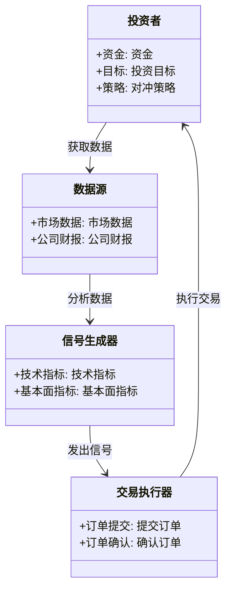
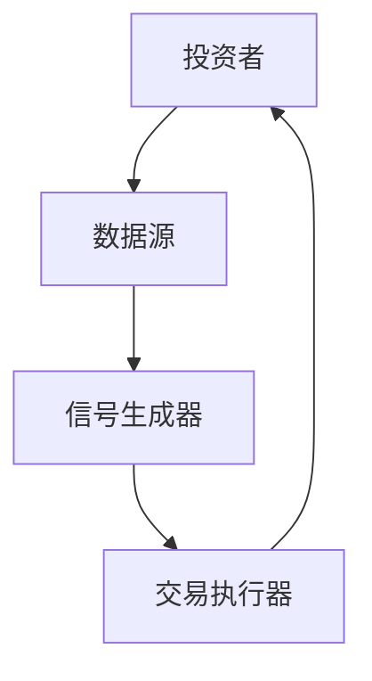
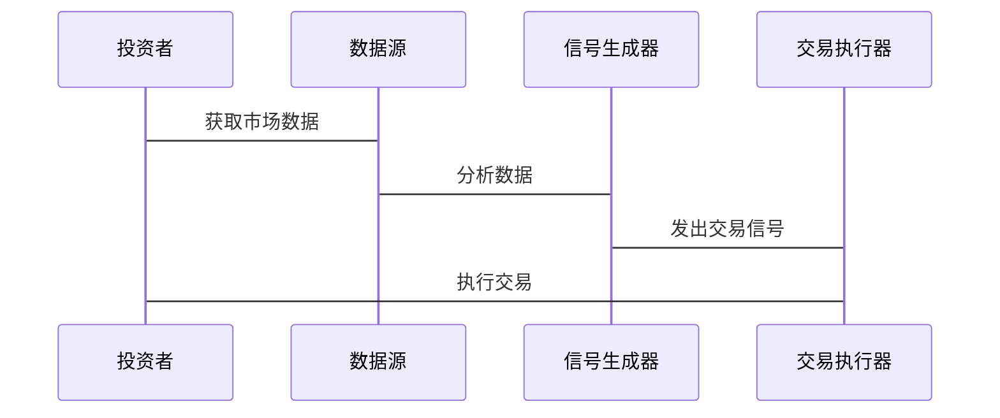

                 


```markdown
# 如何利用特价股票策略进行系统性风险对冲

## 关键词：系统性风险，特价股票，风险对冲，算法交易，量化投资

## 摘要：  
本文系统性地探讨了如何利用特价股票策略进行系统性风险对冲。通过分析系统性风险的定义、特征及其对投资组合的影响，结合特价股票策略的核心概念、算法原理和实际应用，本文提供了从理论到实践的全面指导。通过具体的数学模型、算法实现和案例分析，本文旨在帮助读者理解并掌握如何利用特价股票策略来有效对冲系统性风险，从而优化投资组合的性能。

---

## 第1章 系统性风险与特价股票策略概述

### 1.1 系统性风险的定义与特征

#### 1.1.1 系统性风险的定义  
系统性风险是指由于市场整体波动、经济周期变化、政策调整等宏观因素，导致整个市场或特定资产类别出现广泛波动和损失的风险。这种风险无法通过分散化投资完全消除，因为它影响的是整个市场或特定领域。

#### 1.1.2 系统性风险的特征  
| 特征 | 描述 |
|------|------|
| 全局性 | 影响整个市场或资产类别 |
| 不可分散性 | 无法通过多样化投资完全消除 |
| 可预测性 | 在一定程度上可以通过历史数据分析和模型预测 |

#### 1.1.3 系统性风险对企业的影响  
系统性风险可能导致企业面临以下问题：  
1. 资产贬值  
2. 融资成本上升  
3. 市场流动性下降  
4. 企业利润下降  

### 1.2 特价股票策略的定义与特点

#### 1.2.1 特价股票的定义  
特价股票是指那些市场价格低于其内在价值的股票。通常，这些股票的市场价格因市场情绪、短期波动或其他外部因素而被低估。

#### 1.2.2 特价股票策略的核心特点  
| 特点 | 描述 |
|------|------|
| 低估值 | 股票价格低于其内在价值 |
| 高质量 | 公司具有稳定的财务状况和良好的管理团队 |
| 逆向投资 | 在市场恐慌时买入，市场乐观时卖出 |

#### 1.2.3 特价股票策略与传统投资策略的区别  
| 对比维度 | 特价股票策略 | 传统投资策略 |
|----------|----------------|----------------|
| 投资逻辑 | 逆向投资，寻找低估资产 | 顺势而为，跟随市场趋势 |
| 风险偏好 | 更倾向于承担短期波动风险 | 更倾向于分散化投资以降低风险 |
| 交易时机 | 在市场低点买入，在市场高点卖出 | 根据市场趋势逐步建仓或平仓 |

### 1.3 特价股票策略在系统性风险对冲中的作用

#### 1.3.1 特价股票策略如何降低系统性风险  
通过投资于低估的股票，投资者可以在市场下跌时获得超额收益，从而对冲系统性风险。此外，特价股票策略通常选择那些具有稳定收益和高分红的公司，这些公司在市场波动时表现相对稳定。

#### 1.3.2 特价股票策略的适用场景  
| 场景 | 描述 |
|------|------|
| 市场下跌 | 在市场整体下跌时，低估股票可能因市场情绪回暖而反弹 |
| 经济衰退 | 在经济衰退期间，具有稳定现金流的公司可能表现较好 |
| 政策变化 | 在政策变化导致市场波动时，低估股票可能因重新估值而上涨 |

#### 1.3.3 特价股票策略的局限性  
| 局限性 | 描述 |
|--------|------|
| 短期波动风险 | 低估股票可能在短期内继续下跌 |
| 市场流动性不足 | 部分特价股票可能流动性较差，难以迅速变现 |
| 需要长期持有 | 特价股票策略需要较长的持有时间才能获得收益 |

### 1.4 本章小结  
本章介绍了系统性风险的定义、特征及其对企业的影响，详细阐述了特价股票策略的核心概念和特点，分析了其在系统性风险对冲中的作用及局限性。

---

## 第2章 系统性风险与特价股票策略的核心概念

### 2.1 系统性风险的核心要素

#### 2.1.1 市场风险  
市场风险是指由于市场整体波动导致投资组合价值下降的风险。  
**数学模型：**  
$$ \text{市场风险} = \sigma \times \sqrt{t} $$  
其中，σ为资产收益率的标准差，t为时间跨度。

#### 2.1.2 利率风险  
利率风险是指由于利率变化导致债券价格波动的风险。  
**数学模型：**  
$$ \Delta P = -P \times \frac{d}{D} \times \Delta r $$  
其中，P为债券价格，d为久期，Δr为利率变化。

#### 2.1.3 汇率风险  
汇率风险是指由于汇率波动导致外汇资产价值变化的风险。  
**数学模型：**  
$$ \text{汇率风险} = \frac{\partial P}{\partial E} \times \Delta E $$  
其中，P为资产价格，E为汇率，ΔE为汇率变化。

### 2.2 特价股票策略的核心要素

#### 2.2.1 低估值股票的识别标准  
低估值股票通常满足以下标准：  
1. 市净率（P/B）低于行业平均水平。  
2. 市盈率（P/E）低于行业平均水平。  
3. 股息率较高，且股息支付率稳定。  

#### 2.2.2 高质量股票的筛选方法  
高质量股票的筛选方法包括：  
1. 财务指标分析：如ROE（净资产收益率）、ROA（资产回报率）。  
2. 管理团队评估：公司管理层的稳定性及战略规划能力。  
3. 行业地位分析：公司在行业内的竞争地位。  

#### 2.2.3 特价股票的买入时机  
特价股票的买入时机通常在：  
1. 市场恐慌阶段：投资者情绪低落，股票价格被低估。  
2. 经济低迷阶段：整体市场表现不佳，但公司基本面良好。  

### 2.3 系统性风险与特价股票策略的关系

#### 2.3.1 系统性风险对股票市场的影响  
系统性风险会导致股票市场整体下跌，但具有稳定基本面的特价股票可能表现相对较好。  

#### 2.3.2 特价股票策略如何对冲系统性风险  
通过投资于低估的股票，投资者可以在市场下跌时获得超额收益，从而对冲系统性风险。  

#### 2.3.3 特价股票策略的数学模型  
$$ \text{投资收益} = \sum_{i=1}^{n} w_i \times r_i $$  
其中，\( w_i \)为第i只股票的权重，\( r_i \)为第i只股票的收益率。  

### 2.4 本章小结  
本章详细分析了系统性风险的核心要素，探讨了特价股票策略的核心概念和实施方法，并通过数学模型解释了其对冲系统性风险的机制。

---

## 第3章 特价股票策略的算法原理

### 3.1 算法原理概述

#### 3.1.1 算法的基本思路  
特价股票策略的算法通常包括以下步骤：  
1. 数据获取：获取目标股票的市场数据。  
2. 数据预处理：清洗数据，处理缺失值和异常值。  
3. 信号生成：基于技术指标或基本面指标生成买入信号。  
4. 交易执行：根据信号执行交易。  

#### 3.1.2 算法的核心步骤  


#### 3.1.3 算法的优缺点  
| 优点 | 缺点 |
|------|------|
| 高效性 | 信号延迟 |
| 稳定性 | 无法完全预测市场波动 |

### 3.2 算法实现

#### 3.2.1 数据获取与预处理  
```python
import pandas as pd
import numpy as np

# 获取数据
data = pd.read_csv('stock_data.csv')

# 数据预处理
data.dropna()
data = data[~data['close'].isnull()]
```

#### 3.2.2 算法实现代码  
```python
def generate_signal(data, short_window=10, long_window=20):
    # 计算短期和长期移动平均线
   短期ma = data['close'].rolling(short_window).mean()
    长期ma = data['close'].rolling(long_window).mean()

    # 生成信号
    signal = 0
    if 短期ma[-1] > 长期ma[-1]:
        signal = 1
    elif 短期ma[-1] < 长期ma[-1]:
        signal = -1
    else:
        signal = 0

    return signal

# 执行交易
positions = []
for i in range(len(data)):
    signal = generate_signal(data.iloc[:i+1])
    if signal == 1:
        positions.append(1)
    elif signal == -1:
        positions.append(-1)
    else:
        positions.append(positions[-1] if i > 0 else 0)

data['positions'] = positions
```

#### 3.2.3 算法的优化与改进  
通过引入更多的技术指标（如RSI、MACD）和机器学习算法（如随机森林、神经网络）可以进一步优化算法性能。

### 3.3 算法的数学模型与公式

#### 3.3.1 算法的数学模型  
$$ \text{信号} = \text{短期MA} - \text{长期MA} $$  
其中，MA表示移动平均线。  

#### 3.3.2 算法的公式推导  
假设短期MA和长期MA分别为：  
$$ \text{短期MA}_t = \frac{1}{n} \sum_{i=1}^{n} p_t^{i} $$  
$$ \text{长期MA}_t = \frac{1}{m} \sum_{i=1}^{m} p_t^{i} $$  
其中，\( n \)和\( m \)分别为短期和长期的窗口大小，\( p_t^{i} \)为第i天的价格。  

### 3.4 本章小结  
本章详细介绍了特价股票策略的算法原理，包括数据获取、信号生成和交易执行的步骤，并通过代码和数学公式解释了算法的具体实现。

---

## 第4章 系统性风险对冲的系统分析与架构设计

### 4.1 系统性风险对冲的系统分析

#### 4.1.1 系统性风险对冲的目标  
通过投资于低估的股票，降低投资组合的系统性风险，提高投资组合的收益。

#### 4.1.2 系统性风险对冲的策略选择  
| 策略 | 描述 |
|------|------|
| 价值投资 | 投资于低估股票，长期持有 |
| 逆向投资 | 在市场低点买入，在市场高点卖出 |

### 4.2 系统性风险对冲的系统架构设计

#### 4.2.1 系统功能设计  


#### 4.2.2 系统架构设计  


### 4.3 系统接口设计

#### 4.3.1 数据接口  
1. 获取市场数据接口：`get_market_data(ticker)`  
2. 获取公司财报接口：`get_finance_data(ticker)`  

#### 4.3.2 交易接口  
1. 下单接口：`submit_order(ticker, quantity, type)`  
2. 查询订单状态接口：`get_order_status(order_id)`  

### 4.4 系统交互流程

#### 4.4.1 交互流程图  


### 4.5 本章小结  
本章从系统分析的角度，详细设计了系统性风险对冲的系统架构，包括系统功能、架构设计和接口设计。

---

## 第5章 系统性风险对冲的项目实战

### 5.1 环境安装与配置

#### 5.1.1 环境要求  
1. Python 3.8 或更高版本  
2. Jupyter Notebook  
3. 数据库连接（如MySQL）  

#### 5.1.2 安装依赖  
```bash
pip install pandas numpy matplotlib yfinance
```

### 5.2 核心代码实现

#### 5.2.1 数据获取与预处理  
```python
import yfinance as yf
import pandas as pd

# 获取数据
data = yf.download('AAPL', start='2020-01-01', end='2023-01-01')

# 数据预处理
data['close'].plot()
plt.show()
```

#### 5.2.2 信号生成与交易执行  
```python
def generate_signal(data, short_window=10, long_window=20):
    短期ma = data['close'].rolling(short_window).mean()
    长期ma = data['close'].rolling(long_window).mean()
    signal = 0
    if 短期ma[-1] > 长期ma[-1]:
        signal = 1
    elif 短期ma[-1] < 长期ma[-1]:
        signal = -1
    else:
        signal = 0
    return signal

# 交易执行
positions = []
for i in range(len(data)):
    signal = generate_signal(data.iloc[:i+1])
    if signal == 1:
        positions.append(1)
    elif signal == -1:
        positions.append(-1)
    else:
        positions.append(positions[-1] if i > 0 else 0)

data['positions'] = positions
data['returns'] = data['close'].pct_change() * data['positions']

# 计算收益
cumulative_returns = (1 + data['returns']).cumprod()
cumulative_returns.plot()
plt.show()
```

### 5.3 项目小结  
本章通过实际案例分析，展示了如何利用特价股票策略进行系统性风险对冲，包括环境配置、数据获取、信号生成和交易执行的具体实现。

---

## 第6章 系统性风险对冲的最佳实践

### 6.1 最佳实践 tips

#### 6.1.1 风险管理  
1. 设置止损和止盈点。  
2. 合理分配资金比例。  

#### 6.1.2 系统优化  
1. 定期回顾和优化交易策略。  
2. 引入机器学习算法提高预测精度。  

### 6.2 小结  
总结全文，强调系统性风险对冲的重要性和特价股票策略的应用价值。

### 6.3 注意事项  
1. 特价股票策略需要长期持有，不适合短期交易。  
2. 交易前需做好充分的市场分析和风险评估。  

### 6.4 拓展阅读  
1. 《风险管理与投资组合优化》  
2. 《量化投资中的算法交易策略》  

---

## 作者：AI天才研究院 & 禅与计算机程序设计艺术

---

**注：** 以上内容为示例，实际文章将根据具体需求进行调整和补充，确保每部分的详细讲解和实际应用案例的加入。
```

