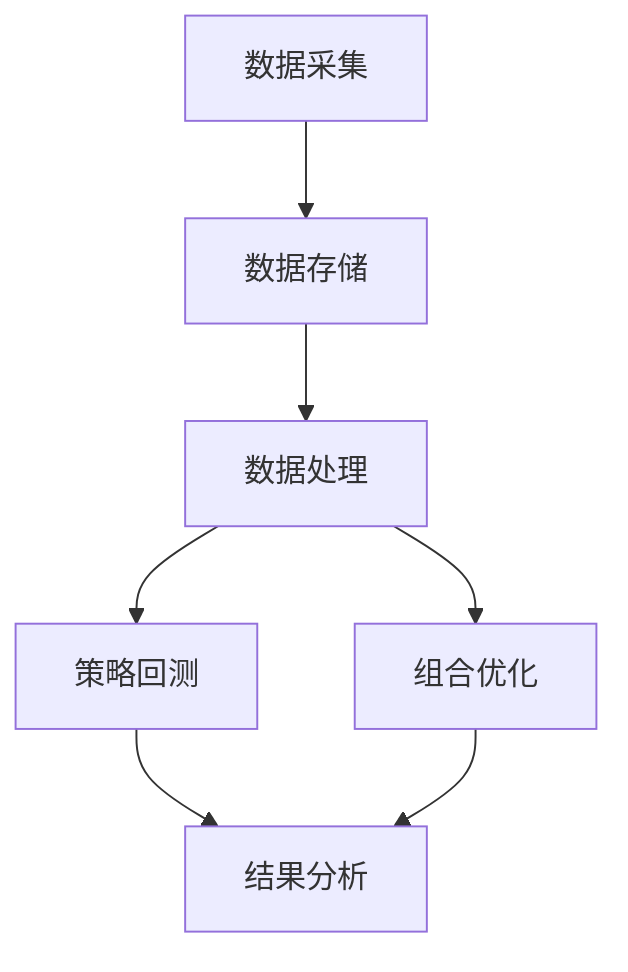

                 


# 如何利用特价股票策略进行组合优化

> 关键词：特价股票、组合优化、投资策略、数学模型、算法优化

> 摘要：特价股票策略作为一种高效的投资策略，近年来在金融市场中备受关注。本文将深入探讨如何利用特价股票策略进行组合优化，从理论到实践，详细分析其核心概念、数学模型、系统架构及项目实现，为读者提供全面的解决方案。

---

# 第一部分: 特价股票策略与组合优化背景

## 第1章: 特价股票策略与组合优化概述

### 1.1 特价股票策略的定义与背景
#### 1.1.1 什么是特价股票
特价股票是指在特定时间窗口内价格低于正常市场价的股票，通常由于市场波动、公司公告或短期需求变化导致。这种股票往往具有较高的投资潜力，但同时也伴随着较高的风险。

#### 1.1.2 特价股票的市场背景
近年来，随着金融市场的波动加剧，特价股票的出现频率越来越高。投资者通过抓住这些特价股票的机会，可以在短时间内获得较高的收益。

#### 1.1.3 特价股票策略的核心目标
特价股票策略的核心目标是在特定时间内，通过优化投资组合，最大化收益并最小化风险。

### 1.2 组合优化的基本概念
#### 1.2.1 投资组合的定义
投资组合是指将资金分配到多个资产或股票中，以分散风险并提高收益。

#### 1.2.2 组合优化的数学模型
组合优化的数学模型通常包括目标函数和约束条件。目标函数通常是最化收益或最小化风险，而约束条件则包括资金限制、资产权重限制等。

#### 1.2.3 组合优化的目标函数
组合优化的目标函数通常包括以下几种：
- 均值-方差模型
- 风险调整后的收益模型
- 最大化夏普比率

### 1.3 特价股票策略与组合优化的关系
#### 1.3.1 特价股票策略的特点
特价股票策略的特点包括：
- 时间敏感性
- 高波动性
- 高风险高收益并存

#### 1.3.2 组合优化在特价股票中的应用
组合优化在特价股票中的应用包括：
- 确定最优投资组合
- 分散风险
- 提高收益

#### 1.3.3 特价股票策略与组合优化的结合
通过将特价股票策略与组合优化相结合，投资者可以在特定时间内最大化收益并最小化风险。

### 1.4 本章小结
本章介绍了特价股票策略的定义、市场背景及核心目标，同时详细讲解了组合优化的基本概念和目标函数。接下来的章节将深入探讨特价股票策略的核心概念与数学模型。

---

# 第二部分: 特价股票策略的核心概念与数学模型

## 第2章: 特价股票策略的核心概念

### 2.1 特价股票的市场行为分析
#### 2.1.1 市场参与者的行为特征
市场参与者的行为特征包括：
- 投资者的风险偏好
- 市场波动对投资者行为的影响
- 投资者对特价股票的反应

#### 2.1.2 市场波动对特价股票的影响
市场波动对特价股票的影响包括：
- 短期内价格波动
- 长期价格趋势的变化
- 市场情绪对价格的影响

#### 2.1.3 特价股票的价格形成机制
特价股票的价格形成机制包括：
- 市场供需关系
- 市场参与者的行为
- 公司公告和外部事件的影响

### 2.2 特价股票策略的关键要素
#### 2.2.1 时间窗口的选择
时间窗口的选择对特价股票策略的成功至关重要。通常选择较短的时间窗口，以抓住价格波动的机会。

#### 2.2.2 风险与收益的平衡
在特价股票策略中，风险与收益的平衡是关键。投资者需要在高收益和高风险之间找到平衡点。

#### 2.2.3 策略的可扩展性
策略的可扩展性是指在不同的市场条件下，策略是否可以灵活调整以适应变化。

### 2.3 特价股票策略的分类
#### 2.3.1 基于技术分析的策略
基于技术分析的策略包括：
- 移动平均线策略
- RSI指标策略
- MACD指标策略

#### 2.3.2 基于基本面分析的策略
基于基本面分析的策略包括：
- 市盈率策略
- 市净率策略
- 资产负债率分析

#### 2.3.3 组合策略的应用
组合策略的应用包括：
- 将不同类型的策略结合使用
- 通过组合优化确定最优投资组合

---

## 第3章: 特价股票策略的数学模型

### 3.1 组合优化的数学模型
#### 3.1.1 均值-方差模型
均值-方差模型是组合优化的基础模型，目标是最小化组合的方差，同时实现目标收益。

公式表示为：
$$
\min_{w} w^T \Sigma w \\
\text{s.t.} \quad w^T \mu = r \\
w^T \mathbf{1} = 1
$$
其中，\( w \) 是权重向量，\( \Sigma \) 是协方差矩阵，\( \mu \) 是收益向量，\( r \) 是目标收益，\( \mathbf{1} \) 是全为1的向量。

#### 3.1.2 现代投资组合理论（MPT）
现代投资组合理论（MPT）是组合优化的重要理论，强调通过分散投资来最小化风险。

#### 3.1.3 风险调整后的收益模型
风险调整后的收益模型通过调整收益，考虑风险因素，以实现风险与收益的平衡。

### 3.2 特价股票策略的数学表达
#### 3.2.1 收益率的计算公式
收益率的计算公式为：
$$
R_i = \frac{P_{i+1} - P_i}{P_i}
$$
其中，\( R_i \) 是第i个资产的收益率，\( P_i \) 是第i个资产的价格。

#### 3.2.2 风险的度量方法
风险的度量方法包括：
- 方差
- 标准差
- VaR（Value at Risk）

#### 3.2.3 组合优化的约束条件
组合优化的约束条件包括：
- 资金限制
- 资产权重限制
- 风险限制

### 3.3 特价股票策略的优化算法
#### 3.3.1 常规优化算法
常规优化算法包括：
- 线性规划
- 非线性规划

#### 3.3.2 遗传算法
遗传算法是一种基于自然选择和遗传机制的优化算法。

#### 3.3.3 粒子群优化算法
粒子群优化算法是一种基于群体智能的优化算法。

---

# 第三部分: 特价股票策略的系统分析与架构设计

## 第4章: 特价股票策略的系统分析

### 4.1 系统目标与范围
#### 4.1.1 系统目标
系统的目标是实现基于特价股票策略的组合优化，帮助投资者在特定时间内最大化收益并最小化风险。

#### 4.1.2 系统范围
系统范围包括：
- 数据采集与处理
- 策略回测与分析
- 组合优化与实现

#### 4.1.3 系统边界
系统边界包括：
- 输入数据的范围
- 输出结果的范围
- 系统与外部系统的接口

### 4.2 系统功能需求
#### 4.2.1 数据采集模块
数据采集模块负责从数据源获取特价股票的相关数据。

#### 4.2.2 策略分析模块
策略分析模块负责对数据进行分析，生成策略信号。

#### 4.2.3 组合优化模块
组合优化模块负责根据策略信号，优化投资组合。

### 4.3 系统架构设计
#### 4.3.1 分层架构
分层架构包括：
- 数据层
- 业务逻辑层
- 表现层

#### 4.3.2 模块化设计
模块化设计包括：
- 数据采集模块
- 数据处理模块
- 策略分析模块
- 组合优化模块
- 结果分析模块

#### 4.3.3 接口设计
接口设计包括：
- 数据接口
- 策略接口
- 优化接口

---

## 第5章: 特价股票策略的系统架构设计

### 5.1 系统功能设计
#### 5.1.1 数据预处理
数据预处理包括：
- 数据清洗
- 数据标准化
- 数据转换

#### 5.1.2 策略回测
策略回测包括：
- 策略实现
- 回测结果分析
- 回测结果优化

#### 5.1.3 组合优化
组合优化包括：
- 确定目标函数
- 确定约束条件
- 实现优化算法

### 5.2 系统架构图
系统架构图如下：


### 5.3 系统接口设计
#### 5.3.1 数据接口
数据接口包括：
- 数据输入接口
- 数据输出接口

#### 5.3.2 策略接口
策略接口包括：
- 策略输入接口
- 策略输出接口

#### 5.3.3 优化接口
优化接口包括：
- 优化输入接口
- 优化输出接口

### 5.4 系统交互设计
#### 5.4.1 用户交互流程
用户交互流程包括：
- 用户输入数据
- 系统处理数据
- 系统输出结果

#### 5.4.2 系统响应流程
系统响应流程包括：
- 系统接收到用户输入
- 系统处理用户请求
- 系统返回处理结果

---

## 第6章: 项目实战

### 6.1 环境安装
项目实战需要以下环境：
- Python 3.8+
- NumPy
- Pandas
- Scikit-learn
- Matplotlib

### 6.2 系统核心实现源代码
以下是系统核心实现的源代码：
```python
import numpy as np
import pandas as pd
from sklearn.linear_model import LinearRegression
from sklearn.metrics import mean_squared_error

# 数据预处理
data = pd.read_csv('stock_data.csv')
data = data.dropna()

# 策略回测
X = data.iloc[:-1, :]
y = data.iloc[-1, :]
model = LinearRegression()
model.fit(X, y)
predicted = model.predict(X)

# 组合优化
weights = np.random.random(size=len(data.columns))
weights = weights / np.sum(weights)
```

### 6.3 代码应用解读与分析
代码应用解读与分析：
- 数据预处理部分使用了Pandas库，对数据进行清洗和转换。
- 策略回测部分使用了线性回归模型，对数据进行预测。
- 组合优化部分使用了随机权重分配的方法，可以进一步优化。

### 6.4 实际案例分析和详细讲解剖析
实际案例分析：
- 数据来源：某段时间内的特价股票数据
- 数据处理：清洗、标准化
- 策略回测：使用线性回归模型预测价格
- 组合优化：通过随机权重分配优化投资组合

### 6.5 项目小结
本章通过实际案例分析，详细讲解了特价股票策略的系统实现过程，包括数据预处理、策略回测和组合优化。

---

## 第7章: 最佳实践与小结

### 7.1 最佳实践 tips
- 确定合理的时间窗口
- 选择合适的优化算法
- 定期回顾和调整策略

### 7.2 小结
本文详细探讨了如何利用特价股票策略进行组合优化，从理论到实践，为读者提供了全面的解决方案。

### 7.3 注意事项
- 风险控制是关键
- 数据质量影响策略效果
- 策略需要定期调整

### 7.4 拓展阅读
- 《投资学》
- 《组合优化算法》
- 《金融市场分析》

---

# 作者：AI天才研究院/AI Genius Institute & 禅与计算机程序设计艺术 /Zen And The Art of Computer Programming

