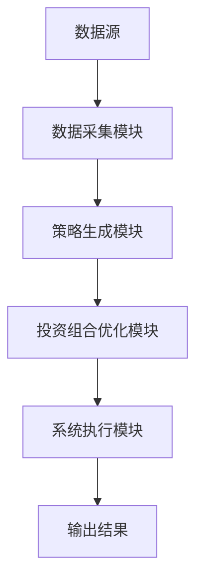
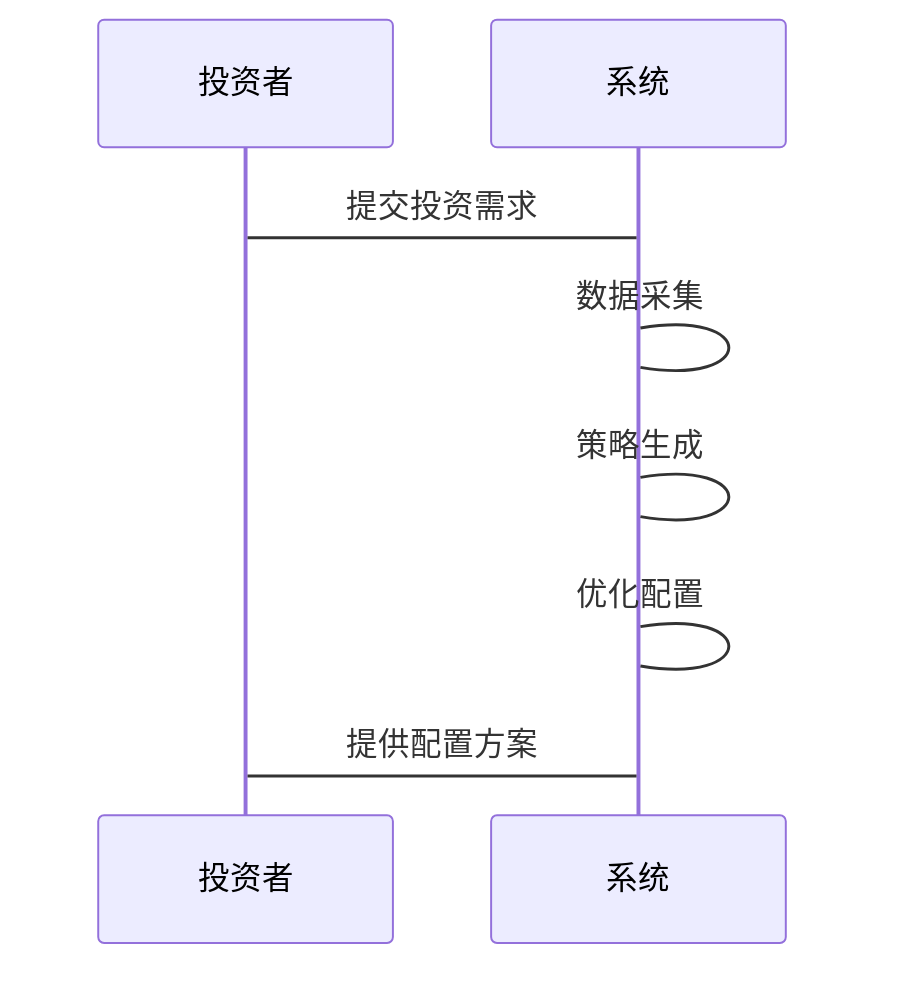

                 


# 如何利用特价股票策略进行资产配置

## 关键词：特价股票、资产配置、投资策略、数学模型、风险管理

## 摘要：本文详细探讨了如何利用特价股票策略进行资产配置，从特价股票的基本概念到资产配置的数学模型，再到实际系统的架构设计与实现，最后结合具体案例进行分析。通过本文的学习，读者可以掌握如何基于特价股票策略构建高效、稳健的投资组合。

---

## 第一部分: 特价股票策略与资产配置基础

### 第1章: 特价股票策略概述

#### 1.1 特价股票的定义与特点

##### 1.1.1 特价股票的定义

特价股票是指在特定市场条件下，股票价格显著低于其内在价值或行业平均水平的股票。这些股票通常被视为被市场低估，具有较高的投资潜力。

##### 1.1.2 特价股票的核心特点

- **低估值**：通过市盈率（P/E）、市净率（P/B）等指标判断，股价低于行业平均水平。
- **高分红潜力**：通常具有较高的股息率，吸引追求稳定收益的投资者。
- **周期性**：在市场低迷或行业衰退期，特价股票更容易出现。

##### 1.1.3 特价股票与普通股票的区别

| 属性         | 特价股票                     | 普通股票                     |
|--------------|------------------------------|------------------------------|
| 估值         | 通常低于市场平均水平         | 通常接近或高于市场平均水平   |
| 风险         | 高（潜在收益大，但波动性高）  | 中等（波动性较低，收益稳定） |
| 投资策略     | 长期持有，等待价值回归       | 短期交易或长期持有           |

#### 1.2 特价股票的市场背景

##### 1.2.1 特价股票出现的原因

- **市场情绪**：投资者恐慌导致抛售，股价下跌。
- **行业周期**：行业处于衰退期，公司基本面暂时不佳。
- **突发事件**：如自然灾害、政策变化等对股价的短期冲击。

##### 1.2.2 市场波动对特价股票的影响

- **波动性**：市场波动加剧时，特价股票价格波动更大。
- **交易机会**：波动性为投资者提供了低位买入的机会。

##### 1.2.3 特价股票的周期性特征

- **周期性波动**：特价股票的出现具有周期性，通常与经济周期相关。
- **周期性投资机会**：投资者需在周期性波动中抓住投资机会。

### 第2章: 资产配置的基本原理

#### 2.1 资产配置的定义与作用

##### 2.1.1 资产配置的定义

资产配置是指将资金分配到不同的资产类别（如股票、债券、现金等）中，以实现风险与收益的最佳平衡。

##### 2.1.2 资产配置的作用

- **风险分散**：通过投资不同资产降低风险。
- **收益增强**：通过优化资产组合提高收益。
- **动态调整**：根据市场变化及时调整资产配置。

##### 2.1.3 资产配置与投资收益的关系

- **相关性**：资产配置决定了投资组合的收益和风险。
- **优化目标**：在给定风险下最大化收益，或在给定收益下最小化风险。

#### 2.2 资产配置的类型

##### 2.2.1 现金、股票、债券等主要资产类别

- **现金**：流动性高，风险低，收益低。
- **股票**：风险高，收益潜力大。
- **债券**：风险中等，收益稳定。

##### 2.2.2 不同资产类别的风险与收益特征

| 资产类别 | 风险 | 收益 |
|----------|------|------|
| 现金     | 低   | 低   |
| 债券     | 中   | 中   |
| 股票     | 高   | 高   |

##### 2.2.3 资产配置的动态调整

- **市场变化**：根据市场趋势调整资产比例。
- **个人目标变化**：如投资目标、风险承受能力的变化。

---

## 第二部分: 特价股票策略的数学模型与算法原理

### 第3章: 特价股票选择的数学模型

#### 3.1 特价股票筛选的指标体系

##### 3.1.1 市盈率（P/E）

公式：$$ P/E = \frac{\text{股价}}{\text{每股净利润}} $$

- 低P/E值表示股价可能被低估。

##### 3.1.2 市净率（P/B）

公式：$$ P/B = \frac{\text{股价}}{\text{每股净资产}} $$

- 低P/B值表示股价可能被低估。

##### 3.1.3 股息率

公式：$$ \text{股息率} = \frac{\text{每股股息}}{\text{股价}} $$

- 高股息率表示分红能力强。

##### 3.1.4 其他辅助指标

- 市销率（P/S）
- 资产负债率
- 净利润增长率

#### 3.2 特价股票选择的优化模型

##### 3.2.1 线性回归模型

公式：$$ y = \beta x + \epsilon $$

- 用于分析股价与基本面指标之间的关系。

##### 3.2.2 聚类分析模型

- 将股票分为不同类别，识别出具有相似特征的特价股票。

##### 3.2.3 支持向量机（SVM）模型

- 用于分类和回归，预测股票是否为特价股票。

### 第4章: 资产配置的优化算法

#### 4.1 均值-方差优化模型

##### 4.1.1 均值-方差模型的定义

- 在给定风险下，寻找收益最大的组合；在给定收益下，寻找风险最小的组合。

公式：
$$ \text{Minimize } \sigma^2 \text{ subject to } \mu \geq r \text{ 和 } w^T \mathbf{1} = 1 $$

其中：
- $$ \sigma^2 $$ 是投资组合的方差（风险）
- $$ \mu $$ 是投资组合的期望收益
- $$ r $$ 是目标收益
- $$ w $$ 是投资权重向量
- $$ \mathbf{1} $$ 是全为1的向量

##### 4.1.2 模型的实现步骤

1. 收集各资产的历史数据。
2. 计算各资产的期望收益和协方差矩阵。
3. 使用优化算法求解最优权重。

#### 4.2 风险平价配置模型

##### 4.2.1 风险平价模型的定义

- 各资产的风险贡献相等。

公式：
$$ w_i = \frac{1}{\sqrt{N \sigma_i^2}} $$

其中：
- $$ w_i $$ 是第i个资产的投资权重
- $$ \sigma_i^2 $$ 是第i个资产的风险（方差）
- $$ N $$ 是资产数量

##### 4.2.2 模型的优势与局限性

- 优势：分散风险，避免单个资产风险过高。
- 局限性：可能忽略资产之间的相关性。

#### 4.3 基于特价股票的动态再平衡算法

##### 4.3.1 动态再平衡的定义

- 定期调整投资组合，以维持目标配置比例。

##### 4.3.2 算法步骤

1. 确定目标配置比例。
2. 定期（如每季度）评估当前投资组合。
3. 调整权重，使其接近目标比例。

##### 4.3.3 实施动态再平衡的注意事项

- 频率：过于频繁的调整可能增加交易成本。
- 市场环境：根据市场变化调整再平衡策略。

---

## 第三部分: 特价股票策略与资产配置的系统架构

### 第5章: 特价股票策略与资产配置的系统架构

#### 5.1 问题场景介绍

- **目标**：构建一个基于特价股票的资产配置系统。
- **用户角色**：投资者、资产管理机构。
- **需求**：实时监控市场，自动筛选特价股票，优化资产配置。

#### 5.2 系统功能设计

##### 5.2.1 数据采集模块

- 数据来源：股票市场数据、财务报表、新闻资讯。
- 数据类型：实时价格、历史数据、基本面指标。

##### 5.2.2 策略生成模块

- 输入：数据采集模块提供的数据。
- 输出：符合筛选条件的特价股票列表。
- 核心功能：通过数学模型筛选出低估股票。

##### 5.2.3 投资组合优化模块

- 输入：特价股票列表。
- 输出：优化后的资产配置方案。
- 核心功能：应用均值-方差模型或风险平价模型优化组合。

##### 5.2.4 系统执行模块

- 输入：优化后的配置方案。
- 输出：交易指令、再平衡建议。
- 核心功能：根据配置方案生成交易策略。

#### 5.3 系统架构设计

##### 5.3.1 系统架构图



##### 5.3.2 数据流图

```mermaid
flowchart TD
    start --> A[数据采集]
    A --> B[策略生成]
    B --> C[投资组合优化]
    C --> D[系统执行]
    D --> end
```

##### 5.3.3 系统交互图



#### 5.4 系统实现细节

##### 5.4.1 数据采集模块的实现

- 数据接口：使用API获取实时数据。
- 数据存储：使用数据库存储历史数据。

##### 5.4.2 策略生成模块的实现

- 筛选算法：基于P/E、P/B等指标筛选低估股票。
- 可视化：生成股票筛选结果图表。

##### 5.4.3 投资组合优化模块的实现

- 优化算法：使用Python的`scipy.optimize`库实现均值-方差优化。
- 风险管理：计算VaR（在险值）等风险指标。

##### 5.4.4 系统执行模块的实现

- 交易执行：生成买卖指令。
- 再平衡：定期调整投资组合。

---

## 第四部分: 项目实战

### 第6章: 特价股票策略与资产配置的项目实战

#### 6.1 环境安装

- **工具选择**：Python、Pandas、NumPy、Matplotlib、Plotly。
- **数据源**：Yahoo Finance API、本地数据库。

#### 6.2 系统核心实现源代码

##### 6.2.1 数据采集模块

```python
import pandas as pd
import requests

def get_stock_data(tickers, start_date, end_date):
    api_key = "YOUR_API_KEY"
    data = []
    for ticker in tickers:
        url = f"https://api.example.com/stock/{ticker}/price?start={start_date}&end={end_date}&api_key={api_key}"
        response = requests.get(url)
        if response.status_code == 200:
            data.append(pd.DataFrame(response.json()))
    return pd.concat(data)
```

##### 6.2.2 策略生成模块

```python
def screen_cheap_stocks(data, threshold_pe=15, threshold_pb=2):
    cheap = []
    for ticker in data.columns:
        df = data[ticker]
        if df['P/E'].mean() < threshold_pe and df['P/B'].mean() < threshold_pb:
            cheap.append(ticker)
    return cheap
```

##### 6.2.3 投资组合优化模块

```python
import numpy as np
from scipy.optimize import minimize

def portfolio_optimization(returns, covariance, target_return):
    n = len(returns)
    init_guess = np.array([1.0/n] * n)
    constraints = [
        {'type': 'eq', 'fun': lambda w: np.sum(w) - 1.0},
        {'type': 'eq', 'fun': lambda w: np.dot(w, returns) - target_return}
    ]
    result = minimize(
        lambda w: np.dot(w.T, np.dot(covariance, w)),
        init_guess,
        constraints=constraints
    )
    return result.x
```

#### 6.3 代码应用解读与分析

##### 6.3.1 数据采集模块

- 功能：从API获取股票数据。
- 输入：股票代码、起始日期、结束日期。
- 输出：DataFrame格式的历史数据。

##### 6.3.2 策略生成模块

- 功能：筛选符合低估指标的股票。
- 输入：数据框、P/E阈值、P/B阈值。
- 输出：符合条件的股票列表。

##### 6.3.3 投资组合优化模块

- 功能：优化投资组合，使其在给定风险下达到目标收益。
- 输入：资产回报率、协方差矩阵、目标收益。
- 输出：优化后的投资权重。

#### 6.4 实际案例分析

##### 6.4.1 案例背景

假设我们有三只股票：A、B、C，目标是构建一个三资产的投资组合，目标收益为8%，风险最低。

##### 6.4.2 数据准备

| 股票 | 期望回报率 | 方差 | 协方差矩阵 |
|------|------------|------|------------|
| A    | 0.08       | 0.04 | [0.02, 0.03, 0.04] |
| B    | 0.10       | 0.06 | [0.03, 0.06, 0.05] |
| C    | 0.06       | 0.03 | [0.04, 0.05, 0.03] |

##### 6.4.3 优化过程

目标：最小化方差，满足期望回报率≥8%。

##### 6.4.4 结果分析

假设优化结果为：w_A=0.4, w_B=0.3, w_C=0.3。

- 投资组合期望回报率：0.4*0.08 + 0.3*0.10 + 0.3*0.06 = 0.082
- 投资组合方差：0.4^2*0.04 + 0.3^2*0.06 + 0.3^2*0.03 + 2*0.4*0.3*0.02 + 2*0.4*0.3*0.03 + 2*0.3*0.3*0.04 ≈ 0.0204

---

## 第五部分: 总结与展望

### 第7章: 总结与展望

#### 7.1 总结

本文详细探讨了如何利用特价股票策略进行资产配置，从理论基础到数学模型，再到系统架构与实战，全面介绍了如何构建高效的投资组合。

#### 7.2 优势与劣势

##### 优势

- **低估值**：投资具有较高安全边际的股票。
- **分散风险**：通过资产配置降低整体风险。
- **长期收益**：特价股票通常具有较高的上涨潜力。

##### 劣势

- **市场波动**：特价股票价格波动较大，存在较大的短期风险。
- **模型限制**：数学模型假设可能与现实不符。

#### 7.3 风险管理

##### 7.3.1 风险控制措施

- **止损策略**：设定止损点，避免过大损失。
- **分散投资**：避免过度集中于某一只股票或资产类别。
- **定期评估**：动态调整投资组合，适应市场变化。

##### 7.3.2 风险提示

- 市场风险：股市波动可能对投资组合造成重大影响。
- 模型风险：数学模型可能无法完全捕捉市场复杂性。
- 操作风险：交易执行中的错误可能影响投资结果。

#### 7.4 进阶学习方向

##### 7.4.1 量化交易

- 算法交易：利用算法自动执行交易策略。
- 高频交易：在短时间内进行大量交易，捕捉短期价格波动。

##### 7.4.2 行为金融学

- 投资者心理：研究投资者行为对市场的影响。
- 行为偏差：识别并避免常见的投资偏差。

---

## 作者：AI天才研究院/AI Genius Institute & 禅与计算机程序设计艺术 /Zen And The Art of Computer Programming

---

**总结：** 通过本文的学习，读者可以掌握如何基于特价股票策略构建高效、稳健的投资组合。从基础理论到数学模型，再到实际系统的架构设计与实现，本文为读者提供了全面的知识体系和实用的工具。同时，通过具体案例的分析，读者可以更好地理解和应用这些策略。

