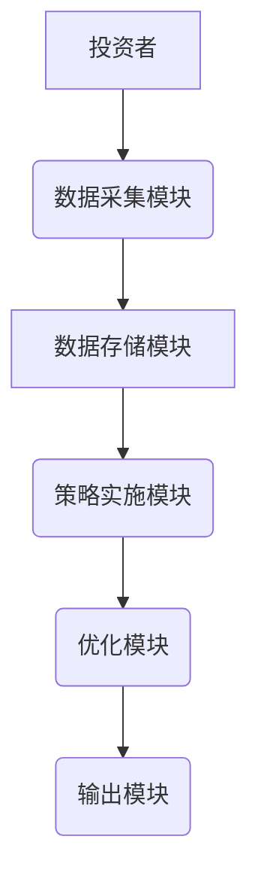
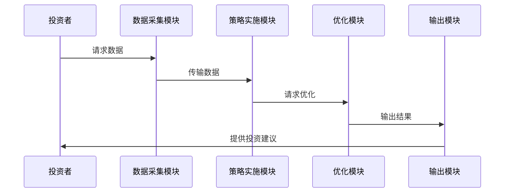

                 


# 如何利用特价股票策略进行跨境资产配置

## 关键词：特价股票、跨境资产配置、投资策略、股票分析、风险管理

## 摘要：本文详细探讨如何利用特价股票策略进行跨境资产配置，通过分析特价股票的内在价值、市场情绪以及全球市场的差异，结合数学模型和系统架构设计，提供优化投资组合的策略和实现方法。

---

# 第一部分: 特价股票策略与跨境资产配置的背景与概念

## 第1章: 特价股票策略的背景与概念

### 1.1 特价股票策略的背景

#### 1.1.1 什么是特价股票
特价股票是指市场价格显著低于其内在价值的股票。这种股票通常出现在市场低迷或公司短期遇到困难时，为投资者提供了以较低价格买入优质资产的机会。

#### 1.1.2 特价股票的市场背景
近年来，全球经济波动加剧，尤其是在2020年新冠疫情的影响下，许多优质公司股票价格大幅下跌，为投资者提供了寻找特价股票的良机。

#### 1.1.3 特价股票与价值投资的区别
价值投资强调购买价格低于内在价值的股票，而特价股票策略更注重在市场恐慌或特殊情况下捕捉被低估的机会。

### 1.2 特价股票策略的核心概念

#### 1.2.1 特价股票的定义与特征
- **定义**：市场价格显著低于内在价值的股票。
- **特征**：低估值、高分红率、稳定的财务状况。

#### 1.2.2 特价股票的分类与应用场景
- **分类**：
  - 周期性股票：如能源、材料等行业。
  - 非周期性股票：如公用事业、消费必需品等行业。
- **应用场景**：
  - 市场低迷时期。
  - 公司短期困境时期。

#### 1.2.3 特价股票策略的优缺点分析
- **优点**：高回报潜力、低买入成本。
- **缺点**：高风险，可能需要长期持有。

### 1.3 特价股票策略与传统投资策略的区别

#### 1.3.1 传统投资策略的局限性
- 过度依赖市场趋势，忽视个股基本面。
- 风险分散不足。

#### 1.3.2 特价股票策略的优势
- 以低于内在价值的价格买入优质资产。
- 利用市场短期波动捕捉机会。

#### 1.3.3 特价股票策略的风险与挑战
- 市场复苏时间不确定。
- 公司基本面可能进一步恶化。

---

## 第2章: 跨境资产配置的背景与概念

### 2.1 跨境资产配置的背景

#### 2.1.1 全球化经济与资产配置的重要性
随着全球经济一体化，投资者可以通过配置不同国家的资产来分散风险，同时捕捉全球市场的机会。

#### 2.1.2 跨境资产配置的必要性
- 避免单一市场的波动风险。
- 利用不同市场的周期性差异。

#### 2.1.3 跨境资产配置的市场环境
- 经济周期波动。
- 汇率波动。
- 政治经济风险。

### 2.2 跨境资产配置的核心概念

#### 2.2.1 跨境资产配置的定义与特征
- **定义**：在全球范围内分散投资，以优化风险和回报。
- **特征**：
  - 多样化：涵盖不同国家、行业和资产类别。
  - 分散风险：降低单一市场的波动影响。

#### 2.2.2 跨境资产配置的分类与应用场景
- **分类**：
  - 全球资产配置：投资于多个主要市场的股票、债券等。
  - 区域资产配置：专注于特定地区的投资。
- **应用场景**：
  - 避免本地市场的波动。
  - 利用不同市场的增长潜力。

#### 2.2.3 跨境资产配置的优缺点分析
- **优点**：分散风险，捕捉全球机会。
- **缺点**：涉及汇率风险和国际政治经济风险。

### 2.3 跨境资产配置与国内投资的区别

#### 2.3.1 国内投资的局限性
- 风险过于集中。
- 缺乏全球市场的机会。

#### 2.3.2 跨境资产配置的优势
- 分散风险。
- 利用不同市场的增长潜力。

#### 2.3.3 跨境资产配置的风险与挑战
- 汇率波动风险。
- 政治经济风险。

---

## 第3章: 特价股票策略与跨境资产配置的结合

### 3.1 特价股票策略与跨境资产配置的结合背景

#### 3.1.1 经济全球化与市场波动
全球化使得市场波动能够迅速传导到全球，投资者可以通过寻找特价股票在全球市场中获利。

#### 3.1.2 特价股票策略的国际化扩展
将特价股票策略扩展到国际市场，寻找全球范围内的低估资产。

#### 3.1.3 跨境资产配置的策略优化
通过结合特价股票策略，优化跨境资产配置的投资回报和风险控制。

### 3.2 特价股票策略与跨境资产配置的结合方式

#### 3.2.1 特价股票的国际化筛选
- 在全球范围内筛选被低估的股票。
- 考虑不同国家的市场环境和经济指标。

#### 3.2.2 跨境资产配置中的特价股票策略
- 将特价股票策略应用于全球资产配置中。
- 结合汇率和市场波动进行动态调整。

#### 3.2.3 组合优化与风险控制
- 构建多元化的投资组合。
- 使用数学模型优化资产配置。

### 3.3 特价股票策略与跨境资产配置的结合优势

#### 3.3.1 分散风险的优势
通过全球配置，降低单一市场的波动风险。

#### 3.3.2 优化收益的优势
在全球范围内寻找低估资产，提高投资回报。

#### 3.3.3 灵活性与适应性的优势
根据市场变化动态调整投资组合。

---

## 第二部分: 特价股票策略的核心原理与分析

## 第4章: 特价股票策略的核心原理

### 4.1 特价股票的内在价值评估

#### 4.1.1 内在价值的定义与计算方法
- **定义**：股票的内在价值是其未来现金流的现值。
- **计算方法**：使用现金流折现模型（DCF）等方法。

#### 4.1.2 市场价值与内在价值的对比
- 市场价值受短期因素影响，内在价值反映长期基本面。

#### 4.1.3 内在价值评估的常用模型
- **DCF模型**：计算未来现金流的现值。
- **PE、PB、PS等估值指标**：常用的估值方法。

### 4.2 特价股票的市场情绪分析

#### 4.2.1 市场情绪的定义与衡量指标
- **定义**：市场参与者的情绪状态。
- **衡量指标**：波动率、成交量、恐慌指数等。

#### 4.2.2 市场情绪对股票价格的影响
- 惶恐慌导致价格偏离内在价值。
- 理性分析帮助识别低估股票。

---

## 第三部分: 系统分析与架构设计

## 第5章: 跨境资产配置的系统分析与架构设计

### 5.1 问题场景介绍
- 投资者希望通过全球资产配置优化投资回报和风险。

### 5.2 系统功能设计
- 数据采集：全球股票数据、经济指标、汇率等。
- 策略实施：特价股票筛选、资产配置优化。

### 5.3 系统架构设计


### 5.4 系统接口设计
- 数据接口：从全球数据库获取实时数据。
- 优化接口：与数学模型交互。

### 5.5 系统交互流程


---

## 第四部分: 项目实战

## 第6章: 特价股票策略与跨境资产配置的实战

### 6.1 环境安装
- 安装Python、Pandas、NumPy等库。
- 数据来源：Yahoo Finance等。

### 6.2 核心代码实现

#### 6.2.1 特价股票筛选
```python
import pandas as pd
import numpy as np

def calculate_intrinsic_value(fcf, discount_rate):
    return fcf / (1 + discount_rate)

# 示例数据
data = {
    '公司': ['A', 'B', 'C'],
    '自由现金流': [100, 150, 200],
    '折现率': [0.08, 0.08, 0.08]
}
df = pd.DataFrame(data)

# 计算内在价值
df['内在价值'] = df.apply(lambda x: calculate_intrinsic_value(x['自由现金流'], x['折现率']), axis=1)
print(df)
```

#### 6.2.2 跨境资产配置优化
```python
import pandas as pd
import numpy as np

def portfolio_optimization(returns, weights):
    return np.dot(returns, weights)

# 示例数据
returns = pd.DataFrame({
    '股票A': [0.1, 0.05, 0.08],
    '股票B': [0.08, 0.1, 0.05],
    '股票C': [0.05, 0.08, 0.1]
})

weights = pd.Series({'股票A': 0.3, '股票B': 0.3, '股票C': 0.4})

# 优化投资组合
optimal_return = portfolio_optimization(returns, weights)
print(optimal_return)
```

### 6.3 案例分析与解读
- 以全球能源公司为例，分析其特价股票机会。
- 结合汇率和市场波动进行配置。

---

## 第五部分: 最佳实践与小结

## 第7章: 最佳实践与小结

### 7.1 投资策略 tips
- 定期评估和调整投资组合。
- 结合市场环境动态优化。

### 7.2 小结
通过结合特价股票策略与跨境资产配置，投资者可以在全球化市场中实现风险可控下的高回报。

### 7.3 注意事项
- 风险控制是关键。
- 需要持续关注市场变化。

### 7.4 拓展阅读
- 《投资学》
- 《全球投资策略》

---

# 作者：AI天才研究院/AI Genius Institute & 禅与计算机程序设计艺术 /Zen And The Art of Computer Programming

