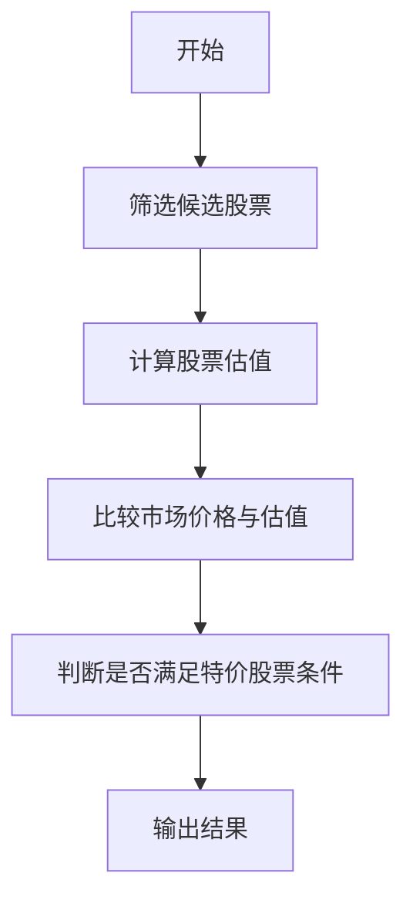
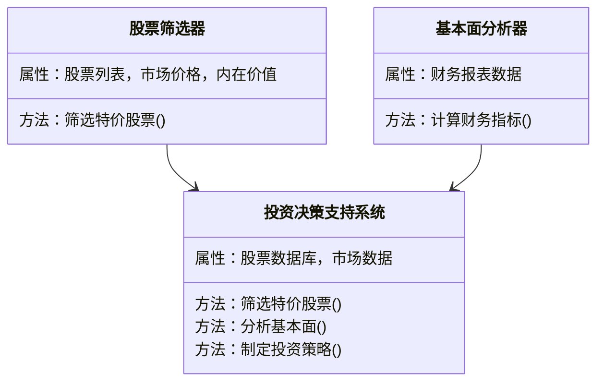
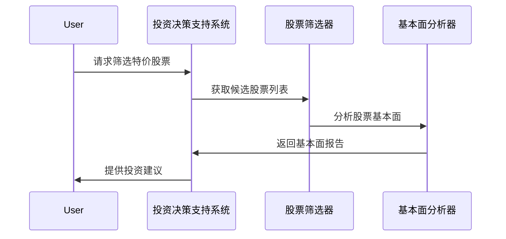

                 


# 如何利用特价股票策略进行逆向产业投资

> 关键词：特价股票，逆向投资，股票策略，产业投资，价值分析

> 摘要：本文将详细探讨如何利用特价股票策略进行逆向产业投资。通过分析特价股票的定义、逆向投资的原理以及两者之间的关系，结合算法原理、数学模型和实际案例，为投资者提供一套系统的投资策略和方法论。文章内容涵盖特价股票的筛选标准、基本面分析、投资策略制定、系统架构设计以及实际项目中的应用，帮助读者在复杂多变的市场环境中找到投资机会。

---

# 第1章: 特价股票策略与逆向投资概述

## 1.1 特价股票的基本概念
### 1.1.1 特价股票的定义
特价股票是指市场价格显著低于其内在价值的股票。这种股票通常被市场低估，可能由于市场恐慌、行业周期性低谷或公司短期问题导致。特价股票的核心在于其价格与价值的不匹配，为投资者提供了潜在的收益机会。

### 1.1.2 特价股票的分类与特点
特价股票可以根据市场波动、行业特性或公司基本面进行分类。其特点包括价格低廉、低估值、高分红率以及潜在的复苏机会。这些特点使其成为逆向投资者的首选目标。

### 1.1.3 特价股票与普通股票的区别
普通股票的价格通常反映市场情绪，而特价股票则因其低估特性，往往被市场忽视或低估。区别在于，特价股票具有更高的安全边际和潜在的上涨空间。

## 1.2 逆向投资的基本原理
### 1.2.1 逆向投资的定义
逆向投资是一种在市场低迷或恐慌时买入，而在市场繁荣时卖出的投资策略。其核心在于反向操作市场情绪，寻找被市场抛弃的优质资产。

### 1.2.2 逆向投资的核心理念
逆向投资的核心理念是“买别人恐惧时的东西”。投资者需要在市场恐慌时发现被低估的机会，同时具备独立思考和长期持有的耐心。

### 1.2.3 逆向投资与传统投资的区别
传统投资依赖于市场趋势和技术分析，而逆向投资则更注重基本面分析和市场情绪的反向操作。逆向投资强调在非理性市场中寻找理性价值。

## 1.3 特价股票策略在逆向投资中的作用
### 1.3.1 特价股票策略的定义
特价股票策略是通过筛选市场价格低于内在价值的股票，进行长期投资以获取超额收益的一种策略。

### 1.3.2 特价股票策略的核心要素
- 市场价格低于内在价值
- 公司基本面良好
- 行业具有复苏潜力
- 市场情绪低迷

### 1.3.3 特价股票策略与逆向投资的关系
特价股票策略是逆向投资的重要工具，逆向投资通过特价股票策略找到被低估的资产，从而实现超额收益。

## 1.4 逆向投资的适用场景与边界
### 1.4.1 逆向投资的适用场景
- 市场恐慌或崩盘时
- 行业周期性低谷时
- 特定公司因负面新闻被错杀时

### 1.4.2 逆向投资的边界与限制
- 需要具备强大的基本面分析能力
- 需要足够的耐心和信心
- 需要控制好仓位和风险

### 1.4.3 逆向投资的潜在风险
- 市场持续低迷导致流动性风险
- 公司基本面恶化导致价值进一步下降
- 市场复苏时间长导致资金机会成本增加

## 1.5 本章小结
本章介绍了特价股票的定义、分类和特点，分析了逆向投资的基本原理和核心理念，并探讨了特价股票策略在逆向投资中的作用及适用场景。接下来的章节将深入分析特价股票策略的核心概念、算法原理和实际应用。

---

# 第2章: 特价股票策略的核心概念与联系

## 2.1 特价股票策略的原理
### 2.1.1 特价股票的形成机制
特价股票的形成通常与市场情绪、行业周期、公司管理问题等因素有关。市场恐慌导致抛售压力增加，而公司基本面良好的股票价格被错杀，形成特价股票。

### 2.1.2 特价股票的市场表现
特价股票通常具有低市盈率、低市净率和高股息率的特点。这些指标反映了股票的低估特性。

### 2.1.3 特价股票与公司基本面的关系
公司基本面是判断股票是否为特价股票的核心依据。良好的基本面意味着公司具有持续盈利能力，而市场价格低于内在价值则为投资提供了安全边际。

## 2.2 逆向投资的核心概念
### 2.2.1 逆向投资的逻辑框架
逆向投资的核心逻辑是基于市场非理性行为，寻找被低估的资产。投资者需要具备独立思考能力，避免随波逐流。

### 2.2.2 逆向投资的关键要素
- 独立思考
- 基本面分析
- 长期持有
- 忍耐力

### 2.2.3 逆向投资与市场情绪的关系
逆向投资的成功取决于对市场情绪的准确判断。在市场恐慌时买入，在市场狂热时卖出，是逆向投资的基本策略。

## 2.3 特价股票策略与逆向投资的联系
### 2.3.1 特价股票策略在逆向投资中的应用
逆向投资者通过特价股票策略筛选出被市场低估的股票，进行长期投资。

### 2.3.2 逆向投资如何利用特价股票策略
逆向投资利用特价股票策略，通过基本面分析和价格比较，找到具有潜在升值空间的股票。

### 2.3.3 特价股票策略与逆向投资的协同效应
特价股票策略为逆向投资提供了工具和方法，而逆向投资则为特价股票策略提供了应用场景和投资理念。

## 2.4 本章小结
本章分析了特价股票策略的原理和逆向投资的核心概念，探讨了两者之间的联系和协同效应。通过结合基本面分析和市场情绪判断，投资者可以更好地利用特价股票策略进行逆向投资。

---

# 第3章: 特价股票策略的算法原理

## 3.1 特价股票筛选算法
### 3.1.1 筛选标准与权重分配
- 市盈率（P/E）小于行业平均水平
- 市净率（P/B）小于1
- 股息率高于行业平均水平
- 公司财务状况健康

### 3.1.2 算法流程图（Mermaid）


## 3.2 特价股票基本面分析算法
### 3.2.1 基本面分析的核心指标
- 净利润
- 营业收入
- 资产负债率
- 盈利能力指标（如ROE）

### 3.2.2 基本面分析的步骤
1. 收集公司财务报表数据
2. 计算关键财务指标
3. 分析公司盈利能力、偿债能力和发展能力
4. 判断公司基本面是否良好

### 3.2.3 基本面分析的Python代码实现
```python
import pandas as pd
import yfinance as yf

# 下载股票数据
msft = yf.download('MSFT', start='2020-01-01', end='2023-12-31')

# 计算基本面指标
def calculate_roe(df):
    net_income = df['净利润']  # 假设df包含'净利润'列
    equity = df['股东权益']     # 假设df包含'股东权益'列
    roe = net_income / equity
    return roe

roe = calculate_roe(msft)
print("ROE:", roe)
```

## 3.3 特价股票投资策略的算法
### 3.3.1 投资策略的制定步骤
1. 筛选特价股票
2. 分析公司基本面
3. 判断市场情绪
4. 制定买卖策略

### 3.3.2 投资策略的数学模型
$$ 投资价值 = \text{内在价值} - \text{市场价格} $$

其中，内在价值通过 discounted cash flow（DCF）模型计算得出。

### 3.3.3 投资策略的Python代码实现
```python
import pandas as pd
import numpy as np

# 假设df包含股票数据和基本面指标
def calculate_intrinsic_value(df):
    # 计算自由现金流
    fcfs = df['自由现金流']
    # 计算加权平均资本成本
    wacc = df['加权平均资本成本']
    # 计算DCF
    dcfs = fcfs / (1 - wacc) * (1 + wacc)**-5
    return dcfs

# 计算投资价值
df['投资价值'] = calculate_intrinsic_value(df)
print("投资价值:", df['投资价值'])
```

## 3.4 本章小结
本章详细介绍了特价股票筛选和基本面分析的算法，通过Python代码实现模型计算，帮助投资者制定有效的投资策略。

---

# 第4章: 逆向投资的系统分析与架构设计

## 4.1 系统功能设计
### 4.1.1 领域模型设计（Mermaid类图）


### 4.1.2 系统架构设计（Mermaid架构图）
```mermaid
C4Context {
    title 投资决策支持系统架构
    System{
        UserInterface
        ServiceLayer
        Database
        ExternalAPI
    }
    UserInterface --> ServiceLayer
    ServiceLayer --> Database
    ServiceLayer --> ExternalAPI
}
```

## 4.2 系统接口设计
### 4.2.1 接口功能
- 股票筛选接口
- 基本面分析接口
- 投资策略制定接口

### 4.2.2 接口协议
- RESTful API
- 数据格式：JSON

## 4.3 系统交互流程（Mermaid序列图）


## 4.4 本章小结
本章通过系统分析和架构设计，展示了如何构建一个支持逆向投资的决策支持系统，为投资者提供高效的投资工具。

---

# 第5章: 项目实战与案例分析

## 5.1 项目背景
假设当前市场处于低迷状态，多个行业出现特价股票。投资者希望通过特价股票策略进行逆向投资，寻找具有潜在升值空间的股票。

## 5.2 项目核心实现
### 5.2.1 环境安装
- Python 3.8+
- Pandas、NumPy、yfinance等库

### 5.2.2 核心代码实现
```python
import yfinance as yf
import pandas as pd

# 下载股票数据
def get_stock_data(ticker, start, end):
    data = yf.download(ticker, start=start, end=end)
    return data

# 筛选特价股票
def screen_dcf_stocks(tickers, start, end):
    selected_stocks = []
    for ticker in tickers:
        data = get_stock_data(ticker, start, end)
        # 计算DCF
        # 假设data中包含自由现金流和加权平均资本成本
        dcf = data['自由现金流'].sum() / (1 - data['加权平均资本成本'].mean())
        market_value = data['Close'].mean()
        if dcf > market_value:
            selected_stocks.append(ticker)
    return selected_stocks

# 实施筛选
tickers = ['AAPL', 'MSFT', 'GOOGL']
selected_stocks = screen_dcf_stocks(tickers, '2020-01-01', '2023-12-31')
print("特价股票:", selected_stocks)
```

## 5.3 案例分析
### 5.3.1 案例背景
假设当前市场中，某行业龙头公司因行业低迷导致股价暴跌，但公司基本面良好，具备复苏潜力。

### 5.3.2 数据分析
- 公司股价从高位下跌30%，市盈率低于行业平均水平
- 公司净利润稳定，现金流充足
- 行业有望在一年内复苏

### 5.3.3 投资策略
- 买入特价股票
- 设置止损点
- 长期持有

## 5.4 本章小结
本章通过项目实战和案例分析，展示了如何利用特价股票策略进行逆向投资。通过实际操作，投资者可以更好地理解策略的应用和效果。

---

# 第6章: 最佳实践与注意事项

## 6.1 投资策略的注意事项
### 6.1.1 风险管理
- 设置止损点
- 分散投资
- 定期复盘

### 6.1.2 心理因素
- 避免贪婪和恐惧
- 坚持长期投资
- 保持独立思考

## 6.2 投资策略的持续优化
### 6.2.1 持续学习
- 关注行业动态
- 更新投资模型
- 学习成功案例

### 6.2.2 数据分析工具的优化
- 引入机器学习模型
- 使用大数据分析
- 提高数据分析效率

## 6.3 法律与合规
- 遵守证券法规
- 保护投资信息
- 遵守市场规则

## 6.4 本章小结
本章总结了逆向投资中的注意事项和最佳实践，为投资者提供了优化投资策略的建议。

---

# 第7章: 总结与展望

## 7.1 本文总结
本文详细探讨了如何利用特价股票策略进行逆向产业投资，从理论到实践，为投资者提供了一套系统的投资方法论。

## 7.2 未来展望
未来，随着人工智能和大数据技术的发展，特价股票策略将更加精准和高效。投资者可以通过技术手段优化投资决策，提高投资收益。

---

# 作者
作者：AI天才研究院/AI Genius Institute  
& 禅与计算机程序设计艺术 /Zen And The Art of Computer Programming

