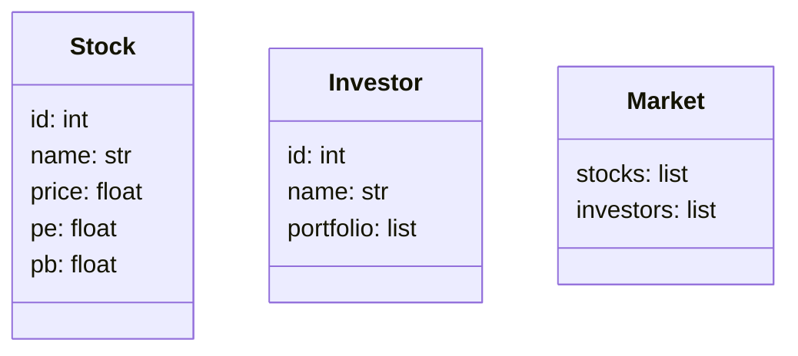
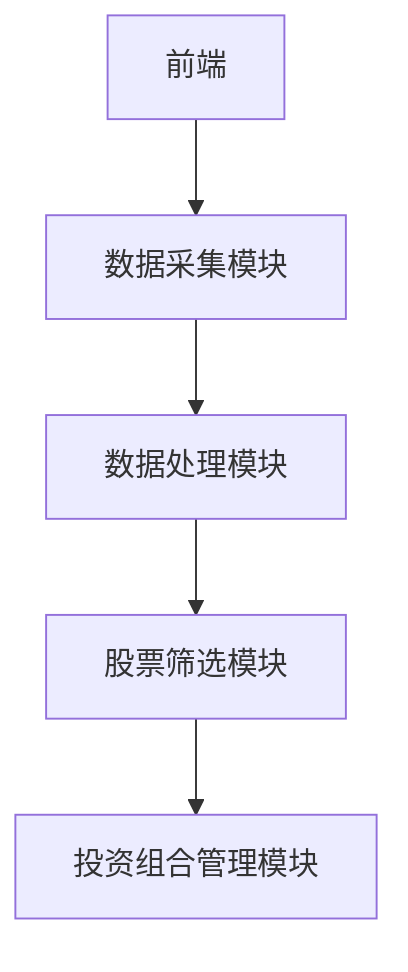

                 


# 如何利用特价股票策略进行逆向投资

> 关键词：逆向投资，特价股票，股票策略，价值投资，市场周期，投资策略

> 摘要：本文详细探讨了如何利用特价股票策略进行逆向投资。首先介绍了逆向投资和特价股票的基本概念，然后分析了特价股票的特征和逆向投资的策略，接着讲解了特价股票识别的算法原理，包括具体的数学模型和Python代码实现。随后，从系统架构设计的角度，详细阐述了特价股票筛选系统的核心功能、系统架构和交互流程。最后，通过实际案例分析，展示了如何在实践中应用这些策略，并总结了最佳实践经验和注意事项。

---

## 第一章: 逆向投资与特价股票概述

### 1.1 逆向投资的基本概念

#### 1.1.1 逆向投资的定义
逆向投资是一种投资策略，强调在市场恐慌或低迷时期买入，而在市场狂热时卖出。其核心理念是“别人恐惧时我贪婪，别人贪婪时我恐惧”。

#### 1.1.2 逆向投资的核心理念
逆向投资的核心理念是寻找市场中的非理性定价机会。当市场过度反应时，逆向投资者能够以较低的价格买入优质资产，等待市场回归理性后获得收益。

#### 1.1.3 逆向投资与传统投资的区别
| 特性 | 逆向投资 | 传统投资 |
|------|----------|-----------|
| 投资时机 | 市场低迷时买入 | 市场上涨时买入 |
| 心理要求 | 耐心、勇气 | 时机把握 |

### 1.2 特价股票的定义与特征

#### 1.2.1 特价股票的定义
特价股票是指市场价格显著低于其内在价值的股票。这些股票通常被市场忽视或低估，具有较大的上涨潜力。

#### 1.2.2 特价股票的主要特征
- **低市盈率（P/E）**：市盈率低于行业平均水平。
- **低市净率（P/B）**：市净率低于行业平均水平。
- **高股息率**：股息收益率较高，且股息支付率稳定。
- **低估值**：市场价格远低于合理估值。

#### 1.2.3 特价股票与市场周期的关系
- **熊市**：特价股票更容易出现，因为市场情绪低落，许多优质股票被抛售。
- **牛市**：特价股票较少，因为市场情绪高涨，股票价格被高估。

### 1.3 逆向投资与特价股票的关系

#### 1.3.1 逆向投资中的特价股票策略
逆向投资者倾向于在市场低迷时寻找特价股票，利用市场的非理性定价获得超额收益。

#### 1.3.2 特价股票在逆向投资中的作用
特价股票是逆向投资的主要工具，因为它们提供了以低于内在价值的价格买入优质资产的机会。

#### 1.3.3 逆向投资中特价股票的筛选标准
- **基本面分析**：重点关注公司的盈利能力、成长性和财务状况。
- **估值指标**：市盈率、市净率等指标低于行业平均水平。
- **市场情绪**：市场恐慌时更容易找到特价股票。

### 1.4 本章小结
本章介绍了逆向投资的基本概念和特价股票的定义、特征及其与市场周期的关系。逆向投资的核心是利用市场的非理性定价，特价股票是实现这一策略的重要工具。

---

## 第二章: 特价股票识别的核心概念

### 2.1 特价股票识别的原理

#### 2.1.1 市场估值的基本原理
市场估值是通过分析公司的财务指标和市场数据来确定其合理市场价格的过程。常用的估值指标包括市盈率、市净率等。

#### 2.1.2 市盈率、市净率等估值指标的计算
- **市盈率（P/E）**：股价除以每股收益。
  $$ P/E = \frac{股价}{每股收益} $$
- **市净率（P/B）**：股价除以每股净资产。
  $$ P/B = \frac{股价}{每股净资产} $$

#### 2.1.3 特价股票的估值模型
常用的估值模型包括市盈率模型、市净率模型和股息率模型。

### 2.2 逆向投资中的特价股票筛选方法

#### 2.2.1 基于基本面分析的筛选方法
基本面分析主要关注公司的财务状况、盈利能力和发展前景。以下是基本面分析的关键步骤：

1. **分析财务报表**：重点关注收入、利润、现金流等指标。
2. **评估公司盈利能力**：计算净利润率、毛利率等指标。
3. **评估公司成长性**：分析收入和利润的同比增长率。
4. **评估公司财务健康状况**：关注负债率、流动比率等指标。

#### 2.2.2 基于技术分析的筛选方法
技术分析主要通过研究股票价格和成交量的变化来预测未来的价格走势。以下是技术分析的关键步骤：

1. **绘制股票价格走势图**：观察价格的波动趋势。
2. **识别价格支撑位和阻力位**：确定价格的买卖区间。
3. **分析成交量变化**：判断价格变动的强度。

#### 2.2.3 综合分析法
综合分析法结合了基本面分析和技术分析，通过多维度的分析来筛选特价股票。

### 2.3 特价股票与市场周期的关系

#### 2.3.1 特价股票在熊市中的表现
在熊市中，市场情绪低迷，许多优质股票被抛售，导致市场价格低于其内在价值，因此容易出现特价股票。

#### 2.3.2 特价股票在牛市中的表现
在牛市中，市场情绪高涨，股票价格被高估，特价股票较少。

#### 2.3.3 市场周期对特价股票策略的影响
- **熊市**：适合寻找特价股票。
- **牛市**：适合卖出高价股票。

### 2.4 本章小结
本章详细探讨了特价股票识别的核心概念，包括估值指标、筛选方法和市场周期对策略的影响。通过综合分析，投资者可以在不同市场周期中找到合适的特价股票。

---

## 第三章: 逆向投资策略的核心要素

### 3.1 逆向投资中的心理因素

#### 3.1.1 投资者心理与市场情绪
投资者心理受市场情绪影响较大，市场恐慌时容易做出非理性决策。

#### 3.1.2 逆向思维在投资中的应用
逆向思维强调在市场情绪低落时买入，市场情绪高涨时卖出。

#### 3.1.3 克服用众心理的策略
- **独立思考**：不盲目跟随市场趋势。
- **长期视角**：关注公司的长期价值，而非短期价格波动。

### 3.2 逆向投资策略中的关键要素

#### 3.2.1 特价股票的内在价值
内在价值是公司未来现金流的现值，计算公式为：
$$ V = \sum_{t=1}^{n} \frac{CF_t}{(1 + r)^t} $$
其中，\( CF_t \) 是第 \( t \) 年的现金流，\( r \) 是折现率。

#### 3.2.2 投资组合的构建
逆向投资者通常会构建一个分散化的投资组合，以降低风险。

#### 3.2.3 风险管理策略
- **止损策略**：设定止损点，避免重大亏损。
- **分散投资**：通过投资不同行业的股票来降低风险。

### 3.3 逆向投资中的数学模型

#### 3.3.1 市场情绪指数模型
市场情绪指数可以通过分析成交量、价格波动等指标来计算。

#### 3.3.2 风险-收益模型
风险-收益模型用于评估投资组合的风险和收益。

### 3.4 本章小结
本章探讨了逆向投资中的心理因素和关键要素，强调了内在价值、风险管理策略和数学模型在逆向投资中的重要性。

---

## 第四章: 特价股票识别的算法原理

### 4.1 特价股票识别的算法流程

#### 4.1.1 数据收集
收集股票的市场价格、财务指标等数据。

#### 4.1.2 数据清洗
处理缺失数据、异常值等。

#### 4.1.3 数据分析
通过分析市盈率、市净率等指标筛选出潜在的特价股票。

#### 4.1.4 模型验证
验证筛选出的股票是否符合特价股票的特征。

### 4.2 算法实现

#### 4.2.1 Python代码实现
以下是Python代码示例，用于筛选特价股票：

```python
import pandas as pd
import numpy as np

# 假设df是股票数据，包含'PE'和'PB'列
df['PE'] = df['PE'].apply(lambda x: x if x < 15 else np.nan)
df['PB'] = df['PB'].apply(lambda x: x if x < 1.5 else np.nan)

# 筛选出PE和PB都低于阈值的股票
cheap_stocks = df[df['PE'].notna() & df['PB'].notna()]
```

#### 4.2.2 算法原理
通过设定市盈率和市净率的阈值，筛选出市场价格低于其内在价值的股票。

### 4.3 算法的数学模型

#### 4.3.1 市盈率模型
$$ P/E = \frac{股价}{每股收益} $$

#### 4.3.2 市净率模型
$$ P/B = \frac{股价}{每股净资产} $$

### 4.4 本章小结
本章详细介绍了特价股票识别的算法原理，包括数据收集、清洗、分析和模型验证。通过Python代码实现，投资者可以快速筛选出潜在的特价股票。

---

## 第五章: 系统分析与架构设计

### 5.1 系统功能设计

#### 5.1.1 领域模型设计
以下是领域模型的mermaid类图：



#### 5.1.2 系统功能模块
系统功能模块包括数据采集、数据处理、股票筛选和投资组合管理。

### 5.2 系统架构设计

#### 5.2.1 系统架构图
以下是系统架构的mermaid图：



#### 5.2.2 接口设计
系统接口包括数据接口、用户接口和API接口。

### 5.3 系统交互设计

#### 5.3.1 系统交互流程
以下是系统交互的mermaid序列图：

```mermaid
sequenceDiagram
   投资者 -> 数据采集模块: 请求数据
   数据采集模块 -> 数据处理模块: 传递数据
   数据处理模块 -> 股票筛选模块: 传递数据
   股票筛选模块 -> 投资组合管理模块: 传递结果
   投资者 <- 投资组合管理模块: 返回结果
```

### 5.4 本章小结
本章从系统架构的角度，详细设计了特价股票筛选系统的功能模块、架构和交互流程。

---

## 第六章: 项目实战

### 6.1 环境安装

#### 6.1.1 安装Python
安装Python和必要的库，如pandas、numpy等。

### 6.2 系统核心实现

#### 6.2.1 特价股票筛选算法实现
以下是Python代码示例：

```python
import pandas as pd

# 假设df是股票数据
df = pd.DataFrame({
    'name': ['stock1', 'stock2', 'stock3'],
    'price': [10, 20, 30],
    'pe': [10, 20, 30],
    'pb': [1, 2, 3]
})

# 筛选出pe和pb都低于阈值的股票
threshold_pe = 15
threshold_pb = 1.5
cheap_stocks = df[(df['pe'] < threshold_pe) & (df['pb'] < threshold_pb)]
print(cheap_stocks)
```

#### 6.2.2 投资组合管理实现
以下是投资组合管理的Python代码示例：

```python
import pandas as pd

# 假设portfolio是投资组合数据
portfolio = pd.DataFrame({
    'name': ['stock1', 'stock2', 'stock3'],
    'weight': [0.3, 0.4, 0.3]
})

# 计算投资组合的预期收益
expected_return = portfolio['weight'].dot(stock_returns)
print(expected_return)
```

### 6.3 案例分析

#### 6.3.1 实际案例分析
通过具体案例分析，展示如何利用特价股票策略进行逆向投资。

#### 6.3.2 案例总结
总结案例中的经验教训，为投资者提供参考。

### 6.4 本章小结
本章通过实际案例分析，展示了如何在实践中应用特价股票策略进行逆向投资，并总结了经验教训。

---

## 第七章: 最佳实践

### 7.1 小结

#### 7.1.1 总结
总结全文的核心内容和主要观点。

#### 7.1.2 重点回顾
回顾全文的重点内容，帮助读者巩固知识。

### 7.2 注意事项

#### 7.2.1 风险提示
提醒读者注意投资风险，避免盲目跟风。

#### 7.2.2 操作建议
给出实际操作中的建议，如分散投资、设置止损等。

### 7.3 拓展阅读

#### 7.3.1 推荐书籍
推荐几本关于逆向投资和股票策略的经典书籍。

#### 7.3.2 其他资源
推荐一些在线资源，如投资博客、论坛等。

### 7.4 本章小结
本章总结了全文的核心内容，并给出了实际操作中的注意事项和拓展阅读建议。

---

## 作者信息

作者：AI天才研究院/AI Genius Institute & 禅与计算机程序设计艺术 /Zen And The Art of Computer Programming

---

# 附录

## 附录A: 算法代码示例

```python
import pandas as pd

# 数据加载
df = pd.read_csv('stocks.csv')

# 筛选出pe和pb都低于阈值的股票
threshold_pe = 15
threshold_pb = 1.5
cheap_stocks = df[(df['pe'] < threshold_pe) & (df['pb'] < threshold_pb)]

# 输出结果
print(cheap_stocks)
```

## 附录B: 系统架构图


---

## 结束语

感谢您的阅读！希望本文对您理解如何利用特价股票策略进行逆向投资有所帮助。如果您有任何疑问或建议，请随时与我们联系。

