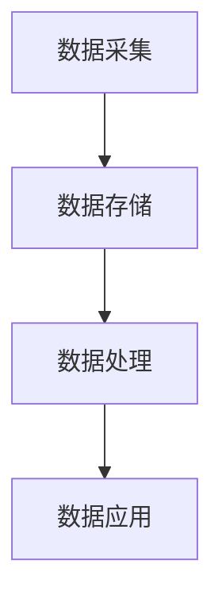

                 


# 如何利用特价股票策略进行逆向数字产业链投资

## 关键词：逆向投资, 特价股票, 数字产业链, 价值投资, 市场分析

## 摘要：  
本文深入探讨了如何利用特价股票策略进行逆向数字产业链投资。首先，介绍了逆向投资的基本概念和特价股票策略的核心要素。接着，分析了数字产业链的主要组成部分及其投资价值。通过结合价值投资理论和市场逆向思维，提出了识别特价股票的具体方法，包括财务指标分析和行业竞争分析。最后，通过实际案例展示了如何在数字产业链中应用特价股票策略，帮助投资者在市场波动中抓住投资机会，实现长期收益最大化。

---

# 第1章：逆向投资与特价股票策略概述

## 1.1 逆向投资的基本概念  
逆向投资是一种投资策略，强调在市场低迷或非理性时期买入被低估的资产，在市场繁荣时期卖出或规避。其核心思想是“买别人恐慌，卖别人贪婪”。  

### 1.1.1 逆向投资的定义  
逆向投资是指在市场情绪低落、投资者恐慌时买入资产，在市场情绪高涨时卖出资产。其本质是利用市场的非理性波动，捕捉价值低估的投资机会。  

### 1.1.2 逆向投资的核心思想  
1. 市场情绪的周期性：市场情绪会周期性波动，投资者需要在市场底部买入，在顶部卖出。  
2. 价值与价格分离：资产的市场价格与内在价值在短期内可能偏离，逆向投资利用这种偏离获利。  
3. 长期视角：逆向投资需要耐心等待市场回归价值的过程。  

### 1.1.3 逆向投资与传统投资的区别  
| 项目 | 逆向投资 | 传统投资 |  
|------|----------|----------|  
| 投资时机 | 市场恐慌时买入 | 市场上涨时买入 |  
| 风险态度 | 偏好高风险 | 偏好低风险 |  
| 持股心态 | 买入并持有 | 高频交易 |  

---

## 1.2 特价股票策略的原理  
特价股票策略是一种逆向投资策略，通过寻找被市场低估的股票进行投资。  

### 1.2.1 特价股票的定义  
特价股票是指市场价格远低于其内在价值的股票。  

### 1.2.2 特价股票策略的优势  
1. 低买高卖：在市场底部买入，市场顶部卖出，获得超额收益。  
2. 风险可控：通过选择基本面良好的公司，降低投资风险。  
3. 长期收益高：逆向投资通常能在市场周期中获得更高的长期回报。  

### 1.2.3 特价股票策略的适用场景  
1. 市场恐慌：如2020年新冠疫情导致的市场崩盘。  
2. 行业低迷：如科技行业在2022年的估值调整。  

---

## 1.3 数字产业链投资的背景  

### 1.3.1 数字产业链的定义  
数字产业链是指围绕数字技术（如人工智能、大数据、云计算等）形成的上下游产业网络。  

### 1.3.2 数字产业链的主要组成部分  
1. 数据采集：传感器、IoT设备。  
2. 数据存储：云存储、数据库。  
3. 数据处理：大数据分析、人工智能。  
4. 数据应用：行业解决方案。  

### 1.3.3 数字产业链投资的重要性  
1. 数字化转型：全球企业加速数字化转型，推动数字产业链扩张。  
2. 市场需求：数字经济市场规模持续增长，为数字产业链投资提供广阔空间。  

---

# 第2章：逆向投资的理论基础  

## 2.1 价值投资理论  

### 2.1.1 价值投资的核心理念  
价值投资强调以低于内在价值的价格买入优质资产。  

#### 2.1.1.1 内在价值公式  
$$ 内在价值 = \frac{未来现金流的现值}{折现率} $$  

#### 2.1.1.2 财务指标分析  
1. 市盈率（P/E）：$$ P/E = \frac{股价}{每股收益} $$  
2. 市净率（P/B）：$$ P/B = \frac{股价}{每股净资产} $$  
3. 股息率：$$ 股息率 = \frac{每股股息}{股价} $$  

### 2.1.2 价值投资与逆向投资的关系  
价值投资是逆向投资的理论基础，逆向投资是价值投资的实践方法。  

---

## 2.2 市场逆向思维  

### 2.2.1 市场情绪与投资决策  
市场情绪可以通过投资者行为指标（如成交量、恐慌指数）进行衡量。  

### 2.2.2 逆向思维在投资中的应用  
1. 避免从众心理：逆向思考，避免跟随市场主流观点。  
2. 寻找市场共识的反面：关注市场忽视的机会。  

### 2.2.3 识别市场底部与顶部  
1. 市场底部特征：低成交量、高恐慌指数、低价位。  
2. 市场顶部特征：高成交量、低恐慌指数、高价位。  

---

## 2.3 投资心理学与逆向投资  

### 2.3.1 心理偏差对投资的影响  
1. 过度自信：高估自己的判断能力。  
2. 惧怕损失：避免亏损导致的投资决策失误。  

### 2.3.2 逆向投资中的心理准备  
1. 做好长期持有的心理准备。  
2. 接受短期亏损的可能。  

---

# 第3章：特价股票策略的核心要素  

## 3.1 特价股票的识别方法  

### 3.1.1 基于财务指标的特价股票筛选  
1. 低市盈率（P/E < 市场平均值）。  
2. 低市净率（P/B < 市场平均值）。  
3. 高股息率（股息率 > 市场平均值）。  

#### 3.1.1.1 Python代码示例  
```python
import pandas as pd

# 筛选低市盈率股票
df = pd.DataFrame({'股票代码': ['A', 'B', 'C'], 
                   '市盈率': [10, 20, 15]})
df[df['市盈率'] < 15]
```

---

## 3.2 企业基本面分析  

### 3.2.1 财务健康度分析  
1. 盈利能力：ROE（净资产收益率）。  
2. 偿债能力：资产负债率。  

### 3.2.2 竞争优势分析  
1. 技术壁垒：专利数量。  
2. 市场地位：市场份额。  

---

## 3.3 行业分析与竞争分析  

### 3.3.1 行业周期分析  
1. 行业生命周期：幼稚期、成长期、成熟期、衰退期。  
2. 行业波动对股票价格的影响。  

### 3.3.2 行业政策分析  
1. 政策支持：政府补贴、税收优惠。  
2. 政策风险：行业监管加强。  

---

# 第4章：数字产业链分析  

## 4.1 数字产业链的构成  

### 4.1.1 数字技术的核心领域  
1. 人工智能：算法、数据处理。  
2. 大数据：数据存储、分析。  
3. 云计算：基础设施、服务。  

#### 4.1.1.1 数字产业链架构图  


---

## 4.2 数字产业链的投资价值  

### 4.2.1 数字技术的市场前景  
1. 全球数字经济市场规模增长快。  
2. 数字技术在各行业的广泛应用。  

### 4.2.2 数字产业链中的龙头企业  
1. 科技巨头：如苹果、谷歌、亚马逊。  
2. 云计算公司：如微软Azure、阿里云。  

---

# 第5章：数字产业链的逆向投资策略  

## 5.1 数字产业链中的特价股票识别  

### 5.1.1 特价股票筛选标准  
1. 低市盈率：P/E < 行业平均值。  
2. 高股息率：股息率 > 行业平均值。  

### 5.1.2 数字产业链中的潜在机会  
1. 技术创新型企业：如人工智能初创公司。  
2. 行业整合机会：如云计算领域的并购整合。  

---

## 5.2 数字产业链的逆向投资组合  

### 5.2.1 投资组合构建  
1. 股票选择：结合财务指标和行业分析。  
2. 风险控制：分散投资，避免过度集中。  

### 5.2.2 投资组合优化  
1. 定期再平衡：根据市场变化调整持仓。  
2. 风险对冲：使用衍生工具（如期权）对冲市场风险。  

---

# 第6章：数字产业链投资的案例分析  

## 6.1 案例背景  
某科技公司在2020年疫情期间股价大幅下跌，市盈率降至历史低点。  

## 6.2 案例分析  
1. 财务分析：公司ROE稳定，负债率低。  
2. 行业分析：云计算需求激增，公司具备技术优势。  

## 6.3 投资策略  
在股价底部买入，长期持有，股价回升后卖出。  

---

# 第7章：数字产业链投资的数学模型与工具  

## 7.1 数学模型  

### 7.1.1 市场估值模型  
$$ 市场估值 = \sum \text{个股估值} $$  

### 7.1.2 风险评估模型  
$$ 风险指数 = \sum (\text{个股波动率} \times \text{持仓比例}) $$  

## 7.2 工具推荐  
1. 数据分析工具：Python（Pandas、NumPy）。  
2. 投资组合管理工具：Morningstar、Excel。  

---

# 第8章：数字产业链投资的未来展望  

## 8.1 数字技术的未来发展趋势  
1. 人工智能的普及。  
2. 大数据应用的深化。  

## 8.2 逆向投资的未来机遇  
1. 数字经济的持续增长。  
2. 全球化带来的投资机会。  

---

# 附录：数字产业链投资的工具与资源  

## 1. 数据源  
1. 股票数据：Yahoo Finance、Google Finance。  
2. 行业报告：Gartner、IDC。  

## 2. 工具推荐  
1. 代码实现：使用Python的量化投资库（如pandas、scikit-learn）。  
2. 图表工具：Matplotlib、Tableau。  

---

# 结语  

逆向投资是一种需要耐心和勇气的投资策略，而特价股票策略则是捕捉数字产业链投资机会的有效工具。通过深入分析数字产业链的结构和价值，投资者可以在市场波动中找到优质资产，实现长期稳健的收益。  

---

作者：AI天才研究院 & 禅与计算机程序设计艺术

