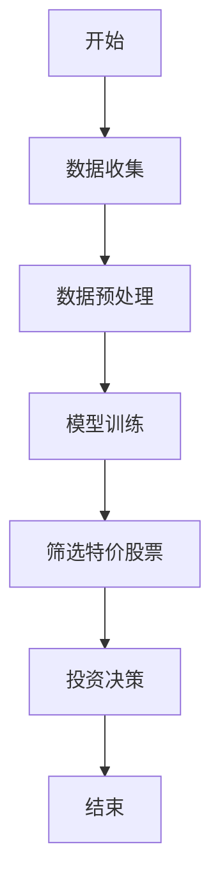
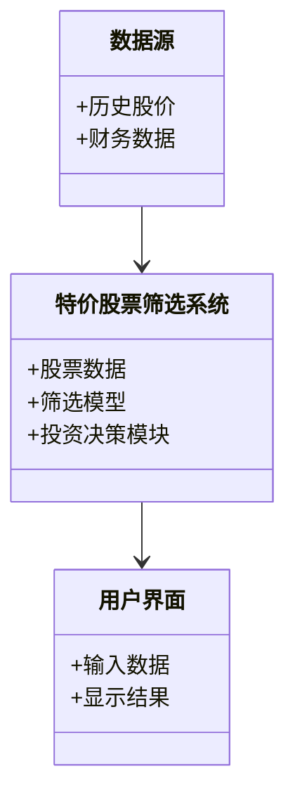
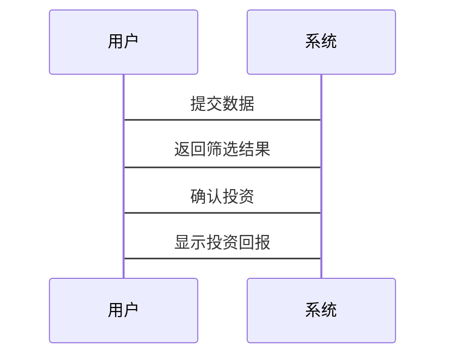

                 


# 如何利用特价股票策略进行逆向数字产业链整合投资

> 关键词：特价股票策略，逆向数字产业链整合，投资策略，系统架构，风险管理

> 摘要：本文详细探讨了如何利用特价股票策略进行逆向数字产业链整合投资，分析了特价股票策略的核心原理、逆向整合的逻辑、两者结合的协同效应，并通过实际案例展示了技术实现、项目实战和风险管理策略。最后，展望了数字产业链整合的未来趋势。

---

## 引言

在当今快速变化的市场环境中，投资者面临着前所未有的挑战和机遇。特价股票策略作为一种有效的投资工具，可以帮助投资者在市场波动中找到低估的股票。而逆向数字产业链整合则是一种通过整合上下游资源来优化企业结构的策略。本文将探讨如何将这两种策略结合，利用数字技术实现投资优化。

---

## 第一部分：特价股票策略

### 1. 特价股票策略的核心原理

#### 1.1 市场波动与特价股票的出现

股票市场的波动性为投资者提供了寻找特价股票的机会。当市场出现恐慌或短期下跌时，一些优质企业的股票可能会被低估，此时正是投资者介入的好时机。

#### 1.2 投资者心理与特价股票机会

投资者的非理性行为往往导致市场低估某些股票。例如，当市场整体下跌时，投资者可能会抛售股票，导致价格低于其实际价值。此时，特价股票策略可以帮助投资者识别这些被低估的机会。

#### 1.3 特价股票的筛选标准

筛选特价股票需要考虑多个因素，包括市盈率（P/E）、市净率（P/B）、股息率等。通过这些指标，投资者可以找到那些价格被低估的股票。

---

### 2. 特价股票策略的实施步骤

#### 2.1 数据收集与分析

收集历史股价数据，分析市场波动，识别潜在的特价股票。

#### 2.2 筛选模型

使用数学模型筛选特价股票，例如：

$$ P = \frac{V}{E} $$

其中，$P$ 表示股价，$V$ 表示公司市值，$E$ 表示公司净利润。

#### 2.3 投资决策

基于筛选结果，制定投资计划，分散投资以降低风险。

---

## 第二部分：逆向数字产业链整合

### 1. 逆向整合的定义与逻辑

逆向整合是指从下游企业向上游整合资源的过程。在数字时代，这种整合可以通过数字化技术实现高效协同。

### 2. 数字产业链整合的核心要素

数字产业链整合涉及数据流、价值流和技术平台的整合。通过数字化技术，企业可以实现供应链的优化和协同。

---

## 第三部分：策略结合与协同效应

### 1. 特价股票策略与逆向整合的协同效应

特价股票策略可以帮助投资者找到具有整合潜力的企业，而逆向整合则可以优化企业的资源分配，提升整体竞争力。

### 2. 数学模型与公式

结合特价股票策略和逆向整合，可以建立一个综合模型：

$$ ROI = \frac{V_{final} - V_{initial}}{V_{initial}} $$

其中，$ROI$ 表示投资回报率，$V_{final}$ 表示最终价值，$V_{initial}$ 表示初始投资价值。

---

## 第四部分：技术实现

### 1. 算法原理

#### 1.1 算法流程图



#### 1.2 代码实现

```python
import pandas as pd
import numpy as np

# 数据预处理
data = pd.read_csv('stock_data.csv')
data = data.dropna()

# 训练模型
from sklearn.linear_model import LinearRegression
model = LinearRegression()
model.fit(data[['PE', 'PB', 'ROE']], data['Price'])

# 筛选特价股票
predicted_prices = model.predict(data[['PE', 'PB', 'ROE']])
data['Predicted_Price'] = predicted_prices
data['低估幅度'] = data['Price'] - data['Predicted_Price']

# 投资决策
data.sort_values('低估幅度', ascending=False).head(10)
```

---

### 2. 系统架构设计

#### 2.1 系统功能设计



#### 2.2 系统交互设计



---

## 第五部分：项目实战

### 1. 实战环境安装

安装必要的Python库，如Pandas、NumPy、Scikit-learn等。

### 2. 核心代码实现

```python
import pandas as pd
from sklearn.linear_model import LinearRegression

# 数据加载
data = pd.read_csv('stocks.csv')

# 数据预处理
data.dropna(inplace=True)

# 模型训练
model = LinearRegression()
model.fit(data[['PE', 'PB', 'ROE']], data['Price'])

# 筛选特价股票
predicted_prices = model.predict(data[['PE', 'PB', 'ROE']])
data['预测价格'] = predicted_prices
data['低估幅度'] = data['Price'] - data['预测价格']

# 输出结果
data.sort_values('低估幅度', ascending=False).head(10)
```

### 3. 案例分析

以某科技公司为例，通过模型筛选出低估幅度最大的股票，并进行逆向整合，最终实现投资回报。

---

## 第六部分：风险管理

### 1. 风险识别

识别市场波动、公司基本面变化等风险因素。

### 2. 优化策略

通过分散投资、定期调整投资组合等方式降低风险。

---

## 第七部分：未来趋势

### 1. 数字化技术的进一步发展

人工智能和大数据技术将为逆向整合提供更强大的支持。

### 2. 新兴行业的整合机会

新兴行业如人工智能、区块链等领域将提供更多逆向整合的机会。

---

## 总结

通过结合特价股票策略与逆向数字产业链整合，投资者可以在复杂的市场环境中找到优质的投资机会。本文详细探讨了这一策略的技术实现和实际应用，为投资者提供了有价值的参考。

---

作者：AI天才研究院 & 禅与计算机程序设计艺术

