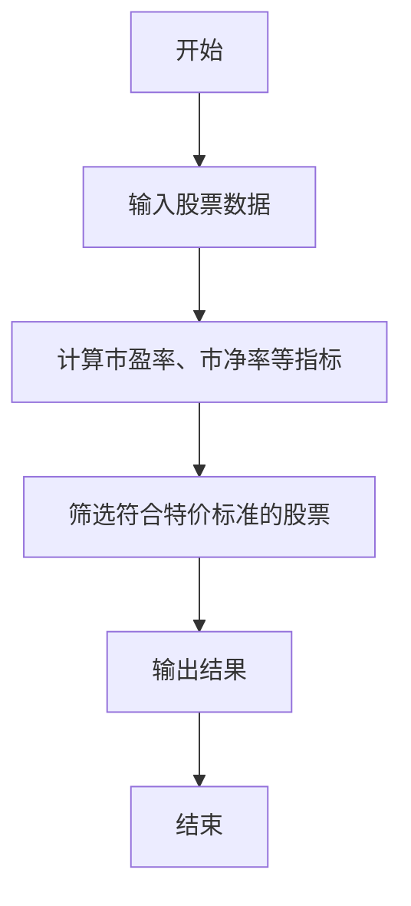
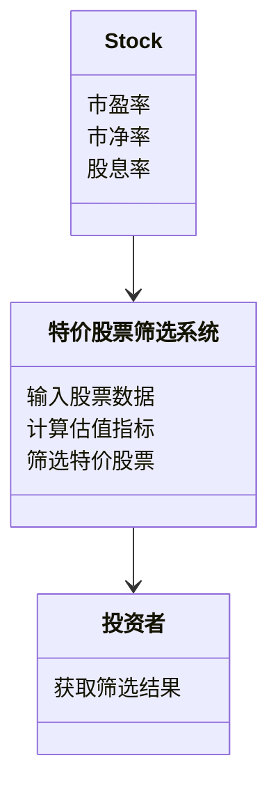
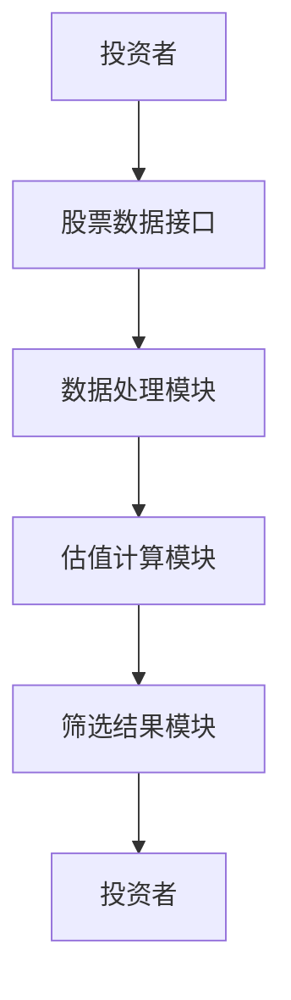
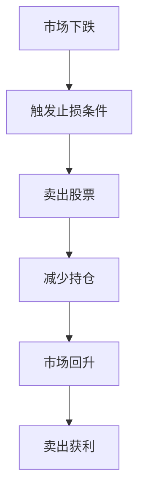

                 


# 如何利用特价股票策略进行逆周期资产配置

> 关键词：特价股票策略、逆周期资产配置、股票投资、风险管理、市场周期、投资组合优化

> 摘要：本文深入探讨了如何利用特价股票策略进行逆周期资产配置。通过分析市场周期波动，结合特价股票筛选算法和数学模型，提出了一套完整的逆周期投资策略。文章从理论基础、算法实现、系统架构到实战案例，全面解析了如何在市场低谷期利用特价股票实现资产增值，并通过风险管理确保投资的长期稳健性。

---

## 第一部分: 特价股票策略与逆周期资产配置概述

### 第1章: 特价股票策略的背景与概念

#### 1.1 什么是特价股票策略
- **问题背景**：在股票市场中，周期性波动是常态。投资者通常在市场高点追求收益，却忽视了低点的投资机会。特价股票策略的核心在于逆周期操作，在市场低迷时寻找被低估的股票，以较低的价格买入，待市场回升时卖出，实现超额收益。
- **问题描述**：许多投资者在市场高位追求短期收益，却忽视了在市场低谷时布局长期机会。特价股票策略通过识别市场低估的股票，帮助投资者在周期底部积累筹码，为未来的市场反弹做好准备。
- **问题解决**：通过分析市场周期和股票估值指标，筛选出具有长期投资价值的特价股票，构建逆周期投资组合。
- **边界与外延**：特价股票策略适用于周期性行业，如金融、能源、房地产等，但需结合市场环境和个股基本面进行调整。其外延包括量化策略和对冲策略。

#### 1.2 逆周期配置的基本概念
- **逆周期配置**：指在市场低谷期增加资产配置，在市场高峰期减少资产配置。这种策略旨在利用市场周期波动，在低点买入、高点卖出。
- **核心目标**：通过逆周期配置，降低投资组合的波动性，提高长期收益。

#### 1.3 特价股票策略与逆周期配置的关系
- **策略定位**：特价股票策略是逆周期配置的重要工具，通过在市场底部布局低估资产，实现逆周期收益。
- **策略优化**：逆周期配置通过资产配置的动态调整，优化特价股票策略的效果。

---

## 第2章: 特价股票策略的核心概念与原理

### 2.1 特价股票的定义与特征
- **定义**：特价股票是指在市场低迷时，价格远低于其内在价值的股票。通常表现为低市盈率（P/E）、低市净率（P/B）等指标。
- **特征分析**：
  - **低估值**：市盈率、市净率等估值指标远低于行业平均水平。
  - **高股息率**：部分特价股票提供较高的股息收益。
  - **行业周期性**：主要分布在周期性较强的行业，如金融、能源等。

### 2.2 逆周期配置的核心要素
- **市场周期分析**：通过技术分析和基本面分析，识别市场周期的高低点。
- **资产选择标准**：筛选具有长期增长潜力的行业和个股。
- **风险管理**：通过分散投资和止损策略控制风险。

### 2.3 特价股票策略与逆周期配置的关联
- **策略协同**：逆周期配置通过动态调整资产配置比例，优化特价股票策略的收益。
- **风险控制**：在市场低谷期，逆周期配置通过增加特价股票持仓，降低整体投资组合的波动性。

---

## 第3章: 特价股票策略的算法与数学模型

### 3.1 特价股票筛选算法
- **算法目标**：通过量化指标筛选出具有长期投资价值的特价股票。
- **筛选指标**：
  - 市盈率（P/E）：股价与每股收益的比率。
  - 市净率（P/B）：股价与每股净资产的比率。
  - 股息率：股息与股价的比率。
- **筛选标准**：
  - P/E < 行业平均值
  - P/B < 行业平均值
  - 股息率 > 行业平均值

### 3.2 算法流程图（Mermaid）


### 3.3 算法实现代码
```python
def screen_cheap_stocks(stocks):
    cheap_stocks = []
    for stock in stocks:
        pe = stock.pe
        pb = stock.pb
        dividend_yield = stock.dividend_yield
        if pe < stockIndustryAverage.pe and pb < stockIndustryAverage.pb and dividend_yield > stockIndustryAverage.dividend_yield:
            cheap_stocks.append(stock)
    return cheap_stocks
```

### 3.4 数学模型与公式
- **市盈率公式**：
  $$ \text{市盈率} = \frac{\text{股价}}{\text{每股收益}} $$
- **市净率公式**：
  $$ \text{市净率} = \frac{\text{股价}}{\text{每股净资产}} $$
- **股息率公式**：
  $$ \text{股息率} = \frac{\text{每股股息}}{\text{股价}} $$

---

## 第4章: 系统分析与架构设计

### 4.1 系统功能设计
- **领域模型（Mermaid 类图）**：


### 4.2 系统架构设计


### 4.3 接口设计
- **输入接口**：股票数据接口
- **输出接口**：筛选结果模块

---

## 第5章: 项目实战与案例分析

### 5.1 环境安装
- **Python 环境**：安装Python和相关库（如pandas、numpy）。
- **数据接口**：使用Yahoo Finance或其它股票数据接口获取数据。

### 5.2 核心代码实现
```python
import pandas as pd

def calculate_pe_ratio(df):
    df['PE'] = df['股价'] / df['每股收益']
    return df

# 示例数据
data = {
    '股票代码': ['AAPL', 'GOOGL', 'MSFT'],
    '股价': [100, 150, 80],
    '每股收益': [10, 15, 8],
    '每股净资产': [50, 75, 40]
}
df = pd.DataFrame(data)
calculate_pe_ratio(df)
```

### 5.3 案例分析
- **案例背景**：2020年新冠疫情导致市场大跌，许多股票被低估。
- **筛选过程**：筛选出PE和PB均低于行业平均水平的股票。
- **结果分析**：通过逆周期配置，投资者在市场低点布局，随后市场回升时实现收益。

---

## 第6章: 风险管理与策略优化

### 6.1 风险管理策略
- **止损策略**：设定止损点，避免重大损失。
- **分散投资**：通过分散投资降低个股风险。
- **动态调整**：根据市场变化动态调整持仓。

### 6.2 风险管理流程图（Mermaid）


---

## 第7章: 总结与展望

### 7.1 总结
- **核心观点**：逆周期配置通过在市场低谷期布局低估资产，实现长期稳健收益。
- **实践经验**：通过量化筛选和风险管理，确保策略的有效性和稳健性。

### 7.2 展望
- **技术进步**：大数据和AI技术将进一步提升股票筛选的效率和精准度。
- **未来趋势**：逆周期配置将成为更多投资者的首选策略。

---

## 作者信息

作者：AI天才研究院/AI Genius Institute & 禅与计算机程序设计艺术 /Zen And The Art of Computer Programming

---

以上是文章的详细目录和部分章节内容，希望对您有所帮助！

