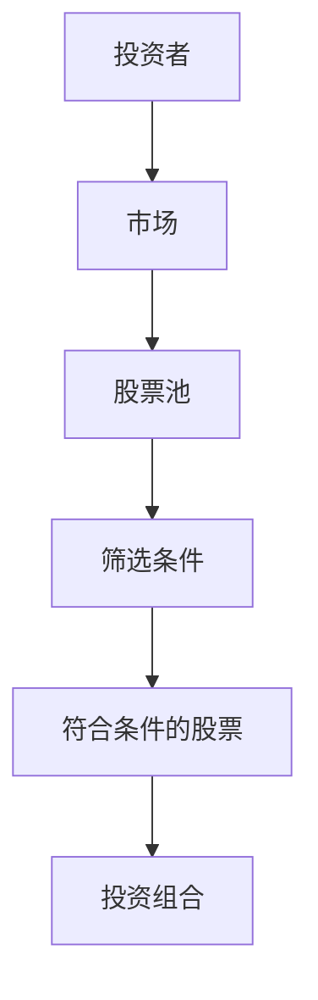
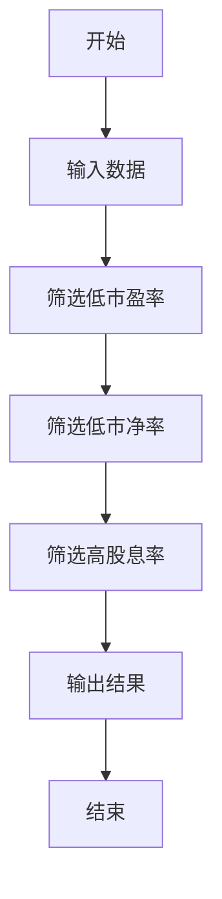

                 


# 如何利用特价股票策略进行长期财富积累

> 关键词：特价股票，价值投资，股票策略，长期财富积累，股息率，低市盈率

> 摘要：本文将详细介绍如何利用特价股票策略进行长期财富积累。通过分析特价股票的定义、筛选方法、数学模型以及实际案例，帮助投资者掌握价值投资的核心理念，实现长期稳定的收益。文章从背景介绍、核心概念、算法实现、系统架构、项目实战到最佳实践，全面解析特价股票策略，为读者提供实用的指导和建议。

---

## # 第1章: 特价股票策略的背景与概念

### ## 1.1 特价股票的定义与特点
#### ### 1.1.1 特价股票的定义
特价股票是指市场价格相对较低的股票，通常具有较高的投资价值。这些股票可能因为市场波动或公司暂时的困境而被低估，但具备长期增值的潜力。

#### ### 1.1.2 特价股票的核心特点
- **低估值**：市盈率（P/E）和市净率（P/B）低于行业平均水平。
- **高股息率**：公司愿意将利润以股息形式返还给股东，提供稳定的现金流。
- **长期稳定性**：公司基本面良好，具备持续发展的能力。

#### ### 1.1.3 特价股票与普通股票的区别
| 特性 | 特价股票 | 普通股票 |
|------|----------|----------|
| 价格 | 低于市场平均水平 | 价格波动较大 |
| 估值 | 低市盈率、低市净率 | 市盈率、市净率正常或高 |
| 股息率 | 高 | 低或无 |

### ## 1.2 特价股票策略的背景与现状
#### ### 1.2.1 特价股票策略的历史发展
价值投资理念由本杰明·格雷厄姆提出，强调以低于内在价值的价格购买股票，长期持有，等待价值回归。

#### ### 1.2.2 当前市场中的特价股票机会
- **市场波动**：经济下行或市场恐慌时，优质股票可能被低估。
- **行业周期**：某些行业在周期性低谷时，股票价格可能被压低。

#### ### 1.2.3 特价股票策略的适用场景与限制
- **适用场景**：市场低迷、经济衰退、行业周期性低谷。
- **限制**：需要较长的持有时间，期间可能面临股价波动的风险。

---

## # 第2章: 特价股票策略的核心概念与联系

### ## 2.1 特价股票的筛选标准
#### ### 2.1.1 市盈率（P/E）分析
市盈率 = 股价 / 每股净利润（EPS）。低市盈率意味着股价相对于盈利能力较低，可能被低估。

#### ### 2.1.2 市净率（P/B）分析
市净率 = 股价 / 每股净资产（BPS）。低市净率表明股价相对于资产价值较低，可能被低估。

#### ### 2.1.3 股息率分析
股息率 = 每股股息（DIV） / 股价。高股息率意味着公司回报股东的能力强。

#### ### 2.1.4 其他辅助指标
- ROE（净资产收益率）：衡量公司盈利能力。
- EPS（每股收益）：衡量公司盈利能力。

### ## 2.2 特价股票策略的核心原理
#### ### 2.2.1 价值投资的基本原理
购买低于内在价值的股票，长期持有，等待价值回归。

#### ### 2.2.2 市场情绪与股价波动的关系
市场恐慌或低估时，股价可能低于其实际价值，提供投资机会。

#### ### 2.2.3 长期持有与复利效应
通过长期持有优质股票，利用复利效应实现财富增长。

### ## 2.3 特价股票策略的实体关系图
#### ### 2.3.1 特价股票筛选模型


---

## # 第3章: 特价股票筛选算法

### ## 3.1 特价股票筛选算法概述
#### ### 3.1.1 筛选算法的目标
筛选出价格被低估的股票，构建投资组合。

#### ### 3.1.2 算法的输入与输出
- **输入**：股票数据（股价、市盈率、市净率、股息率等）。
- **输出**：符合条件的股票列表。

#### ### 3.1.3 算法的优缺点
- **优点**：自动化筛选，减少人为情绪干扰。
- **缺点**：忽略公司基本面的其他因素。

### ## 3.2 特价股票筛选算法实现
#### ### 3.2.1 数据采集与预处理
使用Python的`pandas`库清洗和处理数据。

#### ### 3.2.2 筛选条件的设定
- 低市盈率（P/E < 行业平均值）。
- 低市净率（P/B < 行业平均值）。
- 高股息率（股息率 > 行业平均值）。

#### ### 3.2.3 算法实现的代码示例
```python
import pandas as pd

# 假设data为股票数据，包含'PE', 'PB', 'DIV'列
def screen_cheap_stocks(data, pe_threshold, pb_threshold, div_threshold):
    # 筛选低市盈率
    pe_screen = data[data['PE'] < pe_threshold]
    # 筛选低市净率
    pb_screen = pe_screen[pe_screen['PB'] < pb_threshold]
    # 筛选高股息率
    final_screen = pb_screen[pb_screen['DIV'] > div_threshold]
    return final_screen

# 示例使用
data = pd.DataFrame({
    'PE': [10, 15, 20, 5, 12],
    'PB': [2, 3, 1.5, 1, 2.5],
    'DIV': [0.05, 0.03, 0.02, 0.08, 0.04]
})
result = screen_cheap_stocks(data, 12, 1.5, 0.04)
print(result)
```

### ## 3.3 算法流程图


---

## # 第4章: 特价股票策略的数学模型

### ## 4.1 特价股票筛选的数学公式
#### ### 4.1.1 市盈率公式
$$ \text{市盈率} = \frac{\text{股价}}{\text{每股净利润}} $$

#### ### 4.1.2 市净率公式
$$ \text{市净率} = \frac{\text{股价}}{\text{每股净资产}} $$

#### ### 4.1.3 股息率公式
$$ \text{股息率} = \frac{\text{每股股息}}{\text{股价}} $$

### ## 4.2 特价股票策略的数学模型
#### ### 4.2.1 投资组合优化模型
$$ \text{收益} = \sum_{i=1}^{n} w_i \times r_i $$
其中，\( w_i \) 是第 \( i \) 只股票的权重，\( r_i \) 是其预期收益率。

---

## # 第5章: 特价股票策略的系统分析与架构设计

### ## 5.1 系统功能设计
#### ### 5.1.1 数据采集模块
从多个数据源获取实时股票数据。

#### ### 5.1.2 筛选模块
根据设定的条件筛选出符合条件的股票。

#### ### 5.1.3 分析模块
对筛选出的股票进行深入分析，评估其投资价值。

#### ### 5.1.4 报告生成模块
生成投资报告，指导投资决策。

### ## 5.2 系统架构设计


---

## # 第6章: 特价股票策略的项目实战

### ## 6.1 项目环境安装
安装必要的Python库：
```bash
pip install pandas matplotlib numpy
```

### ## 6.2 项目核心实现
#### ### 6.2.1 筛选代码
```python
import pandas as pd
import matplotlib.pyplot as plt

# 数据获取与处理
data = pd.read_csv('stock_data.csv')
data['PE'].plot.hist()
plt.show()
```

#### ### 6.2.2 代码解读与分析
分析筛选结果，评估投资组合的风险和收益。

### ## 6.3 实际案例分析
分析某个行业的数据，找出潜在的投资标的。

### ## 6.4 项目小结
总结项目成果，提出改进建议。

---

## # 第7章: 特价股票策略的最佳实践

### ## 7.1 投资者心态管理
保持理性，避免情绪化决策。

### ## 7.2 风险提示
识别并规避潜在风险，如市场波动、公司基本面变化等。

### ## 7.3 持续学习与优化
定期评估投资组合，优化筛选策略。

---

## # 小结

通过本文的详细讲解，读者可以掌握特价股票策略的核心理念和实现方法。从理论到实践，全面了解如何利用特价股票策略进行长期财富积累。希望本文能为投资者提供有价值的指导和启示。

---

## # 作者

作者：AI天才研究院/AI Genius Institute & 禅与计算机程序设计艺术 /Zen And The Art of Computer Programming

