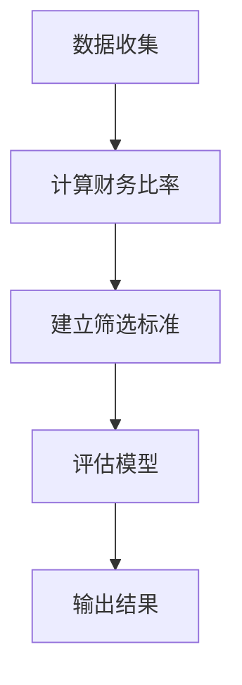
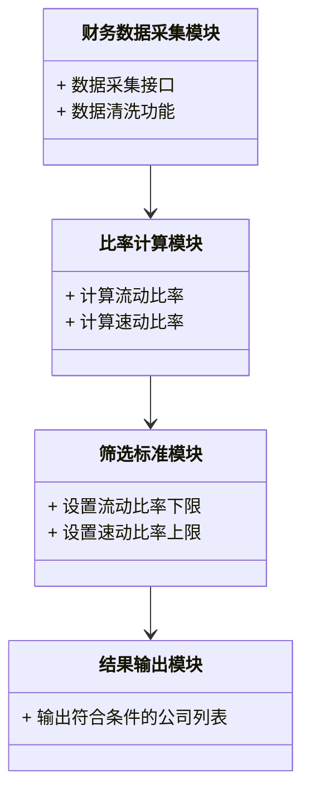

                 


# 如何利用财务比率筛选潜在特价股票

> 关键词：财务比率，股票投资，特价股票，筛选策略，投资技巧

> 摘要：本文将详细介绍如何利用财务比率来筛选潜在的特价股票。通过分析财务比率的核心概念、算法原理、系统架构设计、项目实战以及最佳实践，本文旨在为投资者提供一套科学有效的股票筛选方法。

---

## 第一部分: 财务比率与股票投资基础

### 第1章: 财务比率概述

#### 1.1 财务比率的基本概念
##### 1.1.1 什么是财务比率
财务比率是通过将企业的财务数据（如收入、利润、资产、负债等）进行对比，以评估企业的财务状况和经营效率的指标。常见的财务比率包括流动性比率、偿债能力比率、运营效率比率和盈利能力比率。

##### 1.1.2 财务比率的作用
财务比率可以帮助投资者评估企业的偿债能力、运营效率和盈利能力，从而做出更明智的投资决策。

##### 1.1.3 财务比率的分类
财务比率通常分为以下几类：
1. **流动性比率**：衡量企业偿还短期债务的能力。
2. **偿债能力比率**：衡量企业偿还长期债务的能力。
3. **运营效率比率**：衡量企业利用资产效率的能力。
4. **盈利能力比率**：衡量企业盈利能力的能力。

#### 1.2 股票投资基础
##### 1.2.1 股票投资的基本概念
股票投资是指通过购买公司股份，期望从股价上涨或股息收入中获得收益的投资行为。

##### 1.2.2 股票市场的基本运作
股票市场是投资者买卖公司股份的场所，价格受市场供需、公司业绩和宏观经济因素的影响。

##### 1.2.3 投资者类型与投资目标
投资者可以分为机构投资者和个人投资者，投资目标包括长期增值和短期投机。

#### 1.3 财务比率与股票投资的关系
##### 1.3.1 财务比率在股票投资中的重要性
财务比率是评估企业财务健康状况的重要工具，直接影响股票的投资价值。

##### 1.3.2 财务比率分析对投资决策的影响
通过分析财务比率，投资者可以识别企业的财务风险和盈利能力，从而做出更明智的投资决策。

##### 1.3.3 财务比率分析的局限性
财务比率分析受到企业会计政策、行业差异和宏观经济环境的影响，可能存在局限性。

### 第2章: 财务比率分析的核心概念

#### 2.1 财务比率分析的原理
##### 2.1.1 财务比率的计算方法
财务比率通常基于企业的财务报表数据计算，包括资产负债表、利润表和现金流量表。

##### 2.1.2 财务比率的比较分析
通过与行业平均水平或竞争对手的比较，可以评估企业的财务表现。

##### 2.1.3 财务比率的行业差异
不同行业的企业有不同的财务比率标准，需结合行业特点进行分析。

#### 2.2 财务比率的核心要素
##### 2.2.1 收入与支出
收入是指企业的营业收入，支出是指企业的经营成本。

##### 2.2.2 资产与负债
资产是企业拥有的资源，负债是企业欠款的债务。

##### 2.2.3 所有者权益
所有者权益是企业净资产的价值，等于资产减去负债。

#### 2.3 财务比率的属性特征对比表
| 比率类型 | 计算公式 | 主要用途 | 关键指标 |
|----------|----------|----------|----------|
| 流动比率 | 流动资产 / 流动负债 | 衡量短期偿债能力 | 流动资产：现金、应收账款、存货等 |
| 速动比率 | (流动资产 - 存货) / 流动负债 | 更为严格的短期偿债能力衡量 | 速动资产：现金、应收账款等 |

---

## 第二部分: 财务比率分析的算法原理

### 第3章: 算法原理

#### 3.1 财务比率分析算法概述
财务比率分析算法通过计算和比较企业的财务比率，识别潜在的特价股票。

#### 3.2 算法实现步骤
##### 3.2.1 数据收集
从财务报表中收集企业的收入、利润、资产、负债等数据。

##### 3.2.2 计算财务比率
使用财务比率的计算公式，计算企业的各项财务比率。

##### 3.2.3 建立筛选标准
根据企业的行业特点和投资目标，设定财务比率的筛选标准。

##### 3.2.4 评估模型的有效性
通过历史数据验证模型的准确性和可靠性。

#### 3.3 财务比率分析算法的mermaid流程图



#### 3.4 算法实现的Python代码示例
```python
import pandas as pd

# 假设df是包含财务数据的DataFrame
def calculate_financial_ratios(df):
    df['流动比率'] = df['流动资产'] / df['流动负债']
    df['速动比率'] = (df['流动资产'] - df['存货']) / df['流动负债']
    df['负债比率'] = df['总负债'] / df['总资产']
    df['净资产收益率'] = df['净利润'] / df['净资产']
    return df

# 示例数据
data = {
    '公司': ['A', 'B', 'C'],
    '流动资产': [100, 150, 200],
    '流动负债': [50, 75, 100],
    '存货': [20, 30, 40],
    '总负债': [80, 120, 160],
    '总资产': [200, 300, 400],
    '净利润': [50, 75, 100],
    '净资产': [120, 180, 240]
}

df = pd.DataFrame(data)
df = calculate_financial_ratios(df)
print(df)
```

#### 3.5 算法的数学模型和公式
##### 3.5.1 流动比率
$$ \text{流动比率} = \frac{\text{流动资产}}{\text{流动负债}} $$

##### 3.5.2 速动比率
$$ \text{速动比率} = \frac{\text{流动资产} - \text{存货}}{\text{流动负债}} $$

##### 3.5.3 负债比率
$$ \text{负债比率} = \frac{\text{总负债}}{\text{总资产}} $$

##### 3.5.4 净资产收益率
$$ \text{净资产收益率} = \frac{\text{净利润}}{\text{净资产}} $$

---

## 第三部分: 系统分析与架构设计

### 第4章: 系统架构设计

#### 4.1 系统功能设计
##### 4.1.1 功能模块
1. 数据采集模块：从财务报表中提取数据。
2. 比率计算模块：计算各项财务比率。
3. 筛选标准模块：设定筛选条件。
4. 结果输出模块：展示筛选结果。

##### 4.1.2 mermaid类图


#### 4.2 系统架构设计
##### 4.2.1 架构选择
采用分层架构，包括数据层、业务逻辑层和表现层。

##### 4.2.2 mermaid架构图
```mermaid
container 数据层 {
    数据库
    接口 API
}
container 业务逻辑层 {
    财务数据采集模块
    比率计算模块
}
container 表现层 {
    筛选标准模块
    结果输出模块
}
```

---

## 第四部分: 项目实战

### 第5章: 项目实战

#### 5.1 环境安装
安装所需的Python库，如Pandas、NumPy等。

#### 5.2 系统核心实现
编写代码实现财务比率计算和筛选功能。

#### 5.3 代码应用解读与分析
详细解释代码的功能和实现细节。

#### 5.4 实际案例分析
使用具体数据进行分析，展示筛选结果。

#### 5.5 项目小结
总结项目的实施过程和成果。

---

## 第五部分: 最佳实践

### 第6章: 最佳实践

#### 6.1 小结
总结全文的主要内容和关键点。

#### 6.2 注意事项
提醒读者注意数据来源的可靠性、模型的局限性等。

#### 6.3 拓展阅读
推荐进一步学习的资源和相关书籍。

---

## 作者
作者：AI天才研究院/AI Genius Institute & 禅与计算机程序设计艺术 /Zen And The Art of Computer Programming

