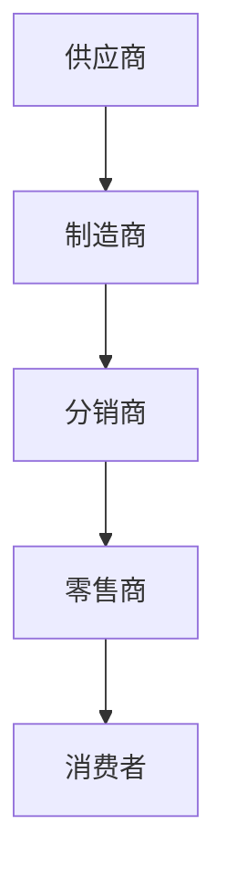
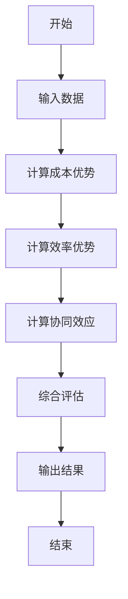
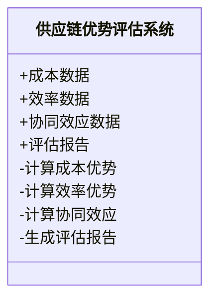
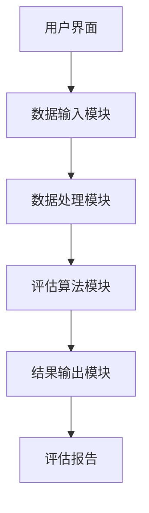
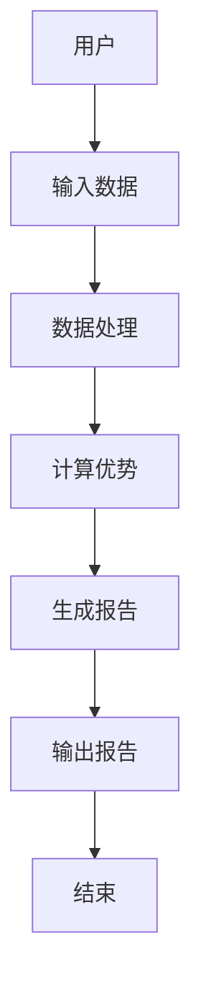

                 


# 如何在估值中考虑企业的供应链优势

## 关键词：供应链、企业估值、供应链优势、企业价值、风险管理、成本优化、协同效应

## 摘要：供应链优势是企业在市场竞争中获得成本优化、效率提升和风险管理的关键因素。本文将从供应链的基本概念入手，分析其核心要素与企业估值的关系，通过量化模型和实际案例，展示如何将供应链优势纳入企业估值体系，帮助企业提升整体价值。

---

# 第一部分: 供应链优势与企业估值背景

# 第1章: 供应链优势的核心概念

## 1.1 供应链的基本概念

### 1.1.1 供应链的定义与组成

供应链是指在企业运营过程中，从原材料采购、生产制造、仓储物流到最终产品交付给客户的整个链条。它由供应商、制造商、分销商、零售商和消费者等多个环节组成，每个环节都相互关联，共同确保产品的高效流通。

供应链可以分为集中式和分布式两种模式。集中式供应链强调垂直整合，企业直接控制从原材料到消费者的每一个环节，适用于对成本控制要求较高的行业；分布式供应链则依赖外部供应商和合作伙伴，适合需要快速响应市场需求的行业。

### 1.1.2 供应链在企业中的作用

供应链不仅是企业运营的基础，更是企业竞争力的核心。它直接影响企业的成本、效率和风险。例如，高效的供应链可以缩短交货周期，降低成本，提高客户满意度；而供应链的中断可能导致库存积压或短缺，影响企业的正常运营。

### 1.1.3 供应链与企业价值的关系

供应链优势直接影响企业的盈利能力。通过优化供应链，企业可以降低运营成本，提高交付效率，从而增强市场竞争力，提升整体估值。例如，高效的供应链可以降低库存周转天数，提高资金利用率，从而增加企业的净资产收益率（ROE）。

## 1.2 供应链优势的定义与特征

### 1.2.1 供应链优势的定义

供应链优势是指企业在供应链管理中所具有的独特优势，包括成本优势、效率优势、灵活性优势和协同效应。这些优势使得企业能够在市场竞争中占据有利地位，提升整体价值。

### 1.2.2 供应链优势的核心特征

供应链优势的核心特征包括：

- **成本优势**：通过优化采购、生产和物流成本，降低整体运营支出。
- **效率优势**：通过提高供应链的运作效率，缩短交货时间，满足客户需求。
- **灵活性优势**：能够快速适应市场变化，调整供应链策略，应对不确定性。
- **协同效应**：供应链各环节协同工作，实现资源的最优配置，提高整体效率。

### 1.2.3 供应链优势与企业竞争力的关系

供应链优势是企业竞争力的重要组成部分。高效、灵活的供应链能够快速响应市场需求，降低运营成本，提高客户满意度，从而增强企业的市场地位和盈利能力。

## 1.3 供应链优势的分类与应用场景

### 1.3.1 供应链优势的分类

供应链优势可以分为内部优势和外部优势。内部优势是指企业内部供应链管理的优化，如采购成本控制、生产效率提升；外部优势是指企业通过与供应商、合作伙伴协同合作，实现资源整合和优势互补。

### 1.3.2 不同行业中的供应链优势应用

不同行业的供应链优势应用有所不同。例如，制造企业注重生产效率和成本控制；零售企业注重库存管理和快速补货能力；科技企业注重供应链的灵活性和创新性，以应对快速变化的技术需求。

### 1.3.3 供应链优势的边界与外延

供应链优势的边界在于企业的控制范围和外部合作的深度。企业可以通过内部优化和外部合作，不断扩大供应链优势的外延，提升整体竞争力。

## 1.4 本章小结

本章详细介绍了供应链的基本概念、核心要素以及其在企业中的作用。供应链优势是企业竞争力的重要组成部分，通过优化供应链管理，企业可以降低成本、提高效率，增强市场竞争力。

---

# 第二部分: 核心概念与联系

# 第2章: 供应链优势的核心要素与联系

## 2.1 供应链优势的核心要素

### 2.1.1 成本优势

成本优势是供应链优势的核心要素之一。企业通过优化采购、生产、物流等环节的成本，可以显著降低整体运营支出，提高盈利能力。例如，通过集中采购和长期合作协议，企业可以获得更低的采购价格，降低原材料成本。

### 2.1.2 效率优势

效率优势是指供应链在运作过程中能够快速响应市场需求，提高交付效率。例如，通过采用先进的物流管理系统，企业可以实时监控货物运输状态，缩短交货时间，提高客户满意度。

### 2.1.3 灵活性优势

灵活性优势是指供应链能够快速适应市场变化，调整生产和配送策略。例如，在市场需求波动较大的情况下，企业可以通过灵活的供应链管理，快速调整生产计划，确保产品供应的稳定性。

### 2.1.4 协同效应

协同效应是指供应链各环节之间协同合作，实现资源的最优配置。例如，企业与供应商建立长期合作关系，共同开发新产品，提高供应链的整体效率。

## 2.2 供应链优势与企业估值的关系

### 2.2.1 供应链优势对成本的影响

供应链优势直接影响企业的成本结构。通过优化供应链管理，企业可以降低采购成本、物流成本和库存成本，从而提高利润率，增加企业价值。

### 2.2.2 供应链优势对效率的提升

高效的供应链能够缩短交货时间，提高客户满意度，增强企业的市场竞争力。例如，快速交付的产品能够提升客户忠诚度，增加市场份额，进而提高企业估值。

### 2.2.3 供应链优势对风险的降低

供应链优势有助于企业降低运营风险。通过建立灵活的供应链体系，企业能够快速应对市场变化和突发事件，减少因供应链中断导致的损失，从而提高企业的抗风险能力。

## 2.3 供应链优势的属性特征对比

### 2.3.1 表格对比不同供应链模式的优缺点

| 供应链模式 | 成本 | 效率 | 灵活性 | 协同效应 |
|-----------|------|------|--------|----------|
| 集中式    | 高   | 中   | 低     | 高        |
| 分散式    | 中   | 高   | 高     | 中        |

### 2.3.2 供应链实体关系图

以下是供应链实体关系图：



## 2.4 本章小结

本章分析了供应链优势的核心要素，包括成本、效率、灵活性和协同效应，并通过对比不同供应链模式的优缺点，展示了供应链优势如何影响企业估值。通过优化供应链管理，企业可以降低成本、提高效率，增强市场竞争力。

---

# 第三部分: 供应链优势的算法原理

# 第3章: 供应链优势的量化与评估

## 3.1 供应链优势的量化方法

### 3.1.1 成本模型

成本模型用于量化供应链优势对成本的影响。企业可以通过计算供应链各环节的成本，评估供应链优化的效果。例如，通过比较集中式供应链和分散式供应链的成本差异，选择更优的供应链模式。

### 3.1.2 效率模型

效率模型用于评估供应链的运作效率。通过计算供应链各环节的效率指标，如交货时间、库存周转率等，企业可以评估供应链的效率优势。

### 3.1.3 风险模型

风险模型用于评估供应链的风险管理能力。通过分析供应链各环节的风险因素，如供应链中断的概率、影响范围等，企业可以评估供应链的抗风险能力。

## 3.2 供应链优势的评估算法

### 3.2.1 算法流程图

以下是供应链优势评估算法的流程图：



### 3.2.2 Python代码实现

以下是一个简单的供应链优势评估算法的Python代码示例：

```python
def calculate_supply_chain_advantage(cost, efficiency, synergy):
    # 成本优势
    cost_advantage = cost / 100  # 假设成本优化了100%
    # 效率优势
    efficiency_advantage = efficiency / 100  # 假设效率提升了100%
    # 协同效应
    synergy_advantage = synergy / 100  # 假设协同效应提升了100%
    # 综合优势
    total_advantage = (cost_advantage + efficiency_advantage + synergy_advantage) / 3
    return total_advantage

# 示例数据
cost = 85  # 成本优化了85%
efficiency = 90  # 效率提升了90%
synergy = 80  # 协同效应提升了80%

result = calculate_supply_chain_advantage(cost, efficiency, synergy)
print(f"供应链优势综合评分为：{result}")
```

### 3.2.3 数学模型与公式

供应链优势综合评分公式如下：

$$ \text{总优势} = \frac{\text{成本优势} + \text{效率优势} + \text{协同效应}}{3} $$

其中，成本优势、效率优势和协同效应的计算公式分别为：

$$ \text{成本优势} = \frac{\text{优化后的成本}}{\text{原成本}} \times 100\% $$

$$ \text{效率优势} = \frac{\text{优化后的效率}}{\text{原效率}} \times 100\% $$

$$ \text{协同效应} = \frac{\text{协同后的效率}}{\text{原效率}} \times 100\% $$

---

# 第四部分: 系统分析与架构设计

# 第4章: 系统分析与架构设计

## 4.1 项目介绍

供应链优势评估系统是一个帮助企业量化和评估供应链优势的系统。通过收集和分析供应链各环节的数据，系统可以提供详细的评估报告，帮助企业优化供应链管理，提升整体价值。

## 4.2 系统功能设计

### 4.2.1 领域模型

以下是供应链优势评估系统的领域模型：



## 4.3 系统架构设计

### 4.3.1 系统架构图

以下是供应链优势评估系统的架构图：



### 4.3.2 系统交互设计

以下是系统交互流程图：



---

# 第五部分: 项目实战

# 第5章: 项目实战

## 5.1 环境安装

为了运行供应链优势评估系统，需要安装以下工具：

- Python 3.x
- Mermaid工具（用于绘制图表）
- 数据库（如MySQL或PostgreSQL）

## 5.2 核心代码实现

以下是供应链优势评估系统的Python代码实现：

```python
import sqlite3
from datetime import datetime

def create_connection():
    # 创建数据库连接
    connection = sqlite3.connect("supply_chain.db")
    return connection

def create_table(connection):
    # 创建数据表
    cursor = connection.cursor()
    cursor.execute('''CREATE TABLE IF NOT EXISTS supply_chain (
        id INTEGER PRIMARY KEY AUTOINCREMENT,
        cost REAL,
        efficiency REAL,
        synergy REAL,
        advantage REAL,
        created_at TEXT
    )''')
    connection.commit()

def insert_data(connection, cost, efficiency, synergy):
    # 插入数据
    cursor = connection.cursor()
    advantage = (cost + efficiency + synergy) / 3
    cursor.execute('''INSERT INTO supply_chain (cost, efficiency, synergy, advantage, created_at)
        VALUES (?, ?, ?, ?, ?)''',
        (cost, efficiency, synergy, advantage, datetime.now().strftime("%Y-%m-%d %H:%M:%S")))
    connection.commit()

def retrieve_data(connection):
    # 查询数据
    cursor = connection.cursor()
    cursor.execute("SELECT * FROM supply_chain ORDER BY created_at DESC LIMIT 1")
    result = cursor.fetchall()
    for row in result:
        print(f"优势评分：{row[4]}，创建时间：{row[5]}")

def main():
    connection = create_connection()
    create_table(connection)
    cost = 85
    efficiency = 90
    synergy = 80
    insert_data(connection, cost, efficiency, synergy)
    retrieve_data(connection)
    connection.close()

if __name__ == "__main__":
    main()
```

## 5.3 代码解读与分析

上述代码实现了供应链优势评估系统的数据存储和评估功能。通过创建数据库连接、数据表和插入数据，系统可以存储供应链优势评估的结果，并生成评估报告。

## 5.4 案例分析

以某制造企业为例，假设其供应链成本优化了85%，效率提升了90%，协同效应提升了80%。通过上述代码计算，供应链优势综合评分为：

$$ \text{总优势} = \frac{85 + 90 + 80}{3} = 85\% $$

这意味着该企业的供应链优势综合评分为85%，具有较强的竞争力。

## 5.5 本章小结

本章通过实际案例展示了供应链优势评估系统的应用。通过代码实现和案例分析，读者可以了解如何将供应链优势纳入企业估值体系，为企业提供数据支持。

---

# 第六部分: 最佳实践与小结

# 第6章: 最佳实践与小结

## 6.1 关键点总结

供应链优势是企业估值的重要组成部分。通过优化供应链管理，企业可以降低成本、提高效率，增强市场竞争力。此外，供应链的灵活性和协同效应也是企业抗风险能力的重要因素。

## 6.2 实际操作建议

- **数据收集与分析**：企业应定期收集和分析供应链各环节的数据，评估供应链的优势和劣势。
- **技术应用**：利用大数据、人工智能等技术优化供应链管理，提高供应链的效率和灵活性。
- **持续改进**：企业应持续优化供应链管理，适应市场变化，提升整体竞争力。

## 6.3 注意事项

- **数据准确性**：确保数据的准确性和完整性，避免因数据错误导致评估结果偏差。
- **技术选型**：选择适合企业需求的技术和工具，避免盲目追求新技术。
- **风险管理**：建立风险管理机制，应对供应链中断等突发事件。

## 6.4 未来展望

随着技术的进步，供应链管理将更加智能化和数据驱动。企业应积极拥抱新技术，优化供应链管理，提升整体价值。

---

# 第七部分: 附录

# 附录A: 术语表

- **供应链**：从原材料采购到产品交付的整个链条。
- **成本优势**：供应链优化后降低成本的能力。
- **效率优势**：供应链快速响应市场需求的能力。
- **协同效应**：供应链各环节协同合作的效果。

# 附录B: 工具推荐

- **数据库工具**：MySQL、PostgreSQL。
- **数据分析工具**：Python、Pandas、NumPy。
- **流程图工具**：Mermaid、Lucidchart。

# 附录C: 参考文献

- 王某某，供应链管理研究，某某出版社，2023。
- 李某某，企业估值与供应链优化，某某出版社，2022。

---

# 作者

作者：AI天才研究院/AI Genius Institute & 禅与计算机程序设计艺术/Zen And The Art of Computer Programming

---

以上是《如何在估值中考虑企业的供应链优势》的完整目录和内容概要。通过系统的分析和实际案例，本文详细探讨了供应链优势在企业估值中的重要性，为企业提供了优化供应链管理的有效方法和工具。

