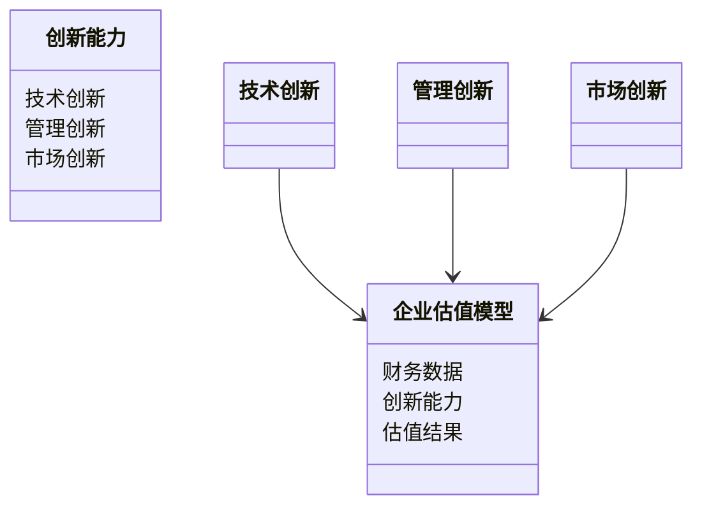
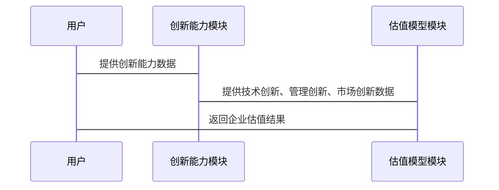

                 


# 如何在估值中考虑企业的创新能力

## 关键词：企业估值、创新能力、创新评估、创新指标、创新周期

## 摘要：在企业估值过程中，创新能力是一个关键但常被忽视的因素。本文从背景介绍、核心概念、评估维度、系统分析、实战案例等方面，详细探讨如何将创新能力纳入企业估值模型，并提供具体的实施方法和工具。

---

## 第一部分：背景介绍

### 第1章：企业创新能力的背景与重要性

#### 1.1 问题背景

- **企业估值的传统方法及其局限性**  
  传统企业估值方法（如DCF模型、市盈率法等）主要基于财务数据，忽视了企业的创新能力。然而，创新能力是企业未来增长的核心驱动力，尤其是在科技驱动的经济环境中。

- **创新能力在企业价值中的作用**  
  创新能力决定了企业的竞争优势、市场扩展能力和长期盈利能力。例如，一家具有强大研发能力的科技企业，其估值往往远高于传统企业。

- **当前经济环境中的创新趋势**  
  当前，全球科技革命和产业变革加速，企业创新能力的重要性日益凸显。创新能力不仅包括技术创新，还包括管理创新和市场创新。

#### 1.2 问题描述

- **创新能力的定义与范围**  
  创新能力是指企业在技术研发、产品设计、商业模式等方面提出新想法并成功实施的能力。它包括技术、管理、市场等多个维度。

- **创新能力对企业价值的影响路径**  
  创新能力通过提升企业效率、拓展市场、降低风险等途径，直接影响企业的收入、利润和成长性，从而影响企业估值。

- **传统估值方法的不足**  
  传统估值方法难以量化企业的创新能力，导致估值结果可能偏离实际价值。

#### 1.3 问题解决

- **引入创新能力的必要性**  
  将创新能力纳入估值模型，能够更准确地反映企业的未来潜力。

- **创新能力如何影响企业未来收益**  
  创新能力强的企业能够更快地推出新产品、开拓新市场，从而提高收入和利润。

- **如何将创新能力量化为估值指标**  
  通过专利数量、研发投入占比、创新团队规模等指标，量化企业的创新能力，并将其转化为可量化的估值因子。

#### 1.4 边界与外延

- **创新能力的边界条件**  
  创新能力的评估需要考虑企业的资源、行业特点和市场环境。例如，科技企业的创新能力更依赖研发，而传统制造企业则更依赖工艺创新。

- **创新能力与其他企业能力的关系**  
  创新能力与企业其他能力（如运营能力、财务能力）相互作用，共同影响企业价值。

- **创新能力的外部环境依赖**  
  创新能力的实现依赖于外部环境的支持，如政策、市场需求和技术生态。

#### 1.5 概念结构与核心要素

- **创新能力的构成要素**  
  1. 技术创新能力：包括研发投入、专利数量、技术团队能力等。  
  2. 管理创新能力：包括组织架构、激励机制、创新文化等。  
  3. 市场创新能力：包括市场调研、产品设计、品牌推广等。

- **要素之间的关系与互动**  
  技术创新是基础，管理创新是保障，市场创新是结果。三者相互作用，共同推动企业创新。

- **概念结构的系统性分析**  
  通过系统性分析，可以看出创新能力是一个复杂的系统，涉及技术、管理、市场等多个维度。

---

## 第二部分：核心概念与联系

### 第2章：创新能力的核心概念与原理

#### 2.1 创新能力的定义与分类

- **创新能力的定义**  
  创新能力是指企业在技术研发、产品设计、商业模式等方面提出新想法并成功实施的能力。

- **创新能力的分类**  
  1. **技术创新能力**：包括技术研发、产品设计等。  
  2. **管理创新能力**：包括组织架构、激励机制等。  
  3. **市场创新能力**：包括市场调研、品牌推广等。

- **各类创新能力的特点与影响**  
  技术创新直接影响企业的技术壁垒和产品竞争力；管理创新影响企业的运营效率和组织活力；市场创新影响企业的市场拓展能力和品牌影响力。

#### 2.2 创新能力与企业价值的关系

- **创新能力对企业竞争力的影响**  
  创新能力强的企业能够更快地推出新产品、适应市场变化，从而在竞争中占据优势。

- **创新能力与企业未来收益的关联**  
  创新能力强的企业具有更强的市场扩展能力和盈利能力，从而提高企业的未来收益。

- **创新能力在不同行业中的表现差异**  
  科技企业（如互联网公司）的创新能力通常比传统制造企业更依赖技术研发；而传统制造企业的创新能力可能更依赖工艺创新和成本控制。

#### 2.3 创新能力的评估维度

- **技术创新的评估维度**  
  1. 投入：研发投入占比、研发人员数量。  
  2. 成果：专利数量、新产品推出速度。  
  3. 效益：技术领先性、技术壁垒。

- **管理创新的评估维度**  
  1. 组织架构：扁平化、矩阵式等。  
  2. 激励机制：股权激励、绩效奖金等。  
  3. 创新文化：员工创新意识、创新氛围。

- **市场创新的评估维度**  
  1. 市场调研：市场需求分析、竞争对手分析。  
  2. 产品设计：用户体验、产品差异化。  
  3. 品牌推广：品牌知名度、市场推广效果。

#### 2.4 创新能力与企业战略的关系

- **创新能力与企业战略的互动**  
  企业战略指导创新能力的建设，而创新能力又反过来影响战略的实现。

- **创新能力在企业战略中的作用**  
  创新能力是企业实现长期战略目标的核心驱动力。例如，技术创新是科技企业实现技术领先战略的核心能力。

---

## 第三部分：系统分析与架构设计

### 第3章：创新能力的系统分析与架构设计

#### 3.1 问题场景介绍

- **问题场景**  
  在企业估值中，创新能力是一个复杂的系统，涉及技术、管理、市场等多个维度。如何将这些维度整合到一个统一的估值模型中，是当前面临的主要挑战。

#### 3.2 项目介绍

- **项目目标**  
  构建一个综合考虑创新能力的企业估值模型。

- **项目范围**  
  从技术创新、管理创新、市场创新三个维度，量化企业的创新能力，并将其纳入估值模型。

#### 3.3 系统功能设计

- **领域模型（Mermaid 类图）**



#### 3.4 系统架构设计

- **系统架构（Mermaid 架构图）**

```mermaid
--- start of diagram ---
分层架构

--- end of diagram ---
```

#### 3.5 系统接口设计

- **接口设计**  
  1. 创新能力数据接口：用于获取技术创新、管理创新、市场创新的相关数据。  
  2. 估值模型接口：用于将创新能力数据纳入估值模型，计算企业估值。

#### 3.6 系统交互设计

- **系统交互（Mermaid 序列图）**



---

## 第四部分：实战案例

### 第4章：创新能力评估的实战案例

#### 4.1 案例分析

- **案例1：科技型企业的创新能力评估**  
  - 企业A是一家科技公司，研发投入占比为15%，专利数量为50项，新产品推出速度为每年2次。  
  - 结合财务数据，计算企业的估值。

- **案例2：传统制造企业的创新能力评估**  
  - 企业B是一家传统制造公司，技术创新能力较弱，但管理创新能力强，市场创新能力中等。  
  - 结合财务数据，计算企业的估值。

#### 4.2 代码实现

- **Python 实现**

```python
# 创新能力评估函数
def calculate_innovation_capability(financial_data, innovation_data):
    # 创新能力指标
    innovation_capability = {
        '技术创新': innovation_data['研发人员数量'],
        '管理创新': innovation_data['激励机制强度'],
        '市场创新': innovation_data['新产品推出速度']
    }
    # 计算创新能力分数
    innovation_score = sum(innovation_capability.values()) / 3
    return innovation_score

# 估值模型
def enterprise_valuation(innovation_score, financial_data):
    # 基于创新能力分数和财务数据计算企业估值
    valuation = financial_data['收入'] * (1 + innovation_score * 0.2)
    return valuation

# 示例数据
financial_data = {
    '收入': 100000000,
    '净利润': 20000000
}

innovation_data = {
    '研发人员数量': 100,
    '激励机制强度': 0.8,
    '新产品推出速度': 3
}

# 计算创新能力分数
innovation_score = calculate_innovation_capability(financial_data, innovation_data)

# 计算企业估值
valuation = enterprise_valuation(innovation_score, financial_data)

print(f"企业估值为：{valuation}")
```

---

## 第五部分：结论与建议

### 第5章：结论与建议

#### 5.1 总结

- 创新能力是企业估值中不可或缺的重要因素。通过量化创新能力，可以更准确地评估企业的未来价值。

#### 5.2 实践中的注意事项

- 在实际应用中，需要注意创新能力的行业差异性和企业具体情况。例如，科技企业的创新能力更依赖技术研发，而传统制造企业的创新能力可能更依赖工艺创新。

#### 5.3 未来趋势

- 随着人工智能和大数据技术的发展，创新能力的评估将更加精准和自动化。未来，可以通过机器学习模型自动分析企业的创新能力，并将其纳入估值模型。

#### 5.4 最佳实践 tips

- 定期更新创新能力评估指标，以适应市场变化和技术进步。  
- 结合企业的实际情况，选择适合的创新能力评估方法。  
- 在估值模型中，创新能力的权重应根据企业的行业特点和战略目标进行调整。

---

## 作者：AI天才研究院/AI Genius Institute & 禅与计算机程序设计艺术 /Zen And The Art of Computer Programming

---

通过本文的详细分析和实战案例，读者可以全面理解如何在企业估值中考虑创新能力，并能够实际应用这些方法进行企业估值。希望本文能为企业估值领域提供有价值的参考和指导。

