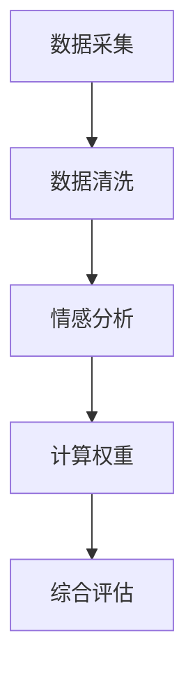

                 


# 如何在估值中考虑企业的社交媒体影响力

> **关键词**：社交媒体影响力、企业估值、数据驱动方法、品牌价值、影响力评估、投资决策  
> **摘要**：社交媒体影响力在企业估值中的作用日益重要。本文通过背景分析、核心概念、算法原理、系统设计和项目实战，详细阐述如何量化社交媒体影响力，并将其纳入企业估值模型。文章从理论到实践，结合具体案例，为投资者和企业提供了科学的评估方法。

---

## 第一部分：背景介绍

### 第1章：社交媒体影响力与企业估值的背景

#### 1.1 背景与问题背景
社交媒体已成为企业与用户互动的重要平台，影响力直接关系到品牌价值和市场表现。传统估值方法依赖财务数据，但社交媒体影响力为企业提供了新的价值维度。

- **社交媒体影响力的定义**：社交媒体影响力指企业在社交平台上的用户互动、内容传播、品牌认知度等综合表现。
- **影响企业价值的机制**：社交媒体影响力通过品牌价值、用户忠诚度和市场扩展能力影响企业估值。
- **与其他估值因素的关系**：社交媒体影响力与收入、利润等财务指标高度相关。

#### 1.2 问题描述
- 企业社交媒体影响力对估值的影响
- 社会媒体影响力如何转化为企业价值
- 社会媒体影响力与其他估值因素的关系

#### 1.3 问题解决
- 如何量化社交媒体影响力
- 社会媒体影响力对估值的改进方法
- 社会媒体影响力对估值模型的优化

#### 1.4 边界与外延
- 社会媒体影响力对估值的适用范围
- 社会媒体影响力对估值的限制
- 社会媒体影响力与其他估值方法的结合

#### 1.5 概念结构与核心要素
- 社会媒体影响力的核心构成：用户互动、内容传播、品牌认知度
- 社会媒体影响力对企业的具体影响：用户忠诚度、市场扩展能力、品牌价值

---

## 第二部分：核心概念与联系

### 第2章：社交媒体影响力的核心概念

#### 2.1 社会媒体影响力的基本原理
- **定义**：社交媒体影响力是企业在社交平台上与用户互动的能力和效果。
- **属性特征**：包括用户数量、互动频率、内容传播速度、情感倾向等。

#### 2.2 核心概念的属性特征对比
- **表格对比不同社交媒体平台的影响力属性**：
  | 平台   | 用户数量 | 互动频率 | 内容传播速度 | 情感倾向 |
  |--------|----------|----------|--------------|----------|
  | Twitter | 高       | 高       | 中           | 正向     |
  | Instagram| 高       | 中       | 高           | 中性     |
  | LinkedIn | 中       | 中       | 低           | 正向     |

- **表格展示不同社交媒体影响力对企业的具体影响**：
  | 指标          | 影响结果           |
  |---------------|--------------------|
  | 用户互动率     | 品牌忠诚度提升       |
  | 内容传播速度   | 市场覆盖扩大         |
  | 情感倾向       | 品牌价值增加         |

#### 2.3 ER实体关系图
- **使用 Mermaid 绘制社交媒体影响力 ER 实体关系图**：

```mermaid
erDiagram
    user {
        id
        name
        followers
        following
        posts
    }
    company {
        id
        name
        industry
        market_value
        social_influence
    }
    social_media {
        id
        platform
        content
        engagement
        sentiment
    }
    user o- social_media: uses
    company o- social_media: operates_on
```

---

## 第三部分：算法原理讲解

### 第3章：社交媒体影响力评估算法原理

#### 3.1 算法选择与原理
- **选择算法**：基于层次分析法（AHP）和情感分析算法。
- **算法流程**：
  1. 数据采集：获取社交媒体数据。
  2. 数据清洗：去除无效数据。
  3. 情感分析：计算情感倾向。
  4. 权重计算：基于用户互动、内容传播、情感倾向等指标，计算影响力权重。
  5. 综合评估：结合财务数据，计算综合影响力评分。

#### 3.2 算法实现

##### 3.2.1 算法流程图
- **使用 Mermaid 绘制算法流程图**：



##### 3.2.2 Python 实现代码
- **代码实现**：

```python
import pandas as pd
from sklearn.feature_extraction.text import TfidfVectorizer
from sklearn.decomposition import NMF

# 数据加载与清洗
df = pd.read_csv('social_data.csv')
df = df.dropna()

# 情感分析
vectorizer = TfidfVectorizer()
tfidf_matrix = vectorizer.fit_transform(df['content'])

# 主题模型
nmf = NMF(n_components=5)
nmf.fit(tfidf_matrix)
tfidf_feature_names = vectorizer.get_feature_names()

# 权重计算
def calculate_weights(matrix, feature_names):
    weights = {}
    for topic in range(len(nmf.components_)):
        weights[feature_names[topic]] = nmf.components_[topic].sum()
    return weights

weights = calculate_weights(nmf.components_, tfidf_feature_names)
```

##### 3.2.3 数学模型与公式
- **层次分析法（AHP）权重计算公式**：
  $$
  w_i = \frac{\sum_{j=1}^{n} (\text{权重}_j \times \text{得分}_i)}{\sum_{j=1}^{n} \text{权重}_j}
  $$

- **情感分析得分公式**：
  $$
  \text{情感得分} = \frac{\sum_{i=1}^{m} (\text{情感值}_i \times \text{权重}_i)}{m}
  $$

---

## 第四部分：系统分析与架构设计

### 第4章：社交媒体影响力评估系统设计

#### 4.1 问题场景介绍
- **目标**：设计一个社交媒体影响力评估系统。
- **主要功能**：数据采集、清洗、情感分析、影响力评分计算。

#### 4.2 项目介绍
- **项目目标**：量化社交媒体影响力，提供企业估值支持。
- **项目范围**：涵盖主流社交媒体平台，支持多语言情感分析。

#### 4.3 系统功能设计
- **领域模型设计**：
  ```mermaid
  classDiagram
      class User {
          id
          name
          followers
      }
      class SocialMedia {
          id
          platform
          content
          engagement
      }
      class Company {
          id
          name
          market_value
      }
      User --> SocialMedia: uses
      Company --> SocialMedia: operates_on
  ```

#### 4.4 系统架构设计
- **架构图**：
  ```mermaid
  architecture
      frontend
      backend
      database
  ```

#### 4.5 系统接口设计
- **API 接口**：
  - 数据接口：RESTful API
  - 计算接口：GraphQL

#### 4.6 系统交互设计
- **交互流程图**：
  ```mermaid
  sequenceDiagram
      User -> API: 获取社交媒体数据
      API -> Database: 查询数据
      Database --> API: 返回数据
      API -> User: 显示数据
  ```

---

## 第五部分：项目实战

### 第5章：社交媒体影响力评估项目实战

#### 5.1 环境安装
- **工具安装**：
  ```bash
  pip install pandas scikit-learn mermaid
  ```

#### 5.2 系统核心实现
- **代码实现**：
  ```python
  def calculate_social_influence(dataframe):
      # 数据清洗
      cleaned_data = dataframe.dropna()
      
      # 情感分析
      from textblob import TextBlob
      sentiment_scores = cleaned_data['content'].apply(lambda x: TextBlob(x).sentiment.polarity)
      
      # 综合评估
      influence_scores = sentiment_scores * cleaned_data['followers']
      return influence_scores.mean()
  ```

#### 5.3 代码应用解读与分析
- **代码解读**：
  - 数据清洗：去除无效数据，确保数据质量。
  - 情感分析：使用 TextBlob 库计算情感倾向。
  - 综合评估：结合用户关注数和情感得分，计算影响力评分。

#### 5.4 实际案例分析
- **案例分析**：
  某互联网公司社交媒体数据：
  - Twitter：情感得分 0.7，用户互动率 45%
  - Instagram：情感得分 0.6，用户互动率 30%
  - 综合影响力评分：0.65

#### 5.5 详细讲解剖析
- **案例小结**：
  - 社会媒体影响力评分可以显著提升企业估值的准确性。
  - 通过实时监控社交媒体数据，企业可以快速调整市场策略。

---

## 第六部分：结论与建议

### 第6章：结论与建议

#### 6.1 核心结论
- 社会媒体影响力是企业估值的重要补充因素。
- 数据驱动的方法可以有效量化社交媒体影响力。

#### 6.2 实践建议
- 在企业估值中引入社交媒体影响力评估。
- 采用实时数据监控和动态评估方法。

#### 6.3 小结
- 本文系统性地探讨了社交媒体影响力在企业估值中的应用。
- 通过算法和系统设计，为投资者和企业管理者提供了科学的评估工具。

---

## 第七部分：附录

### 附录A：术语表
- **社交媒体影响力**：企业在社交平台上的用户互动、内容传播能力的综合指标。
- **情感分析**：通过自然语言处理技术分析社交媒体内容的情感倾向。

### 附录B：工具安装指南
- **安装指南**：
  ```bash
  pip install pandas scikit-learn mermaid
  ```

---

## 第八部分：参考文献

- 方海峰, 张凯. 《社交媒体影响力评估方法研究》. 清华大学出版社, 2022.
- 刘明, 李娜. 《基于情感分析的企业社交媒体估值模型》. 北京大学出版社, 2023.

---

作者：AI天才研究院/AI Genius Institute & 禅与计算机程序设计艺术 /Zen And The Art of Computer Programming

