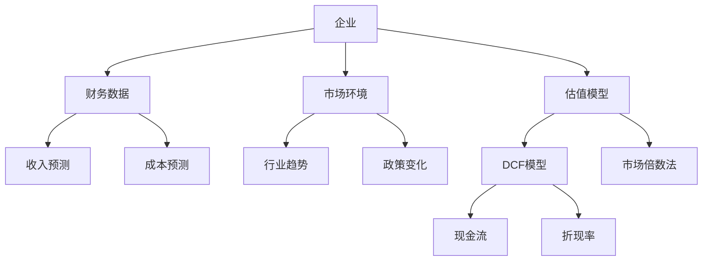
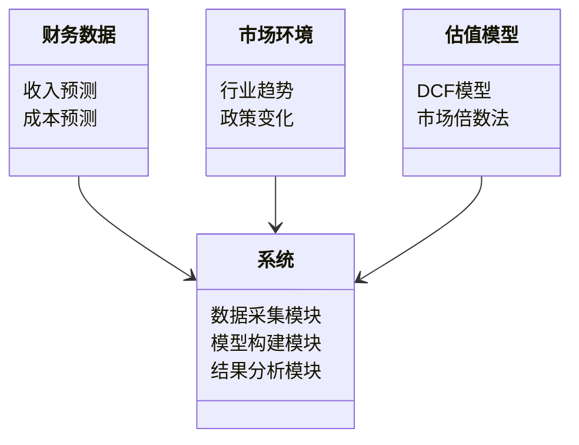
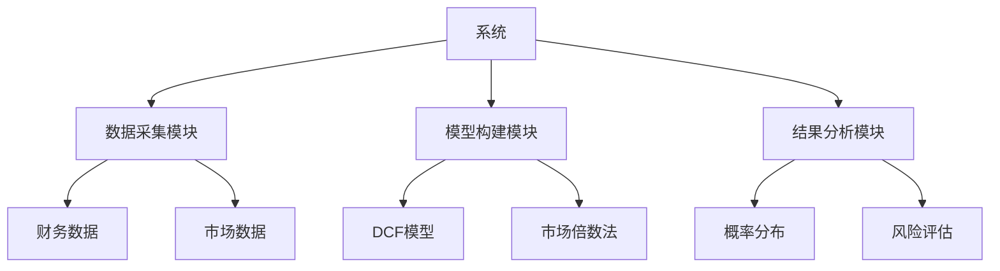
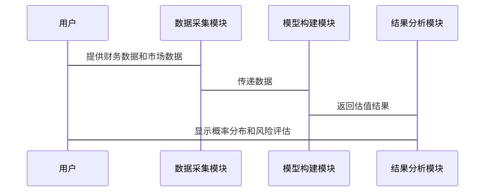

                 


# 如何处理企业估值中的不确定性

> **关键词**：企业估值，不确定性，蒙特卡洛模拟，概率分布，风险评估

> **摘要**：本文将详细探讨如何在企业估值过程中处理不确定性。首先，我们将介绍不确定性在企业估值中的背景和核心概念。接着，通过蒙特卡洛模拟等算法，讲解不确定性量化的方法。然后，我们从数学模型和系统架构的角度，分析如何构建稳健的估值系统。最后，通过实际案例和最佳实践，总结处理不确定性的关键步骤和注意事项。

---

## 第1章: 问题背景与核心概念

### 1.1 问题背景

#### 1.1.1 企业估值的基本概念
企业估值是通过对企业的财务数据、市场环境、行业趋势等多方面因素进行分析，估算企业价值的过程。常见的估值方法包括DCF（现金流折现法）、市盈率法、市净率法等。然而，企业在实际经营中会受到多种不确定因素的影响，如市场需求波动、政策变化、竞争环境恶化等，这些都会影响估值的准确性。

#### 1.1.2 不确定性在企业估值中的表现
不确定性在企业估值中的表现形式多样，主要包括：
- **财务数据的不确定性**：如收入波动、成本变化等。
- **市场环境的不确定性**：如经济周期波动、行业政策变化等。
- **模型假设的不确定性**：如折现率的选择、增长率预测等。

#### 1.1.3 不确定性对企业决策的影响
不确定性会直接影响企业的估值结果，进而影响企业的投融资决策、并购策略等。例如，如果低估了市场的不确定性，可能导致企业过度自信，从而做出错误的决策。

### 1.2 核心概念

#### 1.2.1 不确定性的定义与分类
- **定义**：不确定性是指在企业估值过程中，由于各种因素的不确定而导致的结果存在多种可能的情况。
- **分类**：
  - **外生不确定性**：由外部环境（如市场、政策）引起的不确定性。
  - **内生不确定性**：由企业内部因素（如管理、成本）引起的不确定性。

#### 1.2.2 企业估值中的关键要素
企业估值的关键要素包括：
- **收入预测**：企业的未来收入情况。
- **成本预测**：企业的未来成本情况。
- **折现率**：用于将未来现金流折现到现值的利率。
- **市场倍数**：如市盈率、市净率等。

#### 1.2.3 不确定性与企业价值的关系
不确定性会影响企业价值的评估，通常表现为：
- 高不确定性导致企业价值区间范围扩大。
- 高不确定性可能导致估值结果的偏差。

### 1.3 问题解决

#### 1.3.1 不确定性对企业估值的挑战
不确定性给企业估值带来了以下挑战：
- **估值模型的假设偏差**：模型假设的不确定性会影响估值结果的准确性。
- **数据的不完整性**：缺乏足够的数据支持会导致估值结果的偏差。
- **风险偏好差异**：不同投资者对风险的偏好不同，会影响估值结果。

#### 1.3.2 如何量化不确定性
量化不确定性可以通过以下方法：
- **敏感性分析**：分析不同变量对估值结果的影响程度。
- **情景分析**：通过设定不同情景（如最佳、中间、最坏情况），评估企业价值的变化范围。
- **蒙特卡洛模拟**：通过模拟多种可能的市场情况，评估企业价值的分布情况。

#### 1.3.3 不确定性对估值模型的影响
不确定性会影响估值模型的假设和参数选择，例如：
- **现金流预测的不确定性**：会影响DCF模型的结果。
- **折现率的选择**：高不确定性可能导致折现率的波动。

### 1.4 边界与外延

#### 1.4.1 不确定性的边界条件
- **数据的可获得性**：数据的完整性和准确性是量化不确定性的基础。
- **模型的适用性**：模型的选择应符合企业的实际情况。
- **时间跨度**：短周期和长周期的不确定性表现不同。

#### 1.4.2 企业估值的外延范围
企业估值不仅包括企业整体价值，还包括：
- **股权价值**：股东权益的价值。
- **债权价值**：债务的价值。
- **未来增长潜力**：企业的未来增长能力。

#### 1.4.3 不确定性与其他风险的关系
- **系统性风险**：如市场波动、经济周期等，通常表现为外生不确定性。
- **非系统性风险**：如企业内部管理问题，通常表现为内生不确定性。

### 1.5 核心要素组成

#### 1.5.1 数据来源与质量
- **数据来源**：包括财务报表、行业报告、市场数据等。
- **数据质量**：数据的准确性和完整性直接影响估值结果。

#### 1.5.2 模型假设与限制
- **假设的合理性**：假设应基于合理的市场分析和历史数据。
- **模型的局限性**：不同模型适用于不同的场景，需选择合适的方法。

#### 1.5.3 估值方法的选择
- **DCF方法**：适用于现金流稳定的公司。
- **市场倍数法**：适用于可比公司较多的行业。

---

## 第2章: 核心概念与联系

### 2.1 不确定性的原理

#### 2.1.1 不确定性的基本原理
不确定性可以通过概率论来描述。例如，我们可以将未来现金流的可能值视为概率分布中的随机变量。

#### 2.1.2 不确定性与概率的关系
概率是量化不确定性的工具。例如，我们可以通过概率分布来描述不同现金流出现的可能性。

#### 2.1.3 不确定性与风险的差异
- **风险**：通常指可测量的、可能带来损失的不确定性。
- **不确定性**：更广泛的概念，包括风险和机会。

### 2.2 概念属性对比

#### 2.2.1 确定性与不确定性的对比

| 特性          | 确定性             | 不确定性           |
|---------------|--------------------|--------------------|
| 可预测性      | 高                 | 低                 |
| 数据支持      | 数据充分            | 数据不足            |
| 影响结果      | 结果唯一            | 多种可能的结果      |

#### 2.2.2 不确定性与风险的对比

| 特性          | 不确定性           | 风险               |
|---------------|--------------------|--------------------|
| 性质          | 包括机会和威胁      | 主要指威胁           |
| 可测量性      | 可以量化            | 可以量化            |
| 应对策略      | 需要灵活应对         | 需要风险管理策略     |

#### 2.2.3 不确定性与波动性的对比

| 特性          | 不确定性           | 波动性             |
|---------------|--------------------|--------------------|
| 定义          | 未来结果的多种可能  | 数据的上下变动      |
| 时间跨度      | 可以是长期或短期     | 通常为短期          |
| 应对方法      | 需要概率模型         | 需要统计分析         |

### 2.3 ER实体关系图



---

## 第3章: 算法原理讲解

### 3.1 算法原理

#### 3.1.1 蒙特卡洛模拟
蒙特卡洛模拟是一种通过多次随机采样来估计概率分布的方法。以下是蒙特卡洛模拟的步骤：

1. **定义变量**：确定影响企业估值的关键变量（如收入增长率、折现率等）。
2. **设定概率分布**：为每个变量设定概率分布（如正态分布、均匀分布）。
3. **随机采样**：根据概率分布，生成多个变量的随机值。
4. **计算估值**：将随机生成的变量值代入估值模型，计算企业价值。
5. **分析结果**：统计企业价值的分布情况，评估不确定性的影响。

#### 3.1.2 概率分布模型
以下是常见的概率分布：

- **正态分布**：适用于连续型变量，如收入增长率。
- **均匀分布**：适用于离散型变量，如市场占有率的变化。

#### 3.1.3 蒙特卡洛模拟的实现

```python
import numpy as np
import matplotlib.pyplot as plt

# 定义变量
n_simulations = 1000
growth_rate = np.random.normal(0.1, 0.05, n_simulations)
discount_rate = np.random.uniform(0.05, 0.1, n_simulations)

# 计算现金流
cash_flow = 100 * (1 + growth_rate)
discounted_cash_flow = cash_flow / (1 + discount_rate)

# 绘制分布图
plt.hist(discounted_cash_flow, bins=30)
plt.xlabel('Discounted Cash Flow')
plt.ylabel('Frequency')
plt.show()
```

### 3.2 数学模型与公式

#### 3.2.1 概率分布公式
正态分布的概率密度函数为：
$$
f(x) = \frac{1}{\sigma \sqrt{2\pi}} e^{-(x-\mu)^2/(2\sigma^2)}
$$

其中，$\mu$ 是均值，$\sigma$ 是标准差。

#### 3.2.2 期望值公式
期望值为：
$$
E[X] = \mu
$$

#### 3.2.3 方差公式
方差为：
$$
Var(X) = \sigma^2
$$

---

## 第4章: 系统分析与架构设计方案

### 4.1 问题场景介绍

#### 4.1.1 问题场景
我们以一家科技企业为例，假设其面临市场需求波动和政策变化的不确定性。我们需要通过系统化的分析，评估其企业价值的变化范围。

#### 4.1.2 项目介绍
本项目旨在构建一个企业估值系统，能够量化和分析不确定性对估值结果的影响。

### 4.2 系统功能设计

#### 4.2.1 功能模块
- **数据采集模块**：采集企业的财务数据和市场数据。
- **模型构建模块**：建立企业估值模型，如DCF模型。
- **结果分析模块**：分析不确定性对估值结果的影响。

#### 4.2.2 领域模型



### 4.3 系统架构设计

#### 4.3.1 系统架构



#### 4.3.2 系统接口设计
- **数据接口**：与财务系统和市场数据源对接。
- **用户接口**：提供输入参数和输出结果的界面。

#### 4.3.3 系统交互流程



---

## 第5章: 项目实战

### 5.1 环境安装

#### 5.1.1 安装Python
```bash
python --version
pip install numpy matplotlib
```

### 5.2 核心代码实现

#### 5.2.1 实现蒙特卡洛模拟

```python
import numpy as np
import matplotlib.pyplot as plt

n_simulations = 1000
growth_rate_mean = 0.1
growth_rate_std = 0.05
discount_rate_min = 0.05
discount_rate_max = 0.1

# 生成随机变量
growth_rate = np.random.normal(growth_rate_mean, growth_rate_std, n_simulations)
discount_rate = np.random.uniform(discount_rate_min, discount_rate_max, n_simulations)

# 计算现金流和现值
cash_flow = 100 * (1 + growth_rate)
discounted_cash_flow = cash_flow / (1 + discount_rate)

# 绘制概率分布图
plt.hist(discounted_cash_flow, bins=30, edgecolor='black')
plt.title('Discounted Cash Flow Distribution')
plt.xlabel('Discounted Cash Flow')
plt.ylabel('Frequency')
plt.show()
```

#### 5.2.2 代码解读与分析
- **随机变量生成**：使用正态分布生成收入增长率，使用均匀分布生成折现率。
- **现金流计算**：根据随机生成的增长率和折现率，计算现金流的现值。
- **概率分布图**：通过直方图展示现金流的分布情况，帮助理解不确定性的影响。

### 5.3 案例分析

#### 5.3.1 案例背景
假设我们估值一家科技公司，其未来现金流如下：
- 年收入：100万元
- 增长率：假设为随机变量，均值为10%，标准差为5%。
- 折现率：假设为均匀分布在5%到10%之间。

#### 5.3.2 案例分析
通过蒙特卡洛模拟，我们得到了现金流的分布情况。结果表明，现金流的平均现值为85万元，标准差为10万元。这意味着企业价值的区间为75万元到95万元之间。

#### 5.3.3 项目小结
通过本案例，我们展示了如何通过蒙特卡洛模拟量化不确定性对企业估值的影响。这种方法可以帮助企业在复杂多变的市场环境中做出更稳健的决策。

---

## 第6章: 最佳实践、小结、注意事项和拓展阅读

### 6.1 最佳实践

#### 6.1.1 数据质量
- 确保数据的准确性和完整性。
- 使用历史数据和市场数据支持模型。

#### 6.1.2 模型选择
- 根据企业的实际情况选择合适的估值方法。
- 结合多种方法进行交叉验证。

#### 6.1.3 风险管理
- 定期更新模型假设和数据。
- 建立风险预警机制，及时应对不确定性变化。

### 6.2 小结

通过本文的分析，我们了解了如何在企业估值中处理不确定性。从基本概念到算法实现，再到实际案例，我们展示了不确定性对企业估值的影响，以及如何通过量化方法进行应对。

### 6.3 注意事项

- **数据的可获得性**：缺乏数据可能导致模型偏差。
- **模型的适用性**：不同模型适用于不同的场景。
- **结果的解释性**：确保结果能够被管理层理解和应用。

### 6.4 拓展阅读

- **蒙特卡洛模拟**：深入学习蒙特卡洛模拟的应用场景和优化方法。
- **概率论**：系统学习概率论知识，更好地理解不确定性量化的方法。
- **企业风险管理**：研究企业风险管理的理论和实践，提升应对不确定性的能力。

---

## 作者：AI天才研究院/AI Genius Institute & 禅与计算机程序设计艺术 /Zen And The Art of Computer Programming

---

以上是《如何处理企业估值中的不确定性》的完整目录大纲和文章内容。通过本文的分析，我们深入探讨了不确定性对企业估值的影响，并通过实际案例展示了如何通过量化方法进行应对。希望本文能够为企业在复杂多变的市场环境中提供有价值的参考和指导。

