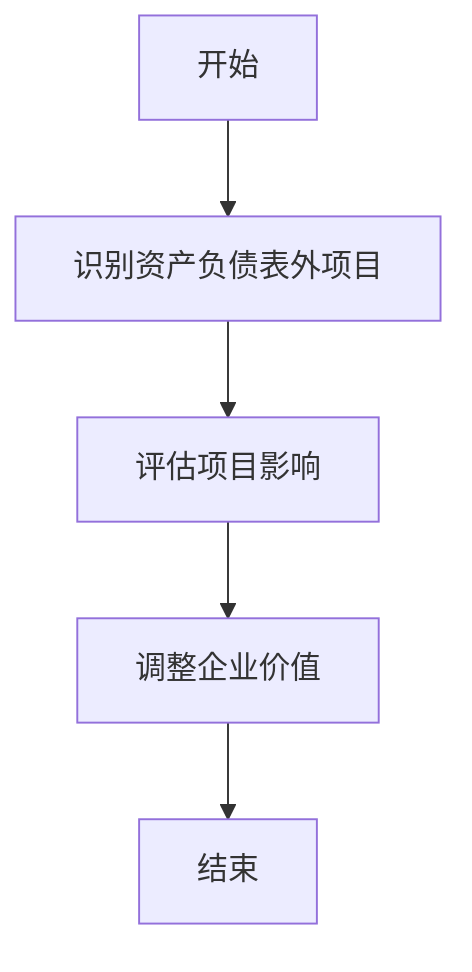
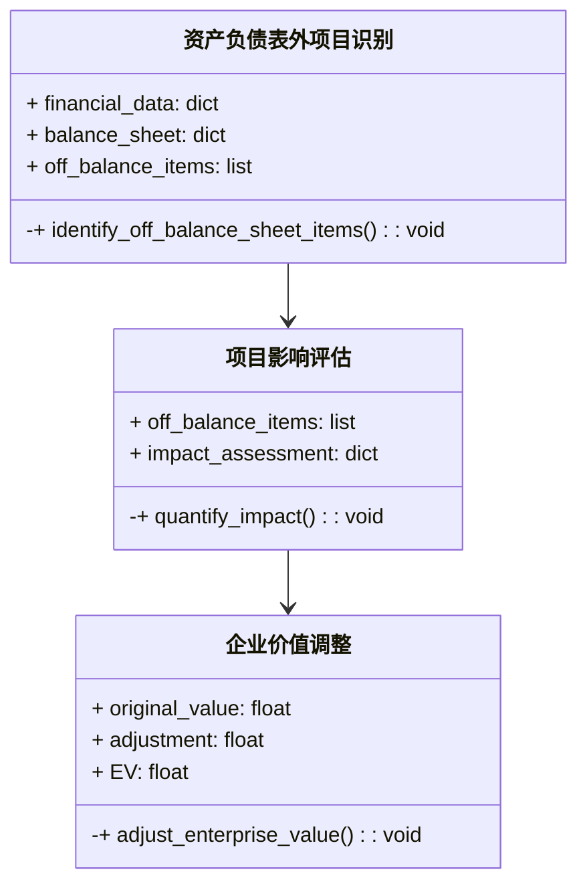
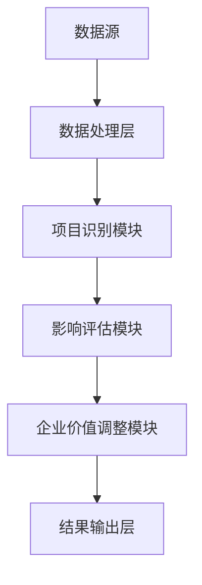

                 


# 如何处理企业估值中的资产负债表外项目

> 关键词：资产负债表外项目、企业估值、财务分析、风险评估、商誉减值

> 摘要：本文详细探讨了如何在企业估值过程中处理资产负债表外项目。通过分析资产负债表外项目的定义、类型及其对估值的影响，结合实际案例和系统架构设计，为读者提供了一套完整的解决方案。

---

## 第一部分：企业估值中的资产负债表外项目概述

### 第1章：背景介绍

#### 1.1 资产负债表外项目的定义与核心概念

##### 1.1.1 资产负债表外项目的定义
资产负债表外项目（Off-Balance Sheet Items）是指那些不直接反映在公司资产负债表上的项目，但可能对企业的财务状况、经营风险和估值产生重大影响。这些项目通常隐藏在表外，可能包括潜在的诉讼、或有负债、未确认资产、未来承诺等。

##### 1.1.2 资产负债表外项目的类型与特征
资产负债表外项目可以分为以下几类：
- **或有负债**：如未决诉讼、担保、承诺等。
- **或有资产**：如未确认的索赔、退款权利等。
- **表外融资**：如融资租赁、售后回购等。
- **商誉**：在合并过程中产生的商誉，通常不在资产负债表中单独列示。

##### 1.1.3 资产负债表外项目与企业估值的关系
资产负债表外项目可能对企业的财务状况和估值产生重大影响。例如，未决诉讼可能导致企业面临潜在的财务损失，而未确认的资产或负债可能影响企业的未来现金流和盈利能力。

#### 1.2 资产负债表外项目的背景与问题背景

##### 1.2.1 企业估值中的问题背景
在企业估值过程中，分析师通常依赖于资产负债表、利润表和现金流量表等财务报表。然而，资产负债表外项目可能对企业的实际价值产生重大影响，而这些信息往往未被充分披露。

##### 1.2.2 资产负债表外项目对企业估值的影响
资产负债表外项目可能影响企业的财务健康状况，进而影响其估值。例如，潜在的诉讼可能导致企业面临巨额赔偿，从而降低其市场价值。

##### 1.2.3 资产负债表外项目识别与确认的挑战
资产负债表外项目的识别和确认往往具有不确定性，因为它们可能涉及复杂的法律、会计和商业判断。此外，企业可能出于信息披露的限制，不愿公开这些信息。

---

### 第2章：资产负债表外项目的核心概念与联系

#### 2.1 资产负债表外项目的原理与特征

##### 2.1.1 资产负债表外项目的属性特征对比
以下表格对比了常见资产负债表外项目的属性特征：

| 项目类型       | 定义                              | 影响                                   | 常见类型                         | 处理方式                 |
|----------------|-----------------------------------|----------------------------------------|----------------------------------|--------------------------|
| 或有负债       | 可能导致企业承担债务的潜在义务   | 可能增加企业的负债，降低估值          | 未决诉讼、担保、承诺           | 确认潜在负债，调整估值   |
| 或有资产       | 可能为企业带来的资产或利益       | 可能增加企业的资产，提高估值          | 未确认的索赔、退款权利         | 确认潜在资产，调整估值   |
| 表外融资       | 资产负债表未直接反映的融资活动   | 可能影响企业的现金流和偿债能力        | 融资租赁、售后回购             | 调整现金流，评估偿债风险 |
| 商誉           | 并购中产生的溢价资产             | 可能影响企业的盈利能力，增加估值风险  | 合并形成的商誉                 | 确认商誉价值，评估减值风险|

##### 2.1.2 资产负债表外项目的ER实体关系图

```mermaid
erDiagram
    +-- P外项目
    P外项目 -->+ 财务影响
    P外项目 -->+ 企业估值
    财务影响 -->+ 资产负债表
    企业估值 -->+ 企业价值
```

---

### 第3章：资产负债表外项目的算法原理

#### 3.1 资产负债表外项目的评估算法

##### 3.1.1 资产负债表外项目识别算法
以下是识别资产负债表外项目的Python代码示例：

```python
def identify_off_balance_sheet_items(financial_data):
    # 示例代码：识别资产负债表外项目
    off_balance_items = []
    for item in financial_data:
        if item not in financial_data['balance_sheet']:
            off_balance_items.append(item)
    return off_balance_items
```

##### 3.1.2 资产负债表外项目影响量化算法
以下是量化资产负债表外项目影响的Python代码示例：

```python
def quantify_impact(impact_type, value):
    # 示例代码：量化项目影响
    if impact_type == 'liability':
        return -value
    elif impact_type == 'asset':
        return value
    else:
        return 0
```

##### 3.1.3 资产负债表外项目对企业价值调整算法
以下是调整企业价值的Python代码示例：

```python
def adjust Enterprise_value(original_value, adjustment):
    # 示例代码：调整企业价值
    return original_value + adjustment
```

#### 3.2 算法实现

##### 3.2.1 资产负债表外项目的流程图



---

## 第4章：资产负债表外项目的数学模型

### 4.1 资产负债表外项目的数学公式

#### 4.1.1 企业价值调整公式
企业价值（EV）的调整公式如下：

$$ EV = \text{原始企业价值} + \text{资产负债表外项目的影响} $$

例如，假设某公司原始企业价值为1000万元，潜在负债为200万元，则调整后的企业价值为：

$$ EV = 1000 + (-200) = 800 \text{万元} $$

#### 4.1.2 商誉减值公式
商誉减值的计算公式如下：

$$ \text{商誉减值} = \max(0, \text{商誉账面价值} - \text{可收回金额}) $$

---

## 第5章：系统分析与架构设计

### 5.1 资产负债表外项目处理的系统架构设计

#### 5.1.1 问题场景介绍
在企业估值过程中，如何有效识别和处理资产负债表外项目是一个复杂的挑战。系统需要能够从财务数据中提取信息，识别潜在的资产负债表外项目，并对其影响进行量化分析。

#### 5.1.2 系统功能设计

##### 5.1.2.1 领域模型设计



##### 5.1.2.2 系统架构设计



---

## 第6章：项目实战

### 6.1 环境安装与配置

#### 6.1.1 安装Python和相关库
```bash
pip install pandas numpy matplotlib
```

#### 6.1.2 安装环境配置示例
```bash
# 示例代码：安装Python环境
python -m pip install --user pandas numpy
```

### 6.2 核心代码实现

#### 6.2.1 核心代码实现
以下是识别资产负债表外项目的Python代码：

```python
import pandas as pd

def identify_off_balance_sheet_items(financial_data):
    off_balance_items = []
    for item in financial_data['items']:
        if item not in financial_data['balance_sheet']:
            off_balance_items.append(item)
    return off_balance_items

# 示例数据
financial_data = {
    'items': ['现金', '应收账款', '存货', '应付账款', '未确认负债'],
    'balance_sheet': ['现金', '应收账款', '存货', '应付账款']
}

off_balance_items = identify_off_balance_sheet_items(financial_data)
print("资产负债表外项目:", off_balance_items)
```

#### 6.2.2 代码解读与分析
上述代码通过遍历财务数据中的各项，识别出不在资产负债表中的项目，从而确定资产负债表外项目。

### 6.3 实际案例分析

#### 6.3.1 案例背景
某公司面临一起潜在的诉讼，可能需要承担1000万元的赔偿责任。

#### 6.3.2 数据准备
```python
financial_data = {
    'items': ['现金', '应收账款', '存货', '应付账款', '未决诉讼负债'],
    'balance_sheet': ['现金', '应收账款', '存货', '应付账款']
}
```

#### 6.3.3 处理步骤
1. 识别资产负债表外项目：
   ```python
   off_balance_items = identify_off_balance_sheet_items(financial_data)
   print("资产负债表外项目:", off_balance_items)  # 输出: ['未决诉讼负债']
   ```

2. 量化影响：
   ```python
   adjustment = quantify_impact('liability', 1000)
   ```

3. 调整企业价值：
   ```python
   original_value = 10000
   adjusted_EV = adjust_enterprise_value(original_value, adjustment)
   print("调整后的企业价值:", adjusted_EV)  # 输出: 9000
   ```

#### 6.3.4 结果分析
调整后的企业价值为9000万元，比调整前减少了1000万元。

---

## 第7章：总结与展望

### 7.1 总结

#### 7.1.1 小结
本文详细探讨了如何在企业估值过程中处理资产负债表外项目。通过分析其定义、类型、影响及处理方法，结合实际案例和系统架构设计，为读者提供了一套完整的解决方案。

#### 7.1.2 注意事项
在实际操作中，应结合企业的具体情况，谨慎处理资产负债表外项目，避免低估其对估值的影响。

#### 7.1.3 拓展阅读
建议读者进一步阅读相关财务分析和风险管理的书籍，以深入理解资产负债表外项目的影响。

---

## 作者
作者：AI天才研究院 & 禅与计算机程序设计艺术

