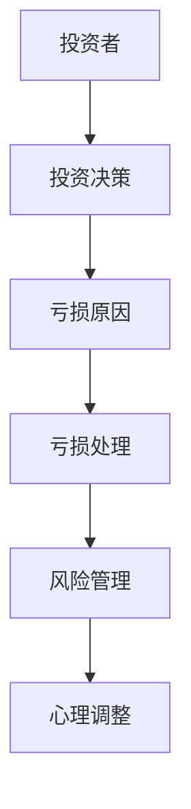
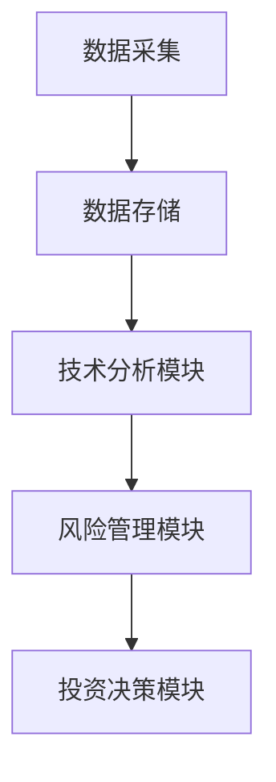

                 

# 如何处理特价股票投资中的亏损

> 关键词：特价股票、亏损处理、风险管理、技术分析、心理调整、投资策略

> 摘要：本文深入探讨如何在特价股票投资中有效处理亏损，涵盖背景分析、风险管理策略、技术分析方法、心理因素影响及长期投资策略。通过详细讲解和实际案例，帮助投资者掌握应对亏损的方法。

---

## 目录大纲

### 第一部分：特价股票投资中的亏损处理基础

#### 第1章：特价股票投资概述

##### 1.1 特价股票的基本概念
- 1.1.1 特价股票的定义与特点
  - 特价股票的定义：价格低于市场平均水平的股票。
  - 特点：高波动性、高风险、潜在高回报。
- 1.1.2 特价股票的投资价值分析
  - 特价股票的潜在价值：可能被市场低估的公司。
  - 投资价值的评估方法：市盈率、市净率等。
- 1.1.3 特价股票与普通股票的区别
  - 市场流动性：特价股票流动性较低，价格波动较大。
  - 投资门槛：对投资者的专业知识要求较高。

##### 1.2 特价股票投资中的常见问题
- 1.2.1 投资者在特价股票中的常见误区
  - 过度乐观：认为低价股票一定会上涨。
  - 忽视公司基本面：只看价格，不看公司财务状况。
- 1.2.2 特价股票投资中的风险与机会
  - 风险：市场波动大，容易受宏观经济影响。
  - 机会：发现被低估的股票，获得超额收益。
- 1.2.3 特价股票市场的波动性分析
  - 市场波动的原因：信息不对称、投资者情绪影响。
  - 波动性对投资者的影响：短期亏损风险高。

#### 第2章：亏损的背景与原因

##### 2.1 亏损的背景分析
- 2.1.1 特价股票市场的波动性
  - 市场波动的周期性：牛市与熊市交替。
  - 特价股票的高波动性导致频繁的价格波动。
- 2.1.2 投资者心理与行为偏差
  - 心理偏差：贪婪和恐惧影响决策。
  - 行为偏差：从众心理、过度自信。
- 2.1.3 市场环境对亏损的影响
  - 宏观经济因素：利率变化、通货膨胀。
  - 行业因素：公司所处行业的发展状况。

##### 2.2 亏损的主要原因
- 2.2.1 技术分析失误
  - 错误的支撑位和阻力位判断。
  - 没有及时识别趋势变化。
- 2.2.2 基本面分析遗漏
  - 忽视公司财务状况。
  - 未考虑行业竞争环境。
- 2.2.3 风险管理不善
  - 未设置止损点。
  - 重仓投资导致风险放大。

#### 第3章：亏损的核心概念与联系

##### 3.1 核心概念原理
- 3.1.1 投资亏损的定义与分类
  - 亏损的定义：投资收益低于预期或本金损失。
  - 分类：短期亏损、长期亏损、永久性亏损。
- 3.1.2 亏损与收益的平衡关系
  - 高风险高回报：高波动性股票可能带来高收益。
  - 风险管理的重要性：如何在高风险中寻找平衡。
- 3.1.3 亏损中的心理与行为因素
  - 心理压力：亏损带来的焦虑和压力。
  - 行为调整：如何克服心理障碍，做出理性决策。

##### 3.2 概念属性特征对比表格
| 概念 | 特点 | 示例 |
|------|------|------|
| 亏损类型 | 短期亏损 vs 长期亏损 | 短期亏损：股价波动导致；长期亏损：投资标的长期表现不佳 |
| 亏损原因 | 市场因素 vs 个人因素 | 市场因素：宏观经济波动；个人因素：决策失误 |

##### 3.3 ER实体关系图（Mermaid流程图）

### 第二部分：风险管理与技术分析策略

#### 第4章：风险管理策略

##### 4.1 风险管理的核心原理
- 4.1.1 风险与收益的平衡
  - 风险管理的目标：在可控风险内追求最大收益。
  - 风险与收益的权衡：高风险不一定带来高收益。
- 4.1.2 风险管理的数学模型
  - 风险值（VaR）计算：衡量投资组合的最大潜在损失。
  - 风险调整后的收益（RAROC）：考虑风险后的收益衡量。
- 4.1.3 风险管理的步骤与方法
  - 识别风险：分析市场、行业和公司风险。
  - 评估风险：量化风险的影响程度。
  - 制定应对策略：止损、分散投资、调整仓位。

##### 4.2 常用风险管理工具
- 4.2.1 止损策略
  - 止损点的设置：根据技术分析或估值设置止损价。
  - 止损类型：固定比例止损、百分比止损。
- 4.2.2 仓位管理
  - 投资组合分散：避免将所有资金投资于单一股票。
  - 仓位调整：根据市场变化动态调整持仓比例。
- 4.2.3 风险分散
  - 多元化投资：投资不同行业、不同风险等级的股票。
  - 使用衍生品：通过期货、期权对冲风险。

#### 第5章：技术分析与亏损

##### 5.1 技术分析的核心原理
- 5.1.1 技术分析的假设
  - 市场行为反映所有信息。
  - 价格走势具有趋势性。
  - 历史会重复。
- 5.1.2 技术分析的主要方法
  - 趋势分析：识别上升、下降趋势。
  - 指标分析：使用MACD、RSI等指标。
  - 形态分析：头肩形、双底形等形态识别。

##### 5.2 技术分析中的亏损处理
- 5.2.1 趋势分析中的亏损处理
  - 识别趋势反转信号：趋势线破位、均线空头排列。
  - 及时止损：避免亏损扩大。
- 5.2.2 指标分析中的亏损处理
  - 超买超卖信号：RSI指标高于80时卖出。
  - 背离信号：价格创新高，指标未创新高，预示反转。
- 5.2.3 形态分析中的亏损处理
  - 突破失败：股价突破阻力位后回落，应及时止损。
  - 突破确认：股价有效突破阻力位，可加仓或持有。

##### 5.3 技术分析的数学模型
- 5.3.1 移动平均线（MA）计算
  - 简单移动平均线（SMA）：n天的平均价格。
  - 加权移动平均线（WMA）：赋予近期价格更高权重。
- 5.3.2 相对强弱指数（RSI）计算
  - RSI = (11天内上涨幅度平均值) / (11天内总波动幅度平均值) × 100。

#### 第6章：心理因素对亏损的影响

##### 6.1 投资者的心理偏差
- 6.1.1 心理偏差的常见类型
  - 过度自信：认为自己能预测市场走势。
  - 羊群效应：跟随大众投资，忽视个人判断。
- 6.1.2 心理偏差对投资决策的影响
  - 贪婪与恐惧：高位买入，低位卖出。
  - 过度交易：频繁买卖导致交易成本增加。

##### 6.2 心理调整与纪律性培养
- 6.2.1 建立投资计划：明确投资目标、策略和纪律。
- 6.2.2 控制情绪：避免因亏损而做出冲动决策。
- 6.2.3 定期复盘：分析亏损原因，总结经验教训。

#### 第7章：长期投资策略与亏损处理

##### 7.1 长期投资策略概述
- 7.1.1 价值投资：寻找被低估的股票。
  - 公司基本面分析：盈利能力、财务状况、管理团队。
  - 股票内在价值计算：DCF模型、市盈率、市净率。
- 7.1.2 分散投资：降低风险。
  - 投资组合多样化：不同行业、不同市场。
  - 定期再平衡：调整持仓比例，保持风险可控。

##### 7.2 长期投资中的亏损处理
- 7.2.1 评估投资标的长期价值。
  - 判断公司是否具备持续竞争优势。
  - 分析行业前景和公司管理。
- 7.2.2 耐心与纪律：避免因短期亏损而放弃长期策略。
  - 避免频繁交易，耐心等待价值实现。
  - 定期评估投资组合，调整策略。

### 第三部分：项目实战与总结

#### 第8章：项目实战

##### 8.1 特价股票投资系统设计
- 8.1.1 系统目标：构建一个基于技术分析和风险管理的特价股票投资系统。
- 8.1.2 系统功能设计
  - 数据采集：获取特价股票的历史价格、成交量数据。
  - 技术分析：计算指标、识别形态、判断趋势。
  - 风险管理：设置止损点、动态调整仓位。
- 8.1.3 系统架构设计（Mermaid架构图）

##### 8.2 系统实现
- 8.2.1 环境安装：Python、Pandas、Matplotlib、技术分析库。
- 8.2.2 核心代码实现
  - 数据获取：使用Yahoo Finance API获取股票数据。
  - 技术指标计算：计算MA、RSI等指标。
  - 止损点设置：根据技术分析结果设置止损价。
- 8.2.3 代码应用解读与分析
  - 数据清洗：处理缺失值、异常值。
  - 指标可视化：绘制K线图、指标图。
  - 策略回测：测试策略在历史数据上的表现。

##### 8.3 实际案例分析
- 8.3.1 案例背景：选择一只特价股票，分析其技术走势。
- 8.3.2 案例分析：应用技术分析和风险管理策略，制定投资计划。
- 8.3.3 案例结果：模拟投资过程，展示收益与亏损情况。

#### 第9章：总结与展望

##### 9.1 总结与教训
- 9.1.1 总结：如何在特价股票投资中处理亏损。
- 9.1.2 教训：风险管理的重要性，纪律性在投资中的关键作用。

##### 9.2 注意事项与建议
- 9.2.1 风险提示：投资有风险，入市需谨慎。
- 9.2.2 建议：持续学习，不断完善投资策略。
- 9.2.3 未来展望：技术分析与人工智能的结合，量化投资的发展。

##### 9.3 最佳实践 tips
- 保持耐心，避免频繁交易。
- 定期复盘，总结经验教训。
- 严格执行风险管理策略。

### 作者

作者：AI天才研究院/AI Genius Institute & 禅与计算机程序设计艺术 /Zen And The Art of Computer Programming

---

通过以上目录大纲，读者可以系统地了解如何在特价股票投资中处理亏损，从基础概念到高级策略，再到实际项目实战，逐步掌握应对亏损的方法和技巧。

