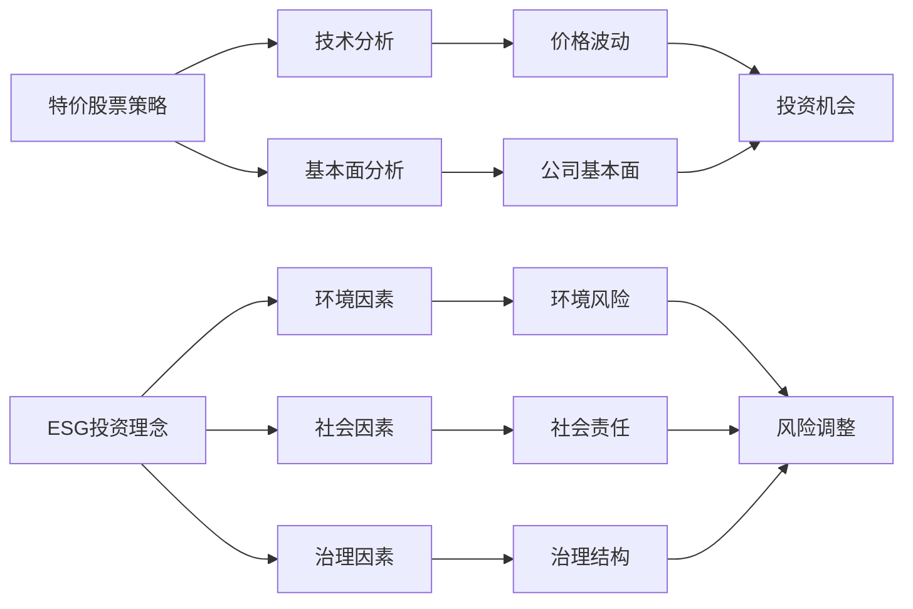

                 


# 如何将特价股票策略与ESG投资理念结合

## 关键词：特价股票，ESG投资，策略结合，投资理念，可持续发展

## 摘要：本文探讨了如何将特价股票策略与ESG投资理念相结合，通过分析两者的联系、算法原理、系统架构及项目实战，展示了如何在投资决策中同时考虑价格优势与社会责任，实现长期可持续收益。

---

## 第一部分: 特价股票策略与ESG投资理念的背景介绍

### 第1章: 特价股票策略的基本概念

#### 1.1 特价股票的定义与特点
- **1.1.1 特价股票的定义**
  特价股票是指市场价格低于其内在价值的股票，通常具有较高的投资潜力。
- **1.1.2 特价股票的特点**
  - 价格被低估
  - 高股息率
  - 具备成长潜力
- **1.1.3 特价股票策略的优势**
  - 高收益潜力
  - 低风险
  - 易于量化分析

### 第2章: ESG投资理念的基本概念

#### 2.1 ESG的定义与内涵
- **2.1.1 ESG的定义**
  ESG是指环境、社会和公司治理三个维度的综合评估。
- **2.1.2 ESG的核心要素**
  - 环境（Environmental）
  - 社会（Social）
  - 治理（Governance）

### 第3章: 特价股票策略与ESG投资理念的结合背景

#### 3.1 当前金融市场的发展趋势
- 投资者越来越关注社会责任和可持续发展。
- 传统财务指标已不足以满足投资需求。

#### 3.2 ESG投资的兴起与影响
- ESG投资成为主流，影响投资决策。
- 投资者关注企业社会责任和长期可持续发展。

#### 3.3 特价股票策略在ESG投资中的潜在价值
- 提供高收益潜力。
- 符合可持续发展理念。
- 结合ESG因素，优化投资决策。

---

## 第二部分: 特价股票策略与ESG投资理念的核心概念与联系

### 第4章: 特价股票策略的核心原理

#### 4.1 技术分析与基本面分析的结合
- **4.1.1 技术分析**
  - 价格趋势分析
  - 技术指标（如RSI、MACD）
- **4.1.2 基本面分析**
  - 财务指标（如PE、ROE）
  - 行业分析

#### 4.2 特价股票策略的关键指标与模型
- **4.2.1 关键指标**
  - 市盈率（P/E）
  - 市净率（P/B）
  - 股息率（Dividend Yield）
- **4.2.2 特价股票模型**
  - Graham-Davidson模型
  - Value Investing模型

### 第5章: ESG投资理念的核心原理

#### 5.1 ESG评分的计算方法
- **5.1.1 环境评分**
  - 碳排放
  - 可再生能源使用
- **5.1.2 社会评分**
  - 劳工权益
  - 社会责任
- **5.1.3 治理评分**
  - 股权结构
  - 透明度

#### 5.2 ESG投资的筛选标准与策略
- **5.2.1 筛选标准**
  - ESG评分高于行业平均水平
  - 环保表现优异
- **5.2.2 投资策略**
  - 被动投资
  - 主动投资

### 第6章: 特价股票策略与ESG投资理念的联系

#### 6.1 两者的互补性与协同效应
- **互补性**
  - 特价股票提供短期价格优势
  - ESG提供长期可持续性
- **协同效应**
  - 结合价格优势与社会责任
  - 提高投资组合的抗风险能力

#### 6.2 ESG因素在特价股票策略中的应用
- **环境因素**
  - 环保表现优异的公司更具投资价值
- **社会因素**
  - 社会责任强的公司更受投资者青睐
- **治理因素**
  - 良好的公司治理确保了公司的长期稳定

#### 6.3 特价股票策略在ESG投资中的优化作用
- **优化投资组合**
  - 结合价格优势与社会责任
  - 提高投资组合的收益与风险调整后的回报

#### 6.4 核心概念对比与联系的Mermaid图


---

## 第三部分: 特价股票策略与ESG投资理念的算法原理

### 第7章: 算法原理的数学模型

#### 7.1 ESG评分的计算公式
$$ ESG\_score = \alpha \cdot E + \beta \cdot S + \gamma \cdot G $$

其中，$\alpha$, $\beta$, $\gamma$为权重系数，$E$, $S$, $G$分别为环境、社会和治理评分。

#### 7.2 特价股票评估模型
$$ Value = \frac{Earnings}{Interest Rate} $$

#### 7.3 结合ESG因素的多因子模型
$$ Return = \beta_1 \cdot P/E + \beta_2 \cdot ESG\_score + \beta_3 \cdot Momentum $$

### 第8章: 算法实现的Python代码示例

#### 8.1 数据清洗与预处理
```python
import pandas as pd

# 加载数据
df = pd.read_csv('stock_data.csv')

# 删除缺失值
df.dropna(inplace=True)

# 标准化处理
from sklearn.preprocessing import StandardScaler
scaler = StandardScaler()
df[['P/E', 'P/B', 'ROE']] = scaler.fit_transform(df[['P/E', 'P/B', 'ROE']])
```

#### 8.2 ESG评分计算
```python
def calculate_esg_score(row):
    # 假设环境、社会、治理评分分别为row['E'], row['S'], row['G']
    return row['E'] * 0.4 + row['S'] * 0.3 + row['G'] * 0.3

df['ESG_Score'] = df.apply(calculate_esg_score, axis=1)
```

#### 8.3 特价股票筛选策略
```python
# 筛选P/E <行业平均P/E 且 ESG_Score >行业平均ESG_Score的股票
industry_avg_pe = df['P/E'].mean()
industry_avg_esg = df['ESG_Score'].mean()

df['is_cheap'] = df['P/E'] < industry_avg_pe
df['is_high_esg'] = df['ESG_Score'] > industry_avg_esg

# 结合策略
df['select'] = df['is_cheap'] & df['is_high_esg']
```

---

## 第四部分: 系统分析与架构设计方案

### 第9章: 系统功能设计

#### 9.1 功能模块
- 数据采集模块
- 数据分析模块
- ESG评分模块
- 策略制定模块
- 投资执行模块

#### 9.2 功能流程图


### 第10章: 系统架构设计

#### 10.1 架构设计
- 数据源层
- 数据处理层
- 策略层
- 用户界面层

#### 10.2 系统架构图


### 第11章: 接口设计与交互流程图

#### 11.1 接口设计
- 数据接口
- 策略接口
- 用户界面接口

#### 11.2 交互流程图


---

## 第五部分: 项目实战

### 第12章: 环境安装与代码实现

#### 12.1 环境安装
- 安装Python
- 安装Pandas、Matplotlib、Scikit-learn

#### 12.2 核心代码实现
```python
import pandas as pd
from sklearn.preprocessing import StandardScaler

# 加载数据
df = pd.read_csv('stock_data.csv')

# 数据清洗
df.dropna(inplace=True)

# 标准化处理
scaler = StandardScaler()
df[['P/E', 'P/B', 'ROE']] = scaler.fit_transform(df[['P/E', 'P/B', 'ROE']])

# 计算ESG评分
def calculate_esg_score(row):
    return row['E'] * 0.4 + row['S'] * 0.3 + row['G'] * 0.3

df['ESG_Score'] = df.apply(calculate_esg_score, axis=1)

# 筛选策略
industry_avg_pe = df['P/E'].mean()
industry_avg_esg = df['ESG_Score'].mean()

df['is_cheap'] = df['P/E'] < industry_avg_pe
df['is_high_esg'] = df['ESG_Score'] > industry_avg_esg

df['select'] = df['is_cheap'] & df['is_high_esg']
```

### 第13章: 项目小结

#### 13.1 项目总结
- 成功将特价股票策略与ESG投资理念结合
- 提高了投资决策的科学性和可持续性
- 优化了投资组合的风险调整后收益

#### 13.2 经验与教训
- 数据质量对结果影响重大
- 模型需要根据市场变化不断优化
- 需要关注政策和市场环境的变化

---

## 第六部分: 最佳实践与注意事项

### 第14章: 最佳实践

#### 14.1 数据来源的选择
- 使用可靠的数据源
- 确保数据的完整性和准确性

#### 14.2 模型调优
- 定期更新模型参数
- 根据市场变化调整权重

#### 14.3 风险控制
- 分散投资
- 定期评估投资组合

### 第15章: 总结与展望

#### 15.1 总结
- 特价股票策略与ESG投资理念的结合具有重要意义
- 提供了新的投资思路和方法
- 为投资者实现可持续收益提供了新的可能性

#### 15.2 展望
- 进一步研究结合更多ESG因素
- 探索更复杂的量化模型
- 开发智能化的投资工具

### 第16章: 注意事项与拓展阅读

#### 16.1 注意事项
- 投资需谨慎
- 遵守相关法律法规
- 定期评估和调整投资策略

#### 16.2 拓展阅读
- 推荐书籍：《ESG投资指南》
- 推荐博客：[链接]

---

## 作者：AI天才研究院/AI Genius Institute & 禅与计算机程序设计艺术 /Zen And The Art of Computer Programming

