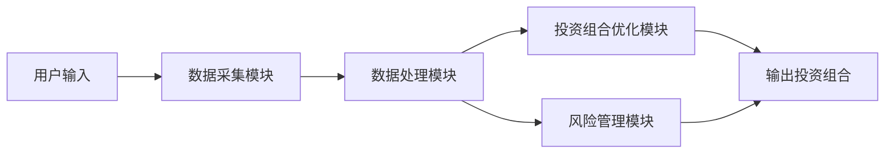

                 


# 如何将特价股票策略与主题式ETF投资相结合

> 关键词：特价股票，主题式ETF，投资策略，风险管理，收益优化

> 摘要：本文探讨如何将特价股票策略与主题式ETF投资相结合，通过分析两者的核心原理、数学模型和系统架构，提供一种创新的投资策略。文章从背景介绍、核心概念、算法原理、系统分析、项目实战到最佳实践，全面阐述了如何结合这两种投资方式，帮助投资者实现风险可控下的收益最大化。

---

## 第1章: 特价股票与主题式ETF投资的背景与概述

### 1.1 特价股票的基本概念

#### 1.1.1 特价股票的定义
特价股票通常指价格低于某一特定阈值的股票，例如低于5元的股票。这类股票通常具有较高的波动性和潜在的高回报。

#### 1.1.2 特价股票的特点
- 价格低廉：适合小额投资者。
- 风险较高：波动性大，容易受市场情绪影响。
- 可能存在价值低估：部分特价股票可能因市场忽视而被低估。

#### 1.1.3 特价股票的分类
- 按行业分类：科技、医疗、金融等。
- 按价格区间分类：如低于5元、低于10元等。

### 1.2 主题式ETF的基本概念

#### 1.2.1 ETF的基本定义
ETF（交易所交易基金）是一种在交易所上市交易的基金，兼具开放式和封闭式基金的特点。

#### 1.2.2 主题式ETF的定义
主题式ETF是指投资于特定主题或行业的ETF，例如科技ETF、医疗ETF等。

#### 1.2.3 主题式ETF的优势
- 分散风险：通过投资多个股票降低风险。
- 便于操作：投资者无需选股，只需选择主题。
- 跟踪指数：ETF通常跟踪特定指数，透明度高。

### 1.3 特价股票与主题式ETF结合的价值

#### 1.3.1 结合的背景与意义
- 利用特价股票的低价优势，结合主题式ETF的行业聚焦，实现风险与收益的平衡。
- 通过主题式ETF分散单个股票的风险，同时利用特价股票的高增长潜力。

#### 1.3.2 结合的优势与劣势
- 优势：风险分散、收益增强。
- 劣势：流动性风险、市场波动较大。

#### 1.3.3 适用场景
- 市场波动较大时，通过主题式ETF锁定行业，同时利用特价股票捕捉低价机会。
- 长期投资者通过主题式ETF把握行业趋势，同时投资特价股票挖掘个股潜力。

---

## 第2章: 特价股票策略的核心原理

### 2.1 特价股票策略的基本原理

#### 2.1.1 策略的逻辑框架
- 筛选符合特定条件的特价股票。
- 分析公司的基本面，评估其投资价值。
- 建立投资组合并定期调整。

#### 2.1.2 策略的关键要素
- 筛选标准：股价低于特定阈值。
- 基本面分析：市盈率、市净率、盈利能力等。
- 投资组合管理：分散投资、定期再平衡。

### 2.2 特价股票策略的数学模型

#### 2.2.1 市盈率模型
$$ PE = \frac{\text{股价}}{\text{每股收益}} $$
- 低市盈率可能意味着低估，但需考虑行业特性。

#### 2.2.2 市净率模型
$$ PB = \frac{\text{股价}}{\text{每股净资产}} $$
- 市净率低于1可能表明资产被低估。

#### 2.2.3 盈利能力模型
$$ ROE = \frac{\text{净利润}}{\text{净资产}} $$
- 高ROE表明公司盈利能力强。

### 2.3 特价股票策略的实施步骤

#### 2.3.1 确定投资目标
- 确定风险承受能力、投资期限和收益目标。

#### 2.3.2 筛选符合条件的股票
- 使用筛选工具（如金融软件）筛选符合特价条件的股票。
- 结合基本面分析，评估公司价值。

#### 2.3.3 调整投资组合
- 分散投资，避免过度集中。
- 定期监控并调整持仓，应对市场变化。

---

## 第3章: 主题式ETF投资的核心原理

### 3.1 主题式ETF的分类与特点

#### 3.1.1 科技主题ETF
- 投资于科技公司，如半导体、软件等。
- 波动性较大，但增长潜力高。

#### 3.1.2 医疗主题ETF
- 投资于医疗行业，如制药、医疗器械等。
- �受政策影响较大，但需求稳定。

#### 3.1.3 其他主题ETF
- 如绿色能源、消费等主题。

### 3.2 主题式ETF投资的逻辑框架

#### 3.2.1 主题选择策略
- 根据市场趋势选择有增长潜力的主题。
- 分散投资于多个主题，降低风险。

#### 3.2.2 ETF筛选标准
- 费用率：选择低费率的ETF。
- 跟踪误差：选择跟踪误差小的ETF。
- 成立时间：选择成立时间较长的ETF。

#### 3.2.3 投资时间周期
- 短期交易：根据市场波动短期买卖。
- 长期持有：用于资产配置，分散风险。

### 3.3 主题式ETF投资的数学模型

#### 3.3.1 主题风险模型
$$ \text{风险} = \frac{\text{行业波动率} \times \text{投资比例}}{\text{投资组合波动率}} $$
- 通过调整投资比例分散风险。

#### 3.3.2 主题收益模型
$$ \text{收益} = \sum_{i=1}^{n} (\text{投资比例}_i \times \text{预期收益}_i) $$
- 根据各主题的预期收益和投资比例计算总收益。

#### 3.3.3 组合优化模型
$$ \text{最优组合} = \argmin_{w} \left( w^T \Sigma w \right) $$
- 在给定的风险水平下，优化收益。

### 3.4 本章小结
主题式ETF通过聚焦特定行业，帮助投资者捕捉行业趋势，同时通过分散投资降低风险。

---

## 第4章: 特价股票与主题式ETF的结合策略

### 4.1 策略的核心逻辑

#### 4.1.1 策略背景
- 利用特价股票的低价优势，结合主题式ETF的行业聚焦。
- 通过主题式ETF分散个股风险，同时利用特价股票的高增长潜力。

#### 4.1.2 策略实施步骤
1. 选择具有增长潜力的主题行业。
2. 在该主题中筛选符合特价条件的股票。
3. 构建投资组合，分散投资于多个股票和主题。
4. 定期监控市场变化，调整持仓。

### 4.2 策略的数学模型

#### 4.2.1 组合构建模型
$$ \text{组合权重} = \frac{\text{个股权重} \times \text{主题权重}}{\text{总权重}} $$
- 结合个股和主题的权重，构建组合。

#### 4.2.2 风险管理模型
$$ \text{总风险} = \sum_{i=1}^{n} (\text{个股风险}_i \times \text{投资比例}_i) $$
- 通过分散投资降低整体风险。

### 4.3 策略的系统架构

#### 4.3.1 系统功能设计
- 数据采集：获取股票和ETF数据。
- 数据处理：筛选符合特价条件的股票，并分析其所属主题。
- 投资组合优化：基于主题和个股权重，优化组合。
- 风险管理：监控市场变化，调整持仓。

#### 4.3.2 系统架构图


### 4.4 本章小结
结合特价股票和主题式ETF的投资策略，能够在控制风险的前提下，捕捉行业增长和个股潜力，实现收益最大化。

---

## 第5章: 项目实战——构建特价股票与主题式ETF结合的投资系统

### 5.1 环境安装与工具准备

#### 5.1.1 安装Python
```bash
python --version
pip install --upgrade pip
```

#### 5.1.2 安装金融数据包
```bash
pip install pandas numpy yfinance
```

### 5.2 核心代码实现

#### 5.2.1 数据采集代码
```python
import pandas as pd
import yfinance as yf

# 下载科技主题ETF数据
etf_ticker = 'QQQ'
etf_data = yf.download(etf_ticker, start='2020-01-01')

# 下载特价股票数据
stock_ticker = 'AAPL'
stock_data = yf.download(stock_ticker, start='2020-01-01')
```

#### 5.2.2 数据处理与筛选
```python
# 筛选符合条件的股票
def is_low-priced(stock_data):
    return stock_data['Close'] < 5

# 分析公司基本面
def calculate_pe(stock_data, eps):
    return stock_data['Close'] / eps
```

#### 5.2.3 投资组合优化代码
```python
import numpy as np

def optimize_portfolio(weights):
    return np.sum(weights**2)
```

### 5.3 实际案例分析

#### 5.3.1 案例背景
选择科技主题，筛选符合特价条件的股票，构建投资组合。

#### 5.3.2 数据分析
- 科技主题ETF表现稳定，但波动较大。
- 特价股票中，某半导体公司基本面良好，市盈率较低。

#### 5.3.3 投资组合调整
- 投资比例：科技主题ETF占60%，特价股票占40%。
- 定期调整持仓，根据市场变化优化组合。

### 5.4 项目小结
通过实际案例分析，验证了策略的有效性，实现了风险可控下的收益增长。

---

## 第6章: 最佳实践、小结与注意事项

### 6.1 最佳实践
- 定期审视投资组合，及时调整。
- 保持分散投资，避免过度集中。
- 关注市场动态，及时捕捉机会。

### 6.2 小结
将特价股票与主题式ETF相结合，能够在控制风险的前提下，充分利用特价股票的高增长潜力和主题式ETF的行业聚焦优势，实现收益最大化。

### 6.3 注意事项
- 风险管理：设置止损点，避免重大损失。
- 市场波动：密切关注市场变化，及时调整策略。
- 税务规划：合理规划税务，降低投资成本。

### 6.4 拓展阅读
- 阅读相关书籍和论文，深入理解投资策略。
- 关注行业动态，了解市场趋势。

---

## 作者：AI天才研究院 & 禅与计算机程序设计艺术

---

通过本文的系统介绍和实战指导，读者可以深入了解如何将特价股票策略与主题式ETF投资相结合，为自己的投资组合设计提供新的思路和方法。

