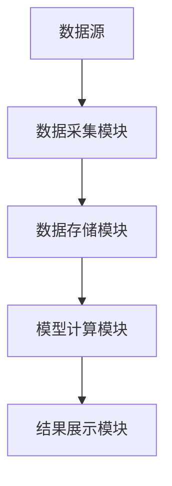

                 


# 如何将特价股票策略与其他投资策略结合

## 关键词：特价股票策略，投资策略结合，风险控制，收益优化，系统架构

## 摘要：
本文深入探讨了如何将特价股票策略与其他投资策略（如价值投资、成长投资和技术创新分析）相结合，以优化投资组合的收益和风险控制。通过分析各策略的核心原理、数学模型和系统架构设计，本文为投资者提供了结合不同策略的实践方法和具体案例。

---

# 第1章: 特价股票策略与其他投资策略结合的背景与意义

## 1.1 特价股票策略的定义与特点
### 1.1.1 特价股票的定义
特价股票是指市场价格显著低于其内在价值的股票。这类股票通常被视为被市场低估的投资机会，具有较大的增值潜力。

### 1.1.2 特价股票的核心特点
- **低估值**：市盈率、市净率等估值指标显著低于行业平均水平。
- **高安全边际**：价格与内在价值的差距提供了较高的安全边际。
- **周期性机会**：通常出现在市场低迷或行业低谷时期。

### 1.1.3 特价股票与其他股票的区别
| 特性 | 特价股票 | 其他股票 |
|------|----------|----------|
| 估值 | 低于行业平均水平 | 与行业平均水平持平或高于 |
| 风险 | 较低（安全边际高） | 风险较高（估值泡沫） |
| 机会 | 价值回归潜力大 | 机会有限 |

## 1.2 其他主要投资策略概述
### 1.2.1 价值投资策略
- **核心**：寻找市场价格低于内在价值的股票，长期持有。
- **特点**：注重公司基本面，强调安全边际。

### 1.2.2 成长投资策略
- **核心**：投资于业绩持续增长、未来前景广阔的公司。
- **特点**：注重公司成长性，愿意承担较高的估值风险。

### 1.2.3 技术分析策略
- **核心**：通过技术指标和市场信号预测股票价格走势。
- **特点**：短期操作为主，注重市场情绪和趋势分析。

### 1.2.4 股票组合投资策略
- **核心**：通过分散投资降低风险，追求稳定收益。
- **特点**：注重资产配置和风险控制。

## 1.3 特价股票策略与其他投资策略结合的意义
### 1.3.1 提高投资组合的稳定性
通过结合不同策略，可以在市场波动中保持投资组合的稳定性。

### 1.3.2 优化风险与收益的平衡
利用特价股票的低估值优势，结合成长股的长期潜力，可以在控制风险的同时追求更高收益。

### 1.3.3 提升投资决策的科学性
多策略结合可以避免单一策略的局限性，提高决策的全面性和科学性。

## 1.4 本章小结
本章介绍了特价股票策略的核心特点，并分析了其与其他投资策略的联系。结合不同策略可以优化投资组合的收益与风险。

---

# 第2章: 特价股票策略与其他投资策略的核心概念与联系

## 2.1 特价股票策略的核心原理
### 2.1.1 市场低估的识别
通过分析市盈率（P/E）、市净率（P/B）等指标，识别市场价格显著低于内在价值的股票。

### 2.1.2 价值回归理论
市场低估的股票往往会在未来回归其内在价值，从而为投资者带来超额收益。

### 2.1.3 特价股票的筛选标准
- **低估值**：P/E < 行业平均，P/B < 1
- **高分红率**：股息率较高，体现公司回报股东的能力。
- **行业地位**：公司处于行业龙头地位，具备竞争优势。

## 2.2 其他投资策略的核心原理
### 2.2.1 价值投资的内在价值计算
- **公式**：内在价值 = min(永续增长率模型，DCF模型)
- **步骤**：分析公司财务报表，估算未来现金流，计算现值。

### 2.2.2 成长投资的未来预期分析
- **核心**：预测公司未来几年的收入和利润增长率。
- **指标**：ROE（净资产收益率）、净利润增长率。

### 2.2.3 技术分析的市场信号解读
- **指标**：移动平均线（MA）、相对强弱指数（RSI）、MACD。
- **信号**：突破、回调、趋势变化。

## 2.3 特价股票策略与其他投资策略的联系
### 2.3.1 理论上的互补性
- **价值投资与特价股票**：价值投资是特价股票策略的理论基础。
- **成长股与特价股票**：成长股的低估阶段可能符合特价股票的筛选标准。

### 2.3.2 实践中的协同效应
- **组合投资**：通过结合价值投资和成长投资，构建攻守兼备的投资组合。
- **技术分析辅助**：利用技术分析信号，优化买入和卖出时机。

### 2.3.3 案例分析：价值投资与特价股票结合的实例
**案例**：某公司股票市场价格为10元，内在价值15元，市盈率显著低于行业平均，符合价值投资和特价股票的双重标准。通过长期持有，结合技术分析信号，可以在价格接近内在价值时卖出，获得超额收益。

## 2.4 本章小结
本章分析了特价股票策略与其他投资策略的核心原理和联系，强调了多策略结合的优势。

---

# 第3章: 特价股票策略与其他投资策略的数学模型与算法

## 3.1 特价股票评估的数学模型
### 3.1.1 市净率模型
- **公式**：市净率 = 股票价格 / 每股净资产
- **应用**：筛选市净率低于1的股票。

### 3.1.2 市盈率模型
- **公式**：市盈率 = 股票价格 / 每股收益
- **应用**：筛选市盈率低于行业平均的股票。

### 3.1.3 股息率模型
- **公式**：股息率 = 每股股息 / 股票价格
- **应用**：筛选股息率高于行业平均水平的股票。

## 3.2 其他投资策略的数学模型
### 3.2.1 内在价值计算模型
- **公式**：内在价值 = Σ（未来现金流的现值）
- **应用**：通过DCF模型估算成长股的内在价值。

### 3.2.2 成长股预测模型
- **公式**：净利润增长率 = (净利润增长量 / 基期净利润) × 100%
- **应用**：预测未来几年的净利润增长率，评估成长潜力。

### 3.2.3 技术分析指标公式
- **移动平均线（MA）**：
  - 简单移动平均（SMA）：$SMA = \frac{1}{n}\sum_{i=1}^{n}P_i$
  - 加权移动平均（WMA）：$WMA = \sum_{i=1}^{n}w_iP_i$
- **相对强弱指数（RSI）**：
  - RSI = 100 - (100 - (100 - (100 / (1 + (1 - 平均上涨幅度 / 平均下跌幅度)))) )
- **MACD**：
  - MACD线 = 短期EMA - 长期EMA
  - 信号线 = MACD的EMA

## 3.3 综合评估模型
### 3.3.1 综合评分公式
$$
综合评分 = \alpha \times 特价股票评分 + \beta \times 其他策略评分
$$
其中，$\alpha$ 和 $\beta$ 是权重系数，通常根据市场环境和投资目标进行调整。

### 3.3.2 模型优化与参数调整
- **参数优化**：通过历史数据回测，调整$\alpha$和$\beta$的值，以最大化收益和最小化风险。
- **风险管理**：引入风险调整因子，降低组合的整体波动性。

## 3.4 算法实现
### 3.4.1 数据输入与预处理
- 数据来源：股票历史价格、财务数据、行业指标。
- 数据清洗：处理缺失值、异常值。

### 3.4.2 模型计算
```python
# 示例代码：计算综合评分
def calculate综合评分(股票列表, alpha, beta):
    综合评分 = []
    for 股票 in 股票列表:
        特价评分 = calculate_特价评分(股票)
        其他策略评分 = calculate_其他策略评分(股票)
        综合评分_i = alpha * 特价评分 + beta * 其他策略评分
        综合评分.append(综合评分_i)
    return 综合评分
```

### 3.4.3 结果输出与可视化
- **输出**：生成综合评分报告，包括排名、建议和风险提示。
- **可视化**：绘制股票评分分布图、趋势图。

## 3.5 本章小结
本章通过数学模型和算法，展示了如何将特价股票策略与其他策略结合，优化投资组合的评估和决策过程。

---

# 第4章: 特价股票策略与其他投资策略的系统架构设计

## 4.1 系统功能设计
### 4.1.1 数据采集模块
- 功能：从数据源获取股票价格、财务数据等信息。
- 工具：Yahoo Finance API、CSV文件。

### 4.1.2 模型计算模块
- 功能：运行综合评估模型，生成股票评分。
- 工具：Python（Pandas、NumPy）、机器学习框架（如Scikit-learn）。

### 4.1.3 结果展示模块
- 功能：生成报告、可视化图表。
- 工具：Matplotlib、Plotly。

## 4.2 系统架构图


## 4.3 接口设计
### 4.3.1 数据接口
- 输入：股票代码、日期范围。
- 输出：历史数据、财务指标。

### 4.3.2 计算接口
- 输入：股票列表、权重参数。
- 输出：综合评分、排名。

### 4.3.3 展示接口
- 输入：评分结果。
- 输出：报告、图表。

## 4.4 本章小结
本章通过系统架构设计，展示了如何将特价股票策略与其他策略结合的实现过程。

---

# 第5章: 特价股票策略与其他投资策略的项目实战

## 5.1 环境搭建
### 5.1.1 数据源选择
- 数据源：Yahoo Finance API、本地CSV文件。

### 5.1.2 工具安装
- Python环境：安装Pandas、NumPy、Matplotlib。
- IDE：Jupyter Notebook或PyCharm。

## 5.2 核心实现
### 5.2.1 数据预处理
```python
import pandas as pd
data = pd.read_csv('stock_data.csv')
data = data.dropna()  # 删除缺失值
```

### 5.2.2 模型计算
```python
def calculate综合评分(股票列表):
    综合评分 = []
    for stock in 股票列表:
        特价评分 = calculate_特价评分(stock)
        其他策略评分 = calculate_其他策略评分(stock)
        综合评分_i = 0.5 * 特价评分 + 0.5 * 其他策略评分
        综合评分.append(综合评分_i)
    return 综合评分
```

### 5.2.3 结果展示
```python
import matplotlib.pyplot as plt
评分结果 = calculate综合评分(股票列表)
plt.bar(股票列表, 评分结果)
plt.show()
```

## 5.3 案例分析
**案例**：假设我们有两只股票A和B，分别计算它们的综合评分。
- 股票A：特价评分80，其他策略评分70，综合评分75。
- 股票B：特价评分60，其他策略评分80，综合评分70。
- 结论：股票A更值得投资。

## 5.4 本章小结
本章通过具体案例，展示了如何将理论应用于实际投资决策。

---

# 第6章: 总结与最佳实践

## 6.1 小结
本文详细探讨了如何将特价股票策略与其他投资策略结合，优化投资组合的收益与风险。

## 6.2 注意事项
- **风险控制**：避免过度集中投资。
- **模型优化**：根据市场变化调整参数。
- **持续学习**：关注市场动态，更新策略。

## 6.3 拓展阅读
- 《价值投资入门》
- 《技术分析实战技巧》
- 《股票组合投资策略》

## 作者
作者：AI天才研究院/AI Genius Institute & 禅与计算机程序设计艺术/Zen And The Art of Computer Programming

---

通过以上内容，您可以全面了解如何将特价股票策略与其他投资策略结合，并在实际操作中应用这些策略来优化投资组合。

