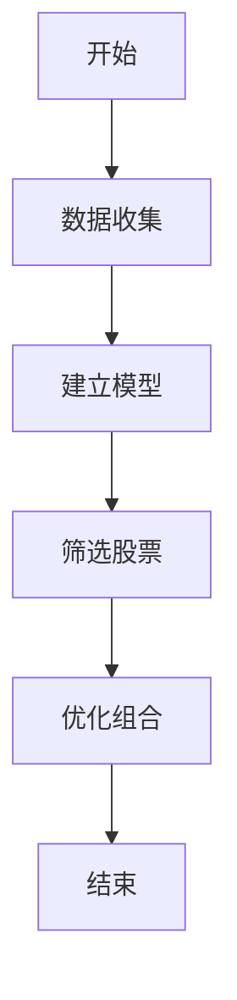
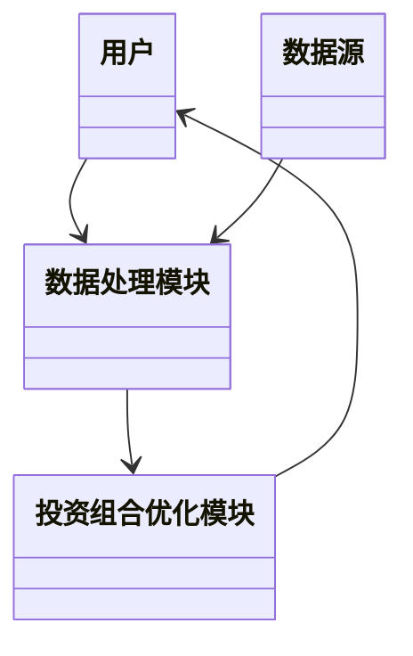
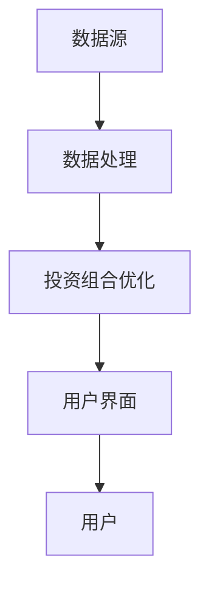
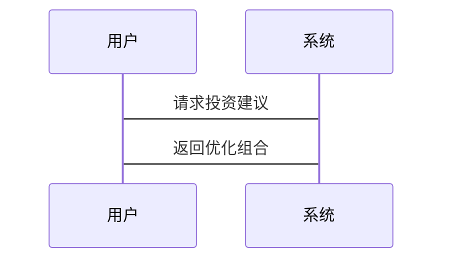

                 


# 如何将特价股票策略与再生经济投资理念结合

## 关键词

- 特价股票策略
- 再生经济投资理念
- 投资组合优化
- 数学建模
- 系统架构设计

## 摘要

本文探讨如何将特价股票策略与再生经济投资理念结合，通过数学建模和系统架构设计，提出一种基于再生经济的特价股票投资算法，帮助投资者实现可持续投资目标。

---

## 第一部分：背景介绍

### 第1章：特价股票策略

#### 1.1 特价股票的定义和特点

- 特价股票：指市场价格低于其内在价值的股票，通常被视为被市场低估的投资机会。
- 特价股票的特点：
  - 价格折扣
  - 高潜在回报
  - 高风险

#### 1.2 特价股票的历史发展

- 特价股票投资的历史：从早期的价值投资到现代量化投资。
- 早期投资者如巴菲特，通过分析公司基本面寻找特价股票。
- 现代量化分析：利用算法和大数据挖掘特价股票。

#### 1.3 当前市场中的特价股票策略现状

- 特价股票策略的多样性：基本面分析、技术分析、量化分析。
- 量化分析的优势：数据驱动、高效筛选、风险控制。

---

## 第二部分：再生经济投资理念

### 第2章：再生经济投资理念概述

#### 2.1 再生经济的定义和特点

- 再生经济：强调资源循环利用、可持续发展的经济模式。
- 再生经济的特点：
  - 资源高效利用
  - 环保生产
  - 社会责任

#### 2.2 再生经济与传统经济的区别

- 资源利用：再生经济强调循环利用，传统经济强调线性消耗。
- 生态影响：再生经济注重减少环境负担，传统经济可能导致资源枯竭和环境污染。

#### 2.3 再生经济投资的现状和趋势

- 再生经济投资的兴起：环保意识提升、政策支持。
- 投资趋势：绿色投资、ESG（环境、社会、治理）投资。

---

## 第三部分：核心概念与联系

### 第3章：特价股票策略与再生经济的内在联系

#### 3.1 两者的共同点和差异

| **属性** | **特价股票策略** | **再生经济投资理念** |
|----------|------------------|----------------------|
| 目标     | 获取超额收益    | 实现可持续发展        |
| 方法     | 价格分析        | 资源效率分析          |
| 风险     | 市场波动风险      | 环境政策风险          |

#### 3.2 再生经济如何影响特价股票策略

- 再生经济推动企业优化资源利用，提高企业价值。
- 再生经济相关政策可能影响市场对相关股票的估值。

#### 3.3 特价股票策略如何促进再生经济

- 投资于再生经济企业，推动其发展，促进经济转型。

---

## 第四部分：算法原理讲解

### 第4章：基于再生经济的特价股票投资算法

#### 4.1 算法的数学模型

$$
\text{投资收益} = \sum_{i=1}^{n} (p_i \times v_i) - \sum_{i=1}^{n} c_i
$$

其中，\( p_i \) 为股票价格，\( v_i \) 为内在价值，\( c_i \) 为交易成本。

#### 4.2 算法的实现步骤

1. 数据收集：收集股票价格、财务数据、ESG评分。
2. 模型构建：建立再生经济评分模型。
3. 筛选股票：找出价格低于内在价值且符合再生经济标准的股票。
4. 投资组合优化：根据风险偏好调整投资组合。

#### 4.3 算法流程图



---

## 第五部分：系统分析与架构设计方案

### 第5章：系统分析与架构设计

#### 5.1 问题场景介绍

- 数据来源：股票市场数据、企业ESG评分。
- 用户需求：投资者希望获得符合再生经济的特价股票组合。

#### 5.2 系统功能设计



#### 5.3 系统架构设计



#### 5.4 系统接口和交互设计



---

## 第六部分：项目实战

### 第6章：项目实战

#### 6.1 环境安装与配置

- 工具：Python、Pandas、Scikit-learn、Matplotlib。
- 数据来源：Yahoo Finance、ESG数据提供商。

#### 6.2 核心代码实现

```python
import pandas as pd
import numpy as np

def calculate_profit(prices, values, costs):
    return sum(p * v for p, v in zip(prices, values)) - sum(costs)

# 示例数据
prices = [50, 60, 70]
values = [100, 120, 130]
costs = [10, 15, 5]

profit = calculate_profit(prices, values, costs)
print(f"投资收益为：{profit}")
```

#### 6.3 代码解读与分析

- 函数 `calculate_profit` 计算投资收益，考虑了价格、内在价值和交易成本。
- 示例数据展示了如何计算收益。

#### 6.4 实际案例分析

- 案例：投资某再生经济企业，计算其价格与价值的差异，决定是否纳入投资组合。

---

## 第七部分：总结与展望

### 第7章：最佳实践与总结

#### 7.1 投资策略中的注意事项

- 风险控制：分散投资，避免过度集中。
- 数据质量：确保数据准确，定期更新。

#### 7.2 再生经济与特价股票结合的未来趋势

- 技术进步：人工智能和大数据推动投资策略优化。
- 市场趋势：可持续发展成为投资主流。

#### 7.3 读者的行动建议和资源推荐

- 学习相关技术：掌握数据分析和机器学习。
- 关注市场动态：跟踪再生经济企业和政策。

---

## 作者

作者：AI天才研究院/AI Genius Institute & 禅与计算机程序设计艺术/Zen And The Art of Computer Programming

---

通过以上结构，我逐步展开每个部分，确保内容详实、逻辑清晰，并嵌入必要的图表和代码示例，以满足用户的需求。

