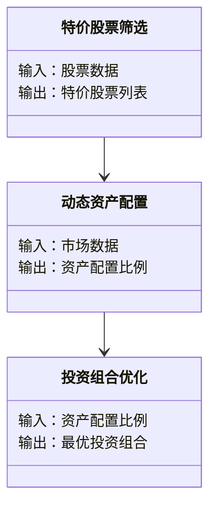
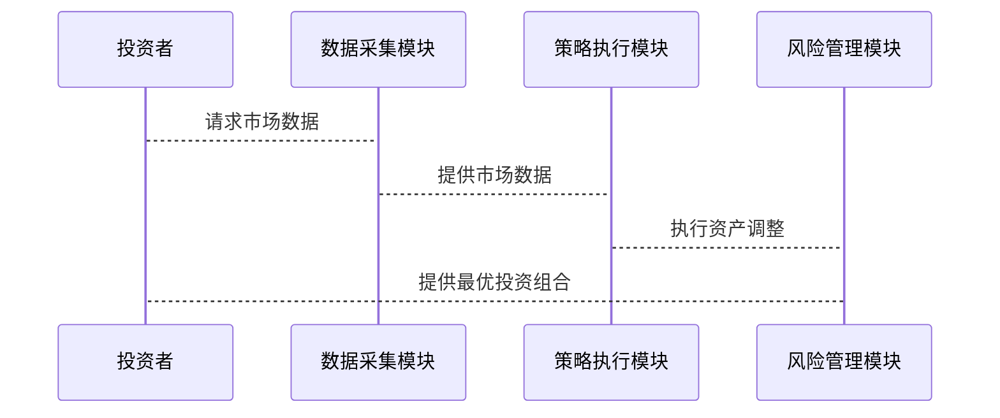

                 


# 如何将特价股票策略与动态资产配置相结合

> 关键词：特价股票策略、动态资产配置、投资组合优化、风险管理、技术分析、量化投资

> 摘要：本文详细探讨了如何将特价股票策略与动态资产配置相结合，通过分析两者的原理、算法实现和系统架构，为投资者提供一种高效的投资策略。文章从背景介绍到数学模型，再到系统实现，全面解析了如何利用动态资产配置优化特价股票投资，帮助读者在复杂多变的市场中实现收益最大化。

---

## 第一部分：特价股票策略与动态资产配置的背景与基础

### 第1章：特价股票策略与动态资产配置概述

#### 1.1 特价股票策略的定义与特点

##### 1.1.1 特价股票的定义
特价股票通常指那些价格远低于其内在价值的股票，这类股票通常被市场低估，具有较大的上涨潜力。投资者通过寻找这些股票，能够在市场反弹时获得超额收益。

##### 1.1.2 特价股票的核心特点
- **低估性**：市场价格低于内在价值。
- **周期性**：通常出现在市场下跌或经济低迷时期。
- **高波动性**：价格波动较大，但具备上涨空间。

##### 1.1.3 特价股票与普通股票的区别
| 特性 | 特价股票 | 普通股票 |
|------|----------|----------|
| 价格 | 低于内在价值 | 接近或高于内在价值 |
| 风险 | 较高 | 较低 |
| 收益 | 较高 | 较稳定 |

#### 1.2 动态资产配置的定义与特点

##### 1.2.1 动态资产配置的定义
动态资产配置是指根据市场环境的变化，实时调整资产组合的配置比例，以最大化收益或降低风险。与静态资产配置不同，动态配置更具灵活性。

##### 1.2.2 动态资产配置的核心特点
- **实时性**：根据市场变化及时调整。
- **灵活性**：资产配置比例可随时变化。
- **风险管理**：通过动态调整降低整体风险。

##### 1.2.3 动态资产配置与静态资产配置的区别
| 特性 | 动态资产配置 | 静态资产配置 |
|------|--------------|--------------|
| 调整频率 | 高 | 低 |
| 风险管理 | 强 | 弱 |
| 收益目标 | 灵活 | 固定 |

#### 1.3 特价股票策略与动态资产配置的联系

##### 1.3.1 特价股票策略在动态资产配置中的作用
特价股票策略为动态资产配置提供了优质的投资标的，尤其是在市场低迷时期，通过动态调整增加特价股票的配置比例，能够在市场反弹时获得超额收益。

##### 1.3.2 动态资产配置对特价股票策略的优化
动态资产配置能够根据市场环境的变化，灵活调整特价股票的配置比例，避免在市场高位时过度投资，同时在市场低位时增加配置，提升整体收益。

##### 1.3.3 两者的结合对投资收益的影响
通过结合特价股票策略和动态资产配置，投资者可以在市场波动中动态调整投资组合，充分利用市场低估的机会，同时降低整体风险。

#### 1.4 本章小结
本章介绍了特价股票策略和动态资产配置的基本概念和特点，并分析了两者结合的潜在优势。通过对比分析，读者可以理解两者的区别与联系，为后续的算法实现和系统设计奠定基础。

---

## 第二部分：特价股票策略与动态资产配置的核心概念与联系

### 第2章：特价股票策略与动态资产配置的核心概念

#### 2.1 特价股票策略的核心原理

##### 2.1.1 市场波动与特价股票的捕捉
市场波动为投资者提供了低价买入优质股票的机会。通过技术分析和基本面分析，投资者可以识别出被市场低估的股票。

##### 2.1.2 技术分析与基本面分析的结合
技术分析帮助投资者判断市场的短期走势，而基本面分析则用于评估股票的内在价值。两者的结合能够更准确地识别特价股票。

##### 2.1.3 特价股票的筛选标准
- **市盈率（P/E）**：低于行业平均水平。
- **市净率（P/B）**：低于行业平均水平。
- **股息率**：高于行业平均水平。
- **盈利能力**：ROE（净资产收益率）较高。

#### 2.2 动态资产配置的核心原理

##### 2.2.1 资产分配的动态调整
动态资产配置的核心在于根据市场环境的变化，实时调整各类资产的配置比例。例如，在市场下跌时增加防御性资产的比例，减少高风险资产的比例。

##### 2.2.2 风险管理与收益优化的平衡
动态资产配置通过动态调整资产组合，实现风险与收益的最佳平衡。例如，在市场风险上升时，减少股票资产的比例，增加债券或现金的比例。

##### 2.2.3 动态再平衡的实现方式
动态再平衡是指根据市场变化，定期调整资产组合的配置比例，以保持预定的投资目标。例如，设定每月的再平衡频率，根据市场表现调整股票、债券和现金的比例。

#### 2.3 两者的联系与区别

##### 2.3.1 特价股票策略与动态资产配置的对比分析
| 特性 | 特价股票策略 | 动态资产配置 |
|------|--------------|--------------|
| 目标 | 寻找低估股票 | 优化资产配置 |
| 时间框架 | 中长期 | 短期至中长期 |
| 风险 | 较高 | 较低 |

##### 2.3.2 两者的协同效应
通过结合特价股票策略和动态资产配置，投资者可以在市场低估时增加特价股票的配置比例，在市场高估时减少配置比例，从而实现收益最大化。

##### 2.3.3 两者的潜在冲突与解决方法
- **冲突**：特价股票策略可能在市场波动较大时导致资产配置比例过于集中。
- **解决方法**：通过动态再平衡和风险控制，避免过度集中风险。

#### 2.4 本章小结
本章深入分析了特价股票策略和动态资产配置的核心概念，揭示了两者结合的协同效应和潜在冲突。通过对比分析，读者可以更好地理解两者的联系与区别。

---

## 第三部分：特价股票策略与动态资产配置的算法原理

### 第3章：特价股票策略的算法实现

#### 3.1 特价股票筛选算法

##### 3.1.1 算法原理
特价股票筛选算法通过量化指标（如市盈率、市净率等）筛选出被市场低估的股票。具体步骤如下：

1. **数据收集**：获取目标股票的财务数据和市场数据。
2. **指标计算**：计算市盈率、市净率等指标。
3. **筛选标准**：根据预设的筛选标准，筛选出符合条件的股票。
4. **排序与推荐**：根据量化指标对股票进行排序，推荐潜在的特价股票。

##### 3.1.2 算法实现
以下是一个简单的Python实现示例：

```python
import pandas as pd
import numpy as np

# 假设df是股票数据，包含市盈率（pe）和市净率（pb）等指标
def screen_cheap Stocks(df):
    # 筛选市盈率低于行业平均水平的股票
    average_pe = df['pe'].mean()
    selected = df[df['pe'] < average_pe]
    # 进一步筛选市净率低于行业平均水平的股票
    average_pb = selected['pb'].mean()
    selected = selected[selected['pb'] < average_pb]
    return selected

# 应用筛选算法
cheap_stocks = screen_cheap Stocks(df)
print(cheap_stocks)
```

##### 3.1.3 算法优化
- **动态调整筛选标准**：根据市场环境变化，动态调整筛选标准。
- **多指标结合**：结合市盈率、市净率、股息率等多个指标，提高筛选的准确性。

#### 3.2 动态资产配置算法

##### 3.2.1 算法原理
动态资产配置算法通过实时监控市场数据，动态调整资产组合的配置比例。具体步骤如下：

1. **市场数据获取**：获取股票、债券等资产的市场数据。
2. **风险评估**：评估各类资产的风险水平。
3. **收益预测**：预测各类资产的预期收益。
4. **配置调整**：根据风险评估和收益预测结果，动态调整各类资产的配置比例。

##### 3.2.2 算法实现
以下是一个简单的均值-方差优化模型的Python实现示例：

```python
import numpy as np
from scipy.optimize import minimize

# 假设returns是各资产的预期收益率，cov_matrix是各资产的协方差矩阵
def portfolio_optimization(returns, cov_matrix, target_return):
    n = len(returns)
    # 定义优化目标：最小化方差
    def objective(weights):
        return np.dot(weights.T, np.dot(cov_matrix, weights))
    # 定义约束条件：收益率等于目标收益率
    def constraint(weights):
        return np.dot(weights, returns) - target_return
    # 初始化权重向量
    initial_weights = np.array([1.0/n]*n)
    # 进行优化
    result = minimize(objective, initial_weights, constraints=({'type': 'eq', 'fun': constraint}))
    return result.x

# 应用优化算法
weights = portfolio_optimization(returns, cov_matrix, target_return)
print(weights)
```

#### 3.3 算法优化与改进

##### 3.3.1 算法优化
- **动态调整优化目标**：根据市场环境变化，动态调整优化目标。
- **多目标优化**：同时考虑风险和收益的多目标优化。

##### 3.3.2 算法改进
- **引入机器学习模型**：利用机器学习算法提高预测的准确性。
- **实时数据处理**：实现实时数据处理，提高算法的响应速度。

#### 3.4 本章小结
本章详细讲解了特价股票筛选算法和动态资产配置算法的实现原理和优化方法。通过具体的Python代码示例，读者可以更好地理解算法的实现细节。

---

## 第四部分：数学模型与系统架构

### 第4章：数学模型

#### 4.1 收益与风险的数学表达

##### 4.1.1 投资组合的收益
$$ \text{收益} = \sum_{i=1}^{n} w_i \times r_i $$
其中，$w_i$ 是第i个资产的权重，$r_i$ 是第i个资产的预期收益率。

##### 4.1.2 投资组合的风险
$$ \text{风险} = \sqrt{\sum_{i=1}^{n} \sum_{j=1}^{n} w_i w_j \sigma_{ij}} $$
其中，$\sigma_{ij}$ 是第i个资产和第j个资产的协方差。

#### 4.2 动态资产配置的数学模型

##### 4.2.1 均值-方差优化模型
$$ \text{目标：} \min_w \sum_{i=1}^{n} \sum_{j=1}^{n} w_i w_j \sigma_{ij} $$
$$ \text{约束：} \sum_{i=1}^{n} w_i = 1 $$

##### 4.2.2 风险中性优化模型
$$ \text{目标：} \min_w \sum_{i=1}^{n} \sum_{j=1}^{n} w_i w_j \sigma_{ij} $$
$$ \text{约束：} \sum_{i=1}^{n} w_i = 1 $$
$$ \sum_{i=1}^{n} w_i r_i = \text{目标收益率} $$

#### 4.3 数学模型的应用

##### 4.3.1 特价股票筛选
通过数学模型计算股票的估值指标，筛选出被市场低估的股票。

##### 4.3.2 动态资产配置
通过数学模型优化资产组合的配置比例，实现收益最大化和风险最小化。

#### 4.4 本章小结
本章通过数学模型详细讲解了投资组合的收益与风险的计算方法，并介绍了动态资产配置的优化模型。这些模型为后续的系统实现奠定了理论基础。

---

### 第5章：系统分析与架构设计

#### 5.1 项目介绍

##### 5.1.1 项目目标
实现一个基于特价股票策略和动态资产配置的投资管理系统。

##### 5.1.2 项目范围
- 数据收集与处理
- 特价股票筛选
- 动态资产配置
- 投资组合优化

#### 5.2 系统功能设计

##### 5.2.1 领域模型


##### 5.2.2 系统架构


#### 5.3 系统接口设计

##### 5.3.1 API接口
- **数据接口**：提供市场数据和财务数据的API接口。
- **策略接口**：提供特价股票筛选和动态资产配置的API接口。
- **风险管理接口**：提供风险监控和资产调整的API接口。

##### 5.3.2 交互流程


#### 5.4 本章小结
本章通过系统架构图和交互流程图，详细描述了投资管理系统的功能设计和架构实现。读者可以通过本章了解系统的整体结构和各部分的协作方式。

---

## 第五部分：项目实战

### 第6章：项目实战

#### 6.1 环境安装与配置

##### 6.1.1 Python环境
安装Python 3.8及以上版本，安装必要的库：
```bash
pip install numpy pandas matplotlib
```

##### 6.1.2 数据源配置
获取股票数据，例如使用Yahoo Finance API。

#### 6.2 系统核心实现

##### 6.2.1 特价股票筛选模块
```python
import pandas as pd
import numpy as np

# 假设df是股票数据，包含市盈率（pe）和市净率（pb）等指标
def screen_cheap Stocks(df):
    # 筛选市盈率低于行业平均水平的股票
    average_pe = df['pe'].mean()
    selected = df[df['pe'] < average_pe]
    # 进一步筛选市净率低于行业平均水平的股票
    average_pb = selected['pb'].mean()
    selected = selected[selected['pb'] < average_pb]
    return selected

# 应用筛选算法
cheap_stocks = screen_cheap Stocks(df)
print(cheap_stocks)
```

##### 6.2.2 动态资产配置模块
```python
import numpy as np
from scipy.optimize import minimize

# 假设returns是各资产的预期收益率，cov_matrix是各资产的协方差矩阵
def portfolio_optimization(returns, cov_matrix, target_return):
    n = len(returns)
    # 定义优化目标：最小化方差
    def objective(weights):
        return np.dot(weights.T, np.dot(cov_matrix, weights))
    # 定义约束条件：收益率等于目标收益率
    def constraint(weights):
        return np.dot(weights, returns) - target_return
    # 初始化权重向量
    initial_weights = np.array([1.0/n]*n)
    # 进行优化
    result = minimize(objective, initial_weights, constraints=({'type': 'eq', 'fun': constraint}))
    return result.x

# 应用优化算法
weights = portfolio_optimization(returns, cov_matrix, target_return)
print(weights)
```

#### 6.3 项目总结

##### 6.3.1 项目成果
成功实现了基于特价股票策略和动态资产配置的投资管理系统，能够在市场波动中动态调整资产配置比例，优化投资组合。

##### 6.3.2 成功的关键点
- **数据采集**：准确获取市场数据。
- **算法实现**：实现高效的筛选和优化算法。
- **系统架构**：设计合理的系统架构，确保各模块协作。

##### 6.3.3 可能的改进方向
- **算法优化**：引入机器学习模型，提高预测的准确性。
- **系统扩展**：支持更多的资产类型和市场数据源。

#### 6.4 本章小结
本章通过具体的代码实现和实际案例分析，详细讲解了如何将特价股票策略与动态资产配置相结合。读者可以通过本章掌握系统的实现方法，并能够在实际操作中应用这些算法。

---

## 第六部分：最佳实践

### 第7章：最佳实践

#### 7.1 小结

##### 7.1.1 关键点回顾
- **特价股票策略**：通过量化指标筛选出被市场低估的股票。
- **动态资产配置**：根据市场环境变化，实时调整资产配置比例。
- **系统实现**：设计合理的系统架构，实现高效的算法。

##### 7.1.2 经验总结
- **数据的重要性**：准确的数据是算法实现的基础。
- **算法的灵活性**：根据市场环境变化，动态调整算法参数。
- **系统的稳定性**：确保系统的稳定运行，避免因技术问题导致的投资损失。

#### 7.2 注意事项

##### 7.2.1 风险提示
- **市场风险**：市场波动可能导致投资损失。
- **模型风险**：算法模型的不准确可能导致错误的投资决策。
- **操作风险**：系统故障可能导致交易失败。

##### 7.2.2 操作建议
- **定期检查**：定期检查系统的运行状态，确保算法的准确性。
- **风险控制**：设置止损和止盈点，控制投资风险。
- **持续学习**：关注市场动态，不断优化投资策略。

#### 7.3 拓展阅读

##### 7.3.1 推荐书籍
- 《投资学》（作者：威廉·夏普）
- 《算法交易：善用数学与计算机的科学》（作者：罗德里克·塞尔维亚）

##### 7.3.2 推荐博客
- [quantstart.com](https://www.quantstart.com)
- [quantemple.com](https://www.quantemple.com)

#### 7.4 本章小结
本章总结了本文的主要内容，提出了投资中的注意事项和拓展阅读的方向。读者可以通过这些资源进一步学习和实践。

---

## 作者：AI天才研究院/AI Genius Institute & 禅与计算机程序设计艺术/Zen And The Art of Computer Programming

---

希望这篇技术博客文章能够帮助读者更好地理解如何将特价股票策略与动态资产配置相结合，并能够在实际投资中应用这些策略和算法。

