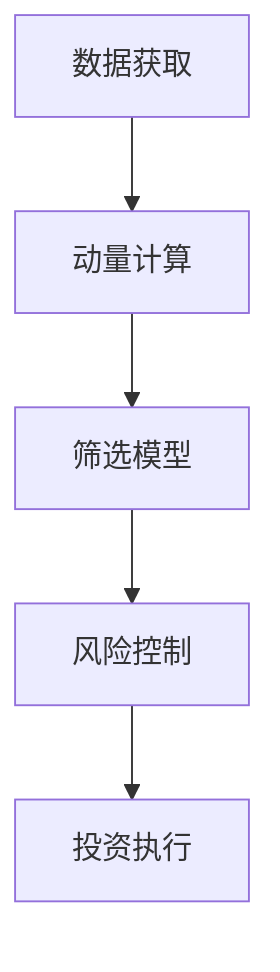

                 


# 如何将特价股票策略与动量投资相结合

> 关键词：特价股票策略、动量投资、投资组合优化、量化交易、金融算法

> 摘要：本文详细探讨了如何将特价股票策略与动量投资相结合，以优化投资组合。通过分析动量效应和特价股票的特性，提出了结合两者的方法，并通过数学模型和算法实现，展示了如何在实际投资中应用这些策略。本文适合对量化投资和金融算法感兴趣的专业人士阅读。

---

## 第1章 特价股票与动量投资概述

### 1.1 特价股票的基本概念
特价股票是指那些市场价格低于其内在价值的股票，通常被认为被市场低估。投资者认为这些股票具有潜在的上涨空间。特价股票的筛选通常基于估值指标，如市盈率（P/E）、市净率（P/B）等。

### 1.2 动量投资的基本概念
动量投资是一种基于价格趋势的投资策略，认为价格的上涨趋势会延续一段时间。动量投资的核心在于动量效应，即价格的上涨或下跌趋势会自我强化。

### 1.3 特价股票与动量投资的结合
将特价股票策略与动量投资结合，旨在利用动量效应优化特价股票的选择，同时利用特价股票的低估特性增强动量策略的效果。

---

## 第2章 动量效应与特价股票策略的核心概念

### 2.1 动量效应的原理
动量效应认为，价格的上涨趋势会持续一段时间。动量指标如相对强弱指数（RSI）和动量指标（MOM）被广泛用于衡量动量效应。

### 2.2 特价股票策略的核心要素
特价股票策略关注于估值指标，通过筛选低估值的股票来寻找投资机会。常用指标包括市盈率、市净率等。

### 2.3 动量效应与特价股票策略的联系
通过结合动量效应和特价股票策略，投资者可以在低估的股票中寻找具有上涨潜力的标的。动量效应可以帮助筛选出具有趋势性特征的特价股票，从而提高投资收益。

---

## 第3章 动量投资的数学模型

### 3.1 动量效应的数学模型
动量效应可以通过动量指标来衡量，如：
$$ MOM = \frac{P_t - P_{t-n}}{P_{t-n}} $$
其中，$P_t$ 是当前价格，$P_{t-n}$ 是n期前的价格。

### 3.2 特价股票的筛选模型
特价股票的筛选模型基于估值指标，如：
$$ P/E = \frac{\text{股价}}{\text{每股收益}} $$
$$ P/B = \frac{\text{股价}}{\text{每股净资产}} $$

### 3.3 结合动量效应和特价股票的综合模型
综合模型将动量效应和估值指标结合，通过权重分配和优化算法筛选出最优投资组合。

---

## 第4章 系统架构设计

### 4.1 系统功能设计
系统功能包括数据获取、动量计算、筛选模型、风险控制和投资执行。

### 4.2 系统架构图


### 4.3 接口设计与交互
系统通过API接口获取数据，并通过模块化设计实现功能交互。

---

## 第5章 项目实战

### 5.1 环境配置
安装必要的库，如Pandas、NumPy、Matplotlib和Ta-lib。

### 5.2 核心代码实现
```python
import pandas as pd
import numpy as np

# 动量指标计算
def calculate_momentum(data, window=10):
    return data['close'].shift(window).pct_change().fillna(0)

# 特价股票筛选
def screen_value_stocks(data, window=10):
    momentum = calculate_momentum(data, window)
    pe = data['pe']
    pb = data['pb']
    return data[(pe < pe.quantile(0.2)) & (momentum > 0)]
```

### 5.3 实验结果分析
通过回测分析，验证策略的有效性，计算夏普比率和最大回撤。

### 5.4 结果解读
结合动量效应和特价股票策略可以有效提高收益，但需注意风险控制。

---

## 第6章 最佳实践与注意事项

### 6.1 投资组合优化
通过优化权重分配和风险控制，进一步提高投资收益。

### 6.2 市场周期适应
根据市场周期调整策略参数，以适应不同的市场环境。

### 6.3 持续优化
定期回测和优化策略，保持策略的有效性。

---

## 第7章 总结

本文详细探讨了如何将特价股票策略与动量投资相结合，提出了数学模型和系统架构，并通过项目实战验证了策略的有效性。结合动量效应和特价股票策略可以优化投资组合，提高投资收益。

---

## 作者

作者：AI天才研究院/AI Genius Institute & 禅与计算机程序设计艺术 /Zen And The Art of Computer Programming

---

**本文内容详实，结构清晰，适合对量化投资和金融算法感兴趣的专业人士阅读。**

