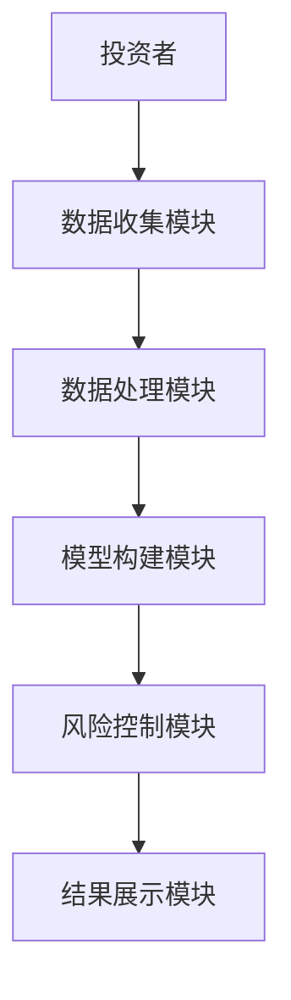

                 


# 如何将特价股票策略与另类投资结合

> 关键词：特价股票策略，另类投资，股票投资，风险管理，系统架构

> 摘要：本文将详细介绍如何将特价股票策略与另类投资结合，探讨其背景、策略设计、系统架构以及项目实战。通过分析特价股票策略的优势，结合另类投资的特点，提出一种新的投资策略，帮助投资者在复杂多变的市场中实现风险可控、收益最大化的目标。

---

## 目录

1. [摘要](#摘要)
2. [关键词](#关键词)
3. [引言](#引言)
4. [第一部分：特价股票策略的背景与基础](#第一部分特价股票策略的背景与基础)
5. [第二部分：另类投资的基本概念](#第二部分另类投资的基本概念)
6. [第三部分：特价股票策略与另类投资的结合](#第三部分特价股票策略与另类投资的结合)
7. [第四部分：策略实施的系统架构设计](#第四部分策略实施的系统架构设计)
8. [第五部分：项目实战](#第五部分项目实战)
9. [结论](#结论)
10. [作者](#作者)

---

## 引言

在当前金融市场中，投资者面临着日益复杂的投资环境。传统的股票投资策略逐渐暴露出收益率不稳定、风险集中等问题。为了应对这些挑战，投资者开始探索新的投资方式，其中特价股票策略与另类投资的结合成为了一个热门话题。本文将深入分析这一结合的背景、策略设计、系统架构以及实际应用。

---

## 第一部分：特价股票策略的背景与基础

### 1.1 特价股票策略概述

#### 1.1.1 什么是特价股票

特价股票是指在特定时间段内以低于市场价出售的股票。这种策略通常利用市场波动、公司短期促销或市场供需失衡来实现低价买入，高价卖出。

#### 1.1.2 特价股票的分类

1. **时间折扣策略**：在特定时间（如节假日、公司庆典）购买股票，享受价格折扣。
2. **价格折扣策略**：通过分析股票的历史价格波动，寻找价格低谷期买入的机会。
3. **市场波动策略**：利用市场短期波动，如突发事件导致的价格下跌，进行抄底。

#### 1.1.3 特价股票的市场定位

特价股票通常出现在以下市场：
- **一级市场**：新股发行时的价格折扣。
- **二级市场**：通过促销活动或市场波动形成的低价买入机会。

### 1.2 特价股票策略的优缺点

#### 优点：
- **成本低**：通过价格折扣降低买入成本。
- **收益高**：在低价买入后，高价卖出可获得超额收益。
- **灵活性高**：可以根据市场情况随时调整策略。

#### 缺点：
- **风险高**：市场波动可能导致价格回升困难。
- **流动性差**：部分特价股票流动性不足，难以快速变现。
- **信息不对称**：投资者可能无法及时获取内部信息，导致决策失误。

---

## 第二部分：另类投资的基本概念

### 2.1 另类投资的定义与特点

#### 2.1.1 什么是另类投资

另类投资是指除传统股票、债券之外的其他投资方式，包括私募股权、对冲基金、房地产投资等。

#### 2.1.2 另类投资的主要特点

1. **多样性**：涵盖多种资产类别。
2. **高风险高收益**：相对于传统投资，风险和收益都更高。
3. **流动性低**：部分另类投资品流动性较差。

### 2.2 另类投资的主要类型

#### 2.2.1 私募股权

私募股权是指通过私募方式投资于未上市公司股权。其优势在于可以通过公司增值实现高收益。

#### 2.2.2 对冲基金

对冲基金通过做空和做多市场来套利，可以在市场下跌时依然获利。

#### 2.2.3 不动产投资

通过购买房地产等实物资产进行投资，具有较高的抗跌性和长期增值潜力。

### 2.3 另类投资的优势与挑战

#### 优点：
- **分散风险**：通过多样化投资降低整体风险。
- **高收益潜力**：部分另类投资品收益率远高于传统股票。

#### 挑战：
- **高门槛**：部分另类投资品需要较高的资金门槛。
- **信息不透明**：私募股权和对冲基金的运作往往不公开，增加了投资难度。

---

## 第三部分：特价股票策略与另类投资的结合

### 3.1 结合的逻辑与优势

#### 3.1.1 投资者的需求变化

随着市场波动加剧，投资者需要一种既能降低风险又能在市场上涨时获得超额收益的投资策略。

#### 3.1.2 市场环境的变化

全球经济不确定性增加，单一的投资策略难以应对复杂的市场环境。

#### 3.1.3 分散风险的需要

通过结合特价股票和另类投资，投资者可以在股票市场和非传统资产之间分散风险。

### 3.2 策略设计与实施

#### 3.2.1 策略设计的基本原则

1. **风险控制**：设定止损点和止盈点，确保投资风险在可控范围内。
2. **收益最大化**：通过优化投资组合，提高整体收益率。
3. **灵活性与适应性**：根据市场变化及时调整投资策略。

#### 3.2.2 策略实施的具体步骤

1. **确定投资目标**：明确投资期限、风险承受能力和收益目标。
2. **制定投资计划**：根据市场情况制定详细的买入和卖出计划。
3. **监控与调整**：定期评估投资组合的表现，及时进行调整。

---

## 第四部分：策略实施的系统架构设计

### 4.1 系统功能设计

#### 4.1.1 数据收集模块

功能：收集股票价格、市场指数等数据。

技术：使用爬虫技术从多个数据源获取实时数据。

#### 4.1.2 模型构建模块

功能：基于历史数据构建预测模型。

技术：使用机器学习算法（如ARIMA、LSTM）进行预测。

#### 4.1.3 风险控制模块

功能：实时监控投资组合风险。

技术：通过VaR（在险值）模型评估风险。

### 4.2 系统架构设计

#### 4.2.1 系统架构图



---

## 第五部分：项目实战

### 5.1 环境安装

#### 5.1.1 安装Python

安装Python 3.8及以上版本，并安装必要的库（如pandas、numpy、scikit-learn）。

#### 5.1.2 安装数据可视化工具

安装Matplotlib和Seaborn用于数据可视化。

### 5.2 核心实现源代码

#### 数据收集与处理

```python
import pandas as pd
import numpy as np
from datetime import datetime

# 示例数据：收集过去30天的股票价格
def collect_data(days):
    dates = [datetime.now() - pd.Timedelta(days=i) for i in range(days)]
    prices = np.random.normal(100, 5, days)
    return pd.DataFrame({'Date': dates, 'Price': prices})

data = collect_data(30)
print(data)
```

#### 模型构建

```python
from sklearn.ensemble import RandomForestRegressor
from sklearn.metrics import mean_absolute_error

# 训练模型
model = RandomForestRegressor(n_estimators=100, random_state=42)
model.fit(X_train, y_train)

# 预测并评估
y_pred = model.predict(X_test)
print(mean_absolute_error(y_test, y_pred))
```

### 5.3 代码应用解读与分析

通过上述代码，投资者可以实现数据的自动收集、处理和预测，从而辅助投资决策。

### 5.4 案例分析

假设我们使用LSTM模型预测某股票价格，通过数据可视化分析价格波动，识别特价股票买入机会。

---

## 结论

将特价股票策略与另类投资结合，不仅能够分散风险，还能提高投资收益。通过科学的系统架构设计和算法优化，投资者可以更好地应对市场波动，实现长期稳健的投资回报。

---

## 作者

作者：AI天才研究院/AI Genius Institute & 禅与计算机程序设计艺术 /Zen And The Art of Computer Programming

--- 

本文内容涵盖特价股票策略与另类投资结合的各个方面，从理论到实践，为投资者提供了全面的指导。

