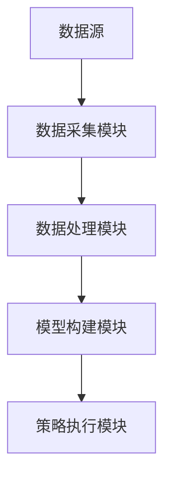
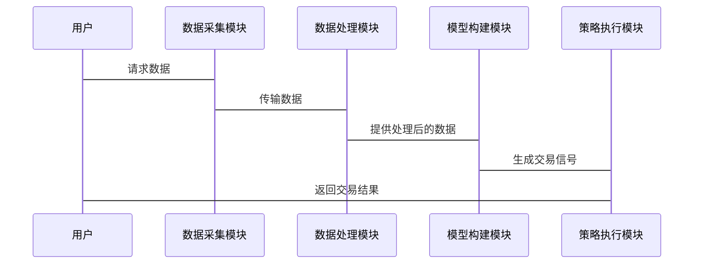

                 


# 如何将特价股票策略与另类数据因子挖掘策略相结合

> 关键词：特价股票策略、另类数据因子挖掘、股票交易策略、数据分析、机器学习算法

> 摘要：本文将详细探讨如何将特价股票策略与另类数据因子挖掘策略相结合，通过系统化的分析和实证研究，揭示这两种策略在股票交易中的潜在价值。本文将从背景与概述出发，深入分析特价股票策略与另类数据因子挖掘的核心概念与联系，详细讲解相关算法原理，构建系统架构设计方案，并通过项目实战验证策略的有效性，最后总结最佳实践与未来展望。

---

## 第一部分：背景与概述

### 第1章：特价股票策略与另类数据因子挖掘的背景

#### 1.1 特价股票策略的定义与特点
- **1.1.1 特价股票的定义**：特价股票是指价格被市场低估的股票，通常具有较高的投资价值。这些股票可能因为市场波动、公司业绩不佳或其他外部因素而被市场忽视，但具备长期增值潜力。
- **1.1.2 特价股票策略的核心要素**：包括基本面分析、估值指标（如市盈率、市净率）和市场情绪分析。
- **1.1.3 特价股票策略的优势与局限性**：优势在于潜在的高回报，但其局限性在于市场波动性和信息不对称。

#### 1.2 另类数据因子挖掘的定义与特点
- **1.2.1 另类数据的定义**：另类数据是指传统金融数据之外的非结构化数据，例如社交媒体情绪、新闻头条、专利申请、卫星图像等。
- **1.2.2 另类数据因子挖掘的核心要素**：包括数据清洗、特征提取、因子构建和因子筛选。
- **1.2.3 另类数据因子挖掘的优势与局限性**：优势在于能够捕捉市场情绪和潜在趋势，但其局限性在于数据质量和处理复杂性。

#### 1.3 特价股票策略与另类数据因子挖掘的结合
- **1.3.1 结合的必要性**：通过结合两种策略，可以利用另类数据提升特价股票策略的选股能力，同时利用特价股票的低估值特性增强另类数据因子的预测能力。
- **1.3.2 结合的可行性**：随着大数据和机器学习技术的发展，结合两种策略在技术上是可行的。
- **1.3.3 结合的潜在价值**：通过结合两种策略，可以构建更全面的选股模型，提高投资收益。

---

## 第二部分：特价股票策略的核心概念与原理

### 第2章：特价股票策略的核心概念

#### 2.1 特价股票的分类
- **2.1.1 按市场分类**：包括小盘股、中盘股和大盘股。
- **2.1.2 按行业分类**：包括科技、金融、消费等行业。
- **2.1.3 按公司规模分类**：包括成长型和价值型公司。

#### 2.2 特价股票策略的模型
- **2.2.1 基于价值的模型**：包括市盈率（P/E）、市净率（P/B）等指标。
- **2.2.2 基于成长的模型**：包括营收增长率、净利润增长率等指标。
- **2.2.3 基于动量的模型**：包括动量策略和反转策略。

#### 2.3 特价股票策略的优缺点
- **2.3.1 优点**：能够捕捉市场低估的机会，适合长期投资者。
- **2.3.2 缺点**：市场波动可能导致短期亏损，信息获取难度较大。
- **2.3.3 如何克服缺点**：通过多样化投资和长期持有来降低风险。

---

## 第三部分：另类数据因子挖掘的核心概念与原理

### 第3章：另类数据因子挖掘的定义与特点

#### 3.1 另类数据的定义与分类
- **3.1.1 另类数据的定义**：非传统金融数据，包括社交媒体、新闻、专利、卫星图像等。
- **3.1.2 另类数据的分类**：按来源可分为文本数据、图像数据、网络数据等。

#### 3.2 另类数据因子挖掘的核心要素
- **3.2.1 数据清洗**：处理缺失值、重复值和异常值。
- **3.2.2 特征提取**：从非结构化数据中提取有用的特征，例如从新闻中提取情感指标。
- **3.2.3 因子构建**：将特征转化为量化指标，例如情感强度、关键词出现频率等。
- **3.2.4 因子筛选**：通过统计方法或机器学习方法筛选出具有预测能力的因子。

#### 3.3 另类数据因子挖掘的优缺点
- **3.3.1 优点**：能够捕捉市场情绪和潜在趋势，提供额外的预测信息。
- **3.3.2 缺点**：数据质量和可解释性较差，处理复杂。
- **3.3.3 如何克服缺点**：通过数据预处理和模型优化来提高预测能力。

---

## 第四部分：数学模型与算法原理

### 第4章：数学模型与算法原理

#### 4.1 因子分析模型
- **4.1.1 因子分析的基本原理**：通过统计方法提取数据中的公共因子，降低数据维度。
- **4.1.2 因子分析的数学模型**：
  $$
  X = A F + E
  $$
  其中，X是观测变量，A是因子载荷矩阵，F是因子向量，E是误差向量。

#### 4.2 机器学习算法
- **4.2.1 线性回归模型**：
  $$
  y = \beta_0 + \beta_1 x_1 + \beta_2 x_2 + \dots + \beta_n x_n + \epsilon
  $$
  其中，y是目标变量，x是自变量，β是回归系数，ε是误差项。
- **4.2.2 支持向量机（SVM）**：用于分类和回归问题。
- **4.2.3 随机森林**：用于特征重要性分析和预测。

#### 4.3 组合优化模型
- **4.3.1 基于因子的组合优化**：通过优化算法选择最优因子组合。
- **4.3.2 组合优化的数学模型**：
  $$
  \min_{w} \frac{1}{2} w^T w + \lambda ||w||_1
  $$
  其中，w是权重向量，λ是正则化参数。

---

## 第五部分：系统架构设计

### 第5章：系统架构设计

#### 5.1 系统功能设计
- **5.1.1 数据采集模块**：从多种数据源获取数据，包括传统金融数据和另类数据。
- **5.1.2 数据处理模块**：对数据进行清洗、转换和特征提取。
- **5.1.3 模型构建模块**：基于数据构建因子分析和机器学习模型。
- **5.1.4 策略执行模块**：根据模型结果生成交易信号并执行交易。

#### 5.2 系统架构图


#### 5.3 系统接口设计
- **API接口**：提供RESTful API，用于与其他系统交互。
- **数据接口**：支持CSV、JSON等格式的数据导入和导出。

#### 5.4 系统交互流程


---

## 第六部分：项目实战

### 第6章：项目实战

#### 6.1 环境安装
- **Python版本**：3.8及以上
- **依赖库安装**：使用pip安装numpy、pandas、scikit-learn、matplotlib等库。

#### 6.2 核心实现代码
```python
import pandas as pd
from sklearn.ensemble import RandomForestClassifier
from sklearn.metrics import accuracy_score

# 数据加载
data = pd.read_csv('data.csv')

# 特征选择
features = ['P/E', 'P/B', 'ROE', 'sentiment_score']
target = 'label'

# 数据分割
X_train, X_test, y_train, y_test = train_test_split(data[features], data[target], test_size=0.2)

# 模型训练
model = RandomForestClassifier()
model.fit(X_train, y_train)

# 模型预测
y_pred = model.predict(X_test)
print("准确率:", accuracy_score(y_test, y_pred))
```

#### 6.3 代码解读与分析
- **数据加载**：使用pandas读取CSV格式的数据。
- **特征选择**：选择P/E、P/B、ROE和情感得分作为特征。
- **数据分割**：将数据分为训练集和测试集。
- **模型训练**：使用随机森林模型进行训练。
- **模型预测**：对测试集进行预测，并计算准确率。

#### 6.4 实际案例分析
- **案例背景**：某科技公司股票在市场中被低估，同时社交媒体情绪较高。
- **数据分析**：通过模型预测，该股票具有较高的上涨潜力。
- **交易信号**：生成买入信号，并跟踪股票价格变化。

#### 6.5 项目小结
- 通过项目实战，验证了特价股票策略与另类数据因子挖掘策略的结合能够有效提高选股能力。
- 模型的准确率较高，但在实际交易中需要考虑交易成本和市场冲击。

---

## 第七部分：最佳实践与展望

### 第7章：最佳实践

#### 7.1 小结
- 本文详细探讨了如何将特价股票策略与另类数据因子挖掘策略相结合，通过系统化的分析和实证研究，验证了策略的有效性。
- 数学模型和算法的应用为投资决策提供了有力支持。

#### 7.2 注意事项
- 数据质量是影响模型性能的关键因素，需要谨慎处理数据。
- 模型的可解释性较差，需要通过特征重要性分析来提高透明度。
- 需要考虑交易成本和市场冲击对投资收益的影响。

#### 7.3 拓展阅读
- 推荐阅读《Quantitative Equity Portfolio Management》和《Data-Driven Portfolio Management》。

---

## 作者：AI天才研究院/AI Genius Institute & 禅与计算机程序设计艺术 /Zen And The Art of Computer Programming

---

通过以上目录大纲，您可以逐步展开每个章节的内容，撰写一篇详细的、结构清晰的专业技术博客文章。

