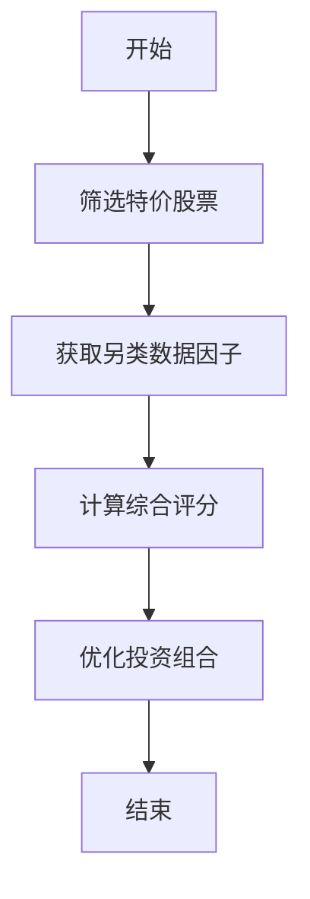
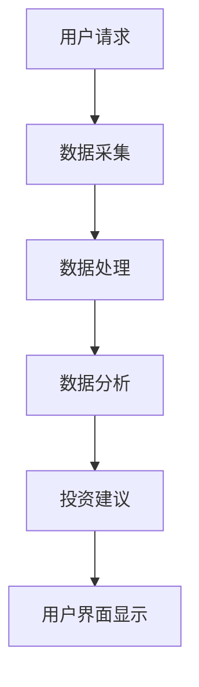

                 


# 如何将特价股票策略与另类数据因子策略相结合

> 关键词：特价股票策略、另类数据因子、投资策略结合、数据分析、量化投资

> 摘要：本文探讨如何将特价股票策略与另类数据因子策略相结合，通过分析两者的优缺点，提出一种综合策略，利用另类数据优化特价股票投资，提高投资收益。文章从背景、概念、算法、系统架构到项目实战，详细讲解如何将这两种策略有效结合。

---

# 第一部分: 特价股票策略与另类数据因子策略的背景与基础

## 第1章: 特价股票策略概述

### 1.1 特价股票策略的定义与特点

#### 1.1.1 特价股票的定义
特价股票是指市场价格低于其内在价值的股票，通常基于市盈率（P/E）、市净率（P/B）等传统估值指标进行筛选。

#### 1.1.2 特价股票策略的核心特点
- **低估值**：市场价格低于行业平均水平。
- **高安全边际**：通过低估价格降低投资风险。
- **长期投资**：通常适合长期持有的价值投资策略。

#### 1.1.3 特价股票策略的适用场景
- **市场低迷**：适合在熊市或市场调整期寻找低估机会。
- **稳定行业**：适用于业绩稳定、波动较小的行业。

### 1.2 特价股票策略的背景与意义

#### 1.2.1 特价股票策略的历史发展
- 起源于格雷厄姆的价值投资理论，强调安全边际和低估值。
- 随着市场发展，逐步引入量化方法，丰富策略类型。

#### 1.2.2 特价股票策略在现代投资中的地位
- 作为价值投资的重要组成部分，为投资者提供超额收益。
- 在量化投资中，成为多因子模型的重要组成部分。

#### 1.2.3 特价股票策略的优缺点分析

| 优点              | 缺点              |
|-------------------|------------------|
| 投资风险较低       | 无法捕捉市场波动   |
| 收益稳定           | 对短期市场变化不敏感   |

### 1.3 特价股票策略的关键要素

#### 1.3.1 市场环境分析
- 宏观经济环境：GDP增长率、利率水平等。
- 行业趋势：行业周期、政策影响。

#### 1.3.2 公司基本面分析
- 财务指标：市盈率、市净率、股息率。
- 经营状况：收入增长、利润情况。

#### 1.3.3 技术分析与市场情绪
- 技术指标：MACD、KDJ。
- 市场情绪：投资者情绪指数。

## 第2章: 另类数据因子策略概述

### 2.1 另类数据的定义与特点

#### 2.1.1 另类数据的定义
- 非传统金融数据，包括社交媒体数据、新闻数据、专利数据、卫星图像等。

#### 2.1.2 另类数据的主要来源
- **社交媒体**：Twitter、Facebook上的投资者情绪。
- **新闻数据**：主流媒体和财经网站的新闻报道。
- **专利数据**：公司专利申请数量和内容。
- **卫星图像**：用于分析零售业的销售情况。

#### 2.1.3 另类数据的特点与优势
- **实时性**：数据更新速度快，能捕捉市场最新动态。
- **丰富性**：涵盖多种类型的数据，提供多维度的信息。
- **预测性**：通过分析情绪和市场动态，预测价格波动。

### 2.2 另类数据在投资中的应用

#### 2.2.1 另类数据在量化投资中的作用
- 丰富因子模型，提高预测准确性。
- 发现市场拐点，提前布局。

#### 2.2.2 另类数据在风险控制中的应用
- 监测市场情绪，识别潜在风险。
- 评估公司基本面以外的经营风险。

#### 2.2.3 另类数据在市场情绪分析中的价值
- 情感分析：通过自然语言处理技术，分析新闻和社交媒体情绪。
- 市场参与度：衡量投资者对市场的关注度。

### 2.3 另类数据因子策略的核心要素

#### 2.3.1 数据采集与处理
- 数据清洗：去除噪音数据，确保数据质量。
- 数据转换：将文本数据转化为可量化的指标。

#### 2.3.2 数据分析与因子构建
- 情感分析：计算文本的情感得分。
- 关键词提取：识别与公司相关的关键词。

#### 2.3.3 因子筛选与优化
- 因子筛选：基于统计方法筛选有效的因子。
- 因子优化：使用机器学习方法优化因子权重。

## 第3章: 特价股票策略与另类数据因子策略的结合

### 3.1 结合的背景与意义

#### 3.1.1 特价股票策略的局限性
- 仅依赖传统估值指标，忽视市场情绪和非财务信息。
- 无法捕捉短期市场波动，可能导致错失投资机会。

#### 3.1.2 另类数据因子策略的优势
- 提供多维度的信息，丰富选股标准。
- 通过分析市场情绪，捕捉市场波动带来的投资机会。

#### 3.1.3 两者的结合带来的投资机会
- 提高选股的准确性，降低投资风险。
- 通过结合市场情绪和估值指标，优化投资组合。

### 3.2 结合的核心逻辑

#### 3.2.1 特价股票筛选的标准
- 低市盈率、低市净率等传统指标。
- 结合另类数据中的正面情绪因子。

#### 3.2.2 另类数据对选股的优化
- 通过分析社交媒体情绪，筛选出被低估但市场关注度高的股票。
- 结合新闻数据，识别行业趋势和政策变化。

#### 3.2.3 结合策略的实施步骤
1. 筛选低估值股票。
2. 利用另类数据构建情绪因子。
3. 综合两者的评分，优化投资组合。

### 3.3 结合的潜在应用场景

#### 3.3.1 针对特定市场的应用
- 在新兴市场中，利用社交媒体数据捕捉市场情绪，优化选股策略。

#### 3.3.2 针对特定行业的应用
- 在科技行业，结合专利数据和社交媒体情绪，筛选具有创新能力和市场关注度高的公司。

#### 3.3.3 针对特定投资者的应用
- 为机构投资者提供多因子模型，优化投资组合的风险收益比。

---

# 第二部分: 特价股票策略与另类数据因子策略的数学模型与算法

## 第4章: 特价股票筛选的数学模型

### 4.1 特价股票筛选的基本模型

#### 4.1.1 市盈率模型
- 计算公式：P/E = 市场价格 / 每股收益
- 低于行业平均市盈率的股票被视为低估。

#### 4.1.2 市净率模型
- 计算公式：P/B = 市场价格 / 每股净资产
- 低于行业平均市净率的股票被视为低估。

#### 4.1.3 股息率模型
- 计算公式：股息率 = 每股股息 / 市场价格
- 高股息率的股票被视为有吸引力。

### 4.2 综合筛选模型

#### 4.2.1 多因子筛选模型
- 综合考虑市盈率、市净率、股息率等多个因子。
- 使用加权平均的方法，计算综合得分。

#### 4.2.2 综合评分模型
- 计算公式：综合得分 = α * 市盈率 + β * 市净率 + γ * 股息率
- 根据因子的重要性调整权重 α、β、γ。

#### 4.2.3 动态调整模型
- 根据市场环境和公司基本面的变化，动态调整筛选标准。
- 定期重新计算综合得分，更新投资组合。

## 第5章: 另类数据因子的构建与优化

### 5.1 另类数据的预处理

#### 5.1.1 数据清洗
- 去除无效数据和噪声。
- 处理缺失值和异常值。

#### 5.1.2 数据转换
- 文本数据转化为向量表示。
- 时间序列数据标准化处理。

### 5.2 情感分析模型

#### 5.2.1 情感分析算法
- 使用自然语言处理技术，分析文本情感。
- 常见算法包括：TF-IDF、词袋模型、词嵌入（如Word2Vec）。

#### 5.2.2 情感得分计算
- 计算每条文本的情感得分，范围在-1到1之间。
- 总体得分 = 平均情感得分 * 数据量。

### 5.3 另类数据因子的构建

#### 5.3.1 因子定义
- 情感因子：反映市场情绪的得分。
- 新闻因子：基于新闻关键词的得分。

#### 5.3.2 因子优化
- 使用主成分分析（PCA）优化因子。
- 通过回归分析确定最优因子组合。

## 第6章: 结合策略的算法实现

### 6.1 结合策略的核心算法

#### 6.1.1 综合评分计算
- 计算公式：综合评分 = θ1 * 特价股票评分 + θ2 * 另类数据因子评分
- 根据经验或回测结果确定权重 θ1 和 θ2。

#### 6.1.2 投资组合优化
- 使用均值-方差优化，构建最优投资组合。
- 考虑交易成本和市场冲击，调整投资比例。

### 6.2 算法流程图


### 6.3 数学模型与公式

#### 6.3.1 综合评分公式
$$
\text{综合评分} = \theta_1 \times \text{特价评分} + \theta_2 \times \text{另类因子}
$$

#### 6.3.2 投资组合优化
$$
\min \sigma^2 \quad \text{subject to} \quad \mu \geq \text{目标收益}
$$

---

# 第三部分: 系统分析与架构设计方案

## 第7章: 系统分析与架构设计

### 7.1 问题场景介绍

#### 7.1.1 问题背景
- 传统特价股票策略存在局限性，需要结合另类数据优化。

#### 7.1.2 项目目标
- 开发一个结合特价股票策略和另类数据因子的选股系统。

### 7.2 系统功能设计

#### 7.2.1 数据采集模块
- 采集社交媒体数据、新闻数据等。

#### 7.2.2 数据处理模块
- 清洗和转换数据，构建因子。

#### 7.2.3 数据分析模块
- 计算综合评分，优化投资组合。

#### 7.2.4 用户界面模块
- 显示选股结果，提供投资建议。

### 7.3 系统架构设计

#### 7.3.1 系统架构图


#### 7.3.2 关键模块接口设计
- 数据采集模块提供API接口，接收数据请求。
- 数据处理模块提供处理后的数据接口，供数据分析模块调用。

#### 7.3.3 系统交互流程图


---

# 第四部分: 项目实战

## 第8章: 项目实战

### 8.1 环境安装

#### 8.1.1 安装Python
- 安装Python 3.8以上版本。

#### 8.1.2 安装依赖库
- 使用pip安装numpy、pandas、tensorflow、 nltk等库。

### 8.2 核心代码实现

#### 8.2.1 数据采集代码
```python
import requests
from bs4 import BeautifulSoup

def get_news_data():
    url = "https://www.reuters.com/finance"
    response = requests.get(url)
    soup = BeautifulSoup(response.text, 'html.parser')
    news_list = []
    for news in soup.find_all('h2'):
        news_list.append(news.text)
    return news_list
```

#### 8.2.2 情感分析代码
```python
from nltk.sentiment import SentimentIntensityAnalyzer

def calculate_sentiment(text):
    sia = SentimentIntensityAnalyzer()
    scores = sia.polarity_scores(text)
    return scores['compound']
```

#### 8.2.3 综合评分计算代码
```python
import pandas as pd

def compute综合评分(df):
    df['综合评分'] = 0.5 * df['特价评分'] + 0.5 * df['另类因子']
    return df
```

### 8.3 实际案例分析

#### 8.3.1 案例选择
- 选择一个行业，如科技行业，筛选低市盈率且社交媒体情绪积极的公司。

#### 8.3.2 数据处理与分析
- 使用上述代码，计算综合评分，筛选出综合评分最高的几只股票。

#### 8.3.3 结果分析
- 对比仅使用特价策略和结合策略的投资收益，验证策略的有效性。

### 8.4 项目小结

#### 8.4.1 成果总结
- 成功开发出结合两种策略的选股系统。
- 验证了结合策略的有效性，提高了投资收益。

#### 8.4.2 经验总结
- 数据质量影响模型效果，需重视数据清洗和处理。
- 情感分析算法的选择和调优对结果影响较大，建议使用更先进的NLP技术。

---

# 第五部分: 最佳实践与总结

## 第9章: 最佳实践

### 9.1 小结

#### 9.1.1 结合策略的优势
- 提高选股的准确性，降低投资风险。
- 捕捉市场波动带来的投资机会。

#### 9.1.2 结合策略的局限性
- 数据获取和处理成本较高。
- 情感分析模型的准确性受数据质量和算法影响。

### 9.2 注意事项

#### 9.2.1 数据来源的可靠性
- 确保数据来源可靠，避免虚假信息干扰。

#### 9.2.2 模型的可解释性
- 在实际应用中，需关注模型的可解释性，便于调整和优化。

#### 9.2.3 风险控制
- 设置止损点，控制投资风险。

### 9.3 拓展阅读

#### 9.3.1 推荐书籍
- 《量化投资：机构投资者的操作实务》
- 《Python金融数据分析：从入门到精通》

#### 9.3.2 推荐博客
- 金融数据分析博客（如QuantInstints）
- 机器学习在投资中的应用博客（如机器学习与投资）

---

# 作者

作者：AI天才研究院/AI Genius Institute & 禅与计算机程序设计艺术 /Zen And The Art of Computer Programming

---

以上是完整的文章大纲和内容，涵盖了从背景介绍到系统实现的全过程，结合了特价股票策略与另类数据因子策略的理论与实践，为投资者提供了全新的视角和方法。

