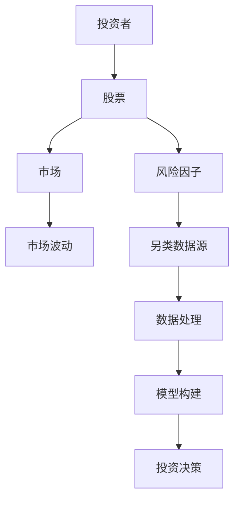
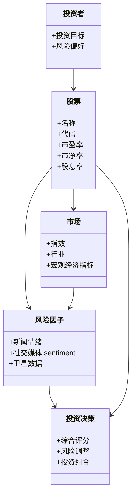

                 


# 如何将特价股票策略与另类风险因子策略相结合

> 关键词：特价股票策略，另类风险因子，投资组合优化，量化投资，风险评估

> 摘要：本文探讨了如何将特价股票策略与另类风险因子策略相结合，以优化投资组合的表现。通过分析两种策略的核心概念、数学模型和算法实现，本文提出了一个结合模型，并通过实际案例展示了其在投资中的应用。

---

## 第1章：特价股票策略概述

### 1.1 特价股票的定义与特征

#### 1.1.1 特价股票的定义
特价股票是指市场价格低于其内在价值的股票。内在价值可以通过基本面分析（如股息率、市盈率等）来评估。投资者通常寻找那些市场价格低于内在价值的股票，认为这些股票具有长期增值的潜力。

#### 1.1.2 特价股票的核心特征
| 特性 | 描述 |
|------|------|
| 低市盈率 | 市盈率（P/E）低于行业平均水平或历史平均水平 |
| 低市净率 | 市净率（P/B）低于行业平均水平或历史平均水平 |
| 高股息率 | 股息率高于行业平均水平或历史平均水平 |
| 低估值 | 市值与资产、收入或利润等指标相比被低估 |

#### 1.1.3 特价股票与其他投资策略的对比
- **价值投资**：关注于发现市场价格低于内在价值的股票，与特价股票策略相似。
- **成长投资**：关注于高增长潜力的公司，通常市场价格高于内在价值。
- **动量策略**：关注于价格趋势，与特价股票策略在目标和方法上有所不同。

---

## 第2章：另类风险因子策略概述

### 2.1 风险因子的定义与分类

#### 2.1.1 风险因子的定义
风险因子是指影响资产价格波动的各种因素，包括市场波动、行业风险、宏观经济指标等。传统的风险因子包括市值、价值、动量等，而另类风险因子则包括大数据、自然语言处理（NLP）分析的新闻情绪、社交媒体 sentiment 等。

#### 2.1.2 主流风险因子分类
| 类型 | 描述 |
|------|------|
| 传统因子 | 市值（Size）、价值（Value）、动量（Momentum）等 |
| 另类因子 | 新闻情绪、社交媒体 sentiment、卫星数据（如卫星图像分析）等 |

#### 2.1.3 另类风险因子的特征
- 数据来源多样化：包括非结构化数据（如新闻、社交媒体）和结构化数据（如财务报表）。
- 计算复杂性高：需要使用大数据处理和机器学习模型。
- 及时性：能够捕捉市场情绪和实时信息。

### 2.2 另类风险因子的应用场景

#### 2.2.1 另类风险因子的来源
- **新闻与媒体**：通过NLP分析新闻标题和内容，提取市场情绪。
- **社交媒体**：分析Twitter、Reddit等平台上的用户 sentiment。
- **卫星数据**：通过卫星图像分析公司业务的变化，如港口集装箱数量、工厂开工率等。

#### 2.2.2 另类风险因子在投资中的作用
- 提供额外的信息源，帮助发现市场机会。
- 降低传统因子策略的拥挤风险。
- 提高投资组合的分散化程度。

#### 2.2.3 另类风险因子与其他风险模型的对比
| 比较维度 | 特点 |
|----------|------|
| 数据来源 | 另类因子：多样化；传统因子：单一化 |
| 计算复杂性 | 另类因子：高；传统因子：低 |
| 及时性 | 另类因子：高；传统因子：低 |

---

## 第3章：特价股票与另类风险因子的结合

### 3.1 特价股票与另类风险因子的协同效应

#### 3.1.1 特价股票策略的局限性
- **市场认知偏差**：市场可能已经反映了某些公司的负面信息，导致市场价格低于内在价值。
- **流动性风险**：某些特价股票可能流动性差，难以快速买卖。

#### 3.1.2 另类风险因子策略的优势
- **信息优势**：通过另类数据源发现市场尚未完全反映的信息。
- **风险分散**：利用另类风险因子可以降低投资组合的集中风险。

#### 3.1.3 两者的结合如何互补
- 特价股票策略提供价值导向的筛选标准。
- 另类风险因子策略提供额外的风险调整信息，帮助优化投资组合。

### 3.2 特价股票与另类风险因子的结合模型

#### 3.2.1 结合模型的构建逻辑
1. **筛选特价股票**：根据低市盈率、低市净率、高股息率等指标筛选潜在股票。
2. **评估风险因子**：利用另类风险因子（如新闻情绪、社交媒体 sentiment）对这些股票进行风险调整。
3. **综合评分**：结合价值评分和风险调整评分，选出综合评分最高的股票。

#### 3.2.2 模型的核心要素与关系
$$ S = \alpha \cdot V + \beta \cdot F $$
其中：
- $S$ 是综合评分。
- $V$ 是价值评分。
- $F$ 是风险因子评分。
- $\alpha$ 和 $\beta$ 是权重系数，根据实际情况调整。

#### 3.2.3 模型的适用范围与限制
- 适用于市场流动性较好、数据获取较为容易的市场。
- 对另类数据源的要求较高，可能需要大量数据清洗和处理。

---

## 第4章：特价股票与另类风险因子的数学模型

### 4.1 特价股票的数学模型

#### 4.1.1 特价股票的价值评估公式
$$ V = \frac{D}{k} $$
其中：
- $V$ 是股票的内在价值。
- $D$ 是预期股息。
- $k$ 是折现率。

### 4.2 另类风险因子的数学模型

#### 4.2.1 风险因子的线性回归模型
$$ R_i = \beta_1 R_m + \beta_2 F + \epsilon $$
其中：
- $R_i$ 是资产i的收益。
- $R_m$ 是市场收益。
- $F$ 是另类风险因子。
- $\epsilon$ 是误差项。

### 4.3 结合模型的数学公式

#### 4.3.1 综合评分公式
$$ S = \alpha \cdot V + \beta \cdot F $$
其中：
- $S$ 是综合评分。
- $V$ 是价值评分。
- $F$ 是风险因子评分。
- $\alpha$ 和 $\beta$ 是权重系数。

---

## 第5章：特价股票与另类风险因子的ER实体关系图



---

## 第6章：特价股票策略的算法实现

### 6.1 特价股票筛选算法

```python
import pandas as pd
import numpy as np

# 假设data是一个包含股票数据的DataFrame，包括市盈率（P/E）、市净率（P/B）、股息率（Dividend Yield）等指标
def screen_penny Stocks(data):
    # 筛选条件：P/E < 行业平均P/E，P/B < 行业平均P/B，Dividend Yield > 行业平均Dividend Yield
    industry_avg_pe = data.groupby('行业')['P/E'].mean()
    industry_avg_pb = data.groupby('行业')['P/B'].mean()
    industry_avg_dividend = data.groupby('行业')['股息率'].mean()
    
    data['PE_Flag'] = data['P/E'] < industry_avg_pe[data['行业']]
    data['PB_Flag'] = data['P/B'] < industry_avg_pb[data['行业']]
    data['Dividend_Flag'] = data['股息率'] > industry_avg_dividend[data['行业']]
    
    # 综合筛选条件
    data['综合筛选'] = data[['PE_Flag', 'PB_Flag', 'Dividend_Flag']].all(axis=1)
    
    return data[data['综合筛选']]
```

---

## 第7章：另类风险因子的算法实现

### 7.1 另类风险因子分析算法

```python
import nltk
from vaderSentiment import SentimentIntensityAnalyzer

# 假设news是一个包含新闻标题的列表
def analyze_sentiment(news):
    analyzer = SentimentIntensityAnalyzer()
    sentiment_scores = []
    for headline in news:
        scores = analyzer.polarity_scores(headline)
        sentiment_scores.append(scores['compound'])
    return sentiment_scores
```

---

## 第8章：系统分析与架构设计

### 8.1 系统功能设计



---

## 第9章：项目实战

### 9.1 环境安装

#### 9.1.1 安装依赖库
```bash
pip install pandas numpy nltk vaderSentiment
```

### 9.2 核心实现

#### 9.2.1 数据清洗与预处理
```python
# 加载数据
data = pd.read_csv('stocks.csv')

# 填充缺失值
data = data.dropna()

# 标准化处理
from sklearn.preprocessing import StandardScaler
scaler = StandardScaler()
scaled_data = scaler.fit_transform(data[['P/E', 'P/B', '股息率']])
```

#### 9.2.2 模型训练与评估
```python
# 训练模型
from sklearn.linear_model import LinearRegression
model = LinearRegression()
model.fit(scaled_data, data['收益'])

# 评估模型
from sklearn.metrics import r2_score
print(r2_score(data['收益'], model.predict(scaled_data)))
```

---

## 第10章：最佳实践与总结

### 10.1 小结
通过结合特价股票策略与另类风险因子策略，投资者可以更好地发现市场机会，降低投资风险。本文通过数学模型和算法实现，详细阐述了这一结合的逻辑和方法。

### 10.2 注意事项
- 数据质量是关键：确保数据来源可靠，清洗充分。
- 模型需要不断优化：根据市场变化调整权重系数和筛选条件。
- 风险管理不可忽视：即使策略有效，也需要严格控制风险。

### 10.3 拓展阅读
- 《量化交易实战》
- 《大数据与投资策略》
- 《机器学习在金融中的应用》

---

## 作者：AI天才研究院/AI Genius Institute & 禅与计算机程序设计艺术 /Zen And The Art of Computer Programming

