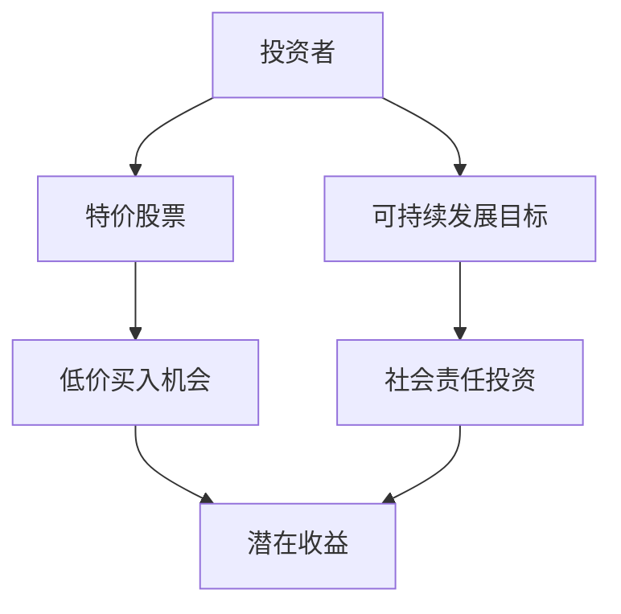
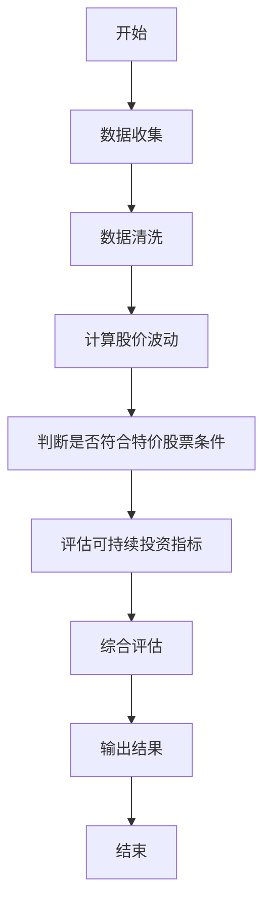
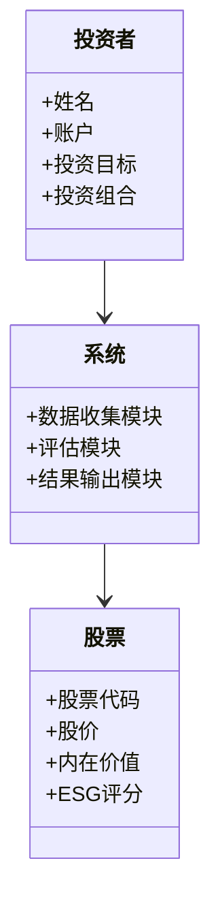
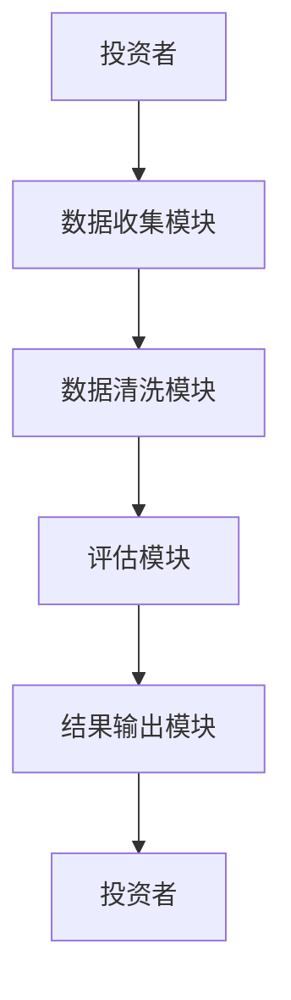
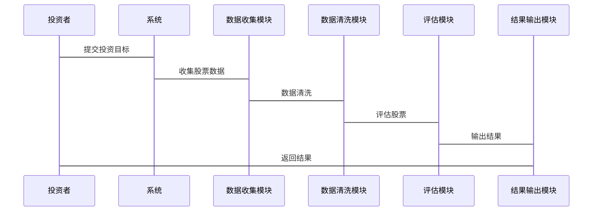

                 


# 如何将特价股票策略与可持续发展目标投资结合

> 关键词：特价股票，可持续投资，股票策略，投资结合，算法设计

> 摘要：本文详细探讨如何将特价股票策略与可持续发展目标投资结合，通过背景介绍、核心概念、算法原理、系统架构、项目实战等多方面展开，提供从理论到实践的全面指导。

---

# 第一部分: 特价股票策略与可持续发展目标投资结合的背景与概念

# 第1章: 特价股票策略与可持续投资的背景介绍

## 1.1 特价股票策略的定义与特点
### 1.1.1 特价股票的定义
特价股票是指市场价格低于其内在价值的股票，通常被认为存在被市场低估的机会。

### 1.1.2 特价股票的核心特点
- **低估值**：市场价格低于内在价值。
- **波动性**：价格波动较大，存在短期波动风险。
- **潜在收益**：长期来看，存在较高的收益潜力。

### 1.1.3 特价股票与传统投资的区别
- **传统投资**：注重长期稳定收益，风险较低。
- **特价股票策略**：注重短期价格波动，风险较高。

## 1.2 可持续发展目标投资的定义与特点
### 1.2.1 可持续投资的定义
可持续投资是指在追求财务回报的同时，考虑环境、社会和公司治理（ESG）因素的投资方式。

### 1.2.2 可持续投资的核心要素
- **环境（E）**：关注企业的环保表现。
- **社会（S）**：关注企业的社会责任。
- **治理（G）**：关注企业的公司治理结构。

### 1.2.3 可持续投资与传统投资的对比
- **传统投资**：注重财务回报，忽视社会和环境因素。
- **可持续投资**：注重财务回报的同时，关注企业的社会和环境责任。

## 1.3 特价股票策略与可持续投资的结合动机
### 1.3.1 特价股票的潜在收益
通过低价买入，高价卖出，获得超额收益。

### 1.3.2 可持续投资的社会价值
通过投资于具有社会责任的企业，推动社会可持续发展。

### 1.3.3 两者的结合优势
- **收益与价值的双重目标**：在追求收益的同时，推动社会可持续发展。
- **风险分散**：通过结合不同类型的股票，降低投资风险。

## 1.4 本章小结
本章介绍了特价股票和可持续投资的基本概念和特点，并探讨了两者结合的动机和优势。

---

# 第2章: 特价股票策略与可持续投资的核心概念与联系

## 2.1 核心概念的定义与属性对比
### 2.1.1 特价股票的核心概念
- **内在价值**：股票的真正价值，与市场价格相比。
- **低估**：市场价格低于内在价值。

### 2.1.2 可持续投资的核心概念
- **ESG因素**：环境、社会和公司治理因素。
- **社会价值**：投资于具有社会责任的企业。

### 2.1.3 两者概念的对比分析
| 特价股票 | 可持续投资 |
|----------|------------|
| 价格低估 | ESG表现 |
| 短期波动 | 长期价值 |
| 高收益潜力 | 社会责任 |

## 2.2 实体关系图


## 2.3 本章小结
本章通过对比分析和实体关系图，展示了特价股票和可持续投资的核心概念及其联系。

---

# 第3章: 特价股票策略与可持续投资的算法原理

## 3.1 算法原理概述
### 3.1.1 特价股票筛选算法
- **数据收集**：收集股票的历史价格、财务数据等。
- **计算内在价值**：使用DCF模型等方法计算股票的内在价值。
- **判断低估**：比较市场价格和内在价值，筛选出低估的股票。

### 3.1.2 可持续投资评估算法
- **数据收集**：收集企业的ESG评分、社会责任表现等。
- **评估社会价值**：根据ESG评分，评估企业的社会价值。

### 3.1.3 结合算法的设计思路
- **综合评估**：将特价股票的低估指标与可持续投资的ESG评分结合起来，综合评估投资价值。

## 3.2 算法流程图


## 3.3 算法实现代码
```python
def calculate_intrinsic_value(stock_data):
    # 计算股票的内在价值
    pass

def assess_sustainability(stock_data):
    # 评估股票的可持续投资指标
    pass

def combine_strategy(stock_data):
    # 综合评估
    pass
```

## 3.4 数学模型与公式
### 3.4.1 特价股票的内在价值计算
$$ V = \frac{CF}{r - g} $$
其中，\( V \) 是内在价值，\( CF \) 是自由现金流，\( r \) 是折现率，\( g \) 是增长率。

### 3.4.2 可持续投资的ESG评分
$$ ESG = \frac{E}{3} + \frac{S}{3} + \frac{G}{3} $$
其中，\( E \)、\( S \)、\( G \) 分别是环境、社会、治理评分，范围为0-10。

## 3.5 本章小结
本章通过算法流程图和数学公式，详细讲解了如何将特价股票策略与可持续投资结合的算法原理。

---

# 第4章: 系统分析与架构设计方案

## 4.1 问题场景介绍
- **用户需求**：投资者希望在追求收益的同时，推动社会可持续发展。
- **核心需求**：设计一个系统，帮助投资者筛选出符合条件的特价股票，并评估其可持续投资价值。

## 4.2 系统功能设计
### 4.2.1 领域模型


### 4.2.2 系统架构设计


### 4.2.3 系统接口设计
- **输入接口**：投资者的投资目标和参数。
- **输出接口**：系统输出符合条件的股票列表和评估结果。

## 4.3 系统交互设计


## 4.4 本章小结
本章通过系统架构设计和交互设计，展示了如何将特价股票策略与可持续投资结合的系统实现方案。

---

# 第5章: 项目实战

## 5.1 环境安装
- **工具安装**：安装Python、Pandas、Matplotlib等工具。
- **数据源**：使用Yahoo Finance获取股票数据，使用Muddy Waters获取ESG评分。

## 5.2 系统核心实现源代码
```python
import pandas as pd
import numpy as np

def calculate_intrinsic_value(stock_data):
    # 计算股票的内在价值
    cf = stock_data['自由现金流'].iloc[-1]
    r = 0.1
    g = 0.05
    return cf / (r - g)

def assess_sustainability(stock_data):
    # 评估股票的可持续投资指标
    e = stock_data['环境评分'].iloc[-1]
    s = stock_data['社会评分'].iloc[-1]
    g = stock_data['治理评分'].iloc[-1]
    return (e + s + g) / 3

def combine_strategy(stock_data):
    # 综合评估
    intrinsic_value = calculate_intrinsic_value(stock_data)
    sustainability_score = assess_sustainability(stock_data)
    return intrinsic_value * sustainability_score

# 示例代码
stock_data = pd.DataFrame({
    '自由现金流': [100, 120, 150],
    '环境评分': [8, 7, 9],
    '社会评分': [7, 8, 6],
    '治理评分': [9, 8, 7]
})
print(combine_strategy(stock_data))
```

## 5.3 代码应用解读与分析
- **数据输入**：股票的历史数据和ESG评分。
- **内在价值计算**：使用DCF模型计算股票的内在价值。
- **可持续投资评估**：计算股票的ESG评分，评估其社会价值。
- **综合评估**：将内在价值和ESG评分结合，综合评估投资价值。

## 5.4 实际案例分析
### 5.4.1 案例介绍
某投资者希望投资于低估且具有社会责任的股票。

### 5.4.2 数据分析
假设某股票的历史数据如下：
- 自由现金流：100
- 环境评分：8
- 社会评分：7
- 治理评分：9

计算其内在价值：
$$ V = \frac{100}{0.1 - 0.05} = 2000 $$

计算ESG评分：
$$ ESG = \frac{8 + 7 + 9}{3} = 8 $$

综合评估：
$$ 综合价值 = 2000 * 8 = 16000 $$

### 5.4.3 投资决策
综合价值高于行业平均水平，建议投资。

## 5.5 本章小结
本章通过实际案例分析，展示了如何将特价股票策略与可持续投资结合的项目实现过程。

---

# 第6章: 总结与展望

## 6.1 本章总结
本文详细探讨了如何将特价股票策略与可持续发展目标投资结合，从背景介绍、核心概念、算法原理、系统架构到项目实战，提供了全面的指导。

## 6.2 展望
未来的研究可以进一步优化算法，结合更多的ESG因素，开发更智能的投资系统。

---

# 作者

作者：AI天才研究院/AI Genius Institute & 禅与计算机程序设计艺术 /Zen And The Art of Computer Programming

---

# 拓展阅读
- [书籍推荐：《Python算法导论》](#)
- [相关技术博客：《可持续投资的数学模型》](#)
- [在线课程：《股票投资策略与算法设计》](#)

