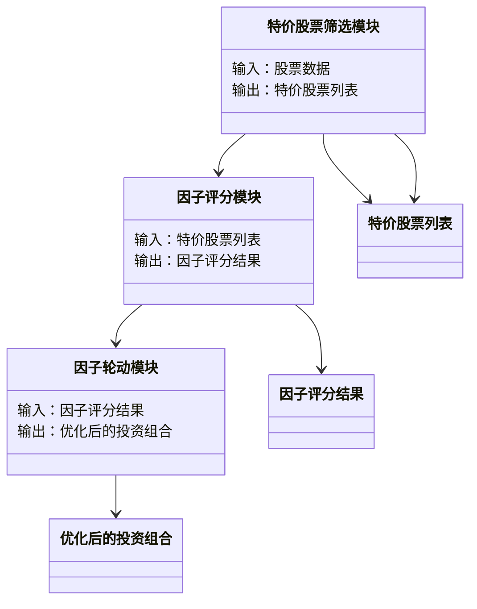

                 


# 如何将特价股票策略与因子轮动策略相结合

> 关键词：特价股票、因子轮动、投资策略、股票交易、量化交易、股票筛选、因子评分  
> 摘要：本文探讨了如何将特价股票策略与因子轮动策略相结合，通过分析两者的结合背景、机制和应用，提供了一种创新的投资策略，帮助投资者在复杂市场中优化投资组合。

---

## 第1章: 特价股票策略的核心概念

### 1.1 特价股票的定义与特点

#### 1.1.1 特价股票的定义
特价股票是指在特定市场条件下，价格显著低于其内在价值或行业平均水平的股票。这些股票通常被视为被市场低估，具有潜在的投资机会。

#### 1.1.2 特价股票的特点
- **低估值**：市盈率、市净率等估值指标远低于行业平均水平。
- **高性价比**：相对于其基本面，股票价格被市场低估。
- **短期波动性**：可能因市场情绪或突发事件出现价格波动。
- **风险较高**：通常出现在市场低迷或公司基本面暂时不佳的情况下。

#### 1.1.3 特价股票与普通股票的区别
| 特性 | 特价股票 | 普通股票 |
|------|----------|----------|
| 价格 | 低于内在价值 | 价格反映市场供需 |
| 风险 | 较高 | 风险适中 |
| 机会 | 投资机会 | 稳定收益 |

---

### 1.2 特价股票的市场背景

#### 1.2.1 特价股票出现的市场环境
- **市场低迷**：整体市场表现不佳，投资者情绪低落。
- **行业困境**：特定行业因经济周期或政策变化而面临压力。
- **突发事件**：如疫情、战争等导致市场短期恐慌。

#### 1.2.2 特价股票的投资者需求
- **追求高回报**：投资者希望以低价买入，未来高价卖出。
- **价值投资**：寻找被市场低估的优质公司。
- **分散风险**：通过低价股票分散投资组合风险。

#### 1.2.3 特价股票的市场机会与风险
- **机会**：低价买入，未来可能有较大反弹空间。
- **风险**：公司基本面可能持续恶化，或市场长期低迷。

---

## 第2章: 因子轮动策略的核心概念

### 2.1 因子轮动的定义与特点

#### 2.1.1 因子轮动的定义
因子轮动是一种投资策略，通过定期评估和调整投资组合中的因子权重，以捕捉市场中表现最佳的因子。因子包括市值、价值、动量、波动率等。

#### 2.1.2 因子轮动的特点
- **动态调整**：定期重新评估因子表现，调整投资权重。
- **适应市场变化**：根据市场环境变化，选择表现最佳的因子。
- **系统化**：基于数学模型和算法进行因子筛选和权重调整。

#### 2.1.3 因子轮动与传统投资策略的区别
| 特性 | 因子轮动 | 传统投资策略 |
|------|----------|--------------|
| 策略基础 | 数学模型 | 基于经验或基本面分析 |
| 调整频率 | 定期调整 | 较少调整 |
| 适用场景 | 多样化市场环境 | 特定市场环境 |

---

### 2.2 因子轮动的市场背景

#### 2.2.1 因子轮动出现的市场环境
- **市场波动性增加**：不同因子在不同市场环境下表现各异。
- **投资者需求多样化**：投资者希望在不同市场条件下获得最优收益。
- **技术进步**：大数据和机器学习技术为因子轮动提供了支持。

#### 2.2.2 因子轮动的投资者需求
- **动态优化投资组合**：适应市场变化，捕捉最佳投资机会。
- **提高收益风险比**：通过因子轮动降低风险，提升收益。
- **系统化投资**：避免人为情绪干扰，实现理性投资。

#### 2.2.3 因子轮动的市场机会与风险
- **机会**：通过因子轮动捕捉市场变化带来的超额收益。
- **风险**：因子表现不稳定，可能导致投资组合波动性增加。

---

## 第3章: 特价股票与因子轮动的结合背景

### 3.1 特价股票与因子轮动的结合意义

#### 3.1.1 特价股票与因子轮动结合的必要性
- **互补性**：特价股票提供低价投资机会，因子轮动提供动态优化方法。
- **提升收益**：通过因子轮动筛选出表现最佳的特价股票，提高投资收益。
- **降低风险**：结合因子轮动的动态调整，降低单一策略的风险。

#### 3.1.2 特价股票与因子轮动结合的潜在优势
- **双重筛选机制**：首先筛选出特价股票，再通过因子轮动优化投资组合。
- **适应市场变化**：因子轮动能根据市场变化动态调整，适应特价股票的波动性。

#### 3.1.3 特价股票与因子轮动结合的市场价值
- **优化投资策略**：帮助投资者在复杂市场中找到最优投资机会。
- **提高投资效率**：通过系统化方法筛选和调整投资组合。

---

### 3.2 特价股票与因子轮动结合的可行性分析

#### 3.2.1 特价股票与因子轮动结合的可行性
- **数据支持**：现代金融市场提供丰富的历史数据，支持因子分析和特价股票筛选。
- **技术支持**：大数据和机器学习技术为因子轮动和特价股票筛选提供了技术保障。

#### 3.2.2 特价股票与因子轮动结合的限制条件
- **数据质量**：需要高质量的历史数据支持因子分析。
- **计算复杂度**：因子轮动需要频繁计算和调整，对计算能力要求较高。

#### 3.2.3 特价股票与因子轮动结合的未来发展趋势
- **技术进步**：随着技术进步，因子轮动和特价股票筛选将更加精准。
- **市场环境变化**：不同市场环境下，因子轮动和特价股票结合的策略需要灵活调整。

---

## 第4章: 特价股票与因子轮动的结合机制

### 4.1 特价股票与因子轮动的结合方式

#### 4.1.1 特价股票作为因子轮动的筛选标准
- **步骤1**：筛选出当前市场中的特价股票。
- **步骤2**：将特价股票作为因子轮动的候选池，根据因子表现进行权重调整。

#### 4.1.2 因子轮动作为特价股票的投资策略
- **步骤1**：通过因子轮动筛选出表现最佳的因子。
- **步骤2**：根据筛选出的因子，选择当前市场中的特价股票进行投资。

#### 4.1.3 特价股票与因子轮动的动态结合
- **动态筛选**：定期重新评估特价股票和因子表现，动态调整投资组合。

---

### 4.2 特价股票与因子轮动结合的数学模型

#### 4.2.1 特价股票与因子轮动结合的数学公式
- **因子评分公式**：
  $$ F_i = \alpha \cdot V_i + \beta \cdot M_i + \gamma \cdot D_i $$
  其中，$F_i$ 是因子评分，$V_i$ 是价值因子，$M_i$ 是动量因子，$D_i$ 是波动率因子。
- **投资组合优化公式**：
  $$ w_i = \frac{F_i}{\sum_{j} F_j} $$
  其中，$w_i$ 是投资权重，$F_i$ 是因子评分。

#### 4.2.2 特价股票与因子轮动结合的模型分析
- **模型输入**：历史股票数据，包括价格、成交量、财务指标等。
- **模型输出**：优化后的投资组合，包括股票权重和预期收益。

#### 4.2.3 特价股票与因子轮动结合的案例分析
- **案例**：假设当前市场中有多只特价股票，通过因子轮动筛选出价值因子表现最佳的股票进行投资。

---

## 第5章: 特价股票与因子轮动结合的策略设计

### 5.1 特价股票与因子轮动结合的策略框架

#### 5.1.1 特价股票与因子轮动结合的策略目标
- **目标1**：筛选出具有潜在上涨空间的特价股票。
- **目标2**：通过因子轮动优化投资组合，提高收益，降低风险。

#### 5.1.2 特价股票与因子轮动结合的策略步骤
1. **筛选特价股票**：基于估值指标（如市盈率、市净率）筛选出当前市场中的特价股票。
2. **计算因子评分**：对筛选出的特价股票计算因子评分（如价值因子、动量因子）。
3. **因子轮动调整**：根据因子评分动态调整投资组合权重，选择表现最佳的因子进行投资。

---

## 第6章: 特价股票与因子轮动结合的系统分析

### 6.1 特价股票与因子轮动结合的系统功能设计

#### 6.1.1 领域模型（Mermaid 类图）


---

### 6.2 系统架构设计（Mermaid 架构图）


---

## 第7章: 特价股票与因子轮动结合的项目实战

### 7.1 项目环境安装

#### 7.1.1 安装 Python 和相关库
```bash
pip install numpy pandas scikit-learn
```

### 7.2 核心代码实现

#### 7.2.1 特价股票筛选模块
```python
import pandas as pd

# 假设 df 是包含股票数据的 DataFrame
def screen_penny_stocks(df):
    # 筛选市盈率低于行业平均的股票
    avg_pe = df['PE'].mean()
    df_penny = df[df['PE'] < avg_pe]
    return df_penny
```

#### 7.2.2 因子评分模块
```python
from sklearn.preprocessing import StandardScaler

def calculate_factor_scores(df):
    # 标准化处理
    scaler = StandardScaler()
    factors = df[['Value', 'Momentum', 'Volatility']]
    scaled_factors = scaler.fit_transform(factors)
    # 计算因子评分
    factor_scores = pd.DataFrame(scaled_factors, columns=['Value', 'Momentum', 'Volatility'])
    return factor_scores
```

#### 7.2.3 因子轮动模块
```python
def factor_trend_following(factor_scores):
    # 计算因子评分的排名
    ranked_factors = factor_scores.rank(ascending=False)
    # 选择评分最高的因子
    selected_factors = ranked_factors['Value'].nlargest(3)
    return selected_factors.index
```

### 7.3 代码解读与分析

#### 7.3.1 特价股票筛选模块解读
- **功能**：筛选出市盈率低于行业平均的股票。
- **输入**：包含股票数据的 DataFrame。
- **输出**：特价股票列表。

#### 7.3.2 因子评分模块解读
- **功能**：对筛选出的特价股票计算因子评分。
- **输入**：特价股票列表。
- **输出**：标准化的因子评分结果。

#### 7.3.3 因子轮动模块解读
- **功能**：根据因子评分动态调整投资组合。
- **输入**：因子评分结果。
- **输出**：优化后的投资组合。

### 7.4 实际案例分析

#### 7.4.1 案例背景
假设当前市场中有10只股票，其中3只是特价股票，市盈率低于行业平均。通过因子评分筛选出价值因子表现最佳的2只股票进行投资。

#### 7.4.2 案例分析
- **筛选特价股票**：3只特价股票。
- **计算因子评分**：对3只股票计算价值因子、动量因子和波动率因子评分。
- **因子轮动调整**：选择价值因子评分最高的2只股票进行投资。

### 7.5 项目小结

- **成功经验**：通过结合特价股票筛选和因子轮动，成功捕捉到潜在收益。
- **经验教训**：因子轮动需要频繁调整，对计算能力和数据质量要求较高。

---

## 第8章: 特价股票与因子轮动结合的最佳实践

### 8.1 最佳实践 tips

- **数据质量**：确保数据来源可靠，数据清洗充分。
- **模型优化**：定期优化因子评分模型，提高筛选精度。
- **风险控制**：设置止损点，避免重大损失。

### 8.2 小结

通过将特价股票策略与因子轮动策略相结合，投资者可以在复杂市场中找到潜在的投资机会，优化投资组合，提高收益，降低风险。

### 8.3 注意事项

- **市场环境变化**：定期评估市场环境，动态调整策略。
- **技术实现难度**：需要专业的技术团队和充足的技术支持。

### 8.4 拓展阅读

- 《因子投资法》
- 《量化投资入门》
- 《股票投资策略与实践》

---

## 作者：AI天才研究院/AI Genius Institute & 禅与计算机程序设计艺术 /Zen And The Art of Computer Programming

---

通过本文的详细分析，读者可以系统地理解如何将特价股票策略与因子轮动策略相结合，并在实际投资中应用这些方法。

