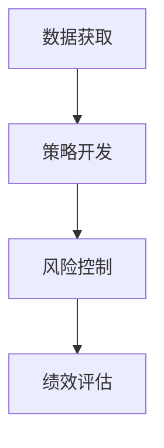

                 


# 如何将特价股票策略与固定收益投资结合

> 关键词：特价股票策略，固定收益投资，投资组合优化，风险对冲，套利机会

> 摘要：本文探讨如何将特价股票策略与固定收益投资相结合，利用固定收益产品的稳定性来优化股票投资组合，并通过股票市场的套利机会来增强固定收益投资的收益。通过分析两者的结合点、策略设计和实际案例，本文为投资者提供一种新的投资思路。

---

## 第一部分：背景与基础

### 第1章：特价股票策略与固定收益投资概述

#### 1.1 特价股票策略的定义与特点
特价股票策略是指在市场中寻找价格低于其内在价值的股票进行投资，期望在市场回升时获得超额收益。其核心特点包括：
- **低估值**：寻找市场价格低于内在价值的股票。
- **逆向投资**：在市场低迷时买入，市场高涨时卖出。
- **长期持有**：通常需要较长时间持有，等待价值回归。

#### 1.2 固定收益投资的定义与特点
固定收益投资是指投资于债券、国债等具有固定收益的金融工具，其特点包括：
- **稳定收益**：定期获得利息收入。
- **低风险**：相比股票，波动性较低，风险可控。
- **流动性**：大多数固定收益产品具有较好的流动性。

#### 1.3 两者的结合背景
随着市场波动加剧，投资者 increasingly seek a balance between risk and return. By combining the high return potential of stock strategies with the stability of fixed-income investments, investors can optimize their portfolios and hedge against market risks.

---

## 第二部分：特价股票策略与固定收益投资的结合策略

### 第2章：利用固定收益产品优化股票投资组合

#### 2.1 套利机会的识别
- **定义**：套利是指利用市场价差，在不承担额外风险的情况下获利。
- **策略**：在股票市场中寻找低估的股票，同时利用固定收益产品对冲市场风险。

#### 2.2 事件驱动策略
- **事件驱动**：当公司发生并购、重组等重大事件时，股价可能出现大幅波动。
- **套利机会**：通过分析事件对股价的影响，寻找短期套利机会。

#### 2.3 时间序列分析
- **分析工具**：使用时间序列分析模型（如ARIMA）预测股票价格走势。
- **策略优化**：结合固定收益产品的稳定性，优化投资组合的收益和风险比。

### 第3章：利用股票策略增强固定收益投资

#### 3.1 利用套利机会
- **策略**：在固定收益市场中寻找因市场波动导致价格低估的机会。
- **实施步骤**：通过量化模型识别套利机会，利用股票策略进行对冲。

#### 3.2 风险对冲
- **方法**：使用股票投资组合对冲固定收益投资中的利率风险和信用风险。
- **实施步骤**：根据固定收益产品的风险敞口，构建相应的股票投资组合进行对冲。

### 第4章：系统架构设计

#### 4.1 系统目标与范围
- **目标**：构建一个结合特价股票策略和固定收益投资的综合投资系统。
- **范围**：涵盖数据获取、策略开发、风险控制和绩效评估。

#### 4.2 系统功能模块
- **数据获取模块**：收集股票和固定收益产品的历史数据。
- **策略开发模块**：开发套利和事件驱动策略。
- **风险控制模块**：监控和管理投资组合的风险。
- **绩效评估模块**：评估投资策略的收益和风险比。

#### 4.3 系统架构图


---

## 第三部分：项目实战与案例分析

### 第5章：项目实战

#### 5.1 环境安装
- **工具**：Python、Pandas、NumPy、Matplotlib、量化交易平台API。
- **数据源**：获取股票和债券的历史数据，例如通过Yahoo Finance API。

#### 5.2 核心代码实现
```python
import pandas as pd
import numpy as np

# 数据获取
def get_stock_data(ticker):
    # 示例代码，实际需要连接API
    return pd.DataFrame({'price': np.random.randn(100).cumsum()})

# 策略回测
def backtest_strategy(data):
    # 简单的移动平均策略
    data['signal'] = data['price'].shift(1)
    data['return'] = data['price'].pct_change()
    data['profit'] = data['return'] * data['signal']
    return data['profit'].cumsum()

# 风险控制
def risk_management(profits, threshold=0.05):
    # 示例风险控制策略
    profits = profits.copy()
    profits[profits > threshold] = threshold
    profits[profits < -threshold] = -threshold
    return profits.cumsum()

# 主函数
if __name__ == "__main__":
    stock_data = get_stock_data('AAPL')
    profits = backtest_strategy(stock_data)
    managed_profits = risk_management(profits)
    print(managed_profits)
```

#### 5.3 案例分析
- **案例一**：利用套利策略在债券市场中获利。
- **案例二**：通过股票投资组合对冲债券投资中的利率风险。

---

## 第四部分：总结与展望

### 第6章：总结与最佳实践

#### 6.1 本章小结
本文详细探讨了如何将特价股票策略与固定收益投资相结合，通过套利机会和风险对冲优化投资组合，实现风险可控下的收益最大化。

#### 6.2 最佳实践 tips
- **数据质量**：确保数据的准确性和完整性。
- **模型选择**：根据市场环境选择合适的策略模型。
- **风险管理**：定期评估和调整投资组合的风险敞口。

#### 6.3 注意事项
- **市场风险**：市场波动可能影响策略效果。
- **交易成本**：频繁交易可能导致较高的交易成本。
- **模型局限性**：策略模型可能无法覆盖所有市场情况。

#### 6.4 拓展阅读
- 建议深入学习量化交易、固定收益产品定价和风险管理系统。

---

## 作者信息

作者：AI天才研究院/AI Genius Institute & 禅与计算机程序设计艺术 /Zen And The Art of Computer Programming

---

通过本文的详细分析和实际案例，投资者可以更好地理解如何将特价股票策略与固定收益投资相结合，从而在复杂多变的市场环境中实现更优的投资回报。

