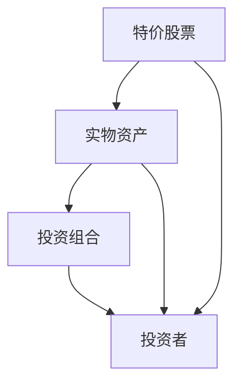
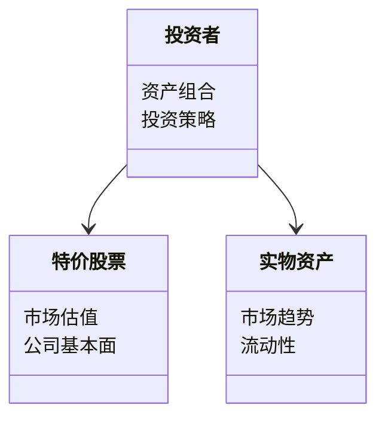
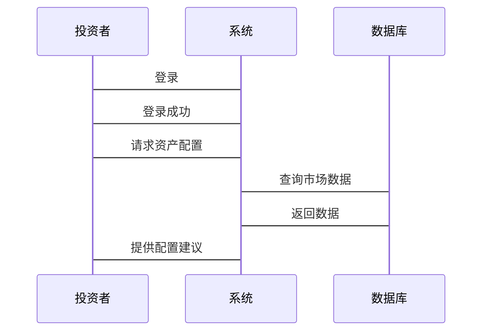

                 


# 如何将特价股票策略与实物资产投资结合

> 关键词：特价股票，实物资产，投资策略，资产配置，风险分散

> 摘要：本文详细探讨了如何将特价股票策略与实物资产投资相结合，通过量化分析、算法设计和系统架构，帮助投资者优化资产配置，分散风险，实现长期稳健的投资收益。

---

## 第1章：特价股票策略与实物资产投资的背景介绍

### 1.1 特价股票策略概述

#### 1.1.1 特价股票的定义与特点
特价股票是指在市场低迷或公司遇到短期困难时，股价低于其内在价值的股票。其特点包括高性价比、低估值、潜在复苏空间大，但伴随着较高的市场波动风险。

#### 1.1.2 特价股票投资的基本原理
投资者通过分析市场周期、公司基本面和估值指标（如市盈率、市净率）来识别特价股票，抓住市场低估的机会。

#### 1.1.3 特价股票与市场周期的关系
在经济衰退或市场低迷时，特价股票往往出现，投资者可通过低位买入，等待市场复苏实现收益。

### 1.2 实物资产投资概述

#### 1.2.1 实物资产的定义与分类
实物资产包括房地产、黄金、艺术品等，具有抗通胀、保值增值的特点。

#### 1.2.2 实物资产投资的基本原理
通过分散投资于不同实物资产，降低市场波动风险，实现资产的长期稳健增长。

#### 1.2.3 实物资产与市场周期的关系
实物资产在经济繁荣时表现良好，在通货膨胀时期更具保值功能，但在经济衰退时可能面临流动性风险。

### 1.3 特价股票与实物资产结合的背景与意义

#### 1.3.1 经济周期与资产配置的关系
不同经济周期下，股票和实物资产的表现各异，合理配置两者可优化收益与风险。

#### 1.3.2 组合投资的优势
通过将特价股票与实物资产结合，投资者可在市场波动时分散风险，平衡收益。

---

## 第2章：特价股票策略与实物资产投资的核心概念与联系

### 2.1 核心概念分析

#### 2.1.1 特价股票策略的核心要素
包括市场估值指标、公司基本面分析和投资时机选择。

#### 2.1.2 实物资产投资的核心要素
包括资产类别选择、市场趋势分析和流动性管理。

#### 2.1.3 两者结合的逻辑框架
利用市场周期差异，互补投资，优化资产配置。

### 2.2 特价股票与实物资产的属性特征对比

| 特性               | 特价股票                   | 实物资产                   |
|--------------------|---------------------------|---------------------------|
| 流动性             | 高                        | 中-低                     |
| 风险收益特征       | 高风险，高收益            | 中风险，稳定收益           |
| 市场相关性         | 高                        | 中                        |
| 抗通胀能力         | 弱                        | 强                        |

### 2.3 特价股票与实物资产的ER实体关系图


---

## 第3章：特价股票策略与实物资产投资的算法原理

### 3.1 特价股票策略的量化评估

#### 3.1.1 市场估值指标的计算
使用市盈率（P/E）和市净率（P/B）等指标评估股票价值。

#### 3.1.2 特价股票筛选算法
```python
def find_low_valued_stocks():
    for stock in all_stocks:
        if stock.pe < market_pe_ratio and stock.pb < market_pb_ratio:
            return stock
    return None
```

#### 3.1.3 数学模型
$$ 价值 = \text{内在价值} = \frac{\text{净利润}}{\text{折现率}} $$

### 3.2 实物资产定价模型

#### 3.2.1 模型设计
考虑市场趋势、供需关系和通胀预期。

#### 3.2.2 定价算法
$$ 价格 = \text{基础价值} \times (1 + \text{通胀率}) $$

#### 3.2.3 数学模型
$$ \text{收益} = \text{资产价格增长} + \text{租金收入} $$

---

## 第4章：系统分析与架构设计

### 4.1 项目背景
开发一个结合特价股票和实物资产投资的系统，帮助投资者优化资产配置。

### 4.2 系统功能设计

#### 4.2.1 领域模型


### 4.3 系统架构设计


### 4.4 系统交互设计


---

## 第5章：项目实战

### 5.1 环境安装
安装Python、Pandas、Matplotlib等工具。

### 5.2 核心实现

#### 5.2.1 数据处理
```python
import pandas as pd
data = pd.read_csv('market_data.csv')
```

#### 5.2.2 策略实现
```python
def portfolio_optimizer():
    # 优化代码
    pass
```

### 5.3 案例分析
分析经济衰退期的资产配置，验证策略的有效性。

---

## 第6章：总结与建议

### 6.1 小结
结合特价股票和实物资产投资可有效分散风险，优化收益。

### 6.2 投资建议
根据市场周期调整资产配置比例，定期评估和优化投资组合。

### 6.3 注意事项
警惕市场波动风险，避免过度集中投资。

### 6.4 拓展阅读
推荐相关书籍和资源，深入学习投资策略。

---

## 作者
作者：AI天才研究院 & 禅与计算机程序设计艺术

