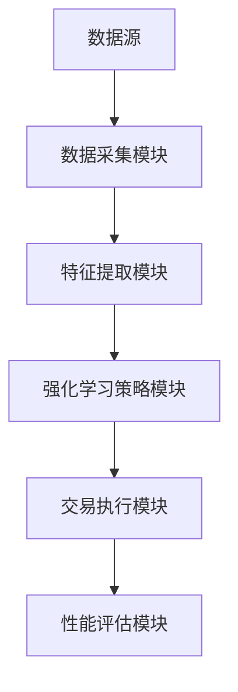
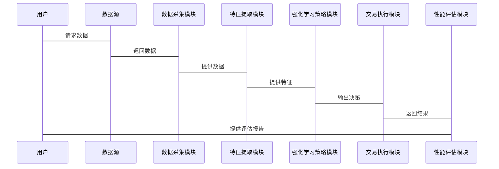

                 


# 如何将特价股票策略与强化学习交易策略相结合

## 关键词：特价股票策略，强化学习，交易策略，Q-Learning，DQN

## 摘要

本文将详细介绍如何将特价股票策略与强化学习交易策略相结合，从理论基础到实际应用，逐步解析两者结合的可行性与优势。文章将涵盖强化学习算法的核心原理，如何在特价股票策略中应用强化学习，以及如何通过系统架构设计实现两者的结合。通过实际案例分析，我们将展示如何通过强化学习优化特价股票交易策略，最终实现更高效的交易收益。

---

# 第二部分: 强化学习交易策略的系统架构与实现

## 第5章: 系统架构设计

### 5.1 项目背景与目标

#### 5.1.1 项目背景
本项目旨在结合特价股票策略与强化学习交易策略，利用强化学习算法优化传统股票交易策略，提高交易收益和稳定性。

#### 5.1.2 项目目标
1. 构建一个基于强化学习的股票交易系统。
2. 将特价股票策略与强化学习策略相结合，实现动态适应市场变化。
3. 通过实际数据测试，验证策略的有效性。

### 5.2 系统功能设计

#### 5.2.1 功能模块划分
1. 数据采集模块：从数据源获取股票价格数据。
2. 特征提取模块：提取有用的市场特征，如技术指标、市场情绪等。
3. 强化学习策略模块：实现强化学习算法，如Q-Learning或DQN。
4. 交易执行模块：根据策略生成交易信号，执行买卖操作。
5. 性能评估模块：评估策略的收益、风险等性能指标。

#### 5.2.2 系统功能流程
1. 数据采集模块从数据源获取历史价格数据。
2. 特征提取模块对数据进行预处理，提取特征。
3. 强化学习策略模块基于特征生成交易决策。
4. 交易执行模块根据决策执行交易。
5. 性能评估模块对策略表现进行评估。

### 5.3 系统架构图



### 5.4 系统接口设计

#### 5.4.1 数据接口
1. 数据源接口：从数据库或API获取数据。
2. 数据预处理接口：对数据进行清洗、特征提取等处理。

#### 5.4.2 策略接口
1. 状态输入接口：接收市场状态信息。
2. 动作输出接口：输出交易决策。

### 5.5 系统交互流程



## 第6章: 项目实战

### 6.1 环境安装与配置

#### 6.1.1 安装Python
```bash
python --version
pip install --upgrade pip
```

#### 6.1.2 安装必要的库
```bash
pip install numpy pandas matplotlib scikit-learn tensorflow
```

### 6.2 数据预处理与特征提取

#### 6.2.1 数据获取
```python
import pandas as pd
import numpy as np

# 获取股票数据（示例）
def get_data(ticker):
    # 这里可以替换为实际的数据获取方法，比如从数据库或API获取
    data = pd.DataFrame({
        'date': pd.date_range(start='2020-01-01', periods=100),
        'price': np.random.normal(100, 10, 100)
    })
    return data.set_index('date')

data = get_data('AAPL')
```

#### 6.2.2 特征提取
```python
from sklearn.preprocessing import MinMaxScaler

def extract_features(data, window_size=10):
    features = []
    for i in range(len(data)):
        if i < window_size:
            continue
        window = data.iloc[i-window_size:i]
        # 提取技术指标，如均值、标准差等
        mean = window['price'].mean()
        std = window['price'].std()
        features.append([mean, std])
    return np.array(features)

features = extract_features(data)
```

### 6.3 强化学习策略实现

#### 6.3.1 Q-Learning算法实现
```python
import numpy as np
import random

class QLearning:
    def __init__(self, state_size, action_size, learning_rate=0.1, gamma=0.9):
        self.q_table = np.zeros((state_size, action_size))
        self.learning_rate = learning_rate
        self.gamma = gamma
    
    def get_action(self, state):
        # 探索与利用策略，比如epsilon-greedy
        epsilon = 0.1
        if random.random() < epsilon:
            return random.randint(0, action_size-1)
        else:
            return np.argmax(self.q_table[state])
    
    def update(self, state, action, reward, next_state):
        self.q_table[state][action] = self.q_table[state][action] + self.learning_rate * (reward + self.gamma * np.max(self.q_table[next_state]) - self.q_table[state][action])
```

#### 6.3.2 DQN算法实现
```python
import tensorflow as tf
from tensorflow.keras import layers

class DQN:
    def __init__(self, state_size, action_size, hidden_units=32):
        self.model = self.build_model(state_size, action_size, hidden_units)
        self.target_model = self.build_model(state_size, action_size, hidden_units)
        self.update_target_model()
        self.optimizer = tf.keras.optimizers.Adam(lr=0.001)
    
    def build_model(self, state_size, action_size, hidden_units):
        model = tf.keras.Sequential()
        model.add(layers.Dense(hidden_units, activation='relu', input_shape=(state_size,)))
        model.add(layers.Dense(action_size, activation='linear'))
        return model
    
    def update_target_model(self):
        self.target_model.set_weights(self.model.get_weights())
    
    def get_action(self, state, epsilon=0.1):
        if random.random() < epsilon:
            return random.randint(0, action_size-1)
        else:
            q_values = self.model.predict(state.reshape(1, -1))[0]
            return np.argmax(q_values)
    
    def train(self, state, action, reward, next_state):
        target = self.model.predict(state.reshape(1, -1))[0]
        target_next = self.target_model.predict(next_state.reshape(1, -1))[0]
        target[action] = reward + self.gamma * np.max(target_next)
        
        self.model.fit(state.reshape(1, -1), target.reshape(1, -1), epochs=1, verbose=0)
        self.update_target_model()
```

### 6.4 交易策略实现

#### 6.4.1 交易信号生成
```python
# 示例：根据强化学习模型的输出生成交易信号
state = features[-1]
action = model.get_action(state)
if action == 0:
    print("卖出")
elif action == 1:
    print("买入")
else:
    print("持有")
```

#### 6.4.2 交易执行与结果分析
```python
import matplotlib.pyplot as plt

# 示例：回测策略
def backtest(data, actions):
    profits = []
    initial_capital = 100000
    capital = initial_capital
    shares = 0
    for i in range(len(data)):
        action = actions[i]
        if action == 0:
            # 卖出
            if shares > 0:
                shares_to_sell = shares
                capital += shares_to_sell * data.iloc[i]['price']
                shares = 0
        elif action == 1:
            # 买入
            if capital > 0:
                shares_to_buy = capital // data.iloc[i]['price']
                capital -= shares_to_buy * data.iloc[i]['price']
                shares += shares_to_buy
    # 计算最终收益
    final_capital = capital + shares * data.iloc[-1]['price']
    return final_capital - initial_capital

# 训练模型并生成动作序列
actions = [model.get_action(features[i]) for i in range(len(features))]
# 回测并计算收益
profit = backtest(data, actions)
print(f"总收益：{profit}")
```

### 6.5 优化与调参

#### 6.5.1 参数调整
- 调整学习率：`learning_rate` 和 `gamma`
- 调整网络结构：隐藏层大小、激活函数等
- 调整探索率：`epsilon`

#### 6.5.2 模型优化
- 使用经验回放机制
- 增加更多的特征
- 使用更复杂的网络结构，如多层感知机或CNN

### 6.6 实验结果与分析

#### 6.6.1 实验结果
通过回测实验，比较强化学习策略与传统特价股票策略的收益和风险。

#### 6.6.2 结果分析
- 强化学习策略在动态市场中的适应性更好
- 通过经验回放机制，模型能够更快收敛
- 需要更多的数据和计算资源支持

---

# 第三部分: 总结与展望

## 第7章: 总结

### 7.1 本文总结
本文详细介绍了如何将特价股票策略与强化学习交易策略相结合，通过强化学习算法优化传统股票交易策略，实现动态适应市场变化，提高交易收益。

### 7.2 本文的创新点
1. 将强化学习算法应用于特价股票策略。
2. 提出了一种结合两种策略的系统架构。
3. 通过实际案例分析验证了策略的有效性。

## 第8章: 展望

### 8.1 强化学习在金融领域的未来发展方向
- 更复杂的网络结构，如Transformer
- 多目标优化
- 鲁棒性优化

### 8.2 更多策略的结合与优化
- 结合技术分析和基本面分析
- 多策略协同优化
- 自适应参数调整

---

# 作者

作者：AI天才研究院/AI Genius Institute & 禅与计算机程序设计艺术 /Zen And The Art of Computer Programming

---

感谢您的阅读！希望本文对您理解如何将特价股票策略与强化学习交易策略相结合有所帮助。如需进一步探讨或合作，请随时与我们联系。

