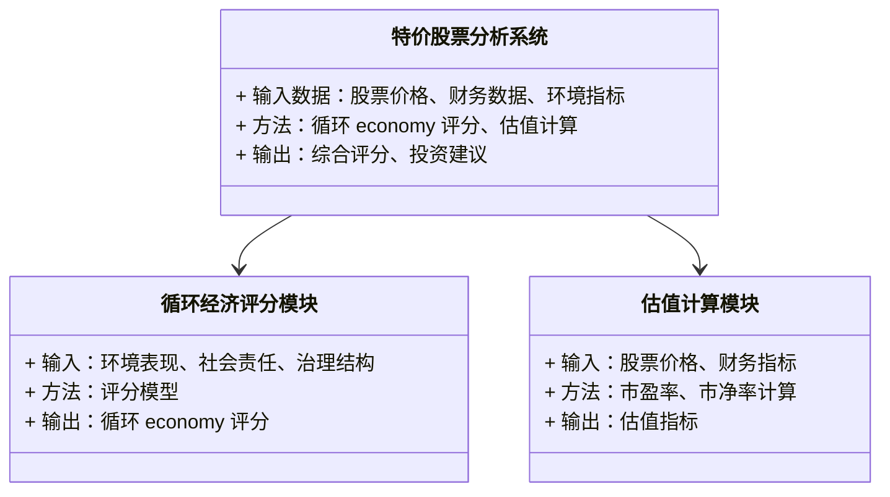
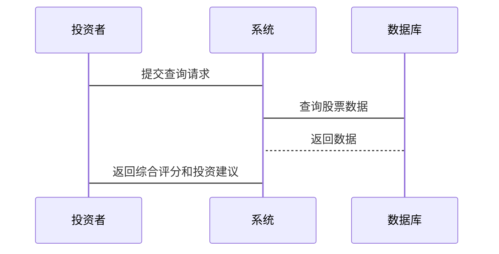

                 


---

# 如何将特价股票策略与循环经济投资理念结合

**关键词**：特价股票策略，循环经济，投资理念，可持续发展，数学模型

**摘要**：本文探讨如何将特价股票策略与循环经济投资理念相结合，通过分析两者的结合背景、核心概念、数学模型和算法原理，构建一个综合的投资决策框架。文章还提供了一个实际案例分析和最佳实践建议，帮助投资者在可持续发展的框架下优化投资策略。

---

## 第1章: 特价股票策略与循环经济投资理念概述

### 1.1 特价股票策略的定义与特点

#### 1.1.1 特价股票的定义
特价股票是指市场价格低于其内在价值的股票。通常，这些股票可能被市场低估，或者由于短期市场波动而被忽视。投资者可以通过分析公司基本面（如盈利能力、财务状况和成长性）来识别这些股票。

#### 1.1.2 特价股票策略的核心特点
- **低估值**：股票价格低于行业平均水平或历史平均水平。
- **高分红**：许多特价股票公司倾向于高分红，吸引追求稳定收益的投资者。
- **高安全边际**：投资者在购买时有较大的价格折扣，降低投资风险。
- **周期性机会**：通常在市场低迷或行业低谷时出现。

#### 1.1.3 特价股票策略的应用场景
- **熊市或震荡市场**：在市场下跌时，许多股票可能被低估。
- **行业困境时期**：某些行业因外部冲击而面临困境，但公司基本面良好的股票可能成为特价股票。
- **价值投资**：长期投资者寻找那些被市场忽视但具有长期增长潜力的公司。

### 1.2 循环经济投资理念的定义与特点

#### 1.2.1 循环经济的定义
循环经济是一种以资源高效利用和循环利用为核心的发展模式，强调减少资源消耗和废弃物产生，通过设计、生产、消费和回收等环节的闭环系统，实现经济可持续发展。

#### 1.2.2 循环经济投资理念的核心特点
- **资源节约**：投资于那些能够高效利用资源、减少浪费的公司。
- **可持续发展**：关注公司在环境保护、社会责任和治理结构方面的表现。
- **长期价值**：循环经济模式下的公司通常具有长期的竞争优势，因为它们能够降低成本并减少环境风险。

#### 1.2.3 循环经济投资理念的应用场景
- **环保政策趋严的时期**：政府出台 stricter regulations on resource usage and emissions，那些符合循环经济模式的公司更具竞争优势。
- **技术进步推动的行业**：技术创新使得资源回收和再利用成为可能，相关公司因此受益。
- **全球可持续发展趋势**：随着全球对可持续发展的关注增加，循环经济模式的投资机会也在增加。

### 1.3 特价股票策略与循环经济投资理念的结合意义

#### 1.3.1 结合的背景与必要性
- **经济可持续发展需求**：传统的经济增长模式依赖于大量资源消耗，而循环经济可以减少资源压力。
- **投资机会的扩展**：通过结合特价股票策略，投资者可以在循环经济领域中发现被低估的投资机会。
- **风险降低**：循环经济模式下的公司通常具有更强的抗风险能力，因为它们能够更好地适应市场变化和政策调整。

#### 1.3.2 结合的核心价值
- **双重收益**：投资者可以在获得短期价格优势的同时，投资于具有长期可持续发展潜力的公司。
- **风险管理**：通过投资于循环经济领域的特价股票，投资者可以降低因环境政策变化带来的风险。
- **社会价值**：投资于循环经济模式的公司有助于推动社会的可持续发展，符合全球绿色投资的趋势。

#### 1.3.3 结合的未来发展趋势
随着全球对可持续发展的关注增加，循环经济投资理念将越来越受到重视。通过结合特价股票策略，投资者可以在这一领域中发现更多的投资机会，同时实现长期的财富增长。

---

## 第2章: 特价股票策略与循环经济投资理念的核心概念与联系

### 2.1 特价股票策略的核心概念

#### 2.1.1 市场流动性分析
市场流动性高的股票通常更容易以合理价格买卖，这为投资者提供了更多的交易机会。在特价股票策略中，流动性较低的股票可能因为交易不活跃而被低估，但这也增加了投资风险。

#### 2.1.2 估值模型与指标
常用的估值指标包括市盈率（P/E）、市净率（P/B）、股息率等。通过比较这些指标，投资者可以判断股票是否被低估。

#### 2.1.3 市场情绪与投资者行为
市场情绪会影响股票价格，尤其是在市场恐慌或乐观时，股票价格可能偏离其内在价值。特价股票策略需要投资者在市场情绪低落时寻找机会，同时在市场情绪高涨时保持冷静。

### 2.2 循环经济投资理念的核心概念

#### 2.2.1 资源循环利用
循环经济的核心是资源的高效利用和循环利用。例如，回收利用废料、减少原材料消耗等。

#### 2.2.2 可持续发展评估
投资者需要评估公司在环境保护、社会责任和治理结构方面的表现，以确保其符合循环经济的可持续发展要求。

#### 2.2.3 循环经济模式下的投资收益模型
循环经济模式下的公司通常具有更低的环境风险和更高的长期增长潜力，这可能体现在公司的盈利能力和股价表现上。

### 2.3 特价股票策略与循环经济投资理念的联系

#### 2.3.1 特价股票策略中的循环经济属性
- **资源效率**：公司是否在资源利用上具有优势，是否通过技术创新实现资源的高效利用。
- **环境风险**：公司是否面临因环境政策变化带来的风险，是否能够通过循环经济模式降低这些风险。

#### 2.3.2 循环经济模式下的投资机会
- **行业机会**：在环保政策趋严的背景下，那些符合循环经济模式的公司可能成为特价股票。
- **技术创新**：投资于那些在循环经济领域具有技术创新能力的公司，可能获得更高的收益。

#### 2.3.3 两者的结合对投资决策的影响
- **投资标的筛选**：投资者需要同时考虑股票的估值和公司的可持续发展潜力。
- **投资策略调整**：在选择特价股票时，优先考虑那些符合循环经济模式的公司。

### 2.4 本章小结

#### 2.4.1 核心概念总结
- 特价股票策略关注的是股票的市场价格与内在价值的差异。
- 循环经济投资理念关注的是公司在资源利用和环境保护方面的表现。

#### 2.4.2 联系与结合的意义
- 两者的结合可以帮助投资者在追求短期收益的同时，关注长期的可持续发展。
- 这种结合不仅能够降低投资风险，还能推动社会的可持续发展。

---

## 第3章: 特价股票策略与循环经济投资理念的数学模型与算法原理

### 3.1 特价股票策略的数学模型

#### 3.1.1 估值模型
常用的估值模型包括：

- **市盈率模型**：P/E = 市价 / 每股净利润
- **市净率模型**：P/B = 市价 / 每股净资产
- **股息率模型**：股息率 = 每股股息 / 市价

#### 3.1.2 市场流动性分析模型
- 流动性指标：如换手率、成交量等。
- 市场流动性对股票价格的影响可以通过回归分析来量化。

#### 3.1.3 市场情绪分析模型
- 市场情绪可以通过新闻媒体分析、投资者情绪指数等方法来衡量。
- 可以使用时间序列分析来预测市场情绪对股票价格的影响。

### 3.2 循环经济投资理念的数学模型

#### 3.2.1 资源循环利用效率模型
- 资源利用效率 = 资源消耗量 / 产品产量
- 通过对比不同公司的资源利用效率，评估其循环经济模式的潜力。

#### 3.2.2 可持续发展评估模型
- 可持续发展评分 = 环境表现 × 社会责任表现 × 治理结构表现
- 每个维度可以通过标准化的评分体系来评估。

#### 3.2.3 投资收益预测模型
- 预测公式：$$ \text{投资收益} = \text{资产收益} + \text{估值提升} $$
- 资产收益可以通过公司基本面分析预测，估值提升则需要考虑市场对公司的重新定价。

### 3.3 两者的结合算法原理

#### 3.3.1 综合估值模型
- 综合估值 = 特价股票估值 × 循环经济评分
- 可以通过加权平均的方式，将两者结合起来。

#### 3.3.2 投资决策算法
1. 筛选符合循环经济模式的公司。
2. 计算这些公司的估值指标，寻找被低估的股票。
3. 结合市场情绪和流动性分析，优化投资组合。

---

## 第4章: 系统分析与架构设计方案

### 4.1 问题场景介绍
投资者需要在循环经济领域中找到那些被低估的股票，通过构建一个综合的分析系统来辅助决策。

### 4.2 项目介绍
开发一个基于循环经济理念的特价股票分析系统，帮助投资者筛选符合条件的股票。

### 4.3 系统功能设计

#### 4.3.1 领域模型


### 4.4 系统架构设计


### 4.5 系统接口设计



---

## 第5章: 项目实战

### 5.1 环境安装
- 安装 Python 和必要的库（如 Pandas、NumPy、Matplotlib）。
- 安装股票数据 API，如 Yahoo Finance 或 Alpha Vantage。

### 5.2 核心实现

```python
import pandas as pd
import numpy as np

# 定义循环经济评分模型
def circular_economy_score(company_data):
    # 环境表现、社会责任、治理结构评分（假设已标准化）
    environment = company_data['environment_score']
    social = company_data['social Responsibility_score']
    governance = company_data['governance_score']
    return environment * 0.4 + social * 0.3 + governance * 0.3

# 定义估值模型
def value_investment_score(stock_price, financial_data):
    pe = stock_price / financial_data['net_profit_per_share']
    pb = stock_price / financial_data['book_value_per_share']
    dividend_yield = financial_data['dividend_per_share'] / stock_price
    return (pe + pb + dividend_yield) / 3

# 综合评分模型
def combined_score(stock_data):
    ce_score = circular_economy_score(stock_data)
    value_score = value_investment_score(stock_price, stock_data)
    return ce_score * 0.6 + value_score * 0.4

# 应用示例
stock_data = {
    'environment_score': 0.8,
    'social Responsibility_score': 0.7,
    'governance_score': 0.8,
    'net_profit_per_share': 2.5,
    'book_value_per_share': 10.0,
    'dividend_per_share': 1.0,
    'stock_price': 15.0
}

score = combined_score(stock_data)
print(f"综合评分：{score}")
```

### 5.3 代码应用解读与分析
- **循环经济评分模型**：通过环境、社会和治理三个维度对公司的可持续发展能力进行评分。
- **估值模型**：结合市盈率、市净率和股息率，评估股票的估值水平。
- **综合评分模型**：将循环经济评分和估值评分结合起来，得到最终的投资评分。

### 5.4 实际案例分析
假设我们选择一家环保公司作为案例，通过上述模型计算其综合评分，评估其是否符合特价股票的条件。

---

## 第6章: 最佳实践与小结

### 6.1 小结
- 通过将特价股票策略与循环经济投资理念结合，投资者可以在追求短期收益的同时，关注公司的长期可持续发展。
- 综合评分模型和系统架构设计为投资者提供了一个有效的工具，帮助他们做出更明智的投资决策。

### 6.2 注意事项
- **数据质量**：模型的准确性依赖于高质量的数据，特别是在环境和社会责任评分方面。
- **模型局限性**：模型无法完全预测市场的不可预测事件，如突发的政策变化或全球经济危机。
- **持续优化**：需要定期更新模型，以反映市场变化和公司的最新表现。

### 6.3 未来展望
随着技术的进步和可持续发展理念的普及，循环经济投资理念将越来越受到重视。未来的挑战在于如何进一步优化模型，以更好地适应市场变化和投资者需求。

---

## 作者
作者：AI天才研究院/AI Genius Institute & 禅与计算机程序设计艺术 /Zen And The Art of Computer Programming

