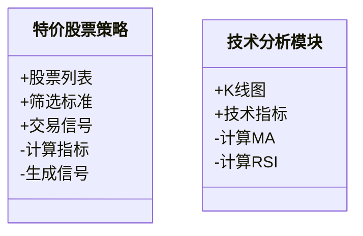
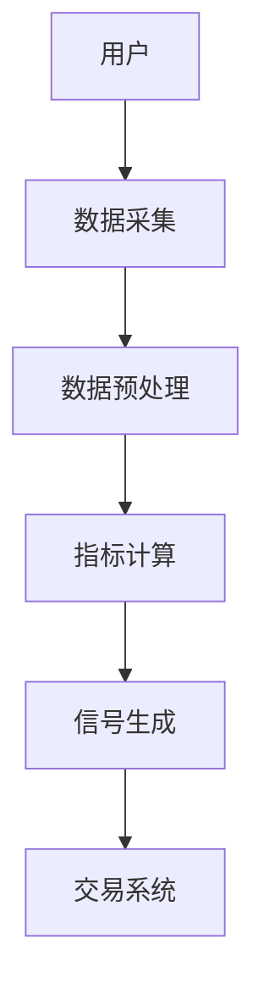
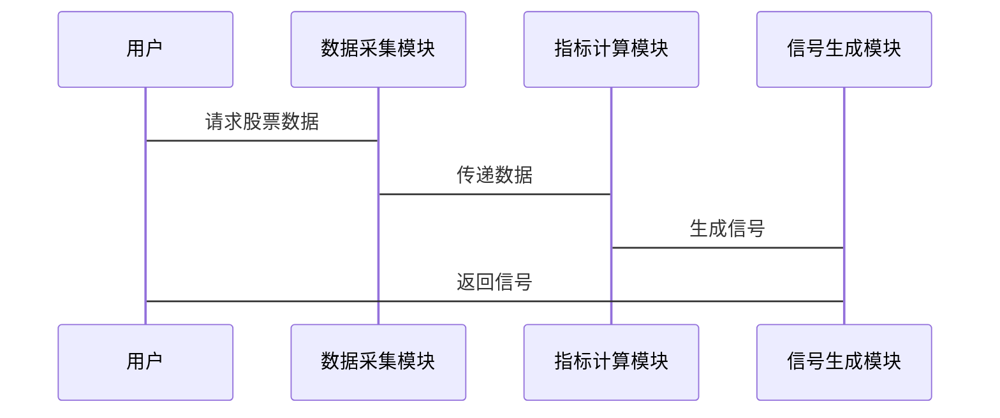

                 


# 如何将特价股票策略与技术分析相结合

> 关键词：特价股票策略，技术分析，股票交易，算法原理，系统架构

> 摘要：本文将详细介绍如何将特价股票策略与技术分析相结合，从理论到实践，帮助投资者更好地理解并应用这些策略。通过分析特价股票策略的核心概念和技术分析的原理，结合数学模型和系统架构设计，提供一个完整的解决方案，帮助投资者在股票交易中做出更明智的决策。

---

## 目录

1. [背景介绍](#背景介绍)
   - [1.1 特价股票策略的定义与特点](#11-特价股票策略的定义与特点)
     - [1.1.1 特价股票的定义](#111-特价股票的定义)
     - [1.1.2 特价股票策略的核心要素](#112-特价股票策略的核心要素)
     - [1.1.3 特价股票策略的优缺点](#113-特价股票策略的优缺点)
   - [1.2 技术分析的基本原理](#12-技术分析的基本原理)
     - [1.2.1 技术分析的定义](#121-技术分析的定义)
     - [1.2.2 技术分析的主要方法](#122-技术分析的主要方法)
     - [1.2.3 技术分析在股票交易中的作用](#123-技术分析在股票交易中的作用)
   - [1.3 特价股票策略与技术分析的结合意义](#13-特价股票策略与技术分析的结合意义)
     - [1.3.1 结合的必要性](#131-结合的必要性)
     - [1.3.2 结合的优势](#132-结合的优势)
     - [1.3.3 结合的实现路径](#133-结合的实现路径)

2. [核心概念与联系](#核心概念与联系)
   - [2.1 特价股票策略的核心概念](#21-特价股票策略的核心概念)
     - [2.1.1 特价股票的市场定位](#211-特价股票的市场定位)
     - [2.1.2 特价股票的筛选标准](#212-特价股票的筛选标准)
     - [2.1.3 特价股票的交易时机](#213-特价股票的交易时机)
   - [2.2 技术分析的核心概念](#22-技术分析的核心概念)
     - [2.2.1 K线图的构成与意义](#221-K线图的构成与意义)
     - [2.2.2 技术指标的分类与作用](#222-技术指标的分类与作用)
     - [2.2.3 趋势线与支撑阻力的概念](#223-趋势线与支撑阻力的概念)
   - [2.3 特价股票策略与技术分析的结合模型](#23-特价股票策略与技术分析的结合模型)
     - [2.3.1 模型的构成要素](#231-模型的构成要素)
     - [2.3.2 模型的逻辑关系](#232-模型的逻辑关系)
     - [2.3.3 模型的优缺点分析](#233-模型的优缺点分析)

3. [算法原理讲解](#算法原理讲解)
   - [3.1 特价股票策略的数学模型](#31-特价股票策略的数学模型)
     - [3.1.1 特价股票的筛选模型](#311-特价股票的筛选模型)
       - [公式推导](#公式推导)
       - [实现步骤](#实现步骤)
     - [3.1.2 特价股票的交易时机模型](#312-特价股票的交易时机模型)
       - [公式推导](#公式推导)
       - [实现步骤](#实现步骤)
   - [3.2 技术分析算法的实现](#32-技术分析算法的实现)
     - [3.2.1 移动平均线（MA）](#321-移动平均线)
     - [3.2.2 相对强弱指数（RSI）](#322-相对强弱指数)
     - [3.2.3 MACD指标](#323-MACD指标)

4. [系统分析与架构设计方案](#系统分析与架构设计方案)
   - [4.1 系统功能设计](#41-系统功能设计)
     - [4.1.1 数据采集模块](#411-数据采集模块)
     - [4.1.2 指标计算模块](#412-指标计算模块)
     - [4.1.3 信号生成模块](#413-信号生成模块)
   - [4.2 系统架构设计](#42-系统架构设计)
     - [4.2.1 领域模型类图](#421-领域模型类图)
     - [4.2.2 系统架构图](#422-系统架构图)
   - [4.3 系统接口设计](#43-系统接口设计)
   - [4.4 系统交互序列图](#44-系统交互序列图)

5. [项目实战](#项目实战)
   - [5.1 项目背景](#51-项目背景)
   - [5.2 环境配置](#52-环境配置)
   - [5.3 核心代码实现](#53-核心代码实现)
     - [5.3.1 数据采集](#531-数据采集)
     - [5.3.2 指标计算](#532-指标计算)
     - [5.3.3 信号生成](#533-信号生成)
   - [5.4 实际案例分析](#54-实际案例分析)
   - [5.5 项目小结](#55-项目小结)

6. [最佳实践](#最佳实践)
   - [6.1 小结](#61-小结)
   - [6.2 注意事项](#62-注意事项)
   - [6.3 拓展阅读](#63-拓展阅读)

---

## 1. 背景介绍

### 1.1 特价股票策略的定义与特点

#### 1.1.1 特价股票的定义
特价股票是指在特定条件下，价格低于市场价的股票。这些条件可能包括公司业绩下滑、行业竞争加剧或市场整体波动等。

#### 1.1.2 特价股票策略的核心要素
- 价格优势：价格低于市场价。
- 时机选择：在特定时间点买入。
- 风险控制：避免重大损失。

#### 1.1.3 特价股票策略的优缺点
优点：高回报潜力。
缺点：高风险，需要精准的时机选择。

### 1.2 技术分析的基本原理

#### 1.2.1 技术分析的定义
技术分析是通过分析历史价格和成交量来预测未来走势的方法。

#### 1.2.2 技术分析的主要方法
- 移动平均线（MA）
- 相对强弱指数（RSI）
- MACD指标

#### 1.2.3 技术分析在股票交易中的作用
帮助投资者识别趋势和潜在的买卖信号。

### 1.3 特价股票策略与技术分析的结合意义

#### 1.3.1 结合的必要性
- 利用技术分析筛选潜在股票。
- 提高策略的科学性和准确性。

#### 1.3.2 结合的优势
- 结合价格优势和趋势分析，提高成功率。
- 降低风险，提高收益。

#### 1.3.3 结合的实现路径
- 筛选特价股票。
- 应用技术分析确认时机。
- 组合策略优化。

---

## 2. 核心概念与联系

### 2.1 特价股票策略的核心概念

#### 2.1.1 特价股票的市场定位
- 在市场中找到价格低估的股票。

#### 2.1.2 特价股票的筛选标准
- 市盈率低于行业平均水平。
- 股价低于净资产价值。

#### 2.1.3 特价股票的交易时机
- 在市场底部买入。
- 在利空消息后买入。

### 2.2 技术分析的核心概念

#### 2.2.1 K线图的构成与意义
K线图由开盘价、收盘价、最高价和最低价组成，显示价格波动。

#### 2.2.2 技术指标的分类与作用
- 移动平均线（MA）：显示价格趋势。
- 相对强弱指数（RSI）：显示超买超卖状态。
- MACD指标：显示价格动能。

#### 2.2.3 趋势线与支撑阻力的概念
趋势线：价格运行的通道。
支撑线：价格下跌的支撑点。
阻力线：价格上涨的阻力点。

### 2.3 特价股票策略与技术分析的结合模型

#### 2.3.1 模型的构成要素
- 特价股票筛选标准。
- 技术指标分析。
- 交易信号生成。

#### 2.3.2 模型的逻辑关系
- 筛选出特价股票。
- 应用技术分析确认买卖信号。

#### 2.3.3 模型的优缺点分析
优点：提高策略的科学性和准确性。
缺点：需要大量的数据和计算资源。

---

## 3. 算法原理讲解

### 3.1 特价股票策略的数学模型

#### 3.1.1 特价股票的筛选模型
公式推导：
$$ P_{\text{target}} = \min(P_{\text{market}}, P_{\text{discount}}) $$

实现步骤：
1. 收集市场价和折扣价。
2. 计算最小值。
3. 筛选出符合条件的股票。

#### 3.1.2 特价股票的交易时机模型
公式推导：
$$ T_{\text{buy}} = \text{当价格低于MA(20)} \text{ 并且 RSI < 30} $$

实现步骤：
1. 计算移动平均线。
2. 计算RSI。
3. 判断是否满足条件。

#### 3.1.3 技术分析算法的实现

##### 3.2.1 移动平均线（MA）
计算公式：
$$ MA = \frac{\sum_{i=1}^{n} P_i}{n} $$

##### 3.2.2 相对强弱指数（RSI）
计算公式：
$$ RSI = 100 - \frac{100}{1 + \frac{U}{D}} $$

##### 3.2.3 MACD指标
计算公式：
$$ MACD = \text{EMA}(12) - \text{EMA}(26) $$

---

## 4. 系统分析与架构设计方案

### 4.1 系统功能设计

#### 4.1.1 数据采集模块
- 从数据源获取股票数据。
- 数据预处理。

#### 4.1.2 指标计算模块
- 计算技术指标。
- 存储结果。

#### 4.1.3 信号生成模块
- 根据指标生成买卖信号。
- 提供交易建议。

### 4.2 系统架构设计

#### 4.2.1 领域模型类图


#### 4.2.2 系统架构图


### 4.3 系统接口设计
- 数据接口：API获取股票数据。
- 信号接口：返回买卖信号。

### 4.4 系统交互序列图


---

## 5. 项目实战

### 5.1 项目背景
介绍项目的目标和意义。

### 5.2 环境配置
- 安装Python和相关库。
- 数据源获取。

### 5.3 核心代码实现

#### 5.3.1 数据采集
```python
import pandas as pd
import requests

def get_stock_data(ticker):
    url = f'https://api.example.com/stock/{ticker}'
    response = requests.get(url)
    data = response.json()
    return pd.DataFrame(data)
```

#### 5.3.2 指标计算
```python
def calculate_ma(data, window):
    return data['Close'].rolling(window).mean()

def calculate_rsi(data, window):
    diff = data['Close'].diff()
    up = diff.where(diff > 0, 0)
    down = -diff.where(diff < 0, 0)
    return (100 * up.rolling(window).sum() / (up.rolling(window).sum() + down.rolling(window).sum())).fillna(0)
```

#### 5.3.3 信号生成
```python
def generate_signal(data, ma_data, rsi_data):
    signal = []
    for i in range(len(data)):
        if data['Close'][i] < ma_data[i] and rsi_data[i] < 30:
            signal.append('buy')
        elif data['Close'][i] > ma_data[i] * 1.02 and rsi_data[i] > 70:
            signal.append('sell')
        else:
            signal.append('hold')
    return signal
```

### 5.4 实际案例分析
分析一个具体案例，展示策略的应用和效果。

### 5.5 项目小结
总结项目的实现过程和成果。

---

## 6. 最佳实践

### 6.1 小结
回顾文章的主要内容和结论。

### 6.2 注意事项
提醒读者注意策略的风险和局限性。

### 6.3 拓展阅读
推荐相关书籍和资源，供读者深入学习。

---

## 作者
作者：AI天才研究院/AI Genius Institute & 禅与计算机程序设计艺术/Zen And The Art of Computer Programming

