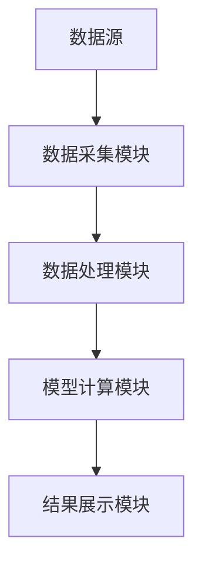

                 


# 如何将特价股票策略与数字反脆弱性因子投资相结合

> 关键词：特价股票策略，数字反脆弱性因子，投资组合优化，风险管理，量化交易

> 摘要：本文将详细探讨如何将特价股票策略与数字反脆弱性因子投资相结合，通过数学建模、算法设计和系统架构优化，构建一种高效、稳健的投资策略。文章从背景介绍、核心概念、算法原理、系统设计到项目实战，层层深入，为读者提供全面的理论与实践指导。

---

# 第一部分: 特价股票策略与数字反脆弱性因子投资概述

## 第1章: 特价股票策略的背景与核心概念

### 1.1 特价股票策略的定义与特点

#### 1.1.1 特价股票的定义
特价股票指的是那些市场价格低于其内在价值的股票。这类股票通常被认为被市场低估，具有较高的投资潜力。投资者通过识别这些股票，可以在市场波动中获得超额收益。

#### 1.1.2 特价股票策略的核心特点
- **低估性**：股票价格低于其真实价值。
- **低风险性**：通常具有较高的安全边际，风险相对较低。
- **周期性**：依赖于市场周期，适合在市场低迷期投资。

#### 1.1.3 特价股票策略与传统投资的区别
- **传统投资**：注重长期增长，关注公司基本面。
- **特价股票策略**：注重短期价格波动，关注市场估值。

### 1.2 数字反脆弱性因子的定义与特点

#### 1.2.1 数字反脆弱性因子的定义
数字反脆弱性因子是指那些在面对市场波动、经济冲击时表现出较强抗压能力的量化指标。这些因子可以通过数学模型计算得出，帮助投资者识别出能够在市场危机中表现稳定的资产。

#### 1.2.2 数字反脆弱性因子的核心特征
- **稳定性**：在市场波动中表现出较强稳定性。
- **可量化性**：可以通过数学模型进行量化计算。
- **预测性**：能够预测资产在市场冲击中的表现。

#### 1.2.3 数字反脆弱性因子与传统投资因子的对比
| 特性 | 传统投资因子 | 数字反脆弱性因子 |
|------|----------------|---------------------|
| 计算方式 | 主要基于历史数据 | 基于数学模型预测未来表现 |
| 应用场景 | 长期投资 | 短期波动中的风险管理 |
| 计算复杂度 | 较低 | 较高 |

### 1.3 特价股票策略与数字反脆弱性因子的结合

#### 1.3.1 结合的必要性
- 提高投资组合的稳定性。
- 降低市场波动对投资组合的影响。
- 在市场低迷期中获得超额收益。

#### 1.3.2 结合的核心逻辑
通过结合特价股票的低估特性和数字反脆弱性因子的稳定性，构建一个能够在市场波动中表现稳健的投资组合。

#### 1.3.3 结合的潜在优势与挑战
- **优势**：风险可控，收益潜力大。
- **挑战**：需要复杂的数学建模和算法优化。

---

## 第2章: 特价股票策略的数学模型与算法原理

### 2.1 特价股票策略的数学模型

#### 2.1.1 收益率计算模型
股票收益率计算公式：
$$ 收益率 = \frac{收盘价 - 开盘价}{开盘价} \times 100\% $$

#### 2.1.2 风险调整后的收益模型
风险调整后的收益可以通过夏普比率衡量：
$$ 夏普比率 = \frac{超额收益}{收益的标准差} $$

#### 2.1.3 投资组合优化模型
投资组合优化的数学模型：
$$ \text{最大化} \sum_{i=1}^{n} w_i R_i - \lambda \sum_{i=1}^{n} w_i^2 \sigma_i^2 $$
其中，$w_i$为投资比例，$R_i$为收益，$\sigma_i$为风险，$\lambda$为惩罚因子。

### 2.2 数字反脆弱性因子的算法实现

#### 2.2.1 反脆弱性因子的量化方法
反脆弱性因子计算公式：
$$ \text{反脆弱性因子} = \frac{\text{历史波动率}}{\text{市场波动率}} $$

#### 2.2.2 反脆弱性因子的风险评估模型
风险评估模型：
$$ \text{风险评分} = \sum_{i=1}^{n} w_i \cdot R_i $$
其中，$w_i$为权重，$R_i$为风险因子。

#### 2.2.3 反脆弱性因子的权重分配算法
权重分配算法：
$$ \text{权重} = \frac{\text{因子的重要性}}{\sum \text{所有因子的重要性}} $$

### 2.3 特价股票策略与数字反脆弱性因子的结合算法

#### 2.3.1 综合收益计算公式
综合收益计算公式：
$$ \text{综合收益} = \alpha \cdot \text{特价股票收益} + \beta \cdot \text{反脆弱性因子收益} $$

#### 2.3.2 综合风险评估模型
综合风险评估模型：
$$ \text{综合风险} = \sqrt{ (\alpha \cdot \text{特价股票风险})^2 + (\beta \cdot \text{反脆弱性因子风险})^2 } $$

#### 2.3.3 综合投资组合优化算法
综合投资组合优化算法：
1. 计算各股票的特价股票收益和反脆弱性因子收益。
2. 根据风险偏好分配权重。
3. 优化投资组合，最大化综合收益，最小化综合风险。

---

## 第3章: 数字反脆弱性因子的系统架构设计

### 3.1 系统功能设计

#### 3.1.1 数据采集模块
- 数据来源：股票市场数据、经济指标数据。
- 数据类型：收盘价、成交量、市场指数等。

#### 3.1.2 数据处理模块
- 数据清洗：去除异常数据。
- 数据转换：将数据转换为可计算的格式。

#### 3.1.3 模型计算模块
- 计算特价股票收益。
- 计算数字反脆弱性因子。
- 综合计算投资组合收益和风险。

#### 3.1.4 结果展示模块
- 展示投资组合的综合收益和风险。
- 提供可视化界面，便于投资者决策。

### 3.2 系统架构图



### 3.3 接口设计与交互流程

#### 3.3.1 数据接口设计
- 数据输入接口：接收股票市场数据。
- 数据输出接口：输出计算结果。

#### 3.3.2 模型接口设计
- 输入接口：接收处理后的数据。
- 输出接口：输出综合收益和风险。

#### 3.3.3 用户交互流程
1. 用户输入投资参数。
2. 系统计算综合收益和风险。
3. 系统展示结果。
4. 用户根据结果进行投资决策。

---

## 第4章: 特价股票策略与数字反脆弱性因子的项目实战

### 4.1 环境安装与配置

#### 4.1.1 Python环境安装
- 安装Python 3.8或更高版本。
- 安装Jupyter Notebook用于数据分析。

#### 4.1.2 数据分析库安装
- 安装Pandas、NumPy、Matplotlib用于数据处理和可视化。

#### 4.1.3 开发工具配置
- 安装Visual Studio Code或PyCharm作为开发工具。

### 4.2 核心代码实现

#### 4.2.1 特价股票数据获取与处理
```python
import pandas as pd
import numpy as np

# 获取股票数据
data = pd.read_csv('stock_data.csv')

# 数据清洗
data = data.dropna()
data = data.sort_index()

# 计算特价股票收益
data['收益'] = data['收盘价'].pct_change()
data['特价股票'] = data['收益'].apply(lambda x: 1 if x < -0.05 else 0)
```

#### 4.2.2 数字反脆弱性因子的实现
```python
def 计算反脆弱性因子(data):
    市场波动率 = data['收盘价'].std()
    历史波动率 = data['收盘价'].rolling(20).std().mean()
    反脆弱性因子 = 历史波动率 / 市场波动率
    return 反脆弱性因子
```

#### 4.2.3 综合投资组合优化算法
```python
def 综合优化(data, alpha=0.5, beta=0.5):
    特价股票收益 = data['特价股票'].values
    反脆弱性收益 = data['反脆弱性因子'].values
    综合收益 = alpha * 特价股票收益 + beta * 反脆弱性收益
    return 综合收益
```

### 4.3 实际案例分析

#### 4.3.1 案例背景
假设我们有一个包含10只股票的数据集，我们需要根据特价股票策略和数字反脆弱性因子构建投资组合。

#### 4.3.2 数据处理与计算
```python
# 假设data为包含10只股票的数据
data = pd.read_csv('multi_stock_data.csv')

# 计算特价股票
data['特价股票'] = data['收盘价'].pct_change().apply(lambda x: 1 if x < -0.05 else 0)

# 计算反脆弱性因子
反脆弱性因子 = data.groupby('股票代码').apply(计算反脆弱性因子)
data['反脆弱性因子'] =反脆弱性因子

# 综合优化
综合收益 = 综合优化(data)
```

#### 4.3.3 结果展示
```python
import matplotlib.pyplot as plt

plt.plot(综合收益)
plt.title('综合收益曲线')
plt.xlabel('时间')
plt.ylabel('收益')
plt.show()
```

### 4.4 项目小结

#### 4.4.1 核心收获
- 理解了如何结合特价股票策略和数字反脆弱性因子。
- 掌握了相关数学模型和算法实现。

#### 4.4.2 注意事项
- 数据质量影响结果，需确保数据准确。
- 参数设置需根据市场情况调整。

---

# 第五章: 最佳实践与小结

## 5.1 最佳实践 tips

- 定期更新模型，适应市场变化。
- 合理分配权重，避免过度集中。
- 结合市场环境，灵活调整策略。

## 5.2 小结

本文详细探讨了如何将特价股票策略与数字反脆弱性因子投资相结合，通过数学建模、算法设计和系统优化，构建了一种高效、稳健的投资策略。投资者可以根据市场环境和自身需求，灵活调整策略参数，实现超额收益。

## 5.3 注意事项

- 风险控制是投资的关键，需时刻关注市场波动。
- 数据质量和模型准确性直接影响投资结果。

## 5.4 拓展阅读

- 《Python金融算法》
- 《量化交易：机构如何利用数学与计算机科学实现长期稳定收益》
- 《风险管理与投资组合优化》

---

作者：AI天才研究院/AI Genius Institute & 禅与计算机程序设计艺术 /Zen And The Art of Computer Programming

