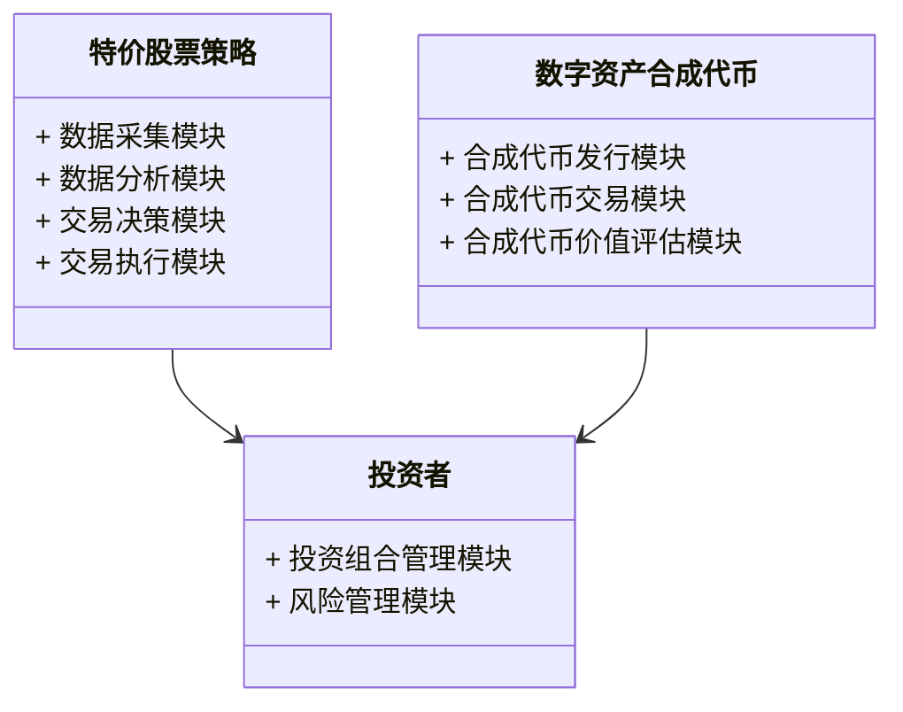
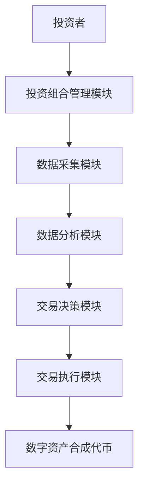
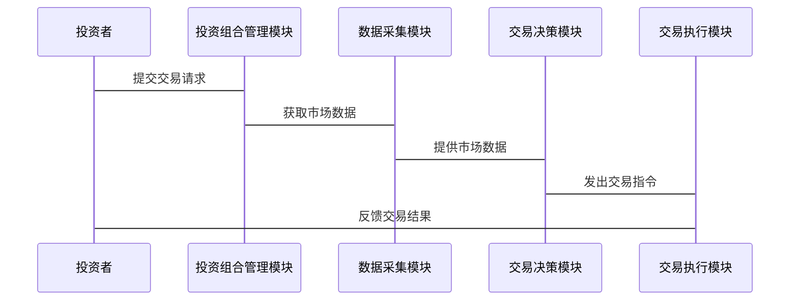

                 


# 如何将特价股票策略与数字资产合成代币投资结合

> 关键词：特价股票策略，数字资产合成代币，投资结合，算法交易，风险管理

> 摘要：本文探讨了如何将特价股票策略与数字资产合成代币投资相结合，分析了两者的结合背景、核心概念，详细讲解了算法实现、系统架构设计，并通过实际案例展示了项目实战，最后提出了最佳实践建议。

---

## 第一部分: 特价股票策略与数字资产合成代币投资的背景与概念

### 第1章: 特价股票策略与数字资产合成代币投资概述

#### 1.1 特价股票策略的定义与特点
##### 1.1.1 特价股票策略的定义
特价股票策略是一种短期交易策略，主要通过捕捉股票价格的短期波动来获利。它通常基于技术分析或基本面分析，结合市场情绪和市场数据，寻找高概率的交易机会。

##### 1.1.2 特价股票策略的核心特点
- **短期性**：通常在较短时间内完成交易，如日内交易或波段交易。
- **高流动性**：选择流动性高的股票，确保可以快速买卖。
- **技术驱动**：依赖技术指标（如K线图、MACD、RSI等）进行交易决策。
- **高风险高回报**：由于短期波动大，风险较高，但潜在回报也较大。

##### 1.1.3 特价股票策略在投资中的作用
特价股票策略在投资中起到补充长期投资的作用，能够在市场波动中捕捉短期收益，优化整体投资组合的表现。

#### 1.2 数字资产合成代币的定义与特点
##### 1.2.1 数字资产合成代币的定义
数字资产合成代币是一种将多种数字资产或传统资产打包成一种新的代币形式的投资工具。它通过智能合约在区块链上实现，允许投资者以一种更便捷的方式持有和交易多样化的资产组合。

##### 1.2.2 数字资产合成代币的核心特点
- **多样性**：可以包含多种资产，如股票、加密货币、黄金等。
- **便捷性**：通过合成代币，投资者可以轻松持有多种资产，无需分别购买和管理。
- **流动性**：数字资产市场具有高流动性，合成代币可以随时买卖。
- **透明性**：基于区块链技术，交易过程透明可追溯。

##### 1.2.3 数字资产合成代币与传统金融资产的区别
| 属性 | 数字资产合成代币 | 传统金融资产 |
|------|-----------------|---------------|
| 交易时间 | 24/7，全天候 | 交易时间受限 |
| 技术基础 | 区块链技术 | 传统金融系统 |
| 透明度 | 高度透明可追溯 | 透明度较低 |
| 创新性 | 可编程、可合成 | 较难创新合成 |

#### 1.3 特价股票策略与数字资产合成代币投资的结合背景
##### 1.3.1 当前金融市场的发展趋势
近年来，金融市场逐渐趋向于数字化和智能化，区块链技术的应用日益广泛，数字资产市场快速崛起，传统金融与数字资产的界限逐渐模糊。

##### 1.3.2 数字资产与传统金融资产的融合
随着区块链技术的发展，数字资产合成代币将传统金融资产与数字资产相结合，为投资者提供了更多元化的投资选择。

##### 1.3.3 技术进步对投资策略的影响
人工智能、大数据分析和区块链技术的进步，为投资策略的优化提供了新的工具和方法，使得特价股票策略与数字资产合成代币投资的结合成为可能。

#### 1.4 本章小结
本章介绍了特价股票策略和数字资产合成代币的基本概念、特点及两者的结合背景，为后续分析奠定了基础。

---

## 第二部分: 特价股票策略与数字资产合成代币投资的核心概念与联系

### 第2章: 特价股票策略的核心原理

#### 2.1 特价股票策略的基本原理
##### 2.1.1 市场波动与投资机会
股票价格的短期波动为投资者提供了快速获利的机会，但同时也伴随着较高的风险。

##### 2.1.2 技术分析与基本面分析的结合
技术分析通过分析价格走势预测未来价格变动，基本面分析通过研究公司财务状况和行业前景评估股票价值，两者结合可以提高交易决策的准确性。

##### 2.1.3 短期交易策略的实施步骤
1. 确定交易目标：设定明确的买卖目标和止损点。
2. 选择交易工具：使用技术指标或算法进行交易决策。
3. 执行交易：快速买卖以捕捉价格波动。
4. 风险管理：控制仓位和杠杆，避免过度风险。

#### 2.2 数字资产合成代币的合成原理
##### 2.2.1 数字资产合成代币的合成机制
通过智能合约将多种资产的价值合成到一种代币中，投资者可以按比例持有不同资产，享受其价值变化带来的收益。

##### 2.2.2 合成代币的发行与流通
合成代币可以在去中心化交易所（如Uniswap、SushiSwap）上发行和交易，其价格由合成的资产价值决定。

##### 2.2.3 合成代币的价值评估
合成代币的价值取决于其包含的资产价值、市场需求和市场流动性的综合影响。

#### 2.3 特价股票策略与数字资产合成代币投资的结合原理
##### 2.3.1 两者的共同点与差异点
| 属性 | 特价股票策略 | 数字资产合成代币投资 |
|------|--------------|---------------------|
| 投资目标 | 短期收益 | 多元化收益 |
| 风险特征 | 高风险 | 中低风险 |
| 交易时间 | 交易时间受限 | 24/7全天候交易 |

##### 2.3.2 结合的理论基础
数字资产合成代币的高流动性与24/7交易时间，为特价股票策略提供了更灵活的交易环境。通过合成代币，投资者可以将股票市场的波动与数字资产市场的流动性相结合，优化投资组合。

##### 2.3.3 结合的实际意义
将特价股票策略与数字资产合成代币投资结合，可以：
- 提高资金利用率，优化资产配置。
- 利用数字资产市场的高流动性，快速进出头寸。
- 降低交易成本，提高投资效率。

#### 2.4 核心概念对比分析
##### 2.4.1 特价股票策略与数字资产合成代币的属性对比
| 属性 | 特价股票策略 | 数字资产合成代币 |
|------|--------------|---------------------|
| 投资期限 | 短期 | 中长期 |
| 资产类型 | 单一资产 | 多元化资产 |
| 风险管理 | 需要严格控制 | 通过分散投资降低风险 |

##### 2.4.2 两者的优劣势对比
- **优势**：结合两者的优势，可以在保持高收益的同时，降低整体风险。
- **劣势**：需要同时管理股票市场和数字资产市场的波动，增加了复杂性。

##### 2.4.3 结合后的优势与风险
- **优势**：
  - 提高资金利用率。
  - 优化资产配置。
  - 利用数字资产市场的高流动性。
- **风险**：
  - 市场波动风险增加。
  - 合成代币的价格波动可能难以预测。
  - 技术风险（如智能合约漏洞）。

#### 2.5 本章小结
本章分析了特价股票策略和数字资产合成代币的核心原理，并探讨了两者的结合方式及其优劣势，为后续的算法实现和系统设计提供了理论基础。

---

## 第三部分: 特价股票策略与数字资产合成代币投资的算法与数学模型

### 第3章: 特价股票策略的算法实现

#### 3.1 特价股票策略的算法概述
##### 3.1.1 算法的核心思想
基于技术分析和市场数据，通过算法自动识别交易机会并执行交易。

##### 3.1.2 算法的实现步骤
1. 数据采集：获取股票的实时价格和市场数据。
2. 数据分析：使用技术指标（如MACD、RSI）分析价格走势。
3. 交易决策：根据分析结果生成买卖信号。
4. 交易执行：通过交易平台自动执行交易指令。

##### 3.1.3 算法的优化方向
- 提高交易模型的准确性。
- 优化风险管理策略。
- 提升算法的执行效率。

#### 3.2 算法实现的数学模型
##### 3.2.1 算法的数学表达式
假设股票价格序列为$P_t$，其中$t$表示时间点。算法基于技术指标计算交易信号，例如使用相对强弱指数（RSI）进行买卖决策。

##### 3.2.2 算法的数学推导
RSI的计算公式为：
$$
RSI(t) = \frac{100 \times (\text{平均上涨幅度})}{\text{平均上涨幅度} + \text{平均下跌幅度}}
$$
当RSI(t) < 30时，买入信号；当RSI(t) > 70时，卖出信号。

##### 3.2.3 算法的数学验证
通过历史数据验证算法的交易信号准确性，计算交易收益和风险指标（如最大回撤、 Sharpe比率等）。

#### 3.3 本章小结
本章详细讲解了特价股票策略的算法实现，包括核心思想、实现步骤和数学模型，并通过技术指标分析和数学验证，为后续的系统设计奠定了基础。

---

## 第四部分: 特价股票策略与数字资产合成代币投资的系统分析与架构设计

### 第4章: 特价股票策略与数字资产合成代币投资的系统架构设计

#### 4.1 问题场景介绍
投资者希望通过数字资产合成代币优化特价股票策略，实现更高效的投资组合管理。

#### 4.2 系统功能设计
##### 4.2.1 领域模型类图


##### 4.2.2 系统架构设计


#### 4.3 系统接口设计
- 数据接口：与股票数据源和数字资产交易所对接。
- 交易接口：与交易平台集成，实现自动交易。
- 用户接口：提供投资组合管理、风险管理等功能。

#### 4.4 系统交互设计


#### 4.5 本章小结
本章通过系统架构设计和接口设计，展示了如何将特价股票策略与数字资产合成代币投资结合，实现高效的投资管理。

---

## 第五部分: 特价股票策略与数字资产合成代币投资的项目实战

### 第5章: 项目实战

#### 5.1 环境安装
- **安装Python**：需要安装Python 3.8及以上版本。
- **安装必要的库**：如Pandas、NumPy、Matplotlib、Binance API等。
- **安装区块链开发工具**：如Solidity、Remix IDE等。

#### 5.2 核心代码实现
##### 5.2.1 数据采集模块
```python
import pandas as pd
import requests

def get_stock_data(symbol):
    url = f"https://api.example.com/stock/{symbol}"
    response = requests.get(url)
    data = response.json()
    return pd.DataFrame(data)
```

##### 5.2.2 交易决策模块
```python
def generate_signals(data):
    # 使用RSI指标生成交易信号
    # 具体实现略
    pass
```

##### 5.2.3 交易执行模块
```python
from binance.client import Client

def execute_trade(symbol, quantity, side):
    client = Client(api_key, api_secret)
    order = client.create_order(
        symbol=symbol,
        quantity=quantity,
        side=side,
        type='market'
    )
    return order
```

##### 5.2.4 合成代币发行模块
```python
def create_synthetic_token(tokens):
    # 使用智能合约发行合成代币
    # 具体实现略
    pass
```

#### 5.3 实际案例分析
##### 5.3.1 案例背景
假设我们选择某只股票和一种加密货币，将其合成一种代币，投资者可以通过持有该代币同时受益于股票价格的上涨和加密货币的波动。

##### 5.3.2 案例分析
通过历史数据验证算法的有效性，分析不同市场环境下的交易表现，优化投资组合的风险管理。

##### 5.3.3 案例小结
通过实际案例分析，验证了算法的有效性和系统的可行性。

#### 5.4 本章小结
本章通过项目实战，详细讲解了如何将特价股票策略与数字资产合成代币投资结合，从环境安装到核心代码实现，再到实际案例分析，为读者提供了完整的解决方案。

---

## 第六部分: 特价股票策略与数字资产合成代币投资的总结与展望

### 第6章: 总结与展望

#### 6.1 本章总结
本文详细探讨了如何将特价股票策略与数字资产合成代币投资结合，分析了两者的结合背景、核心概念，详细讲解了算法实现、系统架构设计，并通过实际案例展示了项目实战。通过本文的分析，读者可以清晰地理解如何利用数字资产合成代币优化特价股票策略，实现更高效的投资管理。

#### 6.2 最佳实践 tips
- 在实施前，确保对数字资产市场和股票市场有充分的了解。
- 合理配置资产，分散投资风险。
- 定期监控交易策略的表现，及时调整。

#### 6.3 未来展望
随着区块链技术和人工智能的进一步发展，特价股票策略与数字资产合成代币投资的结合将更加紧密，未来可能会出现更多创新的投资模式和工具。

#### 6.4 本章小结
本文总结了核心内容，提出了最佳实践建议，并展望了未来的发展方向，为读者提供了全面的指导。

---

## 作者信息

作者：AI天才研究院/AI Genius Institute & 禅与计算机程序设计艺术/Zen And The Art of Computer Programming

---

希望这篇文章能够为您提供有价值的信息，帮助您理解如何将特价股票策略与数字资产合成代币投资结合。如果需要进一步的讨论或深入分析，请随时联系！

