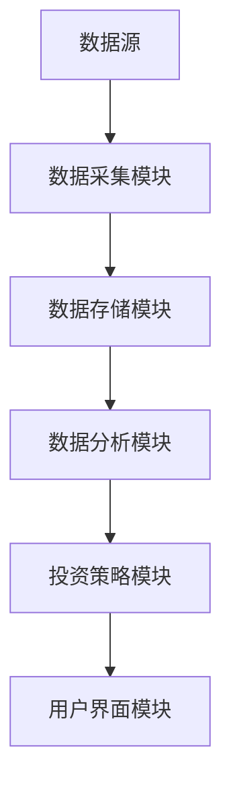
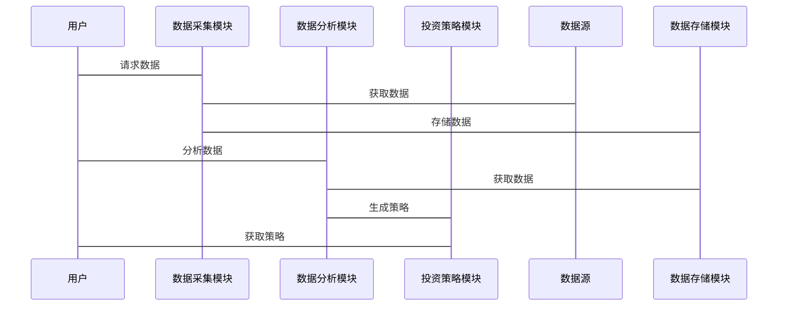

                 


# 如何将特价股票策略与智能资产配置相结合

> 关键词：特价股票策略、智能资产配置、机器学习、算法优化、金融投资

> 摘要：本文详细探讨如何将特价股票策略与智能资产配置相结合，通过机器学习和数据分析提升投资效率和收益。文章从背景介绍、核心概念、算法原理、系统架构、项目实战到最佳实践，全面分析两者结合的策略和方法。

---

## 第一部分: 特价股票策略与智能资产配置的背景介绍

### 第1章: 特价股票策略的基本概念

#### 1.1 什么是特价股票策略
特价股票策略是一种基于市场波动、技术分析和基本面分析的投资策略，旨在在特定条件下以低于市场价买入股票。其核心在于捕捉市场低估的机会，通常在市场下跌或公司出现短期问题时实施。

#### 1.2 特价股票策略的核心要素
- **市场分析**：利用技术指标（如RSI、MACD）和基本面数据（如市盈率、市净率）识别市场机会。
- **选股标准**：筛选出具有低估特性的股票，如低估值、高分红率等。
- **风险管理**：设置止损点和止盈点，控制投资风险。

#### 1.3 特价股票策略的优势与劣势
- **优势**：成本低、收益高、风险可控。
- **劣势**：依赖市场判断，风险较高，需要频繁监控市场变化。

---

### 第2章: 智能资产配置的基本概念

#### 2.1 什么是智能资产配置
智能资产配置是通过算法和数据分析优化投资组合的过程，旨在在不同资产类别之间分配资金，以平衡风险和收益。

#### 2.2 智能资产配置的核心要素
- **数据驱动**：利用历史数据和实时数据进行分析。
- **机器学习**：通过算法预测市场趋势和资产表现。
- **动态调整**：根据市场变化自动优化投资组合。

#### 2.3 智能资产配置的优势与劣势
- **优势**：提高投资效率，降低人为错误，适应市场变化。
- **劣势**：依赖算法和数据质量，可能在极端市场条件下表现不佳。

---

### 第3章: 特价股票策略与智能资产配置的结合意义

#### 3.1 结合的必要性
- 提升投资效率：通过智能算法优化特价股票选择。
- 减少人为错误：利用技术手段提高决策准确性。
- 实现自动化管理：降低人为干预，提高投资效率。

#### 3.2 结合的优势
- 提高收益：通过智能筛选和优化投资组合，捕捉更多市场机会。
- 降低风险：通过动态调整投资组合，控制市场波动带来的风险。

#### 3.3 结合的挑战
- 数据依赖：需要大量高质量的数据支持。
- 技术复杂性：需要结合多种算法和技术。

---

## 第二部分: 特价股票策略与智能资产配置的核心概念与联系

### 第4章: 特价股票策略的核心原理

#### 4.1 市场分析与机会捕捉
- 利用技术指标识别市场趋势。
- 通过基本面分析筛选低估股票。

#### 4.2 技术分析与基本面分析的结合
- 技术分析：使用RSI、MACD等指标预测短期价格走势。
- 基本面分析：评估公司财务状况，判断长期投资价值。

#### 4.3 风险控制与仓位管理
- 设置止损点和止盈点，控制投资风险。
- 根据市场情况调整仓位，避免过度集中。

---

### 第5章: 智能资产配置的核心原理

#### 5.1 数据驱动的资产分析
- 利用历史数据和实时数据进行分析。
- 通过数据挖掘技术发现市场规律。

#### 5.2 机器学习在资产配置中的应用
- 使用回归分析预测资产回报率。
- 利用分类算法识别高风险资产。

#### 5.3 动态调整与优化算法
- 使用动态规划优化投资组合。
- 根据市场变化自动调整资产配置。

---

### 第6章: 特价股票策略与智能资产配置的联系与区别

#### 6.1 联系
- 两者都依赖数据驱动的分析方法。
- 两者都可以通过机器学习技术优化投资决策。

#### 6.2 区别
- 特价股票策略更注重短期价格波动和机会捕捉。
- 智能资产配置更注重长期投资组合的优化和风险管理。

---

## 第三部分: 特价股票策略与智能资产配置的算法原理

### 第7章: 算法原理概述

#### 7.1 特价股票策略的算法
- 技术分析算法：利用指标预测短期价格走势。
- 基本面分析算法：评估公司财务状况。

#### 7.2 智能资产配置的算法
- 回归分析：预测资产回报率。
- 分类算法：识别高风险资产。

#### 7.3 结合算法的原理
- 综合技术分析和基本面分析，优化投资组合。

---

### 第8章: 机器学习模型在股票分析中的应用

#### 8.1 回归分析
- 使用线性回归模型预测股票价格。
- 例如，使用股票的历史价格和交易量预测未来价格。

#### 8.2 分类算法
- 使用随机森林算法识别高风险资产。
- 例如，根据财务指标预测公司违约风险。

#### 8.3 聚类分析
- 使用K-means算法将股票分为不同类别。
- 例如，将股票分为成长股和价值股。

---

## 第四部分: 特价股票策略与智能资产配置的系统分析与架构设计

### 第9章: 系统分析与架构设计方案

#### 9.1 问题场景介绍
- 投资者希望利用特价股票策略优化投资组合，同时通过智能资产配置降低风险。

#### 9.2 项目介绍
- 开发一个结合特价股票策略和智能资产配置的投资管理系统。

#### 9.3 系统功能设计
- 数据采集模块：采集股票数据。
- 分析模块：分析股票数据，识别投资机会。
- 投资策略模块：优化投资组合，生成投资策略。

#### 9.4 系统架构设计
- 使用微服务架构，模块间通过API交互。

#### 9.5 系统接口设计
- 数据接口：与数据源对接，获取实时数据。
- 用户接口：提供用户操作界面。

---

### 第10章: 系统架构图

#### 10.1 系统架构图


#### 10.2 系统交互图


---

## 第五部分: 特价股票策略与智能资产配置的项目实战

### 第11章: 项目实战

#### 11.1 环境安装
- 安装Python和相关库（如pandas、numpy、scikit-learn）。

#### 11.2 核心代码实现
```python
import pandas as pd
import numpy as np
from sklearn.linear_model import LinearRegression
from sklearn.metrics import mean_squared_error

# 数据加载
data = pd.read_csv('stock_data.csv')

# 特征提取
X = data[['open', 'high', 'low', 'volume']]
y = data['close']

# 模型训练
model = LinearRegression()
model.fit(X, y)

# 预测
y_pred = model.predict(X)

# 评估
mse = mean_squared_error(y, y_pred)
print('均方误差:', mse)
```

#### 11.3 案例分析
- 使用历史数据训练模型，预测未来股票价格。
- 根据预测结果生成投资策略。

---

## 第六部分: 最佳实践与总结

### 第12章: 最佳实践

#### 12.1 小结
- 特价股票策略和智能资产配置的结合能够提升投资效率和收益。
- 通过机器学习和数据分析优化投资决策。

#### 12.2 注意事项
- 确保数据质量和完整性。
- 定期更新模型，适应市场变化。

#### 12.3 拓展阅读
- 《机器学习在金融中的应用》
- 《智能投资组合优化》

---

## 结语

通过本文的详细讲解，读者可以理解如何将特价股票策略与智能资产配置相结合，利用机器学习和数据分析优化投资决策。希望本文对投资者和相关技术人士有所帮助。

---

**作者：AI天才研究院/AI Genius Institute & 禅与计算机程序设计艺术 /Zen And The Art of Computer Programming**

