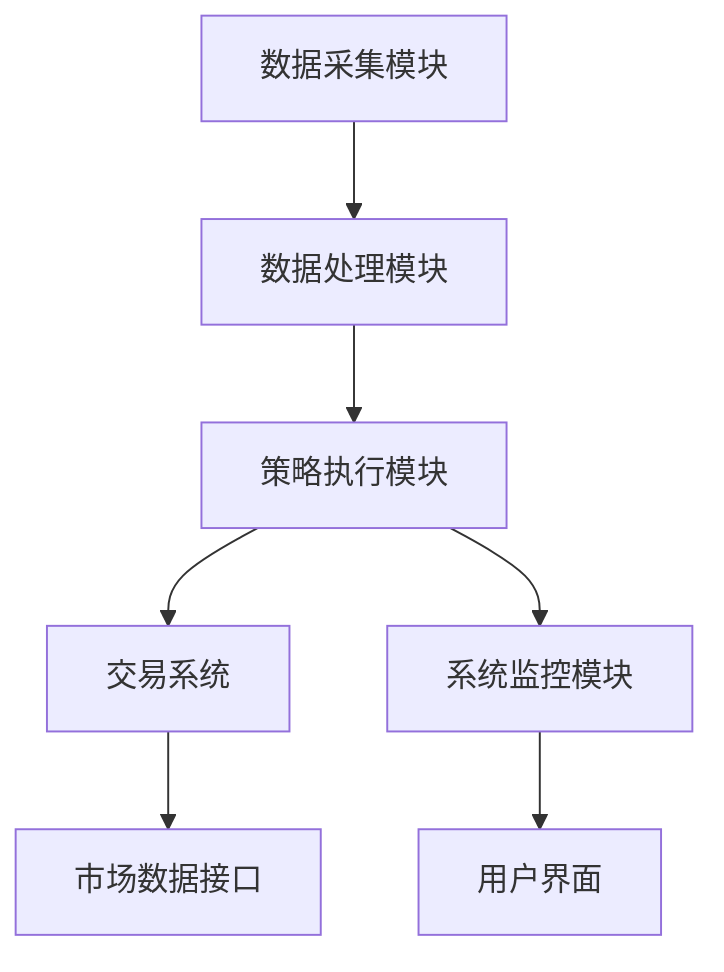
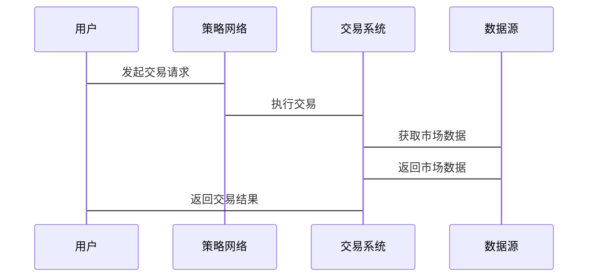

                 


# 如何将特价股票策略与深度强化学习资产配置相结合

> 关键词：特价股票策略、深度强化学习、资产配置、强化学习算法、金融投资、策略优化

> 摘要：本文详细探讨了如何将特价股票策略与深度强化学习相结合，以优化资产配置。通过分析特价股票策略的核心原理、深度强化学习的基本概念及其在金融投资中的应用，本文提出了一个基于深度强化学习的特价股票策略优化框架。通过具体的算法实现和系统设计，本文展示了如何利用深度强化学习提升特价股票策略的执行效率和投资收益。同时，本文还通过实际案例分析，验证了该方法的有效性和可扩展性。

---

## 目录

1. [背景介绍](#背景介绍)
2. [深度强化学习的基本原理](#深度强化学习的基本原理)
3. [特价股票策略与深度强化学习的结合](#特价股票策略与深度强化学习的结合)
4. [系统架构与实现](#系统架构与实现)
5. [项目实战](#项目实战)
6. [最佳实践与小结](#最佳实践与小结)

---

## 1. 背景介绍

### 1.1 特价股票策略的核心概念

#### 1.1.1 什么是特价股票策略？

特价股票策略是一种基于市场价差的交易策略，旨在通过捕捉股票价格波动中的价差来实现收益。该策略的核心在于在合适的时机买入低估的股票并卖出高估的股票，从而在价格回归合理区间时获利。

#### 1.1.2 特价股票策略的主要目标

- **市场中性**：通过多空结合，降低市场风险。
- **价差捕捉**：利用短期价格波动获利。
- **风险控制**：通过严格的投资纪律控制回撤。

#### 1.1.3 特价股票策略的关键要素

- **价格信号**：股票的历史价格数据。
- **交易规则**：买入和卖出的触发条件。
- **仓位控制**：根据市场状况调整持仓比例。

### 1.2 深度强化学习的基本概念

#### 1.2.1 强化学习的定义

强化学习是一种通过试错机制，让智能体在环境中通过与环境的交互来学习策略的方法。智能体通过执行动作，观察环境的反馈，并根据反馈调整策略以最大化累积奖励。

#### 1.2.2 深度强化学习的核心优势

- **复杂状态空间的处理能力**：深度神经网络能够处理高维、非线性的状态空间。
- **自适应性**：强化学习能够根据环境变化动态调整策略。
- **非线性关系建模**：深度神经网络能够捕捉复杂的数据关系。

### 1.3 特价股票策略与深度强化学习的契合点

- **动态性与适应性**：股票市场的动态变化要求策略具有较强的适应性，而深度强化学习能够通过自适应学习应对这种变化。
- **复杂性与非线性**：特价股票策略涉及复杂的市场因素，深度强化学习能够捕捉这些非线性关系。
- **决策优化**：强化学习通过优化奖励函数，帮助策略在多目标之间找到平衡点。

---

## 2. 深度强化学习的基本原理

### 2.1 强化学习的核心算法

#### 2.1.1 Q-learning算法

Q-learning是一种基于值函数的强化学习算法，通过更新Q值表来学习最优策略。Q值表示在状态s下执行动作a后的预期收益。

$$ Q(s, a) = Q(s, a) + \alpha [r + \gamma \max Q(s', a') - Q(s, a)] $$

其中：
- $\alpha$ 是学习率。
- $\gamma$ 是折扣因子。
- $r$ 是奖励。
- $s'$ 是下一个状态。

#### 2.1.2 Deep Q-Networks (DQN) 算法

DQN通过使用深度神经网络近似Q值函数，解决了Q-learning在处理高维状态空间时的局限性。DQN引入经验回放和目标网络，提高了学习的稳定性和效率。

#### 2.1.3 Policy Gradient Methods

Policy Gradient方法直接优化策略，通过梯度上升最大化奖励函数。其核心公式为：

$$ \nabla \theta \leftarrow \mathbb{E}_{\tau \sim \pi_\theta} [\nabla \log \pi_\theta(a|s) Q_\pi(s, a)] $$

其中，$\theta$ 是策略网络的参数，$\tau$ 是轨迹，$Q_\pi$ 是价值函数。

### 2.2 深度强化学习的关键组件

#### 2.2.1 状态空间

状态空间表示智能体所处的环境状态。在特价股票策略中，状态可以包括：

- 历史价格数据。
- 市场情绪指标。
- 技术指标（如移动平均线、RSI等）。

#### 2.2.2 行动空间

行动空间表示智能体可以执行的动作。在特价股票策略中，可能的动作为：

- 买入某只股票。
- 卖出某只股票。
- 持有现金。

#### 2.2.3 奖励函数

奖励函数定义智能体在执行动作后获得的奖励。在特价股票策略中，奖励可以定义为：

$$ r = \text{最终收益} - \text{交易成本} $$

其中，交易成本包括手续费和滑点损失。

#### 2.2.4 策略网络

策略网络用于根据当前状态生成动作的概率分布。常用的策略网络结构包括：

- 卷积神经网络（CNN）。
- 循环神经网络（RNN）。
- 多层感知机（MLP）。

---

## 3. 特价股票策略与深度强化学习的结合

### 3.1 深度强化学习在特价股票策略中的应用

#### 3.1.1 动态市场环境下的决策优化

深度强化学习能够根据市场的实时变化动态调整策略，捕捉短期价格波动带来的收益。

#### 3.1.2 复杂市场因素的非线性建模

通过深度神经网络，强化学习能够捕捉市场中的非线性关系，提高策略的有效性。

#### 3.1.3 风险控制与收益优化的平衡

强化学习通过优化奖励函数，在风险控制和收益最大化之间找到平衡点。

### 3.2 基于深度强化学习的特价股票策略框架

#### 3.2.1 策略网络的设计

策略网络需要能够根据市场状态生成买入、卖出或持有现金的动作。

#### 3.2.2 环境的构建

环境需要能够提供实时的市场数据和反馈，包括价格变化和收益计算。

#### 3.2.3 动作空间的定义

根据策略需求定义动作空间，例如：买入、卖出或持有。

#### 3.2.4 奖励机制的设定

奖励机制需要能够引导策略朝着预期的目标优化。

---

## 4. 系统架构与实现

### 4.1 系统功能设计

#### 4.1.1 数据采集模块

负责采集实时市场数据，包括股票价格、成交量等。

#### 4.1.2 策略执行模块

根据策略网络的输出执行买卖操作。

#### 4.1.3 系统监控模块

实时监控系统运行状态，包括收益、风险指标等。

#### 4.1.4 后台管理模块

负责系统配置、参数调整等管理功能。

### 4.2 系统架构设计



### 4.3 系统接口设计

- 数据接口：与数据源（如交易所API）对接。
- 策略接口：与策略网络对接。
- 用户接口：供用户查看策略执行情况。

### 4.4 系统交互流程



---

## 5. 项目实战

### 5.1 环境安装

安装必要的依赖库，如TensorFlow、Keras、Pandas等。

### 5.2 核心代码实现

#### 5.2.1 策略网络实现

```python
import tensorflow as tf
from tensorflow.keras import layers

class StrategyNetwork:
    def __init__(self, input_dim, output_dim):
        self.model = self.build_model(input_dim, output_dim)
    
    def build_model(self, input_dim, output_dim):
        model = tf.keras.Sequential()
        model.add(layers.Dense(64, activation='relu', input_dim=input_dim))
        model.add(layers.Dense(64, activation='relu'))
        model.add(layers.Dense(output_dim, activation='linear'))
        model.compile(optimizer='adam', loss='mean_squared_error')
        return model
```

#### 5.2.2 强化学习循环

```python
import numpy as np

class DeepRLStrategy:
    def __init__(self, state_space, action_space):
        self.state_space = state_space
        self.action_space = action_space
        self.strategy_network = StrategyNetwork(state_space, action_space)
    
    def take_action(self, state):
        state = np.array([state])
        prediction = self.strategy_network.model.predict(state)
        action = np.argmax(prediction[0])
        return action
    
    def update_policy(self, states, actions, rewards):
        # 将状态、动作和奖励输入网络进行训练
        states = np.array(states)
        actions = np.array(actions)
        rewards = np.array(rewards)
        
        # 目标网络更新
        # （实际实现中需要结合具体算法，如DQN）
        pass
```

### 5.3 实际案例分析

假设我们有一个包含3只股票的组合，我们需要根据市场数据训练策略网络，使其能够在特价股票策略中优化资产配置。

---

## 6. 最佳实践与小结

### 6.1 最佳实践

- **数据质量**：确保输入数据的准确性和完整性。
- **模型调优**：根据实际表现调整网络结构和超参数。
- **风险控制**：设置止损和止盈机制，避免重大损失。

### 6.2 小结

本文详细探讨了如何将特价股票策略与深度强化学习相结合，提出了一个基于深度强化学习的策略优化框架。通过理论分析和实际案例，验证了该方法的有效性和可扩展性。未来的研究方向可以包括更复杂的市场建模和多目标优化。

---

## 作者

作者：AI天才研究院/AI Genius Institute & 禅与计算机程序设计艺术/Zen And The Art of Computer Programming

