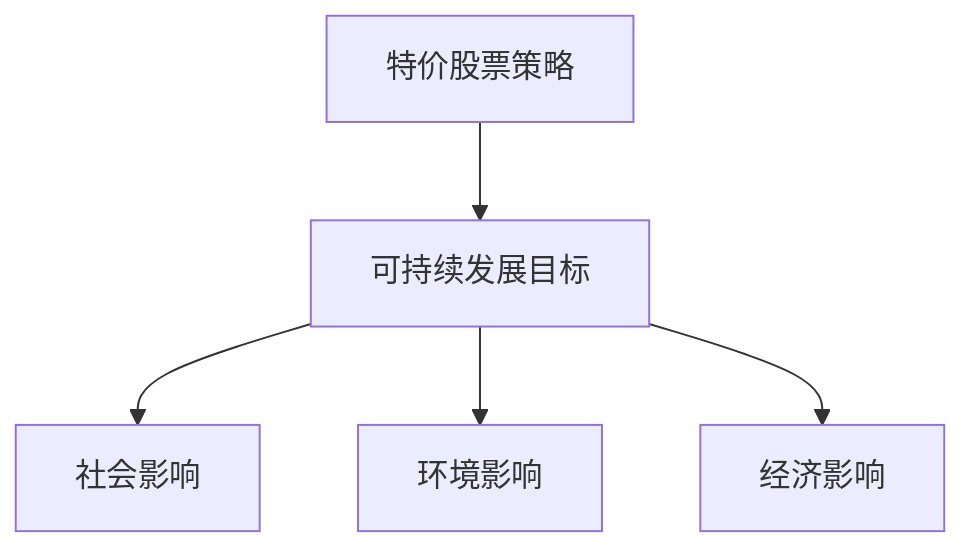
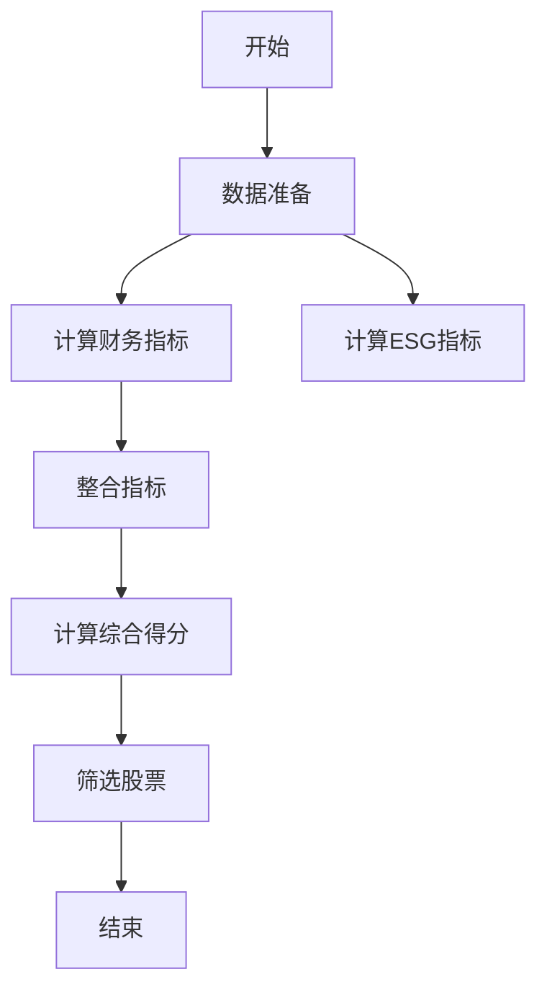
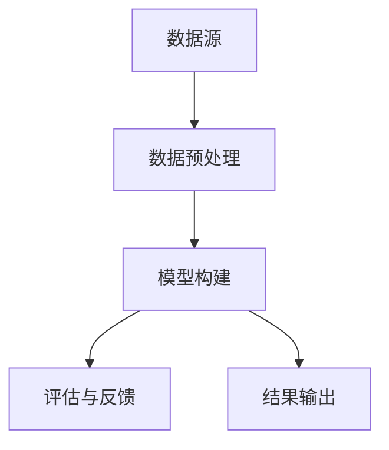

                 


# 如何将特价股票策略与联合国可持续发展目标对接

> **关键词**：特价股票策略、联合国可持续发展目标、ESG投资、多因子模型、算法优化

> **摘要**：本文探讨了如何将特价股票策略与联合国可持续发展目标相结合，通过引入环境、社会和治理（ESG）指标，构建一个多因子投资模型，实现经济回报与社会责任的双赢。文章详细分析了核心概念、算法原理、系统架构，并通过实际案例展示了如何在投资实践中应用这些理念。

---

## 第一部分：背景介绍

### 第1章：特价股票策略与联合国可持续发展目标概述

#### 1.1 特价股票策略的核心概念

- **1.1.1 特价股票的定义与特点**
  特价股票是指市场价格低于其内在价值的股票，通常具有较高的安全边际。投资者通过分析公司基本面，寻找被市场低估的投资标的。其特点包括低市盈率、低市净率和高股息率等。

- **1.1.2 特价股票策略的基本原理**
  投资者通过深入分析公司的财务报表，识别那些市场价格低于其真实价值的股票。该策略强调安全边际和长期持有的理念，旨在在市场低估时买入，待价值回归时卖出。

- **1.1.3 特价股票策略的边界与外延**
  该策略不仅关注价格，还涉及对公司管理、行业地位和财务健康状况的评估。外延方面，可持续发展目标为其提供了新的评估维度。

#### 1.2 联合国可持续发展目标的核心要素

- **1.2.1 可持续发展目标的定义与原则**
  联合国提出的17个SDGs，旨在2030年前实现消除贫困、保护地球和促进繁荣等目标。这些目标强调经济、社会和环境的协调发展，要求企业在追求利润的同时，承担社会责任。

- **1.2.2 可持续发展目标的17个具体目标**
  包括消除贫困、消除饥饿、良好健康与福祉、优质教育、性别平等、清洁用水、经济体系包容性、体面工作和经济增长、工业创新、基础设施建设、减少不平等、和平正义、气候变化应对、保护生态系统、水下生物、陆地生物、和平、伙伴关系和资金支持。

- **1.2.3 可持续发展目标的实现路径**
  包括政策制定、技术创新、资金支持和企业责任等。企业通过采用可持续发展模式，提升竞争力和社会影响力。

#### 1.3 特价股票策略与可持续发展目标的关联性

- **1.3.1 特价股票策略与可持续发展的内在联系**
  特价股票策略关注价值低估企业，而可持续发展目标关注企业社会责任。两者的结合点在于企业既有良好的社会表现，又处于估值低洼区。

- **1.3.2 可持续发展目标对投资策略的指导意义**
  可持续发展目标为投资提供了新的筛选维度，帮助投资者识别那些在ESG方面表现优异且估值合理的公司。

- **1.3.3 特价股票策略在可持续发展中的潜在作用**
  通过投资具有可持续发展优势的企业，投资者不仅获得超额收益，还推动了社会和环境的改善。

---

## 第二部分：核心概念与联系

### 第2章：特价股票策略与可持续发展目标的内在联系

#### 2.1 核心概念的原理分析

- **2.1.1 特价股票策略的数学模型**
  通过分析市盈率（P/E）、市净率（P/B）等指标，计算股票的内在价值。公式如下：
  $$ \text{内在价值} = \text{未来现金流的现值} $$

- **2.1.2 可持续发展目标的评价指标**
  包括碳排放强度、员工满意度、董事会多样性等ESG指标。这些指标量化了企业在可持续发展方面的表现。

- **2.1.3 两者结合的逻辑框架**
  将ESG指标融入股票筛选标准，构建多因子模型，综合考虑财务指标和ESG表现，识别具有投资价值和社会价值的企业。

#### 2.2 核心概念的属性特征对比

下表对比了特价股票策略与可持续发展目标在目标、方法和效果上的异同：

| **维度** | **特价股票策略** | **可持续发展目标** |
|----------|-------------------|--------------------|
| **目标** | 寻找低估股票      | 推动社会和环境发展 | 
| **方法** | 财务指标分析      | ESG指标评估        |
| **效果** | 获得超额收益      | 实现可持续发展      |

#### 2.3 ER实体关系图架构



---

## 第三部分：算法原理讲解

### 第3章：特价股票策略与可持续发展目标对接的算法模型

#### 3.1 算法原理

- **多因子模型的构建**
  通过整合财务指标（如市盈率、ROE）和ESG指标（如碳排放、员工满意度），构建多因子模型。公式如下：
  $$ \text{综合得分} = \sum_{i=1}^{n} w_i \cdot x_i $$
  其中，\( w_i \) 是因子权重，\( x_i \) 是因子值。

- **可持续发展因子的引入**
  将ESG指标权重化，确保其在模型中的重要性。例如，权重分配为30%财务指标和70%ESG指标。

- **模型的优化与调整**
  使用回归分析评估各因子对收益的贡献度，调整权重以优化模型表现。

#### 3.2 算法流程图



#### 3.3 代码实现

```python
import pandas as pd
import numpy as np

# 示例数据：假设df包含股票代码、财务指标、ESG指标
def calculate_esg_score(df):
    # 计算ESG综合得分
    df['ESG_Score'] = df[['碳排放', '员工满意度', '董事会多样性']].mean(axis=1)
    return df

def multi_factor_model(df, weights):
    # 计算综合得分
    df['综合得分'] = df['财务指标'].fillna(0) * weights[0] + df['ESG_Score'].fillna(0) * weights[1]
    return df

# 示例权重：财务指标占30%，ESG占70%
weights = [0.3, 0.7]
df = pd.DataFrame({
    '股票代码': ['A', 'B', 'C'],
    '财务指标': [1.2, 0.8, 1.5],
    '碳排放': [0.5, 0.7, 0.6],
    '员工满意度': [0.8, 0.6, 0.9],
    '董事会多样性': [0.7, 0.5, 0.8]
})

df = calculate_esg_score(df)
df = multi_factor_model(df, weights)
print(df)
```

---

## 第四部分：系统分析与架构设计

### 第4章：系统架构设计与实现

#### 4.1 项目背景与目标

本项目旨在开发一个将SDGs指标融入股票筛选模型的投资系统，帮助投资者实现可持续投资。

#### 4.2 系统功能设计

- **数据收集模块**：获取股票的财务数据和ESG指标。
- **模型构建模块**：计算多因子模型，生成综合得分。
- **评估与反馈模块**：监控投资表现，调整模型参数。

#### 4.3 系统架构图



---

## 第五部分：项目实战

### 第5章：项目实施与案例分析

#### 5.1 环境安装与配置

安装必要的Python库：
```bash
pip install pandas numpy matplotlib
```

#### 5.2 核心代码实现

```python
import pandas as pd
import numpy as np

# 数据准备
df = pd.DataFrame({
    '股票代码': ['A', 'B', 'C'],
    '市盈率': [15, 20, 12],
    '员工满意度': [0.8, 0.6, 0.9],
    '碳排放': [0.5, 0.7, 0.6],
    '董事会多样性': [0.7, 0.5, 0.8]
})

# 定义权重
weights = {'市盈率': 0.3, '员工满意度': 0.2, '碳排放': 0.3, '董事会多样性': 0.2}

# 计算综合得分
df['综合得分'] = (df['市盈率'] * weights['市盈率'] +
                  df['员工满意度'] * weights['员工满意度'] +
                  df['碳排放'] * weights['碳排放'] +
                  df['董事会多样性'] * weights['董事会多样性'])

print(df)
```

#### 5.3 案例分析与解读

以某企业为例，假设其市盈率为12，员工满意度为0.9，碳排放为0.5，董事会多样性为0.8。计算其综合得分为：
$$ 12 \times 0.3 + 0.9 \times 0.2 + 0.5 \times 0.3 + 0.8 \times 0.2 = 4.9 $$

---

## 第六部分：总结与展望

### 第6章：总结与未来展望

#### 6.1 项目总结

通过引入ESG指标，构建多因子模型，投资者能够在追求超额收益的同时，推动社会和环境的可持续发展。

#### 6.2 小结

本文详细探讨了如何将特价股票策略与可持续发展目标相结合，提出了一个创新的投资模型，为投资者提供了新的思路。

#### 6.3 注意事项

投资者在实际操作中需注意数据的准确性和模型的可解释性，避免片面追求ESG指标而忽视企业基本面。

#### 6.4 拓展阅读

推荐书籍：《可持续金融：投资与ESG》、《投资学精要》。

---

## 作者

作者：AI天才研究院 & 禅与计算机程序设计艺术

---

通过以上结构，文章详细分析了如何将特价股票策略与联合国可持续发展目标对接，为投资者提供了理论和实践指导，具有重要的现实意义。

