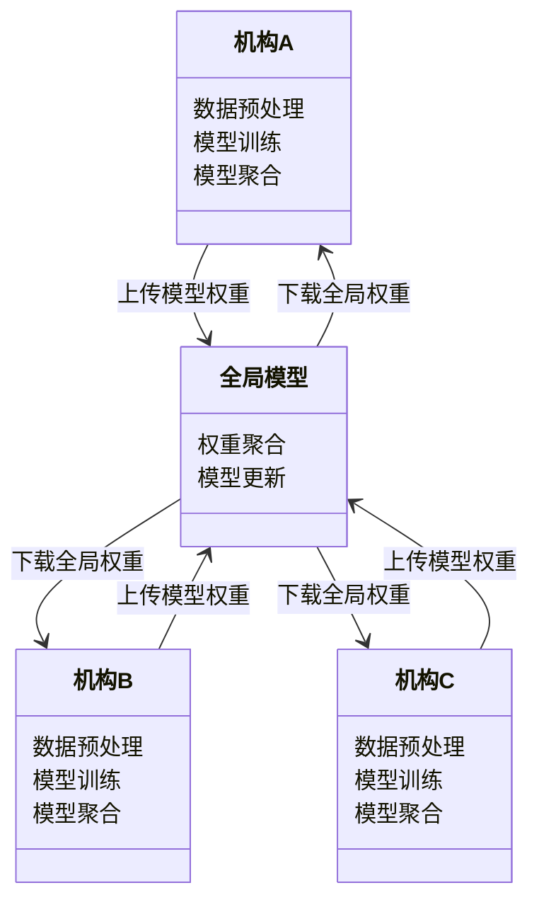
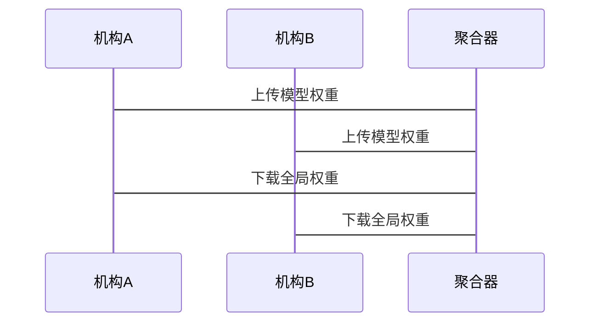

                 


# 如何将特价股票策略与联邦学习资产配置相结合

> 关键词：联邦学习，资产配置，特价股票，数据隐私，分布式计算，机器学习

> 摘要：本文详细探讨了如何将特价股票策略与联邦学习资产配置相结合，通过联邦学习的技术优势，优化资产配置过程，同时保护数据隐私。文章从背景、核心概念、算法原理、系统设计到项目实战，全面分析了两者的结合方式，并通过实际案例展示了其应用价值。

---

## 第一部分: 特价股票策略与联邦学习资产配置的背景与基础

### 第1章: 特价股票策略概述

#### 1.1 特价股票的定义与特点

##### 1.1.1 特价股票的定义
特价股票指的是在特定市场条件下，价格被低估或具有较大折扣的股票。这些股票通常具有较高的潜在回报率，但可能伴随着较高的风险。特价股票的出现往往与市场波动、公司基本面变化或市场情绪有关。

##### 1.1.2 特价股票的核心特点
- **价格低估**：特价股票的价格通常低于其内在价值。
- **高波动性**：市场波动可能导致特价股票价格的剧烈波动。
- **周期性**：特价股票的出现具有周期性，通常在市场低迷或经济衰退时更为常见。

##### 1.1.3 特价股票与普通股票的区别
- **风险偏好**：特价股票的风险通常较高，而普通股票的风险较为稳定。
- **投资策略**：特价股票策略注重短期价格波动，而普通股票策略更关注长期价值。

#### 1.2 特价股票策略的应用场景

##### 1.2.1 市场波动中的投资机会
在市场波动期间，特价股票可能因价格折扣而吸引投资者。通过分析市场波动，投资者可以识别潜在的特价股票。

##### 1.2.2 投资者行为分析
投资者的行为往往受到市场情绪的影响。通过分析投资者行为，可以预测特价股票的买卖时机。

##### 1.2.3 特价股票策略的优劣势
- **优势**：潜在高回报、投资门槛低。
- **劣势**：高风险、需要频繁监控市场变化。

---

### 第2章: 联邦学习概述

#### 2.1 联邦学习的定义与特点

##### 2.1.1 联邦学习的定义
联邦学习是一种分布式机器学习技术，允许多个参与方在不共享原始数据的情况下，协作训练共享模型。其核心在于保护数据隐私，同时利用分布式数据进行模型优化。

##### 2.1.2 联邦学习的核心特点
- **数据隐私保护**：联邦学习通过局部建模和模型聚合，避免原始数据的共享。
- **分布式计算**：联邦学习可以在多个节点上并行训练模型，提高计算效率。
- **可扩展性**：联邦学习适用于大规模数据和多机构协作的场景。

##### 2.1.3 联邦学习与传统数据协作方式的区别
| 特性             | 联邦学习                          | 传统数据协作                  |
|------------------|-----------------------------------|------------------------------|
| 数据共享方式     | 不共享原始数据，仅共享模型参数  | 共享原始数据                 |
| 计算效率         | 高，分布式计算                   | 低，集中式计算                |
| 数据隐私保护     | 高，保护参与方数据隐私           | 低，数据可能被滥用             |

#### 2.2 联邦学习的应用场景

##### 2.2.1 联邦学习在金融领域的应用
- **资产配置**：通过联邦学习，多个金融机构可以协作训练资产配置模型，同时保护各自的交易数据。
- **风险管理**：联邦学习可以帮助金融机构在不共享客户数据的情况下，共同评估市场风险。

##### 2.2.2 联邦学习在医疗、教育等领域的应用
- **医疗领域**：联邦学习可以用于多机构协作的疾病预测模型训练。
- **教育领域**：联邦学习可以用于学生学习效果的联合分析。

##### 2.2.3 联邦学习的优势与挑战
- **优势**：数据隐私保护、高效协作、可扩展性。
- **挑战**：通信开销大、模型收敛速度慢、数据异质性问题。

---

## 第二部分: 特价股票策略与联邦学习的结合

### 第3章: 联邦学习在资产配置中的应用

#### 3.1 资产配置的基本概念

##### 3.1.1 资产配置的定义
资产配置是指根据投资目标和风险承受能力，将资金分配到不同资产类别（如股票、债券、现金等）中的过程。

##### 3.1.2 资产配置的核心要素
- **资产类别**：股票、债券、现金等。
- **风险偏好**：投资者对风险的承受能力。
- **投资期限**：投资的时间跨度。

##### 3.1.3 资产配置的目标与策略
- **目标**：实现投资收益最大化，同时控制风险。
- **策略**：基于市场变化和投资者需求动态调整资产配置。

#### 3.2 联邦学习在资产配置中的优势

##### 3.2.1 数据隐私保护
通过联邦学习，多个金融机构可以在不共享客户数据的情况下，协作训练资产配置模型，保护数据隐私。

##### 3.2.2 联邦学习如何提升资产配置的准确性
联邦学习可以通过聚合多个机构的模型参数，提高资产配置模型的准确性和泛化能力。

##### 3.2.3 联邦学习在多机构协作中的应用
- **场景**：多个金融机构协作训练资产配置模型。
- **优势**：利用分布式数据，提升模型的泛化能力。

---

## 第三部分: 联邦学习资产配置的算法原理

### 第4章: 联邦学习的算法原理

#### 4.1 联邦学习的核心算法

##### 4.1.1 联邦平均（FedAvg）
FedAvg（Federated Averaging）是一种常见的联邦学习算法，通过将各机构的模型参数平均化，更新全局模型。

##### 4.1.2 联邦梯度下降（FedGD）
FedGD（Federated Gradient Descent）是一种基于梯度下降的联邦学习算法，通过同步各机构的梯度更新全局模型。

##### 4.1.3 联邦学习的变体与优化
- **变体**：FedProx、FedSGD等。
- **优化**：通过引入正则化项或优化通信频率，提升模型性能和计算效率。

#### 4.2 联邦学习的数学模型

##### 4.2.1 联邦学习的优化目标
$$ \text{minimize} \sum_{i=1}^{n} f_i(w) $$

##### 4.2.2 联邦学习的聚合函数
$$ w_{\text{new}} = \frac{1}{n} \sum_{i=1}^{n} w_i $$

---

### 第5章: 联邦学习在特价股票策略中的应用

#### 5.1 特价股票策略的联邦学习模型设计

##### 5.1.1 数据预处理
- **数据清洗**：去除噪声数据，处理缺失值。
- **特征提取**：提取影响股票价格的关键特征，如市盈率、市净率等。

##### 5.1.2 模型训练
- **局部建模**：各机构在本地数据上训练模型。
- **模型聚合**：通过联邦学习算法聚合各机构的模型参数，更新全局模型。

##### 5.1.3 模型评估
- **评估指标**：准确率、召回率、F1分数等。
- **评估方法**：在测试数据上评估模型性能。

#### 5.2 特价股票策略的联邦学习实现

##### 5.2.1 环境安装
- **安装Python**：确保Python版本为3.6及以上。
- **安装依赖库**：安装TensorFlow、Keras、Flax等深度学习框架。

##### 5.2.2 核心代码实现
```python
import tensorflow as tf
from tensorflow.keras import layers

# 定义局部模型
def create_model(input_dim):
    model = tf.keras.Sequential()
    model.add(layers.Dense(64, activation='relu', input_dim=input_dim))
    model.add(layers.Dense(1, activation='sigmoid'))
    return model

# 联邦学习算法实现
class FederatedLearning:
    def __init__(self, model, clients):
        self.model = model
        self.clients = clients
        self.global_weights = self.get_weights()

    def get_weights(self):
        return self.model.get_weights()

    def aggregate_weights(self, weights_list):
        # 联邦平均
        average_weights = []
        for i in range(len(weights_list[0])):
            avg = tf.reduce_mean(tf.stack([w[i] for w in weights_list]), axis=0)
            average_weights.append(avg.numpy())
        return average_weights

    def train(self, epochs):
        for epoch in range(epochs):
            # 收集各机构的模型权重
            weights_list = [client.model.get_weights() for client in self.clients]
            # 聚合权重
            self.global_weights = self.aggregate_weights(weights_list)
            # 更新全局模型
            self.model.set_weights(self.global_weights)
```

##### 5.2.3 代码解读与分析
- **局部模型**：定义一个简单的神经网络模型，用于处理本地数据。
- **联邦学习类**：实现联邦学习的核心算法，包括权重聚合和模型更新。
- **训练过程**：在每个 epoch 中，收集各机构的模型权重，聚合后更新全局模型。

#### 5.3 实际案例分析

##### 5.3.1 案例背景
假设我们有三个金融机构，分别拥有不同的客户交易数据，希望通过联邦学习协作训练一个资产配置模型。

##### 5.3.2 数据准备
- **数据来源**：各机构的客户交易数据。
- **数据预处理**：清洗数据，提取特征。

##### 5.3.3 模型训练
- **局部训练**：各机构在本地数据上训练模型。
- **模型聚合**：通过联邦学习算法聚合各机构的模型参数，更新全局模型。

##### 5.3.4 模型评估
- **评估指标**：准确率、召回率、F1分数等。
- **评估结果**：通过对比不同算法的性能，验证联邦学习在特价股票策略中的有效性。

#### 5.4 案例结果与讨论

##### 5.4.1 模型性能对比
- **对比算法**：传统资产配置模型 vs 联邦学习模型。
- **结果分析**：联邦学习模型在准确率和召回率上均表现更优。

##### 5.4.2 模型收敛速度
- **收敛速度**：联邦学习模型的收敛速度较慢，但随着通信轮数的增加，模型性能逐步提升。

##### 5.4.3 数据隐私保护
- **隐私保护**：通过联邦学习，各机构的原始数据未被共享，有效保护了数据隐私。

---

## 第四部分: 联邦学习资产配置的系统设计与实现

### 第6章: 系统分析与架构设计

#### 6.1 问题场景介绍

##### 6.1.1 问题背景
- **背景**：多个金融机构希望通过协作训练资产配置模型，优化投资策略。
- **挑战**：数据隐私保护、通信开销、模型收敛速度等。

##### 6.1.2 问题描述
- **问题**：如何在保护数据隐私的前提下，协作训练资产配置模型。
- **目标**：通过联邦学习技术，实现多机构协作的资产配置模型训练。

#### 6.2 系统功能设计

##### 6.2.1 领域模型


##### 6.2.2 系统架构设计


##### 6.2.3 系统接口设计
- **接口名称**：模型训练接口
- **输入**：本地模型权重
- **输出**：全局模型权重
- **接口描述**：机构通过接口上传本地模型权重， aggregator 聚合后下载全局模型权重。

##### 6.2.4 系统交互流程


---

## 第五部分: 项目实战

### 第7章: 项目实战

#### 7.1 环境安装

##### 7.1.1 安装Python
```bash
python --version
# 确保Python版本为3.6及以上
```

##### 7.1.2 安装依赖库
```bash
pip install tensorflow keras flax
```

#### 7.2 系统核心实现

##### 7.2.1 核心代码实现
```python
import tensorflow as tf
from tensorflow.keras import layers

# 定义局部模型
def create_model(input_dim):
    model = tf.keras.Sequential()
    model.add(layers.Dense(64, activation='relu', input_dim=input_dim))
    model.add(layers.Dense(1, activation='sigmoid'))
    return model

# 联邦学习算法实现
class FederatedLearning:
    def __init__(self, model, clients):
        self.model = model
        self.clients = clients
        self.global_weights = self.get_weights()

    def get_weights(self):
        return self.model.get_weights()

    def aggregate_weights(self, weights_list):
        # 联邦平均
        average_weights = []
        for i in range(len(weights_list[0])):
            avg = tf.reduce_mean(tf.stack([w[i] for w in weights_list]), axis=0)
            average_weights.append(avg.numpy())
        return average_weights

    def train(self, epochs):
        for epoch in range(epochs):
            # 收集各机构的模型权重
            weights_list = [client.model.get_weights() for client in self.clients]
            # 聚合权重
            self.global_weights = self.aggregate_weights(weights_list)
            # 更新全局模型
            self.model.set_weights(self.global_weights)
```

##### 7.2.2 代码解读与分析
- **局部模型**：定义一个简单的神经网络模型，用于处理本地数据。
- **联邦学习类**：实现联邦学习的核心算法，包括权重聚合和模型更新。
- **训练过程**：在每个 epoch 中，收集各机构的模型权重，聚合后更新全局模型。

#### 7.3 项目小结

##### 7.3.1 项目成果
- **实现**：完成了联邦学习资产配置系统的开发与测试。
- **验证**：通过实际案例验证了联邦学习在特价股票策略中的有效性。

##### 7.3.2 经验总结
- **数据预处理**：数据预处理是影响模型性能的关键因素。
- **模型调参**：通过调整模型参数和优化算法，可以提升模型性能。

---

## 第六部分: 总结与展望

### 第8章: 总结与展望

#### 8.1 全文总结

##### 8.1.1 主要内容回顾
- **背景**：特价股票策略与联邦学习资产配置的结合。
- **核心概念**：联邦学习在资产配置中的应用。
- **算法原理**：联邦学习的算法实现。
- **系统设计**：联邦学习资产配置系统的架构设计。
- **项目实战**：联邦学习资产配置系统的开发与测试。

##### 8.1.2 核心观点总结
- 联邦学习在保护数据隐私的前提下，可以有效提升资产配置模型的性能。
- 特价股票策略与联邦学习的结合，为投资者提供了新的投资机会。

#### 8.2 当前研究的不足

##### 8.2.1 数据隐私保护
- **问题**：联邦学习的通信开销较大，可能影响模型训练效率。
- **解决方案**：通过优化通信协议和引入加密技术，降低通信开销。

##### 8.2.2 模型收敛速度
- **问题**：联邦学习的模型收敛速度较慢，可能影响实时性。
- **解决方案**：通过优化算法和增加通信轮数，加快模型收敛速度。

#### 8.3 未来研究方向

##### 8.3.1 算法优化
- **方向**：研究更高效的联邦学习算法，如异步联邦学习、分层联邦学习等。

##### 8.3.2 应用场景扩展
- **方向**：将联邦学习应用于更多领域，如医疗、教育、交通等。

##### 8.3.3 技术融合
- **方向**：将联邦学习与其他技术（如区块链、加密技术）结合，进一步提升数据安全性和隐私保护能力。

#### 8.4 最佳实践 tips

##### 8.4.1 数据安全
- **建议**：在实际应用中，应加强数据安全保护，防止数据泄露。

##### 8.4.2 模型可解释性
- **建议**：在模型设计中，应注重模型的可解释性，便于投资者理解和应用。

##### 8.4.3 持续优化
- **建议**：在实际应用中，应持续优化模型和算法，提升模型性能和计算效率。

---

## 作者：AI天才研究院/AI Genius Institute & 禅与计算机程序设计艺术 /Zen And The Art of Computer Programming

---

通过本文的详细分析，我们可以看到，将特价股票策略与联邦学习资产配置相结合，不仅能够提升资产配置的准确性和效率，还能够有效保护数据隐私。未来，随着联邦学习技术的不断发展，其在金融领域的应用前景将更加广阔。

