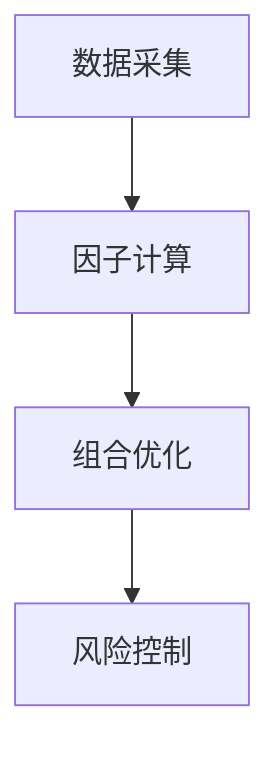
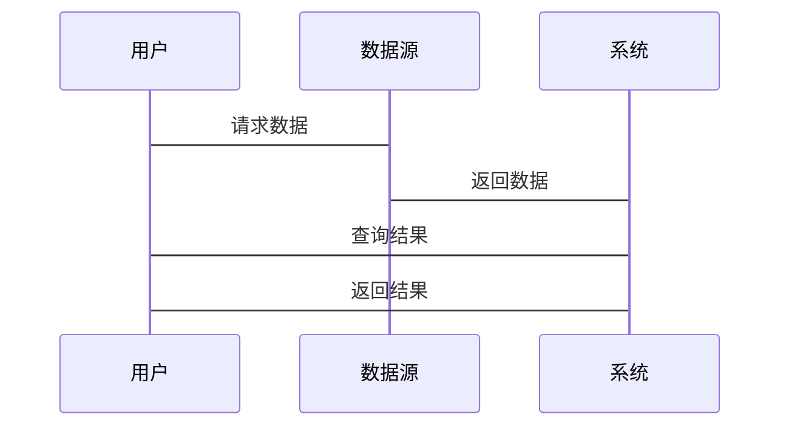

                 


# 如何将特价股票策略与质量因子投资相结合

> 关键词：特价股票、质量因子、投资策略、量化分析、风险管理

> 摘要：本文详细探讨了如何将特价股票策略与质量因子投资相结合，通过量化分析和系统设计，构建出一种兼顾低估值和高质量的股票筛选模型，从而优化投资组合并提高收益。

---

# 第1章 特价股票策略与质量因子投资的背景与概念

## 1.1 特价股票策略的定义与特点
### 1.1.1 特价股票的定义
特价股票是指那些市场价格低于其内在价值的股票。通常，这些股票可能被市场低估，或者由于某些短期因素导致价格下跌，但其基本面仍然稳健。

### 1.1.2 特价股票策略的核心特点
1. **低估值**：主要关注市盈率（P/E）和市净率（P/B）等估值指标。
2. **逆向投资**：在市场低迷时寻找被低估的机会。
3. **长期视角**：注重公司基本面的稳定性，而非短期市场波动。

### 1.1.3 特价股票策略的应用场景
适用于市场低迷时期或行业周期性低谷时，寻找具有长期潜力的股票。

## 1.2 质量因子投资的定义与特点
### 1.2.1 质量因子的定义
质量因子是指公司财务健康状况的量化指标，通常包括高收益率、高账面价值等。

### 1.2.2 质量因子的核心特点
1. **高收益率**：公司盈利能力强。
2. **低财务杠杆**：公司负债较低，财务风险小。
3. **高流动性**：股票交易活跃，易于买卖。

### 1.2.3 质量因子投资的应用场景
适用于长期投资，尤其是寻找具有持续盈利能力和财务健康状况的公司。

## 1.3 特价股票策略与质量因子投资的结合意义
### 1.3.1 结合的逻辑与优势
通过结合低估值和高质量因子，可以在市场低迷时筛选出具有长期增长潜力的股票。

### 1.3.2 结合的潜在价值与风险
1. **潜在价值**：能够在市场低谷时找到价值被低估的优质股票。
2. **风险**：可能会遗漏一些短期表现不佳但长期增长潜力大的股票。

### 1.3.3 结合的创新性与实践意义
通过结合两种策略，可以在市场波动中找到平衡点，优化投资组合的风险收益比。

## 1.4 本章小结
本章介绍了特价股票策略和质量因子投资的基本概念，并探讨了它们结合的逻辑、优势和潜在风险。

---

# 第2章 特价股票策略的核心原理

## 2.1 特价股票的识别方法
### 2.1.1 市盈率（P/E）分析
市盈率 = 市场价格 / 每股收益  
公式：$$ P/E = \frac{Price}{Earnings} $$

### 2.1.2 市净率（P/B）分析
市净率 = 市场价格 / 每股净资产  
公式：$$ P/B = \frac{Price}{Book\ Value} $$

### 2.1.3 其他估值指标的使用
包括股息率、PEG比率等。

## 2.2 特价股票策略的实施步骤
### 2.2.1 确定投资目标
明确投资目标和风险承受能力。

### 2.2.2 数据收集与筛选
收集历史数据，筛选出符合条件的股票。

### 2.2.3 策略优化与调整
根据市场变化调整筛选条件。

## 2.3 特价股票策略的数学模型
### 2.3.1 市盈率模型
$$ P/E = \frac{Price}{Earnings} $$

### 2.3.2 市净率模型
$$ P/B = \frac{Price}{Book\ Value} $$

## 2.4 本章小结
本章详细讲解了特价股票策略的核心原理和实施步骤，并通过数学模型展示了如何进行估值分析。

---

# 第3章 质量因子投资的核心原理

## 3.1 质量因子的定义与分类
### 3.1.1 收益率（Earnings Yield）
$$ Earnings\ Yield = \frac{Earnings}{Price} $$

### 3.1.2 账面价值（Book Value）
$$ Book\ Value = \frac{Total\ Assets - Intangible\ Assets}{Total\ Equity} $$

### 3.1.3 其他质量因子的扩展
包括杠杆率、流动比率等。

## 3.2 质量因子的计算方法
### 3.2.1 收益率计算
$$ Earnings\ Yield = \frac{Earnings}{Price} $$

### 3.2.2 账面价值计算
$$ Book\ Value = \frac{Total\ Assets - Intangible\ Assets}{Total\ Equity} $$

## 3.3 质量因子投资的实施步骤
### 3.3.1 确定质量因子
选择关键的质量指标。

### 3.3.2 数据收集与筛选
收集历史数据，筛选出符合条件的股票。

### 3.3.3 组合优化与调整
根据市场变化优化投资组合。

## 3.4 本章小结
本章详细讲解了质量因子投资的核心原理和实施步骤，并通过数学模型展示了如何进行质量因子计算。

---

# 第4章 特价股票策略与质量因子投资的结合

## 4.1 结合的理论基础
### 4.1.1 投资组合理论
通过结合低估值和高质量因子，优化投资组合的风险收益比。

### 4.1.2 现代投资组合理论（MPT）
通过分散投资降低风险。

## 4.2 结合的数学模型
### 4.2.1 综合评分模型
$$ Score = \alpha \cdot P/E + \beta \cdot Earnings\ Yield $$

### 4.2.2 优化模型
$$ \text{Maximize } \mu \text{ subject to } \sigma \leq \text{风险约束} $$

## 4.3 结合的实施步骤
### 4.3.1 确定筛选条件
综合考虑市盈率、市净率和收益率等因素。

### 4.3.2 数据分析与筛选
利用大数据分析技术筛选出符合条件的股票。

### 4.3.3 组合构建与调整
根据市场变化动态调整投资组合。

## 4.4 实证分析
### 4.4.1 数据来源与处理
使用历史数据进行回测。

### 4.4.2 模型验证
验证模型的有效性和稳定性。

## 4.5 本章小结
本章详细讲解了如何将特价股票策略与质量因子投资相结合，并通过数学模型和实证分析展示了其有效性。

---

# 第5章 系统分析与架构设计

## 5.1 系统功能设计
### 5.1.1 数据采集模块
负责收集股票数据。

### 5.1.2 因子计算模块
负责计算市盈率、市净率等指标。

### 5.1.3 组合优化模块
负责构建投资组合。

### 5.1.4 风险控制模块
负责监控和管理投资风险。

## 5.2 系统架构设计


## 5.3 系统接口设计
### 5.3.1 数据接口
与数据源进行交互。

### 5.3.2 用户接口
提供给用户查询和管理功能。

## 5.4 系统交互设计


## 5.5 本章小结
本章详细讲解了系统的功能设计和架构设计，并通过图示展示了系统的交互流程。

---

# 第6章 项目实战

## 6.1 环境安装
安装Python、Pandas、NumPy等工具。

## 6.2 核心实现
```python
import pandas as pd
import numpy as np

# 计算市盈率
def calculate_pe(stock_data):
    pe = stock_data['price'] / stock_data['earnings']
    return pe

# 计算市净率
def calculate_pb(stock_data):
    pb = stock_data['price'] / stock_data['book_value']
    return pb
```

## 6.3 案例分析
### 6.3.1 数据收集
收集过去5年的股票数据。

### 6.3.2 因子计算
计算市盈率、市净率等指标。

### 6.3.3 组合构建
根据综合评分模型筛选出符合条件的股票。

## 6.4 本章小结
本章通过具体案例展示了如何将理论应用于实际操作，并通过代码实现投资组合的构建。

---

# 第7章 总结与展望

## 7.1 最佳实践 tips
1. 定期调整投资组合。
2. 结合市场环境动态优化策略。

## 7.2 小结
本文详细探讨了如何将特价股票策略与质量因子投资相结合，并通过理论分析和实证研究展示了其有效性。

## 7.3 注意事项
1. 风险控制是关键。
2. 数据质量直接影响结果。

## 7.4 拓展阅读
推荐相关书籍和论文，供读者深入学习。

## 7.5 本章小结
本章总结了文章的主要内容，并提供了进一步学习的建议。

---

# 作者：AI天才研究院/AI Genius Institute & 禅与计算机程序设计艺术 /Zen And The Art of Computer Programming

---

本文通过详细分析特价股票策略和质量因子投资的结合，构建了一个优化的投资模型，并通过系统设计和项目实战展示了其应用价值。希望对投资者和研究人员有所帮助。

