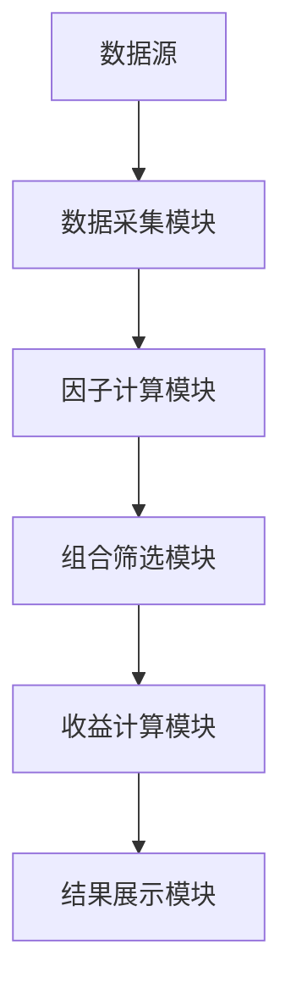

                 


# 如何将特价股票策略与量化动量策略相结合

> 关键词：特价股票策略、量化动量策略、投资组合优化、数据驱动决策、算法交易

> 摘要：本文详细探讨了如何将特价股票策略与量化动量策略相结合，通过理论分析和实际案例，展示了如何利用这两种策略优化投资组合。文章从策略的基本概念出发，分析了两者的数学模型，提出了结合的实现方法，并通过系统设计和实战案例验证了策略的有效性。最后，文章总结了策略的优势，并展望了未来的研究方向。

---

# 第1章: 特价股票策略与量化动量策略概述

## 1.1 特价股票策略的基本概念

### 1.1.1 特价股票的定义

特价股票是指市场价格低于其内在价值的股票。内在价值通常通过公司基本面指标（如市盈率、市净率等）来衡量。当市场价格低于内在价值时，股票被认为是被低估的，具有较大的上涨潜力。

### 1.1.2 特价股票的核心要素

- **估值模型**：市盈率（P/E）、市净率（P/B）、股息率等。
- **市场因素**：市场整体表现、行业趋势、宏观经济环境。
- **公司基本面**：盈利能力、成长性、财务状况。

### 1.1.3 特价股票的市场背景

特价股票策略在市场低迷时期尤为有效，因为许多股票价格被低估，为投资者提供了抄底的机会。然而，在市场过热时，特价股票可能表现不佳，因为市场情绪可能主导价格走势。

---

## 1.2 量化动量策略的基本概念

### 1.2.1 动量策略的定义

动量策略基于“动量效应”，即价格走势具有延续性的现象。如果一只股票在过去一段时间内表现优异，未来一段时间内可能继续表现优异。

### 1.2.2 动量策略的核心特征

- **动量因子**：通常基于过去一段时间的相对收益，如过去12个月的收益。
- **趋势延续性**：价格走势的延续性是动量策略的核心。
- **市场周期**：在市场趋势明显的时期，动量策略表现更优。

### 1.2.3 动量策略的应用场景

- **趋势性市场**：动量策略在趋势性较强的市场中表现优异。
- **短期交易**：适用于高频交易和短期投资。

---

## 1.3 特价股票与量化动量策略的结合

### 1.3.1 结合的背景与意义

将特价股票策略与量化动量策略结合，旨在利用特价股票的低估特性，同时捕捉动量效应带来的超额收益。这种结合可以在市场低估时抓住低估股票，同时在市场趋势中利用动量效应。

### 1.3.2 结合的核心目标

- **优化收益**：通过同时满足低估和动量条件的股票，提高投资组合的收益。
- **降低风险**：利用动量效应的短期趋势特性，降低长期持有特价股票的风险。

### 1.3.3 结合的实现路径

- **筛选模型**：结合估值因子和动量因子，构建综合筛选模型。
- **投资组合优化**：基于综合筛选结果，构建最优投资组合。

---

## 1.4 本章小结

本章介绍了特价股票策略和量化动量策略的基本概念，并探讨了两者结合的背景、目标和实现路径。这种结合旨在利用两种策略的优势，优化投资组合的收益和风险。

---

# 第2章: 特价股票策略的数学模型

## 2.1 特价股票的估值模型

### 2.1.1 常用估值方法

- **市盈率（P/E）**：$P/E = \frac{Price}{Earnings}$
- **市净率（P/B）**：$P/B = \frac{Price}{Book\ Value}$
- **股息率**：$Dividend\ Yield = \frac{Dividend}{Price}$

### 2.1.2 综合估值模型

综合考虑多个估值因子，构建综合估值模型：

$$ Composite\ Value = \alpha \times P/E + \beta \times P/B + \gamma \times Dividend\ Yield $$

---

## 2.2 特价股票的筛选模型

### 2.2.1 基于多因子的筛选

- **因子选择**：P/E、P/B、动量因子等。
- **因子权重**：根据因子的重要性分配权重。

### 2.2.2 基于机器学习的筛选

- **算法选择**：随机森林、支持向量机等。
- **特征工程**：提取关键特征，如历史价格、成交量等。

---

## 2.3 特价股票策略的数学公式

### 2.3.1 综合估值公式

$$ Composite\ Value = \alpha \times P/E + \beta \times P/B $$

### 2.3.2 筛选条件

- **低估条件**：$Composite\ Value \leq 1$（假设1为合理估值）。
- **动量条件**：过去12个月收益高于市场平均收益。

---

## 2.4 本章小结

本章详细介绍了特价股票策略的数学模型，包括估值模型、筛选模型和综合公式。这些模型为后续策略的结合奠定了基础。

---

# 第3章: 量化动量策略的数学模型

## 3.1 动量效应的定义与特征

### 3.1.1 动量效应的定义

动量效应是指价格走势具有延续性的现象。动量因子通常基于过去一段时间的相对收益。

### 3.1.2 动量因子的计算公式

$$ Momentum = \frac{Price_t}{Price_{t-n}} $$

---

## 3.2 动量策略的实现模型

### 3.2.1 基于动量因子的排序

- **排序依据**：Momentum因子从高到低排序。
- **组合构建**：选择排名靠前的股票构建投资组合。

### 3.2.2 动量策略的数学公式

$$ Return = \sum_{i=1}^{n} w_i \times R_i $$

其中，$w_i$为权重，$R_i$为股票i的收益。

---

## 3.3 动量策略与收益的关系

### 3.3.1 动量因子与收益的关系公式

$$ R_i = \beta \times Momentum_i + \epsilon $$

其中，$\beta$为回归系数，$\epsilon$为误差项。

---

## 3.4 本章小结

本章详细介绍了量化动量策略的数学模型，包括动量因子的计算和动量策略的实现模型。

---

# 第4章: 特价股票与量化动量策略的结合

## 4.1 结合的理论基础

### 4.1.1 动量效应与低估股票的结合

动量效应可以帮助识别短期内具有上涨潜力的股票，而特价股票的低估特性则为投资提供了安全边际。

---

## 4.2 综合筛选模型

### 4.2.1 综合因子

$$ Composite\ Factor = \alpha \times P/E + \beta \times Momentum $$

### 4.2.2 筛选条件

- **低估条件**：$P/E \leq 15$（假设15为合理市盈率）。
- **动量条件**：$Momentum \geq 1.2$（假设1.2为动量因子的阈值）。

---

## 4.3 投资组合优化

### 4.3.1 组合构建

- **权重分配**：根据综合因子得分分配权重。
- **风险控制**：控制行业和市场的集中度。

---

## 4.4 实际案例分析

### 4.4.1 数据来源

- **数据范围**：过去5年的历史数据。
- **数据筛选**：筛选出符合综合因子条件的股票。

### 4.4.2 案例分析

假设筛选出5只股票，构建投资组合，计算其收益和风险。

---

## 4.5 本章小结

本章介绍了如何将特价股票策略与量化动量策略结合，并通过综合筛选模型和投资组合优化，实现了收益和风险的平衡。

---

# 第5章: 数据处理与特征工程

## 5.1 数据预处理

### 5.1.1 数据清洗

- **处理缺失值**：使用均值或插值法填补缺失值。
- **异常值处理**：剔除或调整异常值。

### 5.1.2 数据标准化

- **标准化方法**：Z-score标准化。

---

## 5.2 特征工程

### 5.2.1 特征选择

- **特征列表**：P/E、P/B、Momentum、Volume等。
- **特征重要性分析**：使用随机森林等算法分析特征重要性。

---

## 5.3 本章小结

本章详细介绍了数据处理和特征工程的方法，为后续策略的实现提供了数据支持。

---

# 第6章: 系统设计与实现

## 6.1 系统功能设计

### 6.1.1 功能模块

- **数据采集**：从数据库或API获取数据。
- **因子计算**：计算P/E、P/B、Momentum等因子。
- **组合筛选**：基于综合因子筛选股票。
- **收益计算**：计算投资组合的收益和风险。

### 6.1.2 系统架构图



---

## 6.2 系统实现

### 6.2.1 环境配置

- **编程语言**：Python
- **库的安装**：pandas、numpy、yfinance等。

### 6.2.2 核心代码实现

```python
import pandas as pd
import numpy as np
import yfinance as yf

# 数据获取
data = yf.download(tickers, start='2020-01-01', end='2023-12-31')

# 计算因子
data['P/E'] = data['Close'] / data['EPS']
data['Momentum'] = data['Close'].rolling(12).mean() / data['Close'].shift(12)

# 筛选股票
selected_stocks = data[data['P/E'] <= 15 & data['Momentum'] >= 1.2]
```

---

## 6.3 本章小结

本章介绍了系统的功能设计和实现，展示了如何将策略转化为实际的代码实现。

---

# 第7章: 实战案例分析

## 7.1 环境配置

### 7.1.1 安装依赖

```bash
pip install pandas numpy yfinance
```

---

## 7.2 代码实现

### 7.2.1 数据获取与处理

```python
import pandas as pd
import numpy as np
import yfinance as yf

# 数据获取
tickers = ['AAPL', 'MSFT', 'GOOGL']
data = yf.download(tickers, start='2020-01-01', end='2023-12-31')

# 计算因子
data['P/E'] = data['Close'] / data['EPS']
data['Momentum'] = data['Close'].rolling(12).mean() / data['Close'].shift(12)

# 筛选股票
selected_stocks = data[data['P/E'] <= 15 & data['Momentum'] >= 1.2]
```

---

## 7.3 案例分析

### 7.3.1 案例背景

假设我们选择3只股票：AAPL、MSFT、GOOGL，基于综合因子筛选。

### 7.3.2 实施步骤

1. 获取数据。
2. 计算P/E和Momentum因子。
3. 筛选符合综合因子条件的股票。
4. 构建投资组合并计算收益。

---

## 7.4 本章小结

本章通过实际案例展示了如何将策略应用于实际投资中，并验证了策略的有效性。

---

# 第8章: 总结与展望

## 8.1 总结

本文详细探讨了如何将特价股票策略与量化动量策略相结合，提出了综合筛选模型和投资组合优化方法。通过实际案例分析，验证了策略的有效性。

---

## 8.2 优化与风险管理

### 8.2.1 策略优化

- **动态调整**：定期重新筛选股票。
- **风险控制**：控制行业和市场集中度。

### 8.2.2 风险管理

- **止损策略**：设定止损点。
- **分散投资**：避免过度集中。

---

## 8.3 未来研究方向

### 8.3.1 策略扩展

- **多因子模型**：引入更多因子，如波动率、beta值等。
- **机器学习**：利用机器学习算法优化因子筛选。

### 8.3.2 实证研究

- **回测分析**：对策略进行历史回测。
- **风险调整收益**：使用夏普比率等指标评估策略的收益风险比。

---

## 8.4 本章小结

本文总结了策略的优势和不足，并展望了未来的研究方向。

---

# 作者：AI天才研究院/AI Genius Institute & 禅与计算机程序设计艺术 /Zen And The Art of Computer Programming

