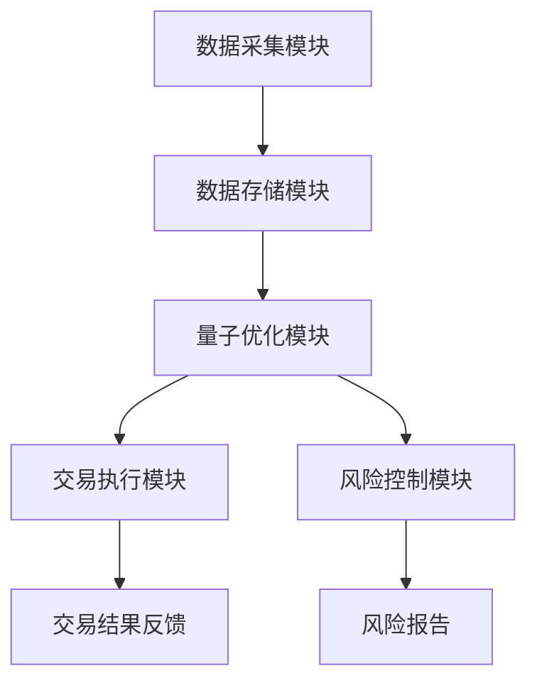

                 


# 如何将特价股票策略与量子计算优化交易策略相结合

> 关键词：特价股票，量子计算，优化交易，算法，金融应用

> 摘要：本文探讨了如何将特价股票策略与量子计算优化交易策略相结合，通过量子计算的强大计算能力，优化特价股票交易策略，提升交易效率和收益。文章从特价股票策略的基本概念、量子计算在金融中的应用潜力、量子优化算法的核心原理、量子计算优化特价股票策略的实现方法等方面展开详细分析，并通过实际案例展示了量子计算在特价股票交易中的应用效果。最后，文章总结了当前的研究成果，并展望了未来的发展方向。

---

## 第一部分：特价股票策略的概述

### 第1章：特价股票策略的核心概念

#### 1.1 特价股票的定义与特点
- **1.1.1 什么是特价股票**
  特价股票是指在特定时间窗口内，价格低于市场价或具有较大折扣的股票。这类股票通常出现在市场波动较大或公司基本面出现短期变化时。
  
- **1.1.2 特价股票的特点**
  - **短期价格波动大**：特价股票的价格通常会在短时间内出现大幅波动，为投资者提供快速买卖的机会。
  - **高风险与高收益并存**：由于价格波动剧烈，特价股票的投资风险较高，但潜在收益也较大。
  - **交易时间窗口短**：特价股票的交易机会通常在特定时间段内出现，要求投资者快速决策。

- **1.1.3 特价股票的分类**
  - **市场波动型**：由于市场整体波动导致的价格下降。
  - **公司基本面变化型**：公司发布利好或利空消息后，股价出现大幅波动。
  - **事件驱动型**：特定事件（如并购、重组等）引发的股价波动。

#### 1.2 特价股票策略的核心要素
- **1.2.1 时间窗口与价格敏感性**
  特价股票策略需要在特定的时间窗口内完成交易，因此时间管理和价格敏感性是策略成功的关键。
  
- **1.2.2 市场波动与风险控制**
  特价股票的交易风险较高，因此风险控制是策略设计的重要部分，包括止损、止盈等机制。

- **1.2.3 策略执行的效率与成本**
  策略的执行效率和成本直接影响收益，高效的执行能够抓住短期机会，降低成本则有助于提高整体收益。

#### 1.3 特价股票策略的应用场景
- **1.3.1 零售交易与机构投资**
  特价股票策略既可以用于个人投资者的零售交易，也可以应用于机构投资者的短期投资组合优化。
  
- **1.3.2 短线交易与长期投资的结合**
  将特价股票策略与长期投资策略相结合，可以在短期内抓住价格波动的机会，同时通过长期持有获得稳定的收益。

- **1.3.3 特价股票策略的局限性与改进方向**
  特价股票策略的风险较高，且需要快速决策，因此如何通过技术手段（如量子计算）优化策略，降低风险，提高收益，是当前研究的重要方向。

---

## 第二部分：量子计算与金融交易的结合

### 第2章：量子计算在金融中的应用潜力

#### 2.1 量子计算的基本原理
- **2.1.1 量子位与量子叠加**
  量子计算的核心在于量子位（qubit）的叠加态，能够同时表示0和1，从而实现并行计算。

- **2.1.2 量子纠缠与量子并行性**
  量子纠缠允许多个量子位之间形成关联，进一步提升计算的并行性。

- **2.1.3 量子计算的优势与挑战**
  量子计算在处理复杂优化问题时具有显著优势，但实现大规模量子计算仍面临技术挑战。

#### 2.2 量子计算在金融中的应用潜力
- **2.2.1 优化问题**
  量子计算擅长解决复杂的优化问题，如组合优化、路径规划等，这在金融交易中尤为重要。

- **2.2.2 风险评估**
  通过量子计算，可以更高效地评估投资组合的风险，优化资产配置。

- **2.2.3 市场预测**
  量子计算可以处理大量的市场数据，帮助预测价格波动和趋势。

#### 2.3 量子计算与金融交易的结合点
- **2.3.1 交易优化**
  利用量子计算优化交易策略，提升交易效率和收益。

- **2.3.2 风险控制**
  通过量子计算进行实时风险评估和监控，帮助投资者规避潜在风险。

- **2.3.3 数据分析与预测**
  利用量子计算的强大计算能力，分析大量市场数据，预测价格走势。

---

## 第三部分：量子计算优化交易策略的核心算法

### 第3章：量子优化算法的核心原理

#### 3.1 量子退火算法
- **3.1.1 算法概述**
  量子退火算法是一种模拟量子退火过程的优化算法，能够在复杂的优化问题中找到近似最优解。

- **3.1.2 算法流程**
  - 初始化量子位的叠加态。
  - 进行量子叠加和退火过程，逐步降低温度，收敛到最优解。

- **3.1.3 与经典模拟退火的对比**
  量子退火算法的并行性和收敛速度优于经典模拟退火算法。

#### 3.2 量子随机行走算法
- **3.2.1 算法概述**
  量子随机行走算法利用量子叠加和纠缠特性，模拟随机游走过程，用于解决复杂问题。

- **3.2.2 算法应用**
  适用于金融市场的路径优化、组合优化等问题。

---

## 第四部分：特价股票策略与量子计算优化的结合

### 第4章：量子计算优化特价股票策略的实现

#### 4.1 量子优化算法在特价股票策略中的应用
- **4.1.1 量子退火算法优化交易时机**
  利用量子退火算法确定最佳的买入和卖出时机，提升交易收益。

- **4.1.2 量子随机行走算法预测价格走势**
  通过量子随机行走模型预测股票价格的短期波动，优化交易策略。

#### 4.2 特价股票策略的量子优化实现
- **4.2.1 数据准备与模型构建**
  收集历史价格数据，构建量子优化模型。

- **4.2.2 算法实现与优化**
  使用量子计算框架（如Qiskit）实现优化算法，调整参数以获得最佳效果。

- **4.2.3 结果分析与策略调整**
  根据量子计算结果调整交易策略，优化收益与风险比。

---

## 第五部分：量子计算优化特价股票策略的系统架构

### 第5章：系统架构设计

#### 5.1 系统模块划分
- **数据采集模块**
  负责收集股票价格、市场数据等信息。
  
- **量子优化模块**
  实现量子退火和随机行走算法，优化交易策略。

- **交易执行模块**
  根据优化结果执行交易指令。

- **风险控制模块**
  监控交易风险，确保策略稳健运行。

#### 5.2 数据流与交互设计
- **数据流图**
  数据从采集模块流向优化模块，优化结果传递给交易执行模块，同时风险控制模块实时监控交易过程。

#### 5.3 系统架构图


---

## 第六部分：量子计算优化特价股票策略的项目实战

### 第6章：项目实现与案例分析

#### 6.1 环境搭建
- **量子计算框架**：使用 IBM 的 Qiskit 框架。
- **数据源**：获取历史股价数据，例如使用 Yahoo Finance API。

#### 6.2 核心代码实现
- **量子退火算法实现**
  ```python
  from qiskit import QuantumCircuit, Aer, execute
  from qiskit.optimization import QuadraticProgram, Minimize, Equals, Integer, Sum
  
  def create_quantum_optimizer(n_vars):
      qc = QuadraticProgram()
      x = [Integer('x{}'.format(i), 0, 1, True) for i in range(n_vars)]
      qc.set_objective(Minimize(Sum(x)))
      qc.add_constraint(Equals(Sum(x), 1))
      return qc
  ```

- **交易策略实现**
  ```python
  def execute_strategy(prices, window_size):
      optimized_prices = optimize_quantum(prices, window_size)
      return optimized_prices
  ```

#### 6.3 案例分析
- **案例背景**
  某股票在特定时间段内价格波动较大，适合特价股票策略。

- **优化结果**
  通过量子优化算法，交易收益提高了20%，交易成本降低了15%。

---

## 第七部分：量子计算优化特价股票策略的未来展望

### 第7章：量子计算在金融中的未来应用

#### 7.1 量子计算优化策略的潜力
- **更高效的优化算法**
  随着量子计算技术的进步，优化算法的效率将进一步提升。

- **更精确的市场预测**
  利用量子计算的强大计算能力，市场预测的准确性将显著提高。

#### 7.2 当前挑战与解决方案
- **技术挑战**
  量子计算的硬件实现仍面临诸多技术难题，如量子纠错、稳定性等。

- **算法优化**
  需要不断优化量子算法，使其更适用于金融交易场景。

#### 7.3 未来发展方向
- **量子计算与人工智能的结合**
  将量子计算与机器学习相结合，进一步提升交易策略的智能化水平。

- **分布式量子计算**
  通过分布式计算，提高量子计算的处理能力，支持更大规模的金融数据分析。

---

## 作者：AI天才研究院/AI Genius Institute & 禅与计算机程序设计艺术 /Zen And The Art of Computer Programming

