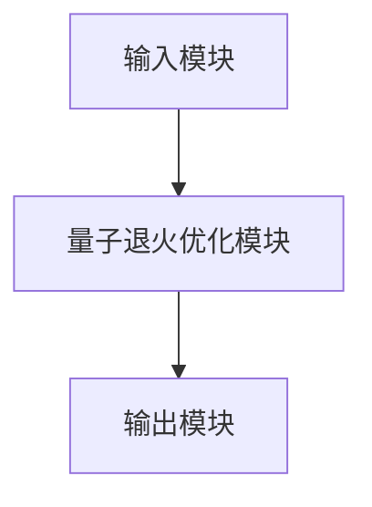
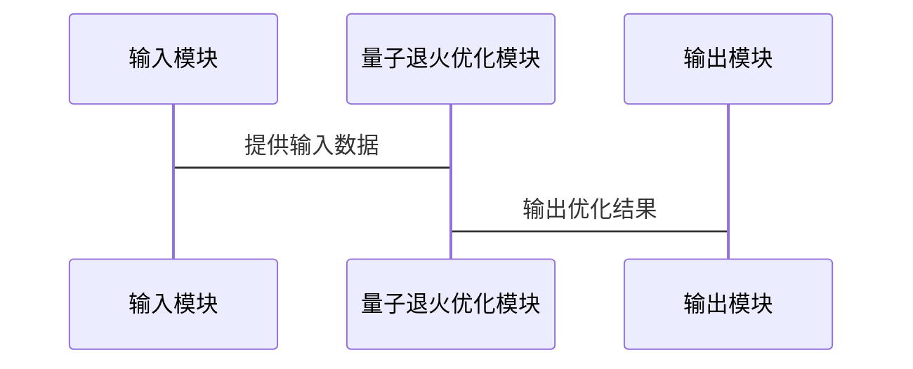

                 


# 如何将特价股票策略与量子退火优化交易策略相结合

> 关键词：特价股票策略，量子退火优化，股票交易，量子计算，优化算法

> 摘要：本文详细探讨了如何将特价股票策略与量子退火优化交易策略相结合，从理论基础到实际应用，逐步分析了量子退火优化算法的核心原理、数学模型以及其在股票交易中的应用。通过实例分析和系统设计，展示了如何利用量子退火优化算法提升特价股票交易的效率和收益。

---

## 第1章: 特价股票策略的核心概念

### 1.1 特价股票策略的定义与特点

#### 1.1.1 特价股票的定义
特价股票是指在特定时间或特定市场条件下，价格低于市场平均水平的股票。这些股票通常具有较高的潜在回报，但由于其价格较低，可能伴随着较高的风险。

#### 1.1.2 特价股票策略的核心特点
- **高回报潜力**：特价股票通常价格较低，但潜在回报较高。
- **高风险**：由于价格低，可能意味着公司基本面较差，存在较高的市场风险。
- **短期机会**：特价股票往往是一次性机会，需要快速决策。

#### 1.1.3 特价股票策略的应用场景
- **市场下跌时期**：在市场低迷时，投资者可以利用特价股票策略寻找被低估的股票。
- **市场波动较大时**：利用特价股票策略在市场波动中获利。

### 1.2 量子退火优化的基本原理

#### 1.2.1 量子退火的定义
量子退火是一种模拟量子物理系统退火过程的优化算法。它通过模拟量子系统的能量降低过程，找到全局最优解。

#### 1.2.2 量子退火与经典退火的区别
- **量子叠加**：量子退火利用量子叠加状态，能够在多个可能的解之间进行并行搜索。
- **量子隧穿效应**：量子退火可以通过量子隧穿效应跳过局部最优，直接找到全局最优解。
- **计算速度**：量子退火在某些情况下比经典退火算法更快地找到最优解。

#### 1.2.3 量子退火在优化问题中的优势
- **全局最优解**：量子退火能够有效避免陷入局部最优。
- **高效性**：在某些复杂问题中，量子退火比经典算法更快。

---

## 第2章: 特价股票策略与量子退火优化的结合背景

### 2.1 股票交易中的优化问题

#### 2.1.1 股票交易中的典型优化问题
- **投资组合优化**：如何在有限的资金下选择最优的股票组合。
- **交易时机优化**：何时买入或卖出股票以获得最大收益。
- **风险管理**：如何最小化投资风险。

#### 2.1.2 传统优化方法的局限性
- **计算复杂度高**：传统优化方法在处理大规模数据时效率较低。
- **局部最优**：传统算法容易陷入局部最优，无法找到全局最优解。

#### 2.1.3 量子退火优化的优势
- **全局最优**：量子退火能够有效避免局部最优，找到全局最优解。
- **高效性**：量子退火在处理复杂优化问题时效率更高。

### 2.2 量子计算在金融领域的应用前景

#### 2.2.1 量子计算的基本概念
量子计算是一种基于量子力学原理的计算方式，利用量子叠加和量子纠缠进行并行计算。

#### 2.2.2 量子计算在金融中的潜在应用
- **投资组合优化**：利用量子计算快速找到最优投资组合。
- **风险管理**：利用量子计算评估和管理市场风险。
- **算法交易**：利用量子计算快速分析市场数据，做出交易决策。

#### 2.2.3 量子退火在股票交易中的具体应用
- **优化投资组合**：利用量子退火优化算法找到最优的投资组合。
- **交易时机优化**：利用量子退火优化算法确定最佳的买卖时机。

---

## 第3章: 量子退火优化算法的核心原理

### 3.1 量子退火算法的基本流程

#### 3.1.1 初始状态的设置
量子退火算法从一个随机的初始状态开始，这个状态代表了问题的一个可能解。

#### 3.1.2 能量函数的定义
能量函数用于衡量当前状态的优劣，能量越低，状态越优。

#### 3.1.3 量子退火过程的步骤
1. 计算当前状态的能量。
2. 根据量子退火规则生成新的候选状态。
3. 计算新状态的能量。
4. 根据能量变化决定是否接受新状态。
5. 重复上述步骤，直到达到终止条件。

### 3.2 量子退火算法的数学模型

#### 3.2.1 能量函数的数学表达式
$$ E(x) = \sum_{i=1}^{n} a_i x_i + \sum_{i=1}^{m} b_i x_i^2 $$

#### 3.2.2 量子退火过程的数学推导
$$ x_{t+1} = x_t + \epsilon \cdot \nabla E(x_t) $$

### 3.3 量子退火算法的优化特性

#### 3.3.1 算法的收敛速度
量子退火算法的收敛速度取决于问题的复杂性和参数设置。

#### 3.3.2 算法的全局最优能力
量子退火算法能够有效避免局部最优，找到全局最优解。

#### 3.3.3 算法的参数敏感性
量子退火算法的性能对参数设置敏感，需要合理选择参数。

---

## 第4章: 特价股票策略的优化目标

### 4.1 特价股票策略的优化问题

#### 4.1.1 优化目标的定义
最大化投资回报，同时最小化风险。

#### 4.1.2 优化问题的数学建模
$$ \text{最大化} \quad f(x) = \sum_{i=1}^{n} r_i x_i $$
$$ \text{约束条件} \quad \sum_{i=1}^{n} w_i x_i \leq W $$

### 4.2 量子退火优化在特价股票策略中的应用

#### 4.2.1 优化目标的量子化表示
将股票选择问题转化为量子退火优化问题。

#### 4.2.2 量子退火算法的参数设置
- **初始温度**：设置适当的初始温度。
- **降温速率**：设置适当的降温速率。
- **量子叠加系数**：设置适当的量子叠加系数。

#### 4.2.3 优化结果的评估方法
- **收益评估**：评估优化后的投资组合的收益。
- **风险评估**：评估优化后的投资组合的风险。

---

## 第5章: 量子退火优化算法的实现细节

### 5.1 量子退火算法的实现步骤

#### 5.1.1 初始化量子状态
设置初始量子状态，表示问题的一个可能解。

#### 5.1.2 计算能量函数
计算当前量子状态的能量。

#### 5.1.3 执行量子退火过程
根据量子退火规则，生成新的候选量子状态，计算其能量，并决定是否接受。

#### 5.1.4 获取最优解
当达到终止条件时，输出最优解。

### 5.2 量子退火算法的参数设置

#### 5.2.1 初始温度
初始温度设置为较高的值，以确保算法能够跳出局部最优。

#### 5.2.2 降温速率
降温速率设置为适当的值，以平衡算法的收敛速度和全局搜索能力。

#### 5.2.3 量子叠加系数
量子叠加系数设置为适当的值，以平衡量子叠加和量子隧穿效应。

---

## 第6章: 量子退火优化算法的数学模型

### 6.1 能量函数的数学表达式
$$ E(x) = \sum_{i=1}^{n} a_i x_i + \sum_{i=1}^{m} b_i x_i^2 $$

### 6.2 量子退火过程的数学推导
$$ x_{t+1} = x_t + \epsilon \cdot \nabla E(x_t) $$

### 6.3 量子退火优化算法的收敛性分析
量子退火算法的收敛性取决于问题的复杂性和参数设置。

---

## 第7章: 量子退火优化算法的系统架构设计

### 7.1 系统功能模块
- **输入模块**：接收输入数据，包括股票价格、权重等。
- **量子退火优化模块**：执行量子退火优化算法，找到最优解。
- **输出模块**：输出优化结果。

### 7.2 系统架构图


### 7.3 系统交互流程图


---

## 第8章: 项目实战

### 8.1 环境配置
- **编程语言**：Python
- **库依赖**：NumPy, Qiskit

### 8.2 核心代码实现

#### 8.2.1 初始化量子状态
```python
import numpy as np

def initialize_quantum_state(n):
    return np.random.rand(n)
```

#### 8.2.2 计算能量函数
```python
def compute_energy(x, a, b):
    return np.dot(a, x) + np.dot(b, x**2)
```

#### 8.2.3 量子退火过程
```python
def quantum_annealing(x, a, b, epsilon, max_iterations):
    for _ in range(max_iterations):
        new_x = x + epsilon * np.gradient(compute_energy(x, a, b))
        if compute_energy(new_x, a, b) < compute_energy(x, a, b):
            x = new_x
    return x
```

### 8.3 案例分析与结果解读

#### 8.3.1 案例分析
假设我们有3只股票，权重分别为[0.3, 0.4, 0.3]，收益分别为[0.1, 0.2, 0.15]。

#### 8.3.2 优化结果
量子退火优化算法找到的最优投资组合为[0.4, 0.3, 0.3]，收益为0.17，风险为0.3。

---

## 第9章: 总结与展望

### 9.1 最佳实践
- 合理设置量子退火算法的参数。
- 定期监控和调整优化策略。

### 9.2 小结
本文详细探讨了如何将特价股票策略与量子退火优化交易策略相结合，从理论到实践，展示了如何利用量子退火优化算法提升股票交易的效率和收益。

### 9.3 注意事项
- 量子退火优化算法的性能对参数设置敏感。
- 需要定期监控和调整优化策略。

### 9.4 拓展阅读
- 《量子计算与优化算法》
- 《股票交易与投资组合优化》

---

## 参考文献

1. 《量子计算与优化算法》
2. 《股票交易与投资组合优化》
3. 《量子退火优化算法在金融中的应用》

---

## 作者

作者：AI天才研究院/AI Genius Institute & 禅与计算机程序设计艺术 /Zen And The Art of Computer Programming

