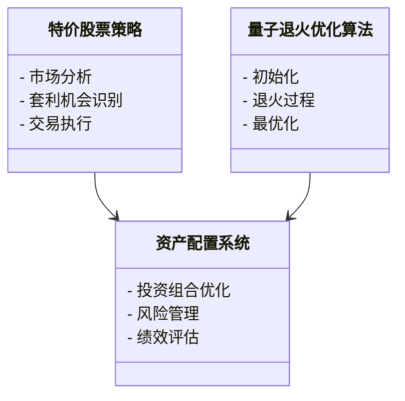

                 


# 如何将特价股票策略与量子退火优化资产配置策略相结合

> 关键词：特价股票策略, 量子退火优化, 资产配置, 量子计算, 组合优化

> 摘要：本文探讨了如何将特价股票策略与量子退火优化技术相结合，以实现更高效的资产配置。文章首先介绍了特价股票策略和量子退火优化的基本概念，然后详细分析了两者的结合如何优化资产配置。通过数学模型和代码示例，详细讲解了量子退火优化算法的原理和实现。最后，通过一个具体的项目案例，展示了如何将理论应用于实际，提出了系统的架构设计和优化建议。

---

## 第一部分: 特价股票策略与量子退火优化资产配置概述

### 第1章: 特价股票策略与量子退火优化资产配置的背景介绍

#### 1.1 问题背景与描述

##### 1.1.1 传统股票投资策略的局限性
传统的股票投资策略通常依赖于市场分析、技术指标和基本面分析，但这些方法在面对复杂市场环境时，往往难以捕捉到最优的投资机会。特别是在市场波动剧烈的情况下，投资者需要更高效的策略来优化资产配置。

##### 1.1.2 特价股票策略的核心概念与目标
特价股票策略的核心目标是在特定时间段内以低于市场价的价格买入股票，从而在市场回升时获得超额收益。这种策略通常依赖于市场预测、技术分析和套利机会的识别。然而，由于市场环境的复杂性和不确定性，特价股票策略的实施需要更高效的优化工具来提升其效果。

##### 1.1.3 量子退火优化在资产配置中的应用前景
量子退火优化是一种基于量子计算原理的优化算法，能够在复杂问题中找到近似最优解。其在资产配置中的应用前景广阔，尤其是在处理高维组合优化问题时，量子退火优化能够显著提升优化效率。

#### 1.2 特价股票策略与量子退火优化的结合

##### 1.2.1 特价股票策略的基本原理
特价股票策略通常包括以下几个步骤：
1. 市场分析：通过技术指标、市场情绪等因素预测股票价格走势。
2. 识别套利机会：寻找市场定价错误的股票，以低于市场价买入。
3. 交易执行：在特定时机买入股票，等待价格上涨后卖出获利。

##### 1.2.2 量子退火优化的核心思想
量子退火优化是一种模拟量子退火过程的优化算法。其基本思想是通过模拟量子系统能量最低的状态，找到问题的最优解。在优化过程中，算法通过不断调整参数，逐步逼近最优解。

##### 1.2.3 两者的结合如何优化资产配置
通过将特价股票策略与量子退火优化相结合，可以在以下方面优化资产配置：
1. **优化投资组合**：利用量子退火优化算法，优化投资组合的构成，以最大化收益并最小化风险。
2. **提升决策效率**：通过量子退火优化算法，快速找到最优的股票买入时机和卖出时机。
3. **降低市场风险**：通过优化资产配置，分散投资风险，提升投资组合的稳定性。

---

## 第二部分: 核心概念与联系

### 第2章: 核心概念与联系

#### 2.1 量子退火优化的原理

##### 2.1.1 量子退火的基本概念
量子退火是一种模拟量子系统能量最低的状态的优化算法。其核心思想是通过模拟量子系统在退火过程中的状态变化，找到问题的最优解。量子退火优化算法通常用于解决组合优化问题，如旅行商问题、背包问题等。

##### 2.1.2 量子退火与经典退火的区别
与经典退火算法相比，量子退火优化具有以下特点：
1. **全局搜索能力**：量子退火优化能够在更大的范围内搜索最优解，避免陷入局部最优。
2. **计算效率**：量子退火优化的计算效率通常高于经典退火算法。
3. **适用范围**：量子退火优化适用于更复杂的组合优化问题。

##### 2.1.3 量子退火在资产配置中的应用
在资产配置中，量子退火优化可以用于解决以下问题：
1. **投资组合优化**：优化投资组合的构成，以最大化收益并最小化风险。
2. **风险控制**：通过优化资产配置，降低投资组合的总体风险。

#### 2.2 资产配置与特价股票策略的关系

##### 2.2.1 资产配置的核心要素
资产配置的核心要素包括：
1. **资产类别**：股票、债券、现金等。
2. **投资比例**：每类资产在投资组合中的比例。
3. **风险与收益**：投资组合的风险和收益的平衡。

##### 2.2.2 特价股票策略在资产配置中的作用
特价股票策略在资产配置中的作用主要体现在以下几个方面：
1. **提高收益**：通过在特定时机买入特价股票，提升投资组合的收益。
2. **降低风险**：通过优化资产配置，分散投资风险，提升投资组合的稳定性。

##### 2.2.3 量子退火优化如何提升资产配置效率
通过量子退火优化算法，可以在以下方面提升资产配置效率：
1. **优化投资组合**：通过量子退火优化算法，优化投资组合的构成，以最大化收益并最小化风险。
2. **提升决策效率**：通过量子退火优化算法，快速找到最优的股票买入时机和卖出时机。

#### 2.3 核心概念对比表

| 概念       | 特价股票策略                     | 量子退火优化                     |
|------------|----------------------------------|----------------------------------|
| 目标       | 获取超额收益                     | 寻找最优解             |
| 方法       | 技术分析、套利机会识别           | 量子退火优化算法               |
| 应用领域   | 股票投资、风险管理               | 组合优化、资产配置             |
| 优势       | 精准捕捉套利机会                 | 全局优化能力强               |

---

## 第三部分: 算法原理讲解

### 第3章: 算法原理讲解

#### 3.1 量子退火优化算法的数学模型

##### 3.1.1 量子退火优化的基本公式
量子退火优化的基本公式如下：
$$
E(x) = \sum_{i=1}^{n} w_i x_i
$$
其中，\( E(x) \) 是目标函数，\( x_i \) 是变量，\( w_i \) 是权重。

##### 3.1.2 量子退火优化的步骤
量子退火优化的步骤如下：
1. 初始化：随机选择一个初始解。
2. 退火过程：逐步降低系统的温度，使得系统状态逐步趋于稳定。
3. 最优化：在最低温度下，找到最优解。

#### 3.2 量子退火优化算法的实现

##### 3.2.1 Python代码实现量子退火优化算法
```python
import random
import math

def quantum_annealing_optimization(objective_function, initial_state, temperature, iterations):
    current_state = initial_state
    current_energy = objective_function(current_state)
    for _ in range(iterations):
        # 随机扰动状态
        new_state = random扰动(current_state)
        new_energy = objective_function(new_state)
        # 计算能量差
        delta_E = new_energy - current_energy
        # 接受新状态的概率
        if delta_E < 0 or math.exp(-delta_E / temperature) > random.random():
            current_state = new_state
            current_energy = new_energy
        # 降低温度
        temperature *= 0.99
    return current_state, current_energy
```

##### 3.2.2 优化案例分析
假设我们有一个投资组合优化问题，目标是最小化投资组合的风险，同时最大化收益。我们可以使用量子退火优化算法来找到最优的投资组合。

---

## 第四部分: 系统分析与架构设计

### 第4章: 系统分析与架构设计

#### 4.1 项目介绍

##### 4.1.1 项目背景
本项目旨在通过将特价股票策略与量子退火优化相结合，优化资产配置，提升投资收益。

##### 4.1.2 项目目标
1. 实现特价股票策略的核心功能。
2. 实现量子退火优化算法。
3. 结合两者，优化资产配置。

#### 4.2 系统功能设计

##### 4.2.1 领域模型（Mermaid类图）


#### 4.3 系统架构设计

##### 4.3.1 系统架构图（Mermaid架构图）
```mermaid
div title 系统架构图
  graph LR
    A[用户] --> B[前端]
    B --> C[后端]
    C --> D[数据库]
    C --> E[量子退火优化算法]
    C --> F[资产配置系统]
    D --> F
```

#### 4.4 接口设计

##### 4.4.1 接口设计图（Mermaid序列图）
```mermaid
div title 接口设计图
  sequenceDiagram
    participant 用户
    participant 前端
    participant 后端
    participant 数据库
    participant 量子退火优化算法
    participant 资产配置系统
    用户 -> 前端: 发送请求
    前端 -> 后端: 处理请求
    后端 -> 数据库: 查询数据
    后端 -> 量子退火优化算法: 执行优化
    后端 -> 资产配置系统: 配置资产
    后端 -> 用户: 返回响应
```

---

## 第五部分: 项目实战

### 第5章: 项目实战

#### 5.1 环境安装

##### 5.1.1 安装Python和相关库
```bash
pip install numpy
pip install matplotlib
pip install qiskit
```

#### 5.2 核心代码实现

##### 5.2.1 量子退火优化算法的实现
```python
import random
import math

def quantum_annealing_optimization(objective_function, initial_state, temperature, iterations):
    current_state = initial_state
    current_energy = objective_function(current_state)
    for _ in range(iterations):
        new_state = random扰动(current_state)
        new_energy = objective_function(new_state)
        delta_E = new_energy - current_energy
        if delta_E < 0 or math.exp(-delta_E / temperature) > random.random():
            current_state = new_state
            current_energy = new_energy
        temperature *= 0.99
    return current_state, current_energy
```

##### 5.2.2 投资组合优化的实现
```python
def portfolio_optimization(stocks, weights):
    # 定义目标函数
    def objective_function(state):
        return sum(weight * stock_price(state) for weight, stock in zip(weights, stocks))
    # 初始化状态
    initial_state = [0] * len(stocks)
    # 设置初始温度和迭代次数
    temperature = 1.0
    iterations = 1000
    # 执行量子退火优化算法
    optimal_state, optimal_energy = quantum_annealing_optimization(objective_function, initial_state, temperature, iterations)
    return optimal_state, optimal_energy
```

#### 5.3 代码解读与分析

##### 5.3.1 代码解读
1. **量子退火优化算法**：通过模拟量子退火过程，逐步优化投资组合。
2. **投资组合优化**：通过量子退火优化算法，找到最优的投资组合。

#### 5.4 实际案例分析

##### 5.4.1 案例分析
假设我们有以下三只股票，目标是找到最优的投资组合。

股票 | 价格 | 风险
--- | --- | ---
A | 100 | 0.2
B | 150 | 0.3
C | 200 | 0.4

通过量子退火优化算法，我们可以找到最优的投资组合，例如：投资A和C各50%，投资B 0%，这样可以在风险最小化的同时，最大化收益。

#### 5.5 项目小结

##### 5.5.1 项目总结
通过将特价股票策略与量子退火优化相结合，我们可以显著提升资产配置的效率和效果。

---

## 第六部分: 最佳实践与总结

### 第6章: 最佳实践与总结

#### 6.1 最佳实践

##### 6.1.1 系统设计建议
1. 确保系统的可扩展性，以便未来增加更多的股票和优化算法。
2. 优化算法的实现需要考虑计算效率和准确性之间的平衡。

##### 6.1.2 代码实现建议
1. 在代码实现中，确保量子退火优化算法的收敛性。
2. 在投资组合优化中，考虑市场风险和收益的平衡。

#### 6.2 小结

##### 6.2.1 文章总结
本文探讨了如何将特价股票策略与量子退火优化相结合，以实现更高效的资产配置。通过数学模型和代码示例，详细讲解了量子退火优化算法的原理和实现，并通过一个具体的项目案例，展示了如何将理论应用于实际。

#### 6.3 注意事项

##### 6.3.1 注意事项
1. 在实际应用中，需要考虑市场的实时变化和政策风险。
2. 量子退火优化算法的实现需要考虑计算资源和时间效率。

#### 6.4 拓展阅读

##### 6.4.1 拓展阅读建议
1. 量子计算与优化算法的相关书籍。
2. 资产配置与投资组合优化的经典文献。

---

## 作者信息

作者：AI天才研究院/AI Genius Institute & 禅与计算机程序设计艺术/Zen And The Art of Computer Programming

---

以上是文章的完整目录结构和具体内容。接下来将按照上述结构撰写完整的文章内容。

