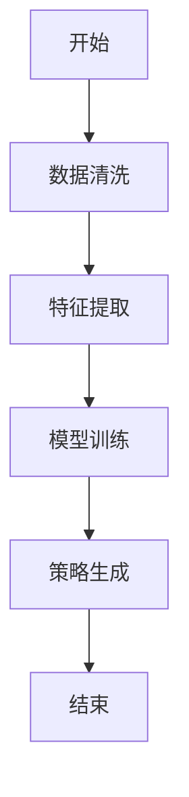
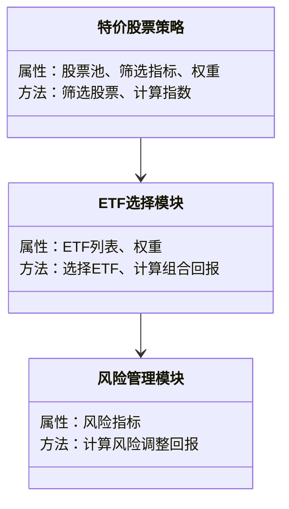
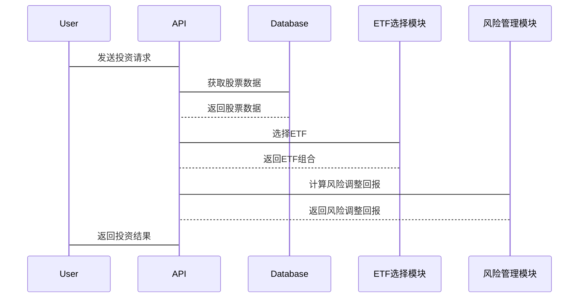

                 


# 如何将特价股票策略应用于ETF投资

> 关键词：特价股票策略, ETF投资, 多因子模型, 数学模型, 算法实现, 风险管理

> 摘要：本文将详细介绍如何将特价股票策略应用于ETF投资。通过分析特价股票策略的核心原理、数学模型、算法实现、系统架构设计以及风险管理，结合实际案例，为投资者提供一套科学的ETF投资策略。本文还提供了详细的Python代码实现和系统设计图，帮助读者更好地理解和应用这些策略。

---

# 第一部分: 特价股票策略与ETF投资概述

## 第1章: 特价股票策略与ETF投资概述

### 1.1 特价股票策略的基本概念

#### 1.1.1 特价股票的定义与特点
- **定义**：特价股票是指在市场波动或经济下行周期中，价格被严重低估的股票。这些股票通常具有较高的安全边际，适合长期投资者。
- **特点**：
  - 价格低于内在价值。
  - 估值低，市盈率、市净率等指标显著低于行业平均水平。
  - 市场关注度低，流动性相对较低。

#### 1.1.2 ETF的基本概念与运作机制
- **定义**：ETF（交易所交易基金）是一种在交易所上市交易的基金，兼具开放式和封闭式基金的特点。
- **运作机制**：
  - ETF通过跟踪特定指数或策略，将资金分散投资于一揽子证券。
  - 投资者可以通过交易所买卖ETF，类似于买卖股票。
- **优点**：
  - 分散风险，降低个股波动对投资组合的影响。
  - 交易灵活，成本低。

#### 1.1.3 特价股票策略与ETF投资的结合
- **结合点**：
  - 通过ETF跟踪特价股票指数，投资者可以间接投资于多个特价股票。
  - ETF的分散投资特性降低了个股风险，同时放大了特价股票策略的收益。

### 1.2 特价股票策略的核心原理

#### 1.2.1 市场波动与投资机会
- 市场波动是投资机会的来源，尤其是在市场下跌时，特价股票更容易出现。
- 投资者可以通过分析市场周期，抓住市场低谷时的投资机会。

#### 1.2.2 特价股票的识别方法
- **基本面分析**：
  - 市盈率（P/E）低于行业平均水平。
  - 市净率（P/B）低于行业平均水平。
  - 盈利能力指标（ROE、ROA）表现稳定。
- **技术分析**：
  - 股价跌破长期均线，显示超卖信号。
  - 成交量在低价位区间放大，显示资金流入。

#### 1.2.3 ETF在特价股票策略中的优势
- **分散投资**：通过ETF投资多个特价股票，降低个股风险。
- **降低交易成本**：ETF的交易成本通常低于个股。
- **简化操作**：投资者无需选股，只需选择合适的ETF。

### 1.3 ETF投资的基本策略

#### 1.3.1 ETF的分类与选择
- **分类**：
  - 按指数类型：标普500ETF、道琼斯ETF等。
  - 按行业：科技ETF、医疗ETF等。
  - 按策略：红利ETF、价值ETF等。
- **选择策略**：
  - 考虑ETF的跟踪误差（Tracking Error）。
  - 考虑ETF的流动性（Volume）。
  - 考虑ETF的管理费（Expense Ratio）。

#### 1.3.2 ETF投资的风险管理
- **风险管理原则**：
  - 设置止损点。
  - 分散投资，避免过度集中。
  - 定期调整投资组合。

#### 1.3.3 ETF投资的长期与短期策略
- **长期策略**：
  - 选择优质ETF，长期持有，获取复利收益。
- **短期策略**：
  - 根据市场波动，短期买卖ETF，获取价差收益。

### 1.4 本章小结
- 本章介绍了特价股票策略和ETF投资的基本概念，并分析了两者结合的优势。通过ETF投资特价股票策略，投资者可以实现风险分散、操作简便和成本降低。

---

## 第2章: 特价股票策略的数学模型与算法

### 2.1 特价股票的量化分析

#### 2.1.1 市场波动的数学模型
- **模型介绍**：
  - 使用CAPM（资本资产定价模型）评估股票的预期收益。
  - 使用波动率指标（VIX指数）衡量市场波动。
- **公式**：
  - CAPM公式：$$E(r_i) = r_f + β_i (E(r_m) - r_f)$$
  - VIX指数公式：$$VIX = \sqrt{E(r^2) - [E(r)]^2$$

#### 2.1.2 特价股票的筛选指标
- **指标列表**：
  - 市盈率（P/E）：$$P/E = \frac{Price}{Earnings}$$
  - 市净率（P/B）：$$P/B = \frac{Price}{Book\ Value}$$
  - 股息率（Dividend Yield）：$$Dividend\ Yield = \frac{Dividend}{Price}$$
  - 盈利能力（ROE）：$$ROE = \frac{Net\ Profit}{Equity}$$

#### 2.1.3 ETF指数的构建方法
- **步骤**：
  1. 筛选符合特价股票条件的股票。
  2. 根据权重（市值、流动性等）构建指数。
  3. 选择跟踪该指数的ETF。

### 2.2 多因子模型在特价股票策略中的应用

#### 2.2.1 多因子模型的定义
- 多因子模型是通过多个因子（如价值因子、动量因子）来解释股票收益的模型。
- 常见因子：
  - 价值因子（Value）：低P/E、低P/B。
  - 动量因子（Momentum）：过去一年收益高的股票。
  - 均值回归因子（Reversal）：近期表现差的股票。

#### 2.2.2 多因子模型的构建步骤
1. 数据清洗与预处理。
2. 选择因子。
3. 计算因子得分。
4. 构建组合。
5. 风险调整。

#### 2.2.3 多因子模型的优缺点
- **优点**：
  - 提高选股的有效性。
  - 降低单一因子的局限性。
- **缺点**：
  - 增加模型复杂性。
  - 需要更多的数据支持。

### 2.3 特价股票策略的数学公式

#### 2.3.1 特价股票筛选公式
$$ Cheap\ Stock = \frac{Price}{内在价值} < 0.8 $$

#### 2.3.2 ETF指数构建公式
$$ Index = \sum_{i=1}^{n} w_i \times Stock_i $$

#### 2.3.3 风险调整回报公式
$$ Adjusted\ Return = Return - \alpha \times Risk $$

---

## 第3章: 特价股票策略的算法实现

### 3.1 算法原理

#### 3.1.1 算法流程图（Mermaid）



### 3.2 算法实现代码

```python
import pandas as pd
import numpy as np

# 示例代码：从数据中筛选特价股票
def filter_cheap_stocks(data):
    cheap_stocks = data[data['price'] < (data['内在价值'] * 0.8)]
    return cheap_stocks

# 示例代码：构建ETF指数
def build_etf_index(stocks, weights):
    index = []
    for i in range(len(stocks)):
        index.append(stocks[i] * weights[i])
    return sum(index)

# 示例代码：计算风险调整回报
def calculate_adjusted_return(return_, risk):
    adjusted_return = return_ - (return_ * risk)
    return adjusted_return
```

### 3.3 本章小结
- 本章通过算法实现，展示了如何将特价股票策略应用于ETF投资。通过数据清洗、特征提取、模型训练等步骤，最终生成投资策略。

---

## 第4章: 系统分析与架构设计方案

### 4.1 问题场景介绍
- **目标**：构建一个基于特价股票策略的ETF投资系统。
- **场景**：投资者希望通过系统自动筛选特价股票，并选择合适的ETF进行投资。

### 4.2 项目介绍
- **项目名称**：基于特价股票策略的ETF投资系统。
- **目标**：实现自动化投资策略，提高投资效率。

### 4.3 系统功能设计（领域模型Mermaid类图）



### 4.4 系统架构设计（Mermaid架构图）


### 4.5 系统接口设计
- **接口1**：从数据库获取股票数据。
- **接口2**：从API获取ETF数据。
- **接口3**：向数据库保存投资组合。
- **接口4**：向API发送投资指令。

### 4.6 系统交互（Mermaid序列图）



---

## 第5章: 项目实战

### 5.1 环境安装
- **工具**：Python、Jupyter Notebook、数据库、API接口。
- **库**：pandas、numpy、matplotlib。

### 5.2 系统核心实现源代码
```python
import pandas as pd
import numpy as np
import requests

# 数据获取
def get_stock_data():
    url = "http://example.com/stock_data"
    response = requests.get(url)
    data = response.json()
    return pd.DataFrame(data)

# 筛选特价股票
def filter_cheap_stocks(data):
    cheap_stocks = data[data['price'] < (data['内在价值'] * 0.8)]
    return cheap_stocks

# ETF选择模块
def select_etf(stocks):
    etf_list = []
    for stock in stocks:
        etf = f"ETF_{stock}"
        etf_list.append(etf)
    return etf_list

# 风险管理模块
def calculate_adjusted_return(return_, risk):
    adjusted_return = return_ - (return_ * risk)
    return adjusted_return
```

### 5.3 代码应用解读与分析
- **数据获取**：通过API获取股票数据，并将其转换为DataFrame。
- **筛选特价股票**：根据设定的阈值，筛选出价格低于内在价值80%的股票。
- **选择ETF**：根据筛选出的特价股票，选择对应的ETF进行投资。
- **风险管理**：根据市场波动调整投资回报，降低风险。

### 5.4 实际案例分析
- **案例**：假设市场下跌，筛选出某只特价股票，并选择对应的ETF进行投资。
- **步骤**：
  1. 获取数据。
  2. 筛选特价股票。
  3. 选择ETF。
  4. 计算风险调整回报。
  5. 执行交易。

### 5.5 项目小结
- 本章通过实际案例，展示了如何将特价股票策略应用于ETF投资，并通过代码实现投资过程。

---

## 第6章: 风险管理与最佳实践

### 6.1 风险管理
- **市场波动**：通过分散投资和风险调整，降低市场波动对投资组合的影响。
- **流动性风险**：选择流动性高的ETF，避免流动性不足导致的交易困难。
- **操作风险**：制定严格的交易流程，避免人为错误。

### 6.2 最佳实践Tips
- **定期调整**：根据市场变化，定期调整投资组合。
- **分散投资**：避免过度集中，降低风险。
- **长期投资**：耐心持有，获取复利收益。

### 6.3 小结
- 通过科学的风险管理，可以有效降低投资风险，提高投资收益。

---

## 第7章: 总结与展望

### 7.1 总结
- 本文详细介绍了如何将特价股票策略应用于ETF投资，通过数学模型、算法实现和系统设计，为投资者提供了一套科学的投资策略。

### 7.2 展望
- 随着人工智能和大数据技术的发展，未来可以通过更复杂的算法和模型，进一步优化ETF投资策略。
- 投资者可以通过技术手段，实现自动化投资，提高投资效率。

---

## 作者：AI天才研究院/AI Genius Institute & 禅与计算机程序设计艺术 /Zen And The Art of Computer Programming

---

**附录：**

- 附录A：常用股票筛选指标表
- 附录B：ETF选择指南
- 附录C：风险管理工具推荐

---

**参考文献：**

1. 股票投资经典书籍。
2. ETF投资相关文献。
3. 相关学术论文。

--- 

**注**：本文为技术博客文章，内容基于假设和示例，不构成实际的投资建议。

